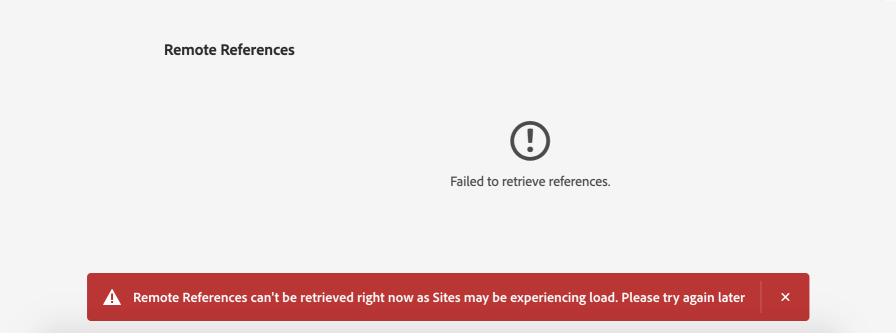

# Use Assets conectado para compartir recursos DAM en [!DNL Experience Manager Sites] {#use-connected-assets-to-share-dam-assets-in-aem-sites}

| Versión | Vínculo del artículo |
| -------- | ---------------------------- |
| AEM 6.5 | [Haga clic aquí](https://experienceleague.adobe.com/docs/experience-manager-65/assets/using/use-assets-across-connected-assets-instances.html?lang=es) |
| AEM as a Cloud Service | Este artículo |

En las grandes empresas se puede distribuir la infraestructura necesaria para crear sitios web. A veces, las capacidades de creación de sitios web y los recursos digitales utilizados para crear estos sitios web se pueden encontrar en diferentes implementaciones. Una razón puede ser la distribución geográfica de implementaciones existentes que son necesarias para trabajar juntas. Otra razón pueden ser las adquisiciones que conducen a una infraestructura heterogénea, incluidas diferentes versiones de [!DNL Experience Manager], que la compañía principal desea utilizar juntas.

>[!NOTE]
>
>Adobe recomienda aprovechar Dynamic Media con las funciones de OpenAPI para conectar a los AEM Assets con as a Cloud Service y AEM Sites. Ver [Integrar AEM Assets remotos con AEM Sites](/help/assets/integrate-remote-approved-assets-with-sites.md).

La funcionalidad de Assets conectado admite los casos de uso anteriores al integrar [!DNL Experience Manager Sites] y [!DNL Experience Manager Assets]. Los usuarios pueden crear páginas web en [!DNL Sites] que utilicen los recursos digitales de [!DNL Assets] implementaciones independientes.

>[!NOTE]
>
>Configure Connected Assets solo cuando necesite utilizar los recursos disponibles en una implementación remota de DAM en una implementación de Sites independiente para crear páginas web.

## Descripción general de Assets conectado {#overview-of-connected-assets}

Al editar páginas en [!UICONTROL Editor de páginas] como destino de destino, los autores pueden buscar, examinar e incrustar recursos sin problemas desde una implementación diferente de [!DNL Assets] que actúe como origen de los recursos. Los administradores crean una integración única de una implementación de [!DNL Experience Manager] con la capacidad [!DNL Sites] con otra implementación de [!DNL Experience Manager] con la capacidad [!DNL Assets]. También puede utilizar imágenes de Dynamic Media en las páginas web del sitio a través de Connected Assets y utilizar las funcionalidades de Dynamic Media, como los ajustes preestablecidos de recorte inteligente y de imagen.

Para los autores de [!DNL Sites], los recursos remotos están disponibles como recursos locales de solo lectura. La funcionalidad admite la búsqueda y el acceso ininterrumpidos a recursos remotos en el Editor del sitio. Para cualquier otro caso de uso que requiera que el cuerpo de recursos completo esté disponible en Sites, considere migrar los recursos de forma masiva en lugar de utilizar Connected Assets.

### Requisitos previos e implementaciones admitidas {#prerequisites}

Antes de usar o configurar esta capacidad, asegúrese de lo siguiente:

* Los usuarios forman parte de los grupos correspondientes en cada implementación.
* Para [!DNL Adobe Experience Manager] tipos de implementación, se cumple uno de los criterios admitidos. [!DNL Experience Manager] as a Cloud Service [!DNL Assets] funciona con [!DNL Experience Manager] 6.5. Para obtener más información sobre cómo funciona esta funcionalidad en [!DNL Experience Manager] 6.5, consulte [Assets conectado en [!DNL Experience Manager] 6.5 [!DNL Assets]](https://experienceleague.adobe.com/docs/experience-manager-65/assets/using/use-assets-across-connected-assets-instances.html?lang=es).

  | | [!DNL Sites] as a [!DNL Cloud Service] | [!DNL Experience Manager] 6.5 [!DNL Sites] en AMS | [!DNL Experience Manager] 6.5 [!DNL Sites] local |
  |---|---|---|---|
  | **[!DNL Experience Manager Assets]as a[!DNL Cloud Service]** | Compatible | Compatible | Compatible  |
  | **[!DNL Experience Manager]6.5 [!DNL Assets] en AMS** | Compatible | Compatible | Compatible  |
  | **[!DNL Experience Manager]6.5 [!DNL Assets] local** | No compatible | No compatible | No compatible |

### Formatos de archivo compatibles {#mimetypes}

Los autores buscan imágenes y los siguientes tipos de documentos en el buscador de contenido y arrastran los recursos buscados en el editor de páginas. Se agregan documentos al componente `Download` e imágenes al componente `Image`. Los autores también pueden agregar recursos remotos en cualquier componente personalizado [!DNL Experience Manager] que extienda los componentes predeterminados `Download` o `Image`. Los formatos admitidos son:

* **Formatos de imagen**: Los formatos que admite el [componente de imagen](file-format-support.md#image-formats).
* **Formatos de documento**: Consulte los [formatos de documento admitidos](file-format-support.md#document-formats).

### Usuarios y grupos implicados {#users-and-groups-involved}

A continuación se describen las distintas funciones que se deben configurar, la capacidad y sus grupos de usuarios correspondientes. El ámbito local se utiliza para el caso de uso en el que un autor crea una página web. El ámbito remoto se utiliza para la implementación de DAM que aloja los recursos necesarios. El autor de [!DNL Sites] recupera estos recursos remotos.

| Función | Ámbito | Grupo de usuarios | Descripciones |
|------|--------|-----------|----------|
| administrador de [!DNL Sites] | Local | [!DNL Experience Manager] `administrators` | Configure [!DNL Experience Manager] y configure la integración con la implementación remota de [!DNL Assets]. |
| Usuario DAM | Local | `Authors` | Se utiliza para ver y duplicar los recursos recuperados en `/content/DAM/connectedassets/`. |
| [!DNL Sites] autor | Local | <ul><li>`Authors` (con acceso de lectura en el DAM remoto y acceso de autor en el [!DNL Sites] local) </li> <li>`dam-users` en [!DNL Sites] local</li></ul> | Los usuarios finales son [!DNL Sites] autores que utilizan esta integración para mejorar la velocidad de contenido. Los autores pueden buscar y examinar recursos en el DAM remoto mediante [!UICONTROL Buscador de contenido] y utilizando las imágenes necesarias en las páginas web locales. |
| administrador de [!DNL Assets] | Remoto | [!DNL Experience Manager] `administrators` | Configurar el intercambio de recursos de origen cruzado (CORS). |
| Usuario DAM | Remoto | `Authors` | Función de autor en la implementación remota de [!DNL Experience Manager]. Busque y examine recursos en Assets conectado usando [!UICONTROL Buscador de contenido]. |
| Distribuidor DAM (usuario técnico) | Remoto | <ul> <li> [!DNL Sites] `Authors`</li> <li> `connectedassets-assets-techaccts` </li> </ul> | El servidor local [!DNL Experience Manager] (no la función de autor [!DNL Sites]) utiliza al usuario presente en la implementación remota para recuperar los recursos remotos, en nombre del autor [!DNL Sites]. |
| [!DNL Sites] usuario técnico | Local | `connectedassets-sites-techaccts` | Permite que la implementación de [!DNL Assets] busque referencias a recursos en las páginas web de [!DNL Sites]. |

### Arquitectura de Assets conectada {#connected-assets-architecture}

Experience Manager le permite conectar una implementación remota de DAM como origen a varias implementaciones de Experience Manager [!DNL Sites]. Sin embargo, puede conectar una implementación de [!DNL Sites] con una sola implementación de DAM remota.

Evalúe la cantidad óptima de instancias de Sites para conectarse a una implementación remota de DAM. Adobe recomienda conectar gradualmente las instancias de Sites a la implementación y probar que no hay ningún impacto en el rendimiento en el DAM remoto, ya que cada instancia de Sites conectada contribuye al tráfico de datos en el DAM remoto.

Los siguientes diagramas ilustran los escenarios admitidos:

El diagrama siguiente ilustra un escenario no compatible:

## Configurar una conexión entre [!DNL Sites] y [!DNL Assets] implementaciones {#configure-a-connection-between-sites-and-assets-deployments}

Un administrador de [!DNL Experience Manager] puede crear esta integración. Una vez creada, los permisos necesarios para utilizarla se establecen mediante grupos de usuarios. Los grupos de usuarios se definen en la implementación [!DNL Sites] y en la implementación DAM.

Para configurar la conectividad de Connected Assets y la conectividad local [!DNL Sites], siga estos pasos:

1. Obtener acceso a una implementación de [!DNL Sites] existente. Esta implementación de [!DNL Sites] se usa para la creación de páginas web, por ejemplo, en `https://<sites_server_fqdn>:[port]`. Dado que la creación de páginas se produce en la implementación de [!DNL Sites], llamemos a la implementación de [!DNL Sites] como local desde la perspectiva de la creación de páginas.

1. Obtener acceso a una implementación de [!DNL Assets] existente. Esta implementación de [!DNL Assets] se usa para administrar recursos digitales, por ejemplo, en `https://[assets_servername]:port`.

1. Asegúrese de que los usuarios y las funciones con el ámbito adecuado existan en la implementación [!DNL Sites] y en la implementación [!DNL Assets] en AMS. Cree un usuario técnico sobre la implementación de [!DNL Assets] y agréguelo al grupo de usuarios mencionado en [usuarios y grupos involucrados](/help/assets/use-assets-across-connected-assets-instances.md#users-and-groups-involved).

1. Obtenga acceso a la implementación local de [!DNL Sites] en `https://[sites_servername]:port`. Haga clic en **[!UICONTROL Herramientas]** > **[!UICONTROL Recursos]** > **[!UICONTROL Configuración de recursos conectados]** y proporcione los siguientes valores:

   1. Un **[!UICONTROL Título]** de la configuración.
   1. **[!UICONTROL Dirección URL del sitio remoto DAM]** es la dirección URL de la ubicación [!DNL Assets] con el formato `https://[assets_servername]:[port]`.
   1. Credenciales de un distribuidor DAM (usuario técnico).
   1. En el campo **[!UICONTROL Punto de montaje]**, escriba la ruta de acceso local [!DNL Experience Manager] donde [!DNL Experience Manager] recupera los recursos. Por ejemplo, `connectedassets` carpeta. Los recursos que se recuperan de DAM se almacenan en esta carpeta en la implementación [!DNL Sites].
   1. **[!UICONTROL La dirección URL de sitios locales]** es la ubicación de la implementación [!DNL Sites]. La implementación [!DNL Assets] utiliza este valor para mantener las referencias a los recursos digitales recuperados por esta implementación [!DNL Sites].
   1. Credenciales de [!DNL Sites] usuario técnico.
   1. El valor del campo **[!UICONTROL Umbral de optimización de la transferencia binaria original]** especifica si los recursos originales (incluidas las representaciones) se transfieren sincrónica o no. Assets con un tamaño de archivo más pequeño se puede recuperar fácilmente, mientras que los recursos con un tamaño de archivo relativamente mayor se sincronizan mejor de forma asíncrona. El valor depende de las capacidades de red.
   1. Seleccione **[!UICONTROL almacén de datos compartido con Assets conectado]**, si utiliza un almacén de datos para almacenar los recursos y éste se comparte entre ambas implementaciones. En este caso, el límite de umbral no importa, ya que los binarios de recursos reales están disponibles en el almacén de datos y no se transfieren.

   

   *Figura: Una configuración típica para la funcionalidad de Assets conectado.*

1. Los recursos digitales existentes en la implementación de [!DNL Assets] ya se han procesado y se han generado las representaciones. Estas representaciones se recuperan mediante esta funcionalidad, por lo que no es necesario regenerarlas. Deshabilite los iniciadores del flujo de trabajo para evitar la regeneración de representaciones. Ajuste las configuraciones del iniciador en la implementación de ([!DNL Sites]) para excluir la carpeta `connectedassets` (los recursos se recuperan en esta carpeta).

   1. En la implementación de [!DNL Sites], haga clic en **[!UICONTROL Herramientas]** > **[!UICONTROL Flujo de trabajo]** > **[!UICONTROL Iniciadores]**.

   1. Busque iniciadores con flujos de trabajo como **[!UICONTROL Recurso de actualización DAM]** y **[!UICONTROL Reescritura de metadatos DAM]**.

   1. Seleccione el lanzador del flujo de trabajo y haga clic en **[!UICONTROL Propiedades]** en la barra de acciones.

   1. En el asistente [!UICONTROL Properties], cambie los campos **[!UICONTROL Path]** como las asignaciones siguientes para actualizar sus expresiones regulares y excluir el punto de montaje **[!UICONTROL connectedassets]**.

   | Antes | Después |
   | ------ | ------------ |
   | `/content/dam(/((?!/subassets).)*/)renditions/original` | `/content/dam(/((?!/subassets)(?!connectedassets).)*/)renditions/original` |
   | `/content/dam(/.*/)renditions/original` | `/content/dam(/((?!connectedassets).)*/)renditions/original` |
   | `/content/dam(/.*)/jcr:content/metadata` | `/content/dam(/((?!connectedassets).)*/)jcr:content/metadata` |

   >[!NOTE]
   >
   >Todas las representaciones disponibles en la implementación remota se recuperan cuando los autores recuperan un recurso. Si desea crear más representaciones de un recurso recuperado, omita este paso de configuración. El flujo de trabajo [!UICONTROL DAM Update Asset] se activa y crea más representaciones. Estas representaciones solo están disponibles en la implementación local [!DNL Sites] y no en la implementación remota DAM.

1. Agregue la implementación [!DNL Sites] como un origen permitido en la configuración CORS de la implementación [!DNL Assets]. Para obtener más información, consulte [comprender CORS](https://experienceleague.adobe.com/docs/experience-manager-learn/foundation/security/understand-cross-origin-resource-sharing.html?lang=es).

1. Configurar [compatibilidad con cookies del mismo sitio](/help/security/same-site-cookie-support.md).

Puede comprobar la conectividad entre las implementaciones configuradas de [!DNL Sites] y la implementación de [!DNL Assets].

![Prueba de conexión de Assets conectado configurado [!DNL Sites]](assets/connected-assets-multiple-config.png)
*Figura: Prueba de conexión de Assets conectado configurado [!DNL Sites].*

<!-- TBD: Check if Launchers are to be disabled on CS instances. Is this option even available to the users on CS? -->

## Uso de recursos de Dynamic Media {#dynamic-media-assets}

Con Assets conectado, puede utilizar recursos de imagen procesados por [!DNL Dynamic Media] desde la implementación remota de DAM en páginas de Sites y utilizar funciones de Dynamic Media, como recorte inteligente y ajustes preestablecidos de imagen.

Para usar [!DNL Dynamic Media] con Assets conectado:

1. Configure [!DNL Dynamic Media] en la implementación remota de DAM con el modo de sincronización habilitado.
1. Configure [Assets conectado](#configure-a-connection-between-sites-and-assets-deployments).
1. Configure [!DNL Dynamic Media] en la instancia de Sites con el mismo nombre de empresa que se configuró en el DAM remoto. La implementación de Sites debe tener acceso de solo lectura a la cuenta de Dynamic Media para trabajar con recursos conectados. Por lo tanto, asegúrese de deshabilitar el modo de sincronización en la configuración de Dynamic Media en la instancia de Sites.

>[!CAUTION]
>
>Con Assets conectado y la configuración de [!DNL Dynamic Media], no puede usar [!DNL Dynamic Media] para procesar los recursos locales disponibles en la implementación de [!DNL Sites].

## Configuración de [!DNL Dynamic Media] {#configure-dynamic-media}

Para configurar [!DNL Dynamic Media] en [!DNL Assets] y [!DNL Sites] implementaciones:

1. Cree la configuración de Connected Assets como se ha descrito anteriormente, excepto que al configurar la funcionalidad, seleccione la opción **[!UICONTROL Recuperar representación original de Dynamic Media Connected Assets]**.

1. Configure [!DNL Dynamic Media] en [!DNL Sites] locales e implementaciones [!DNL Assets] remotas. Siga las instrucciones para [configurar [!DNL Dynamic Media]](/help/assets/dynamic-media/config-dm.md#configuring-dynamic-media-cloud-services).

   * Utilice el mismo nombre de empresa en todas las configuraciones.
   * En [!DNL Sites] local, en [!UICONTROL modo de sincronización de Dynamic Media], seleccione **[!UICONTROL Deshabilitado de forma predeterminada]**. La implementación [!DNL Sites] debe tener acceso de solo lectura a la cuenta [!DNL Dynamic Media].
   * En [!DNL Sites] local, en la opción **[!UICONTROL Publicar Assets]**, seleccione **[!UICONTROL Publicación selectiva]**. No seleccione **[!UICONTROL Sincronizar todo el contenido]**.
   * En la implementación remota de [!DNL Assets], en [!UICONTROL modo de sincronización de Dynamic Media], seleccione **[!UICONTROL Habilitado de forma predeterminada]**.

1. Habilitar compatibilidad con [[!DNL Dynamic Media] en el componente principal de imagen](https://experienceleague.adobe.com/docs/experience-manager-core-components/using/components/image.html?lang=es#dynamic-media). Esta característica permite que el [componente de imagen](https://www.aemcomponents.dev/content/core-components-examples/library/core-content/image.html) predeterminado muestre [!DNL Dynamic Media] imágenes cuando los autores utilizan [!DNL Dynamic Media] imágenes en páginas web en la implementación local de [!DNL Sites].

## Usar recursos remotos {#use-remote-assets}

Los creadores del sitio web utilizan el buscador de contenido para conectarse a la implementación de DAM. Los autores pueden examinar, buscar y arrastrar los recursos remotos de un componente. Para autenticarse en el DAM remoto, conserve las credenciales proporcionadas por el administrador (si las hay).

Los creadores pueden utilizar los recursos disponibles en la implementación local de DAM y la implementación remota de DAM en una sola página web. Utilice el buscador de contenido para decidir si buscar en el DAM local o en el DAM remoto.

Solo se buscan las etiquetas de recursos remotos que tienen una etiqueta correspondiente exacta junto con la misma jerarquía de taxonomía, disponible en la implementación local [!DNL Sites]. Todas las demás etiquetas se descartan. Los autores pueden buscar recursos remotos utilizando todas las etiquetas presentes en la implementación remota de [!DNL Experience Manager], ya que ofrece una búsqueda de texto completo.

### Introducción al uso {#walk-through-of-usage}

Utilice la configuración anterior para probar la experiencia de creación y comprender cómo se utiliza la funcionalidad. Utilice documentos o imágenes de su elección en la implementación remota de DAM.

1. Vaya a la interfaz [!DNL Assets] en la implementación remota accediendo a **[!UICONTROL Assets]** > **[!UICONTROL Archivos]** desde el área de trabajo [!DNL Experience Manager]. También puede acceder a `https://[assets_servername_ams]:[port]/assets.html/content/dam` en un explorador. Cargue los recursos que desee.

1. En la implementación [!DNL Sites], en el activador de perfil en la esquina superior derecha, haga clic en **[!UICONTROL Suplantar como]**. Especifique el nombre de usuario, seleccione la opción proporcionada y haga clic en **[!UICONTROL Aceptar]**.

1. Abra una página [!DNL Sites] y edite la página.

   Haga clic en **[!UICONTROL Alternar panel lateral]** en la esquina superior izquierda de la página.

1. Abra la ficha [!UICONTROL Assets] (Buscador de contenido remoto) y haga clic en **[!UICONTROL Iniciar sesión en Assets conectado]**.

1. Especifique las credenciales para iniciar sesión en el Assets conectado. Este usuario tiene permisos de creación en ambas implementaciones [!DNL Experience Manager].

1. Busque el recurso que agregó a DAM. Los recursos remotos se muestran en el panel izquierdo. Filtre por imágenes o documentos y por tipos de documentos compatibles. Arrastre las imágenes a un componente `Image` y los documentos a un componente `Download`.

   Los recursos recuperados son de solo lectura en la implementación local [!DNL Sites]. Puede seguir utilizando las opciones proporcionadas por los componentes de [!DNL Sites] para editar el recurso recuperado. La edición por componentes no es destructiva.

   

   *Figura: Opciones para filtrar tipos de documentos e imágenes al buscar recursos en DAM remoto.*

1. Se notifica al creador del sitio si el original de un recurso se recupera de forma asíncrona y si falla alguna tarea de recuperación. Durante la creación o incluso después de esta, los autores pueden ver información detallada sobre las tareas de recuperación y los errores en la interfaz de usuario de [trabajos asincrónicos](/help/operations/asynchronous-jobs.md).

   

   *Figura: Notificación sobre la captura asincrónica de recursos que se produce en segundo plano.*

1. Al publicar una página, [!DNL Experience Manager] muestra una lista completa de los recursos que se utilizan en la página. Asegúrese de que los recursos remotos se recuperan correctamente en el momento de la publicación. Para comprobar el estado de cada recurso recuperado, consulte la interfaz de usuario de [trabajos asincrónicos](/help/operations/asynchronous-jobs.md).

   >[!NOTE]
   >
   >Aunque uno o varios recursos remotos no se recuperen completamente, la página se publicará. El área de notificación [!DNL Experience Manager] muestra una notificación de los errores que se muestran en la página de trabajos asincrónicos.

>[!CAUTION]
>
>Una vez que se utilizan en una página web, cualquier persona que tenga permiso para acceder a la carpeta local puede acceder y utilizar los recursos remotos recuperados. Los recursos recuperados se almacenan en la carpeta local (`connectedassets` en el tutorial anterior). Los recursos también se pueden buscar y ver en el repositorio local mediante [!UICONTROL Buscador de contenido].

Los recursos recuperados se pueden usar como cualquier otro recurso local, pero los metadatos asociados no se pueden editar.

### Comprobar el uso de un recurso en todas las páginas web {#asset-usage-references}

[!DNL Experience Manager] permite que los usuarios de DAM comprueben todas las referencias a un recurso. Ayuda a comprender y administrar el uso de un recurso en [!DNL Sites] remotos y en recursos compuestos. Muchos autores de páginas web en la implementación de [!DNL Experience Manager Sites] pueden utilizar un recurso en un DAM remoto en diferentes páginas web. Para simplificar la administración de recursos y no provocar referencias rotas, es importante que los usuarios de DAM comprueben el uso de un recurso en páginas web locales y remotas. La pestaña [!UICONTROL Referencias] de la página [!UICONTROL Propiedades] de un recurso enumera las referencias locales y remotas del recurso.

Para ver y administrar referencias sobre la implementación de [!DNL Assets], siga estos pasos:

1. Seleccione un recurso en la consola [!DNL Assets] y haga clic en **[!UICONTROL Propiedades]** en la barra de herramientas.
1. Haga clic en la ficha **[!UICONTROL Referencias]**. Consulte **[!UICONTROL Referencias locales]** para usar el recurso en la implementación de [!DNL Assets]. Consulte **[!UICONTROL Referencias remotas] para ver el uso del recurso en la implementación de [!DNL Sites] en la que se recuperó el recurso mediante la funcionalidad de Assets conectado.

   

1. Las referencias de [!DNL Sites] páginas muestran el recuento total de referencias para cada [!DNL Sites] local. Puede llevar algún tiempo encontrar todas las referencias y mostrar el número total de referencias.
1. La lista de referencias es interactiva y los usuarios de DAM pueden hacer clic en una referencia para abrir la página de referencia. Si por algún motivo no se pueden recuperar las referencias remotas, se muestra una notificación que informa al usuario del error.
1. Los usuarios pueden mover o eliminar el recurso. Al mover o eliminar un recurso, el número total de referencias de todos los recursos o carpetas seleccionados se muestra en un cuadro de diálogo de advertencia. Al eliminar un recurso para el que aún no se han recuperado las referencias, se muestra un cuadro de diálogo de advertencia.

   

### Administrar actualizaciones de recursos en DAM remoto {#handling-updates-to-remote-assets}

Después de [configurar una conexión](#configure-a-connection-between-sites-and-assets-deployments) entre las implementaciones remotas de DAM y Sites, los recursos en DAM remoto están disponibles en la implementación de Sites. A continuación, puede realizar las operaciones de actualización, eliminación, cambio de nombre y movimiento en los recursos o carpetas DAM remotos. Las actualizaciones, con algún retraso, están disponibles automáticamente en la implementación de Sites. Además, si se utiliza un recurso en DAM remoto en una página local de Experience Manager Sites, las actualizaciones del recurso en DAM remoto se muestran en la página Sites.

Al mover un recurso de una ubicación a otra, asegúrese de [ajustar las referencias](manage-digital-assets.md) para que el recurso se muestre en la página de Sites. Si mueve un recurso a una ubicación a la que no se puede acceder desde la implementación local de Sites, el recurso no se mostrará en la implementación de Sites.

También puede actualizar las propiedades de metadatos de un recurso en DAM remoto y los cambios están disponibles en la implementación local de Sites.

Los creadores de Sites pueden obtener una vista previa de las actualizaciones disponibles en la implementación de Sites y, a continuación, volver a publicar los cambios para que estén disponibles en la instancia de publicación de AEM.

Experience Manager muestra un indicador visual de estado `expired` en los recursos del Buscador de contenido de Assets remoto para impedir que los creadores del sitio usen el recurso en una página de Sites. Si utiliza un recurso con un estado `expired` en una página de Sites, el recurso no se mostrará en la instancia de publicación de Experience Manager.

## Preguntas frecuentes {#frequently-asked-questions}

+++**¿Debería configurar Connected Assets si necesita utilizar los recursos disponibles en su implementación de [!DNL Sites]?**

No es necesario configurar Connected Assets en ese caso. Puede utilizar los recursos disponibles en la implementación de [!DNL Sites].

+++

+++**¿Cuándo necesita configurar la característica de Assets conectado?**

Configure la característica de Assets conectado solo cuando necesite utilizar los recursos disponibles en una implementación de DAM remota en una implementación de [!DNL Sites].

+++

+++**¿Puede conectar varias implementaciones de [!DNL Sites] a una implementación de DAM remota después de configurar Assets conectado?**

Sí, puede conectar varias implementaciones de [!DNL Sites] a una implementación de DAM remota después de configurar Connected Assets. Para obtener más información, consulte [Arquitectura de Assets conectada](#connected-assets-architecture).

+++

+++**¿Cuántas implementaciones remotas de DAM puede conectarse a una implementación de [!DNL Sites] después de configurar Connected Assets?**

Puede conectar una implementación remota de DAM a una implementación de [!DNL Sites] después de configurar Connected Assets. Para obtener más información, consulte [Arquitectura de Assets conectada](#connected-assets-architecture).

+++

+++**¿Puede utilizar recursos de Dynamic Media desde su implementación de [!DNL Sites] después de configurar Connected Assets?**

Después de configurar Connected Assets, los recursos de [!DNL Dynamic Media] están disponibles en la implementación de [!DNL Sites] en modo de solo lectura. Como resultado, no puede usar [!DNL Dynamic Media] para procesar recursos en la implementación de [!DNL Sites]. Para obtener más información, consulte [Configuración de una conexión entre las implementaciones de Sites y Dynamic Media](#dynamic-media-assets).

+++

+++**¿Puede utilizar recursos de los tipos de formato Imagen y Documento desde la implementación remota de DAM en la implementación de [!DNL Sites] después de configurar Connected Assets?**

Sí, puede utilizar recursos de los tipos de formato Imagen y Documento desde la implementación remota de DAM en la implementación [!DNL Sites] después de configurar Connected Assets.

+++

+++**¿Puede utilizar fragmentos de contenido y recursos de vídeo de la implementación remota de DAM en la implementación de [!DNL Sites] después de configurar Connected Assets?**

No, no puede utilizar fragmentos de contenido y recursos de vídeo de la implementación remota de DAM en la implementación de [!DNL Sites] después de configurar Connected Assets.

+++

+++**¿Puede utilizar recursos de Dynamic Media desde la implementación remota de DAM en la implementación de [!DNL Sites] después de configurar Connected Assets?**

Sí, puede configurar y utilizar recursos de imagen de Dynamic Media desde la implementación remota de DAM en la implementación de [!DNL Sites] después de configurar Connected Assets. Para obtener más información, consulte [Configuración de una conexión entre las implementaciones de Sites y Dynamic Media](#dynamic-media-assets).

+++

+++**Después de configurar Connected Assets, ¿puede realizar las operaciones de actualización, eliminación, cambio de nombre y movimiento en los recursos o carpetas DAM remotos?**

Sí, después de configurar Connected Assets, puede realizar las operaciones de actualización, eliminación, cambio de nombre y movimiento en los recursos o carpetas DAM remotos. Las actualizaciones, con algún retraso, están disponibles automáticamente en la implementación de Sites. Para obtener más información, consulte [Administrar actualizaciones de recursos en DAM remoto](#handling-updates-to-remote-assets).

+++

+++**Después de configurar Connected Assets, ¿puede agregar o modificar recursos en su implementación de [!DNL Sites] y ponerlos a disposición en la implementación remota de DAM?**

Puede agregar recursos a la implementación de [!DNL Sites]; sin embargo, esos recursos no se pueden poner a disposición de la implementación de DAM remota.

+++

## Limitaciones y prácticas recomendadas {#tip-and-limitations}

* Para obtener información sobre el uso de los recursos, configure la funcionalidad [Assets Insight](/help/assets/assets-insights.md) en la instancia [!DNL Sites].
* El uso del explorador de rutas en componentes de creación no se admite en recursos conectados.

* No puede arrastrar el recurso remoto al [cuadro de diálogo Configurar componente de imagen](https://experienceleague.adobe.com/docs/experience-manager-core-components/using/wcm-components/image.html?lang=es#configure-dialog). Sin embargo, puede arrastrar el recurso remoto directamente al componente de imagen en la página de Sites sin hacer clic en **[!UICONTROL Configurar]**.

### Permisos y administración de recursos {#permissions-and-managing-assets}

* Los recursos locales son copias de solo lectura. Los componentes de [!DNL Experience Manager] realizan ediciones no destructivas en los recursos. No se permiten otras ediciones.
* Los recursos recuperados localmente solo están disponibles para la creación. Los flujos de trabajo de actualización de recursos no se pueden aplicar y los metadatos no se pueden editar.
* Al usar [!DNL Dynamic Media] en [!DNL Sites] páginas, el recurso original no se recupera ni se almacena en la implementación local. El nodo `dam:Asset`, los metadatos y las representaciones generados por la implementación [!DNL Assets] se recuperan en la implementación [!DNL Sites].
* Solo se admiten las imágenes y los formatos de documento enumerados. [!DNL Content Fragments] y [!DNL Experience Fragments] no son compatibles.
* [!DNL Experience Manager] no recupera los esquemas de metadatos. Significa que es posible que no se muestren todos los metadatos recuperados. Si los esquemas se actualizan por separado en la implementación [!DNL Sites], se mostrarán todas las propiedades de metadatos.
* Todos los autores de [!DNL Sites] tienen permisos de lectura en las copias recuperadas, incluso si los autores no pueden acceder a la implementación de DAM remota.
* No se admiten las API para personalizar la integración.
* La funcionalidad admite la búsqueda y el uso ininterrumpidos de recursos remotos. Para que varios recursos remotos estén disponibles en la implementación local, considere migrar los recursos.
* No es posible usar un recurso remoto como miniatura de página en la interfaz de usuario de [!UICONTROL Propiedades de página]. Puede establecer una miniatura de una página web en la interfaz de usuario de [!UICONTROL Propiedades de página] desde la [!UICONTROL miniatura] haciendo clic en [!UICONTROL Seleccionar imagen].

### Configuración y licencia {#setup-licensing}

* Se admite la implementación de [!DNL Assets] en [!DNL Adobe Managed Services].
* [!DNL Sites] puede conectarse a una sola implementación de [!DNL Assets] a la vez.
* Se requiere una licencia de [!DNL Assets] que funcione como repositorio remoto.
* Se requieren una o más licencias de [!DNL Sites] que funcionen como una implementación de creación local.

### Uso {#usage}

* Los usuarios pueden buscar recursos remotos y arrastrarlos a la página local durante la creación. No se admite ninguna otra funcionalidad.
* La operación de recuperación expira al cabo de 5 segundos. Los autores pueden tener problemas para recuperar recursos, por ejemplo, si hay problemas de red. Los autores pueden volver a intentarlo arrastrando el recurso remoto de [!UICONTROL Buscador de contenido] a [!UICONTROL Editor de páginas].
* Las ediciones simples que no son destructivas y que se admiten mediante el componente `Image`, se pueden realizar en los recursos recuperados. Los recursos son de solo lectura.
* El único método para recuperar el recurso es arrastrarlo a una página. No hay compatibilidad con API ni otros métodos para recuperar un recurso y actualizarlo.
* Si los recursos se retiran del DAM, se seguirán utilizando en [!DNL Sites] páginas.
* Las entradas de referencia remota de un recurso se recuperan de forma asincrónica. Las referencias y el recuento total no están en tiempo real, y puede haber alguna diferencia si un autor de [!DNL Sites] utiliza el recurso mientras un usuario de DAM está viendo la referencia. Los usuarios de DAM pueden actualizar la página e intentarlo de nuevo en unos minutos para obtener el recuento total.

## Solucionar problemas {#troubleshoot}

Para solucionar errores comunes, siga estos pasos:

* Si no puede buscar recursos remotos desde [!UICONTROL Buscador de contenido], asegúrese de que las funciones y los permisos requeridos estén establecidos.

* Es posible que un recurso recuperado del DAM remoto no se publique en una página web por uno o más motivos. No existe en el servidor remoto, la falta de permisos adecuados para recuperarla o un error de red pueden ser las razones. Asegúrese de que el recurso no se elimine del DAM remoto. Asegúrese de que los permisos adecuados estén establecidos y de que se cumplan los requisitos previos. Vuelva a intentar agregar el recurso a la página y vuelva a publicar. Compruebe la [lista de trabajos asincrónicos](/help/operations/asynchronous-jobs.md) si hay errores en la recuperación de recursos.

* Si no puede acceder a la implementación remota de DAM desde la implementación local de [!DNL Sites], asegúrese de que las cookies entre sitios estén permitidas y de que se haya configurado [compatibilidad con cookies del mismo sitio](/help/security/same-site-cookie-support.md). Si se bloquean las cookies entre sitios, es posible que las implementaciones de [!DNL Experience Manager] no se autentiquen. Por ejemplo, [!DNL Google Chrome] en el modo de incógnito puede bloquear cookies de terceros. Para permitir cookies en el explorador [!DNL Chrome], haga clic en el icono &quot;ojo&quot; en la barra de direcciones, vaya a **Sitio que no funciona** > **Bloqueado**, seleccione la URL del sitio remoto DAM y permita la cookie del token de inicio de sesión. También puede ver [cómo habilitar las cookies de terceros](https://support.google.com/chrome/answer/95647).

  

* Si no se recuperan las referencias remotas y el resultado es un mensaje de error, compruebe si la implementación de [!DNL Sites] está disponible y compruebe si hay problemas de conectividad de red. Vuelva a intentarlo más tarde para comprobarlo. La implementación [!DNL Assets] intenta establecer conexión con la implementación [!DNL Sites] dos veces y, a continuación, informa de un error.

  

**Consulte también**

* [Traducir recursos](translate-assets.md)
* [API HTTP de recursos](mac-api-assets.md)
* [Formatos de archivo compatibles con recursos](file-format-support.md)
* [Buscar recursos](search-assets.md)
* [Informes de recurso](asset-reports.md)
* [Esquemas de metadatos](metadata-schemas.md)
* [Descarga de recursos](download-assets-from-aem.md)
* [Administración de metadatos](manage-metadata.md)
* [Facetas de búsqueda](search-facets.md)
* [Administrar colecciones](manage-collections.md)
* [Importación masiva de metadatos](metadata-import-export.md)
* [Publicación de recursos en AEM y Dynamic Media](/help/assets/publish-assets-to-aem-and-dm.md)
