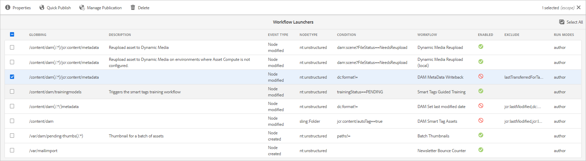

# Metadatos XMP {#xmp-metadata}

| Versión | Vínculo del artículo |
| -------- | ---------------------------- |
| AEM 6.5 | [Haga clic aquí](https://experienceleague.adobe.com/docs/experience-manager-65/assets/administer/xmp-writeback.html) |
| AEM as a Cloud Service | Este artículo |

XMP (Extensible Metadata Platform) es el estándar de metadatos que utiliza Experience Manager Assets para la administración de todos los metadatos. XMP proporciona un formato estándar para la creación, el procesamiento y el intercambio de metadatos para una amplia variedad de aplicaciones.

Además de ofrecer codificación de metadatos universal que se puede incrustar en todos los formatos de archivo, XMP proporciona un rico [modelo de contenido](#xmp-core-concepts) y es [compatible con Adobe](#advantages-of-xmp) y otras compañías, de modo que los usuarios de XMP en combinación con [!DNL Assets] tengan una plataforma potente sobre la cual construir.

## Información general y ecosistema de XMP {#xmp-ecosystem}

[!DNL Assets] admite de forma nativa el estándar de metadatos de XMP. XMP es un estándar para procesar y almacenar metadatos estandarizados y propios en recursos digitales. XMP está diseñado como el estándar común que permite que varias aplicaciones funcionen con eficacia con los metadatos.

Los profesionales de la producción, por ejemplo, utilizan la compatibilidad integrada con XMP en las aplicaciones de Adobe para pasar información a través de varios formatos de archivo. El repositorio [!DNL Assets] extrae los metadatos de XMP y los utiliza para administrar el ciclo de vida del contenido, además de ofrecer la capacidad de crear flujos de trabajo de automatización.

XMP estandariza la forma en que se definen, crean y procesan los metadatos proporcionando un modelo de datos, un modelo de almacenamiento y esquemas. Todos estos conceptos se tratan en esta sección.

Todos los metadatos heredados de EXIF, ID3 o Microsoft Office se traducen automáticamente a XMP, que se puede ampliar para admitir esquemas de metadatos específicos del cliente, como catálogos de productos.

Los metadatos de XMP constan de un conjunto de propiedades. Estas propiedades siempre están asociadas a una entidad específica denominada recurso; es decir, las propiedades se refieren al recurso. En el caso de XMP, el recurso siempre es el recurso.

XMP define un modelo de [metadatos](https://es.wikipedia.org/wiki/Metadatos) que se puede utilizar con cualquier conjunto definido de elementos de metadatos. XMP también define [esquemas](https://en.wikipedia.org/wiki/XML_schema) específicos para propiedades básicas útiles para registrar el historial de un recurso a medida que pasa por varios pasos de procesamiento, desde ser fotografiado, [escaneado](https://es.wikipedia.org/wiki/Esc%C3%A1ner_inform%C3%A1tico) o creado como texto, pasando por etapas de edición fotográfica (como [recorte](https://en.wikipedia.org/wiki/Cropping_%28image%29) o ajuste de color), hasta ensamblarse en una imagen final. XMP permite a cada programa o dispositivo de software añadir su propia información a un recurso digital, que se puede retener en el archivo digital final.

XMP se serializa y almacena con mayor frecuencia mediante un subconjunto del [W3C](https://es.wikipedia.org/wiki/World_Wide_Web_Consortium) [Resource Description Framework](https://en.wikipedia.org/wiki/Resource_Description_Framework) (RDF), que a su vez se expresa en [XML](https://en.wikipedia.org/wiki/XML).

### Ventajas de XMP {#advantages-of-xmp}

XMP tiene las siguientes ventajas sobre otros estándares de codificación y esquemas:

* Los metadatos basados en XMP son muy completos y precisos.
* XMP permite tener varios valores para una propiedad.
* XMP tiene una codificación estandarizada, que permite intercambiar fácilmente metadatos.
* XMP es extensible. Puede añadir información adicional a sus recursos.

El estándar de XMP está diseñado para ser extensible, lo que le permite agregar tipos personalizados de metadatos a los datos de XMP. EXIF, por otro lado, no - tiene una lista fija de propiedades que no se pueden ampliar.

>[!NOTE]
>
>XMP generalmente no permite incrustar tipos de datos binarios. Para transportar datos binarios en XMP, por ejemplo, imágenes en miniatura, se deben codificar en un formato compatible con XML como `Base64`.

### Conceptos principales de XMP {#xmp-core-concepts}

**Espacios de nombres y esquemas**

Un esquema de XMP es un conjunto de nombres de propiedad en un espacio de nombres XML común que incluye
el tipo de datos y la información descriptiva. Un esquema de XMP se identifica con su URI de espacio de nombres XML. El uso de áreas de nombres evita conflictos entre propiedades en esquemas diferentes que tienen el mismo nombre pero un significado diferente.

Por ejemplo, la propiedad **Creator** en dos esquemas diseñados de forma independiente podría significar la persona que creó el recurso o podría significar la aplicación que creó el recurso (por ejemplo, Adobe Photoshop).

**Propiedades y valores de XMP**

XMP puede incluir propiedades de uno o más de los esquemas. Por ejemplo, un subconjunto típico utilizado por muchas aplicaciones de Adobe puede incluir lo siguiente:

* Esquema principal de Dublín: `dc:title`, `dc:creator`, `dc:subject`, `dc:format`, `dc:rights`
* Esquema básico de XMP: `xmp:CreateDate`, `xmp:CreatorTool`, `xmp:ModifyDate`, `xmp:metadataDate`
* Esquema de administración de derechos de XMP: `xmpRights:WebStatement`, `xmpRights:Marked`
* Esquema de administración de medios de XMP: `xmpMM:DocumentID`

**Alternativas de idioma**

XMP permite agregar una propiedad `xml:lang` a las propiedades de texto para especificar el idioma del texto.

## Reescritura de XMP en representaciones {#xmp-writeback-to-renditions}

Esta característica de reescritura de XMP en [!DNL Adobe Experience Manager Assets] replica los cambios de metadatos en las representaciones del recurso original.
Cuando cambia los metadatos de un recurso desde [!DNL Assets] o mientras lo carga, los cambios se almacenan inicialmente en el nodo de metadatos de la jerarquía de recursos. La función de reescritura permite propagar los cambios de metadatos a todas las representaciones del recurso o a algunas específicas. La característica sólo devuelve las propiedades de metadatos que utilizan el espacio de nombres `jcr`, es decir, se devuelve una propiedad denominada `dc:title`, pero no una propiedad denominada `mytitle`.

Por ejemplo, imagine un escenario en el que modifica la propiedad [!UICONTROL Title] del recurso con título `Classic Leather` a `Nylon`.

En este caso, [!DNL Assets] guarda los cambios realizados en la propiedad **[!UICONTROL Title]** en el parámetro `dc:title` para los metadatos de recursos almacenados en la jerarquía de recursos.

>[!IMPORTANT]
>
>La característica de reescritura no está habilitada de manera predeterminada en [!DNL Assets]. Consulte cómo [habilitar la reescritura de metadatos](#enable-xmp-writeback). MSM para recursos digitales no funciona con la reescritura de metadatos habilitada. Tras la reescritura, la herencia se interrumpe.

### Habilitar reescritura de XMP {#enable-xmp-writeback}

El flujo de trabajo [!UICONTROL DAM Metadata Writeback] se usa para escribir de nuevo los metadatos de un recurso. Para habilitar la reescritura, siga uno de los tres métodos siguientes:

* Utilice los lanzadores.
* Iniciar manualmente `DAM MetaData Writeback` flujo de trabajo.
* Configure el flujo de trabajo para que forme parte del posprocesamiento.

Para utilizar los lanzadores, siga estos pasos:

1. Como administrador, acceda a **[!UICONTROL Herramientas]** > **[!UICONTROL Flujo de trabajo]** > **[!UICONTROL Lanzadores]**.
1. Seleccione el [!UICONTROL lanzador] para el cual la columna **[!UICONTROL Flujo de trabajo]** muestra **[!UICONTROL reescritura de metadatos DAM]**. Haga clic en **[!UICONTROL Propiedades]** en la barra de herramientas.

   

1. Seleccione **[!UICONTROL Activar]** en la página **[!UICONTROL Propiedades del lanzador]**. Haga clic en **[!UICONTROL Guardar y cerrar]**.

Para aplicar manualmente el flujo de trabajo a un recurso una sola vez, aplique el flujo de trabajo [!UICONTROL reescritura de metadatos DAM] desde el carril izquierdo.

Para aplicar el flujo de trabajo a todos los recursos cargados, añada el flujo de trabajo a un perfil de posprocesamiento.

<!-- Commenting for now. Need to document how to enable metadata writeback. See CQDOC-17254.

### Enable XMP writeback {#enable-xmp-writeback}

To enable the metadata changes to be propagated to the renditions of the asset when uploading it, modify the **[!UICONTROL Adobe CQ DAM Rendition Maker]** configuration in Configuration Manager.

1. To open Configuration Manager, access `https://[aem_server]:[port]/system/console/configMgr`.
1. Open the **[!UICONTROL Adobe CQ DAM Rendition Maker]** configuration.
1. Select the **[!UICONTROL Propagate XMP]** option, and then save the changes.

### Enable XMP write-back for specific renditions {#enable-xmp-writeback-for-specific-renditions}

To let the XMP write-back feature propagate metadata changes to select renditions, specify these renditions to the [!UICONTROL XMP Writeback Process] workflow step of DAM Metadata WriteBack workflow. By default, this step is configured with the original rendition.

For the XMP write-back feature to propagate metadata to the rendition thumbnails 140.100.png and 319.319.png, perform these steps.

1. Select the Experience Manager logo, and then navigate to **[!UICONTROL Tools]** &gt; **[!UICONTROL Workflow]** &gt; **[!UICONTROL Models]**.
1. From the Models page, open the **[!UICONTROL DAM Metadata Writeback]** workflow model.
1. In the **[!UICONTROL DAM Metadata Writeback]** properties page, open the **[!UICONTROL XMP Writeback Process]** step.
1. In the **[!UICONTROL Step Properties]** dialog box, select the **[!UICONTROL Process]** tab.
1. In the **[!UICONTROL Arguments]** box, add `rendition:cq5dam.thumbnail.140.100.png,rendition:cq5dam.thumbnail.319.319.png`, and then select **[!UICONTROL OK]**.

   

1. Save the changes.
1. To regenerate the Pyramid TIFF (PTIFF) renditions for Dynamic Media images with the new attributes, add the **[!UICONTROL Dynamic Media Process Image Assets]** step to the DAM Metadata write-back workflow. PTIFF renditions are only created and stored locally in a Dynamic Media Hybrid implementation.

1. Save the workflow.

The metadata changes are propagated to the renditions renditions thumbnail.140.100.png and thumbnail.319.319.png of the asset, and not the others.
-->

**Consulte también**

* [Traducir recursos](translate-assets.md)
* [API HTTP de recursos](mac-api-assets.md)
* [Formatos de archivo compatibles con recursos](file-format-support.md)
* [Buscar recursos](search-assets.md)
* [Recursos de red](use-assets-across-connected-assets-instances.md)
* [Informes de recurso](asset-reports.md)
* [Esquemas de metadatos](metadata-schemas.md)
* [Descarga de recursos](download-assets-from-aem.md)
* [Administración de metadatos](manage-metadata.md)
* [Facetas de búsqueda](search-facets.md)
* [Administrar colecciones](manage-collections.md)
* [Importación masiva de metadatos](metadata-import-export.md)
* [Publicación de recursos en AEM y Dynamic Media](/help/assets/publish-assets-to-aem-and-dm.md)
