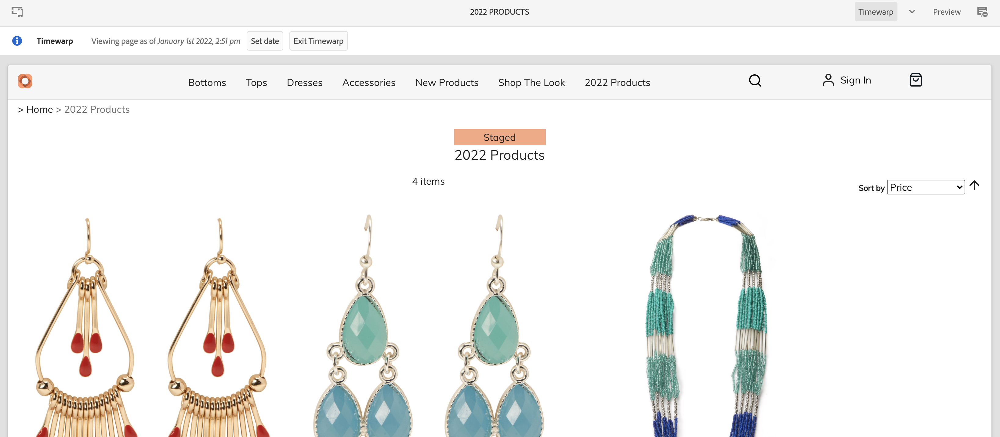

# Creación de experiencias comerciales {#authoring-commerce-experiences}

## Información general {#overview}

AEM El complemento CIF amplía la creación de informes con capacidades específicas del comercio. Esto permite a los autores crear y administrar experiencias relacionadas con el comercio de forma eficaz, obteniendo acceso a los datos y al contenido del producto sin abandonar el contexto.

## Seleccionadores {#pickers}

AEM Los selectores de productos y categorías son cuadros de diálogo de interfaz de usuario modales que ofrecen una manera cómoda para que los autores de la aplicación busquen y seleccionen productos o categorías cuando sea necesario. Los componentes principales, la asociación de contenido y las plantillas de producto son las áreas típicas con configuraciones que requieren datos del catálogo de productos. Los seleccionadores admiten varias opciones de configuración, como selección múltiple, selección de variaciones y preselección de valores.

### Selector de productos {#product-picker}

Este selector ofrece la exploración de la estructura del catálogo o la búsqueda de texto completo para encontrar el producto. Los productos con variación ofrecen un icono de carpeta en la columna Tipo. Al hacer clic en el icono de la carpeta, se abren las variaciones del producto seleccionado.

Al hacer clic en la categoría principal, el autor vuelve al nivel de producto.

**Teaser del producto de ejemplo**

El cuadro de diálogo de configuración de este componente requiere un producto. CIF utiliza el SKU como identificador del producto. Los autores pueden introducir el SKU a mano o hacer clic en el icono de la carpeta para abrir el selector de productos. Después de seleccionar y cerrar el selector, el cuadro de diálogo del componente muestra el nombre del producto seleccionado

### Selector de categoría {#category-picker}

Este selector ofrece la posibilidad de explorar la estructura del catálogo para encontrar la categoría.

**Ejemplo de carrusel de categorías**

El cuadro de diálogo de configuración de este componente requiere 1 : n categorías. CIF utiliza el UID/ID como identificador de categoría. Los autores pueden introducir el UID manualmente o hacer clic en el icono de carpeta para abrir el selector de categorías. Después de seleccionar y cerrar el selector, el cuadro de diálogo del componente muestra el nombre de la categoría seleccionada.

## Editor universal {#universal-editor}

El editor universal se amplía con funciones para acceder a los datos de productos en tiempo real y al contenido de productos asociado.

### Acceso a datos del producto {#access-product-data}

La pestaña &quot;Recursos&quot; del panel lateral del editor ofrece acceso a los datos del producto seleccionando el tipo &quot;Productos&quot;. Los datos se recuperan activos desde el extremo de comercio configurado. El filtro es una búsqueda de texto completo en el extremo de comercio para encontrar productos específicos.

Analógicamente, los productos se pueden enviar en una página (que crea un componente teaser de productos como predeterminado) o en componentes (actualmente compatibles con teaser y carrusel de productos).

### Adición de vínculos en campos de texto mediante RTE {#rte}

Las páginas del catálogo de productos del CIF son páginas virtuales que se procesan sobre la marcha. AEM Por lo tanto, no es posible incrustar hipervínculos como para las páginas de normales. CIF añade una nueva acción &quot;Vínculos de comercio&quot; al RTE (Editor de texto enriquecido). Esta acción funciona exactamente igual que la acción normal &quot;Hipervínculo&quot;, pero permite a los autores seleccionar un producto o una categoría mediante los selectores.

    >[!NOTA]
    >
    > Si se seleccionan tanto la categoría como el producto, se toma el producto.

Esto crea un vínculo de marcador de posición que se sustituye por un vínculo real cuando se representa la página.

### Acceso al contenido del producto asociado {#associated-content}

Si el editor universal reconoce productos 1:n en una página, el panel lateral mostrará automáticamente la pestaña &quot;Contenido de comercio asociado&quot;. AEM Esta pestaña permite a los autores acceder rápidamente al contenido de la documentación que se ha etiquetado con el producto (consulte ). [AEM enriquecer datos de productos con contenido asociado de la](./enrich-product-associated-content.md) para obtener más información). Esta pestaña ofrece desplegables para filtrar por tipo de contenido y productos específicos si hay varios productos en la página. El uso del contenido funciona exactamente igual que el uso de contenido de la pestaña Recursos.

### Previsualizar datos de productos clasificados {#staged-data}

AEM El modo Deformación de tiempo del editor permite a los autores obtener una vista previa y examinar una experiencia con datos de catálogo de productos clasificados en función de la fecha de Deformación de tiempo.

Los componentes mostrarán un indicador visual si la fecha utilizada está ensayada.

## Omnisearch {#omnisearch}

AEM El uso de Omnisearch es una forma sencilla para que los profesionales encuentren datos de catálogo de productos y contenido de la aplicación mediante búsquedas de texto completo. AEM AEM Omnisearch ejecutará la búsqueda de texto completo en el backend de comercio y en el backend de comercio para encontrar objetos de catálogo de productos en el backend de comercio y el contenido de la. AEM Los resultados también incluyen contenido que se etiquetó con datos de producto/categoría.

El resultado se agrupa por tipo.

>[!NOTE]
>
> La búsqueda de texto completo en Omnisearch no admite fragmentos de contenido asociados. Utilice el SKU o UID para buscar fragmentos de contenido asociados.
