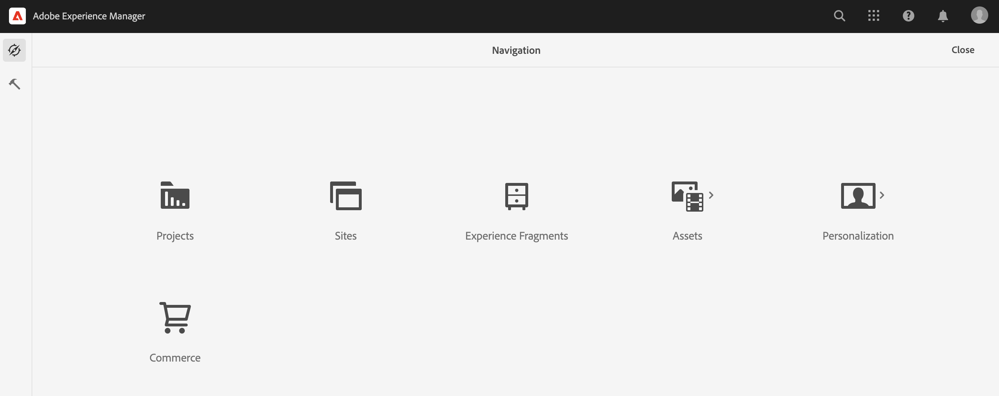

# Product Cockpit {#product-cockpit}

## Información general {#overview}

La cabina de productos proporciona una visión general unificada de los catálogos de productos vinculados y el contenido asociado. Todo el contenido asociado tiene vínculos para acceder rápidamente desde la cabina.

Los datos de productos clasificados incluyen cualquier mutación futura, como nuevas categorías, productos o propiedades actualizadas.

>[!NOTE]
>
>El término catálogo de productos es intercambiable con tienda de comercio, vista de tienda y expresiones similares.

## Configuración {#configuration}

AEM Los catálogos de productos deben configurarse en la interfaz de usuario de. Consulte [configuración de tiendas y catálogos](https://experienceleague.adobe.com/docs/experience-manager-cloud-service/content-and-commerce/storefront/getting-started.html?#catalog) para obtener más información.

La activación de las funciones de catálogo organizadas requiere autenticación. Consulte [Primeros pasos](https://experienceleague.adobe.com/docs/experience-manager-cloud-service/content-and-commerce/storefront/getting-started.html?lang=es) para obtener más información.

>[!NOTE]
>
>Las funciones de catálogo organizadas solo están disponibles con Adobe Commerce y conectores de terceros que admiten la autenticación basada en tokens.

## Apertura de la cabina de productos {#opening-product-cockpit}

AEM La forma más fácil de acceder a la cabina del producto es a través del menú &quot;Comercio&quot; en el menú principal de la barra de productos de la barra de herramientas, en el menú principal de la barra de herramientas. También es posible utilizar Omnisearch (búsqueda de Commerce) o abrir `https://<yourAEMInstance>/commerce.html`.

## Exploración de catálogos de productos {#browsing-product-catalogs}

La cabina de productos está organizada de forma jerárquica siguiendo la estructura del catálogo de productos. El primer nivel muestra el nivel de raíz del catálogo de todos los catálogos de productos configurados, incluida la información meta del backend de comercio.

Al hacer clic en una categoría, se cargarán los elementos secundarios de la categoría en la que se hizo clic.

Al hacer clic en un producto, se cargarán las variaciones de productos si están disponibles.

>[!NOTE]
>
>AEM Los datos del catálogo de productos en la son datos que se recuperan en tiempo real a través del punto de conexión comercial configurado. AEM No se almacenan datos del catálogo de productos en la.

## Buscando catálogos de productos {#searching-product-catalog}

Se proporciona una búsqueda de texto completo sobre el catálogo de productos completo en la pestaña del filtro izquierdo para encontrar productos rápidamente.

## Exploración del catálogo de productos escalonado {#staged-product-catalogs}

De forma predeterminada, la cabina de productos muestra los datos del catálogo de productos en directo. El uso del &quot;CATÁLOGO CLASIFICADO&quot; en la pestaña del filtro izquierdo cargará el catálogo de productos para cualquier fecha seleccionada.

## Propiedades del catálogo de productos {#catalog-properties}

Al hacer clic en el icono de propiedades de un producto o categoría, se abrirá la vista de propiedades del objeto seleccionado. Abrir propiedades de una variante de producto es igual a abrir las propiedades de producto principales.

### Fichas de comercio {#tabs}

Las pestañas general y de variante muestran propiedades de comercio predefinidas que provienen del backend del comercio. Estos datos (incl. AEM variantes) son datos de solo lectura en el caso de los datos, ya que el sistema de registro es el back-end de comercio. La pestaña variante solo aparece para productos con variantes y muestra una lista de todas las variantes.

### AEM Pestañas de contenido {#content-tabs}

AEM AEM Estas pestañas, agrupadas por tipos de contenido de (Fragmentos de experiencias, Fragmentos de contenido, Recursos asociados), muestran contenido de la lista de contenido asociado con el objeto de comercio, que se encuentra asociado con el contenido de la lista. La acción &quot;Ver detalles&quot; abre una nueva pestaña del explorador con el contenido seleccionado.

