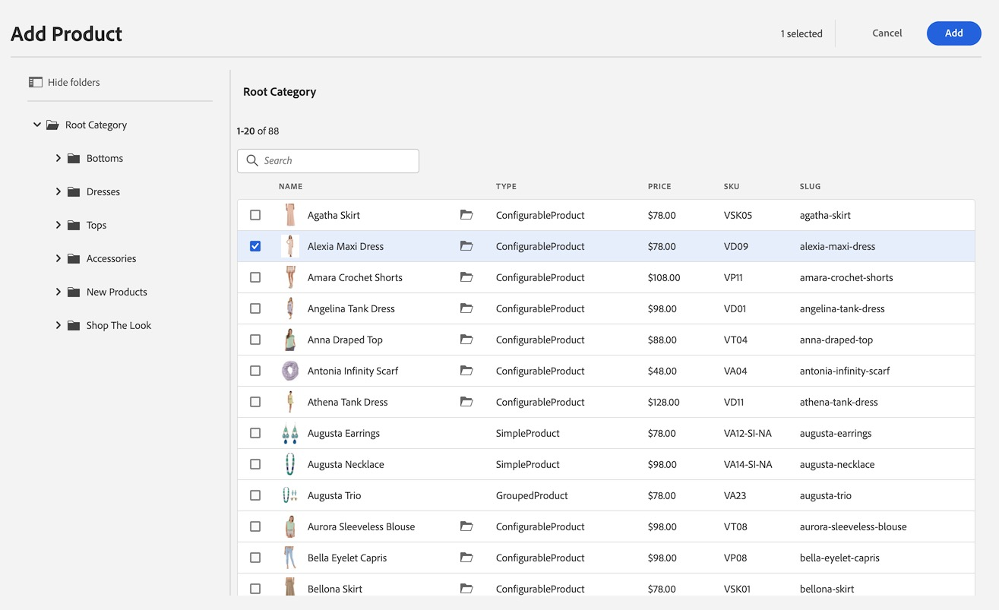

# Creación de experiencias de Commerce {#authoring-commerce-experiences}

## Información general {#overview}

El complemento de CIF amplía la creación de AEM con funciones específicas del comercio. Esto permite a los autores crear y administrar experiencias relacionadas con el comercio de forma eficaz, obteniendo acceso a los datos y al contenido del producto sin abandonar el contexto.

## Seleccionadores {#pickers}

Los selectores de productos y categorías son cuadros de diálogo de interfaz de usuario modales que ofrecen una forma cómoda para que los autores de AEM busquen y seleccionen productos o categorías cuando sea necesario. Los componentes principales, la asociación de contenido y las plantillas de producto son las áreas típicas con configuraciones que requieren datos del catálogo de productos. Los seleccionadores admiten varias opciones de configuración, como selección múltiple, selección de variaciones y preselección de valores.

### Selector de productos {#product-picker}

Este selector ofrece la exploración de la estructura del catálogo o la búsqueda de texto completo para encontrar el producto. Los productos con variación ofrecen un icono de carpeta en la columna Tipo. Al hacer clic en el icono de la carpeta, se abren las variaciones del producto seleccionado.

Al hacer clic en la categoría principal, el autor vuelve al nivel de producto.

#### Ejemplo de teaser de productos {#example-product-teaser}

El cuadro de diálogo de configuración de este componente requiere un producto. CIF utiliza el SKU como identificador de producto. Los autores pueden introducir el SKU a mano o hacer clic en el icono de la carpeta para abrir el selector de productos. Después de seleccionar y cerrar el selector, el cuadro de diálogo del componente muestra el nombre del producto seleccionado

### Selector de categoría {#category-picker}

Este selector ofrece la posibilidad de explorar la estructura del catálogo para encontrar la categoría.

#### Ejemplo de carrusel de categorías {#example-carousel}

El cuadro de diálogo de configuración de este componente requiere 1 : n categorías. CIF utiliza el UID/ID como identificador de categoría. Los autores pueden introducir el UID a mano o hacer clic en el icono de carpeta para abrir el selector de categorías. Después de seleccionar y cerrar el selector, el cuadro de diálogo del componente muestra el nombre de la categoría seleccionada.

## Editor de páginas {#page-editor}

El editor de páginas de AEM se ha ampliado con funciones para acceder a los datos de productos en tiempo real y al contenido de productos asociado.

### Acceso a datos del producto {#access-product-data}

La pestaña &quot;Assets&quot; del panel lateral del editor ofrece acceso a los datos del producto seleccionando el tipo &quot;Productos&quot;. Los datos se recuperan activos desde el extremo de comercio configurado. El filtro es una búsqueda de texto completo en el extremo de comercio para encontrar productos específicos.

Analógicamente, los productos se pueden enviar en una página (que crea un componente teaser de productos como predeterminado) o en componentes (actualmente compatibles con teaser y carrusel de productos).

### Adición de vínculos en campos de texto mediante RTE {#rte}

Las páginas del catálogo de productos de CIF son páginas virtuales que se procesan sobre la marcha. Por lo tanto, no es posible incrustar hipervínculos como para páginas normales de AEM. CIF añade una nueva acción &quot;Vínculos de Commerce&quot; al RTE (Editor de texto enriquecido). Esta acción funciona exactamente igual que la acción normal &quot;Hipervínculo&quot;, pero permite a los autores seleccionar un producto o una categoría mediante los selectores.

>[!NOTE]
>
> Si se seleccionan tanto la categoría como el producto, se toma el producto.

Esto crea un vínculo de marcador de posición que se sustituye por un vínculo real cuando se representa la página.

### Acceso al contenido del producto asociado {#associated-content}

Si el editor reconoce 1:n productos en una página, el panel lateral mostrará automáticamente la pestaña &quot;Contenido de Commerce asociado&quot;. Esta pestaña permite a los autores acceder rápidamente al contenido de AEM que se ha etiquetado con el producto (para obtener más información, consulte [enriquecer datos de productos con contenido de AEM asociado](/help/commerce-cloud/cif-storefront/authoring/enrich-product-associated-content.md)). Esta pestaña ofrece listas desplegables para filtrar por tipo de contenido y productos específicos si hay varios productos en la página. El uso del contenido funciona exactamente igual que el uso de la pestaña &quot;Assets&quot;.

### Previsualizar datos de productos clasificados {#staged-data}

El modo Deformación de tiempo del editor permite a los autores obtener una vista previa y examinar una experiencia de AEM con datos de catálogo de productos clasificados en función de la fecha de Deformación de tiempo.

Los componentes mostrarán un indicador visual si la fecha utilizada está ensayada.

## Omnisearch {#omnisearch}

El uso de Omnisearch es una forma sencilla para que los profesionales encuentren contenido de AEM y datos del catálogo de productos mediante la búsqueda de texto completo. Omnisearch ejecutará la búsqueda de texto completo en AEM y en el backend de Commerce para encontrar objetos de catálogo de productos en el backend de Commerce y en el contenido de AEM. Los resultados de AEM también incluyen contenido etiquetado con datos de productos o categorías.

El resultado se agrupa por tipo.

>[!NOTE]
>
> La búsqueda de texto completo en Omnisearch no admite fragmentos de contenido asociados. Utilice el SKU o UID para buscar fragmentos de contenido asociados.
