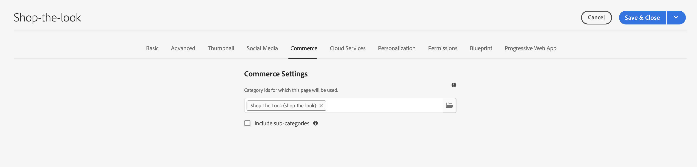

# Administrar páginas y plantillas del catálogo de productos {#product-catalog}

Obtenga información sobre cómo administrar páginas y plantillas de catálogo de productos.

## Lo que hemos visto hasta ahora {#story-so-far}

En el documento anterior del recorrido de creación de contenido de AEM y Commerce, [Introducción a los conceptos básicos de creación de CIF de AEM](/help/commerce-cloud/cif-storefront/commerce-journeys/aem-commerce-content-author/getting-started.md), ha aprendido los conceptos básicos de la creación de CIF.

Este artículo se basa en estos aspectos básicos.

## Objetivo {#objective}

Este documento le ayuda a comprender cómo administrar las páginas y plantillas del catálogo de productos. Después de leer, debería haber logrado lo siguiente:

* comprender los conceptos de las plantillas de catálogo
* cómo funcionan las plantillas genéricas
* ha creado una plantilla individual

## El concepto básico {#basic-concept}

La tienda Venia incluye una experiencia típica de catálogo de productos con navegación y aterrizaje, categoría (PLP) y páginas de detalles de producto (PDP).

Las páginas de catálogo se crean dinámicamente mediante una plantilla de catálogo de AEM CIF y datos de productos en tiempo real que se recuperan del extremo de comercio cuando es necesario. Cada catálogo tiene una plantilla genérica para páginas de productos y categorías.

El componente de navegación muestra el contenido y las páginas del catálogo. Es posible mostrar la página de aterrizaje del catálogo o las categorías de primer nivel en la navegación. Al pasar el ratón por encima de una categoría, se mostrarán las categorías de segundo nivel como una segunda línea.

Al hacer clic en una categoría, se abre la página de categoría (o la página de lista de productos).

Al hacer clic en un producto, se abre la página de detalles del producto.

## Las plantillas {#templates}

### Plantillas genéricas {#generic}

La plantilla de catálogo de Venia genérica utiliza el componente principal de la lista de productos. Este componente muestra la imagen de la categoría si está disponible y los productos de la categoría.

La plantilla de producto genérica Venia utiliza el componente principal Detalles del producto. Este componente muestra información del producto para varios tipos de productos y acciones de complemento al carro de compras.

### Editar plantillas {#edit-templates}

Las plantillas se pueden editar abriendo directamente la página de la plantilla o cambiando al modo de edición mientras navega por una página del catálogo de productos. Tenga en cuenta que al cambiar la página se cambiará la plantilla y no solo la página específica del producto/categoría.

### Plantillas específicas de categoría o producto {#specific}

CIF admite varias plantillas en solo unos clics. Para crear otra plantilla, seleccione la plantilla genérica de la categoría correspondiente y cree una página con la acción **Crear**.

Seleccione la plantilla de producto o categoría correspondiente.

Introduzca el título y cree la página.

Observe que ahora tiene una plantilla específica debajo de la genérica.

Abra la plantilla. Se parece exactamente a la plantilla de categoría genérica.

Añada cualquier imagen en la parte superior de la página.

La plantilla se puede previsualizar con cualquier categoría o producto. Abra **Información de la página** y seleccione **Ver con categoría/producto**. Seleccione el producto/categoría del selector para obtener una vista previa de este producto/categoría. Seleccione la categoría **Ver el aspecto** para obtener una vista previa de la plantilla actualizada.

Ahora tiene que asignar esta plantilla a la categoría específica. Abra las propiedades en el menú **Información de la página** y cambie a la pestaña de comercio. Haga clic en el icono de la carpeta para seleccionar la categoría **Ver el aspecto** del selector de categorías. Es posible asignar varias categorías a una plantilla e incluir también subcategorías activando la casilla de verificación.

Vuelva a la página principal y haga clic en **Ver la categoría Look** para ver la plantilla específica. Todas las demás categorías seguirán utilizando la plantilla genérica.

Se puede aplicar el mismo flujo de trabajo para crear plantillas de producto individuales.

## Siguientes pasos {#what-is-next}

Ahora que ha completado esta parte del recorrido, debe:

* comprender los conceptos de las plantillas de catálogo
* cómo funcionan las plantillas genéricas
* ha creado una plantilla individual

Aproveche este conocimiento y continúe con su recorrido revisando el documento [Administrar experiencias de catálogo de productos clasificados](/help/commerce-cloud/cif-storefront/commerce-journeys/aem-commerce-content-author/staged-catalog.md), donde aprenderá a trabajar con datos de productos clasificados y lanzamientos de AEM.

## Recursos adicionales {#additional-resources}

Aunque se recomienda pasar a la siguiente parte del recorrido al revisar el documento [Administrar la experiencia del catálogo de productos clasificados,](/help/commerce-cloud/cif-storefront/commerce-journeys/aem-commerce-content-author/staged-catalog.md) los siguientes son algunos recursos opcionales que profundizan ciertos conceptos mencionados en este documento, pero que no son necesarios para continuar en el recorrido sin encabezado:

* [Creación de páginas de múltiples productos y categorías](/help/commerce-cloud/cif-storefront/authoring/multi-template-usage.md)
* [Guía de migración para Experience Manager Cloud Service](/help/commerce-cloud/cif-storefront/migration.md): Migración al complemento AEM Commerce integration framework (CIF) desde una versión antigua
