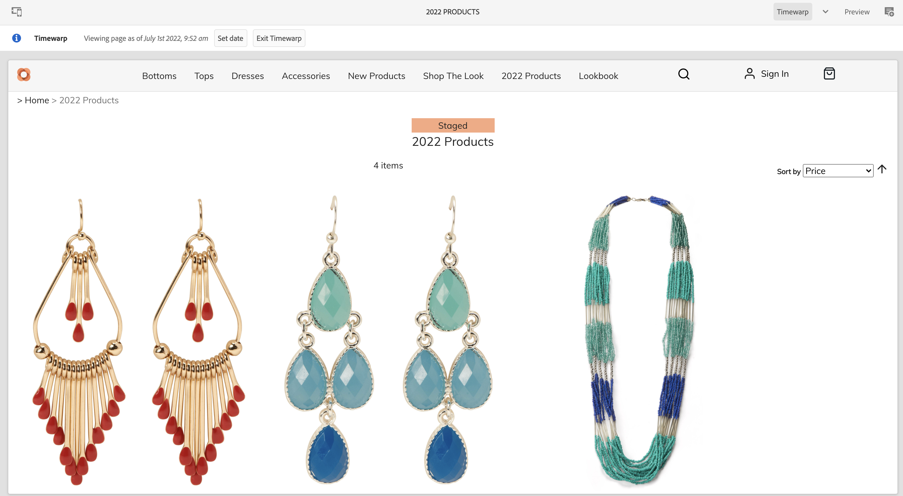

# Creación de experiencias de catálogo de productos por etapas {#building-experiences}

Obtenga información sobre cómo administrar las experiencias de catálogo de productos clasificados.

## Lo que hemos visto hasta ahora {#story-so-far}

En el documento anterior del recorrido de trabajo Contenido de AEM y Commerce, [Administrar páginas y plantillas de catálogo de productos](/help/commerce-cloud/cif-storefront/commerce-journeys/aem-commerce-content-author/catalog-templates.md), ha aprendido a administrar y generar experiencias de catálogo de productos basadas en plantillas.

Este artículo se basa en estos aspectos básicos.

## Objetivo {#objective}

Este documento le ayuda a comprender cómo administrar la experiencia del catálogo de productos en función de los datos de productos clasificados y los lanzamientos de AEM. Muchas veces, los autores tienen que preparar en paralelo un próximo lanzamiento de producto (como una nueva colección de ropa). Esto requiere acceso a los datos del producto clasificados (aún no están activos) y la capacidad de preparar el contenido. Este nuevo contenido se publicará con el lanzamiento del producto.

>[!NOTE]
>
>Esta función solo está disponible con Adobe Commerce o Cloud Edition y conectores de terceros que admiten la autenticación basada en tokens. Consulte [Introducción](/help/commerce-cloud/cif-storefront/getting-started.md) para obtener más información.

En primer lugar, veamos cómo los autores pueden acceder a los datos de productos clasificados con CIF.

## Uso de datos de productos clasificados {#staged-product-data}

Una forma de acceder a los datos de productos clasificados es utilizar la cabina de productos. Abra el catálogo de productos haciendo clic en el icono Commerce en el menú principal de AEM. Esto le proporciona acceso a los datos del producto en directo. Abra la pestaña de filtro a la izquierda y expanda **CATÁLOGO CLASIFICADO**. Con los datos de vista previa, ahora puede acceder a los datos de productos clasificados en cualquier momento. Los datos clasificados incluyen nuevas categorías, productos o campos actualizados como el precio.

Es posible obtener una vista previa de una tienda con datos clasificados mediante la vista Deformación de tiempo. Abra el editor y cambie el modo a Deformación de tiempo. Seleccione cualquier fecha futura. Observe que, sobre el editor, la información indica que está viendo la página durante una fecha determinada.

Ahora puede examinar el catálogo con los datos clasificados. Si abre una categoría o una página de producto clasificados, el editor mostrará un indicador visual.

>[!NOTE]
>
>Omnisearch no tiene contexto y, por lo tanto, solo devolverá datos del catálogo de productos activo

## Lanzamientos de AEM {#launches}

Lanzamientos de AEM le permite crear contenido para los datos de productos clasificados. Si no está familiarizado con los lanzamientos, siga el vínculo de documentación en la sección [Recursos adicionales.](#additional-resources): la fecha de lanzamiento se usa para acceder a los datos de productos clasificados.

Observe que los selectores respetan la fecha de lanzamiento con el indicador de ensayo a la derecha.

## Siguientes pasos {#what-is-next}

Ahora que ha completado esta parte del recorrido, debe:

* comprender los conceptos de catálogo de productos clasificados y contenido con lanzamientos
* poder acceder a los datos del catálogo de productos clasificados mediante la cabina de productos y el editor

Ya está listo para administrar las experiencias de [&#x200B; producto.](/help/commerce-cloud/cif-storefront/commerce-journeys/aem-commerce-content-author/product-experience-management.md) Sin embargo, AEM Content y Commerce tienen muchas opciones adicionales disponibles. Consulte algunos de los recursos adicionales disponibles en la sección [Recursos adicionales](#additional-resources) para obtener más información acerca de las funciones que ha visto en este recorrido.

## Recursos adicionales {#additional-resources}

* [Product Cockpit](/help/commerce-cloud/cif-storefront/authoring/product-cockpit.md)
* [Introducción](/help/commerce-cloud/cif-storefront/getting-started.md)
* [Lanzamientos](/help/sites-cloud/authoring/launches/overview.md)
