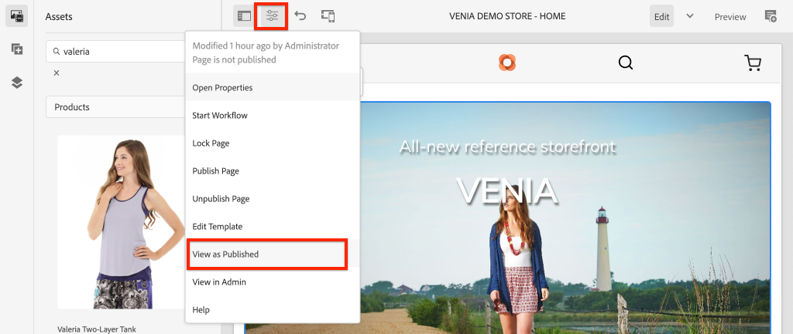
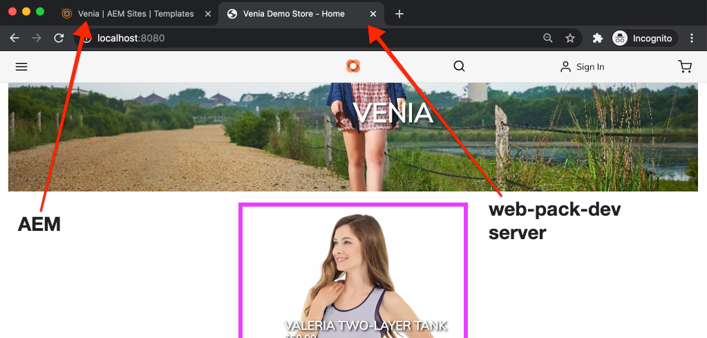
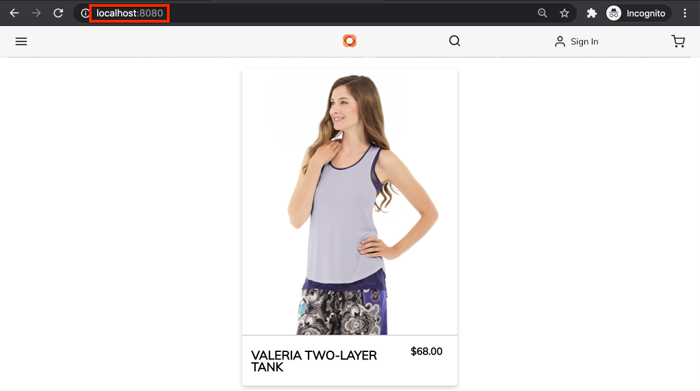

# Diseño de los componentes principales del CIF de AEM {#style-aem-cif-core-components}

El [Proyecto Venia de CIF](https://github.com/adobe/aem-cif-guides-venia) es una base de código de referencia para usar [Componentes principales de CIF.](https://github.com/adobe/aem-core-cif-components) En este tutorial, inspeccionará el proyecto de referencia de Venia y comprenderá cómo se organizan los componentes principales de AEM CIF y CSS y JavaScript. También puede crear un estilo con CSS para actualizar el estilo predeterminado del componente **teaser de productos**.

>[!TIP]
>
> Utilice el [arquetipo de proyecto de AEM](https://github.com/adobe/aem-project-archetype) al iniciar su propia implementación comercial.

## Qué va a generar {#what-you-will-build}

En este tutorial, se implementa un nuevo estilo para el componente teaser de productos que se parece a una tarjeta. Las lecciones aprendidas en el tutorial se pueden aplicar a otros componentes principales de CIF.


## Requisitos previos {#prerequisites}

Se requiere un entorno de desarrollo local para completar este tutorial. Este entorno incluye una instancia en ejecución de AEM configurada y conectada a una instancia de Adobe Commerce. Revise los requisitos y pasos para [configurar un desarrollo local con AEM as a Cloud Service SDK.](/help/commerce-cloud/cif-storefront/develop.md)

## Clonar el proyecto Venia {#clone-venia-project}

Va a clonar el [proyecto Venia](https://github.com/adobe/aem-cif-guides-venia) y, a continuación, invalidará los estilos predeterminados.

>[!NOTE]
>
> **Siéntase libre de usar un proyecto existente** (basado en el tipo de archivo del proyecto AEM con CIF incluido) y omita esta sección.

1. Ejecute el siguiente comando de Git para poder clonar el proyecto:

   ```shell
   $ git clone git@github.com:adobe/aem-cif-guides-venia.git
   ```

1. Cree e implemente el proyecto en una instancia local de AEM:

   ```shell
   $ cd aem-cif-guides-venia/
   $ mvn clean install -PautoInstallPackage,cloud
   ```

1. Añada las configuraciones de OSGi necesarias para poder conectar la instancia de AEM a una instancia de Adobe Commerce o agregar las configuraciones al proyecto creado.

1. En este punto, debería tener una versión de trabajo de una tienda conectada a una instancia de Adobe Commerce. Vaya a la página `US` > `Home` en: [http://localhost:4502/editor.html/content/venia/us/en.html.](http://localhost:4502/editor.html/content/venia/us/en.html)

   Hay que ver que el escaparate esté usando actualmente el tema de Venia. Al expandir el menú principal de la tienda, verá varias categorías que indican que la conexión con Adobe Commerce está funcionando.

   

## Bibliotecas de cliente y módulo ui.frontend {#introduction-to-client-libraries}

CSS y JavaScript responsables de procesar el tema o los estilos de la tienda se administran en AEM mediante una [biblioteca de cliente](/help/implementing/developing/introduction/clientlibs.md) o &quot;clientlibs&quot;, para abreviar. Las bibliotecas de cliente proporcionan un mecanismo para organizar CSS y JavaScript en el código de un proyecto y luego distribuirlas en la página.

Los estilos específicos de marca se pueden aplicar a los componentes principales de AEM CIF agregando y anulando el CSS administrado por estas bibliotecas de cliente. Es fundamental comprender cómo se estructuran e incluyen las bibliotecas de cliente en la página.

[ui.frontend](https://experienceleague.adobe.com/docs/experience-manager-core-components/using/developing/archetype/uifrontend.html) es un proyecto [webpack](https://webpack.js.org/) dedicado para administrar todos los recursos front-end de un proyecto. Este webpack permite a los desarrolladores de front-end usar cualquier número de idiomas y tecnologías como [TypeScript](https://www.typescriptlang.org/), [Sass](https://sass-lang.com/) y mucho más.

El módulo `ui.frontend` también es un módulo Maven y se integra con el proyecto más grande usando un módulo NPM: [aem-clientlib-generator](https://github.com/wcm-io-frontend/aem-clientlib-generator). Durante una compilación, `aem-clientlib-generator` copia los archivos CSS y JavaScript compilados en una biblioteca de cliente en el módulo `ui.apps`.


*El CSS y el JavaScript compilados se copian del módulo `ui.frontend` al módulo `ui.apps` como una biblioteca de cliente durante una compilación de Maven*

## Actualizar el estilo del teaser {#ui-frontend-module}

A continuación, realice un pequeño cambio en el estilo Teaser para ver cómo funcionan el módulo `ui.frontend` y las bibliotecas de cliente. Use [el IDE de su elección](https://experienceleague.adobe.com/docs/experience-manager-learn/cloud-service/local-development-environment-set-up/development-tools.html#set-up-the-development-ide) para importar el proyecto Venia. Las capturas de pantalla utilizadas provienen del [IDE de código de Visual Studio.](https://experienceleague.adobe.com/docs/experience-manager-learn/cloud-service/local-development-environment-set-up/development-tools.html#microsoft-visual-studio-code)

1. Navegue y expanda el módulo **ui.frontend** y expanda la jerarquía de carpetas a: `ui.frontend/src/main/styles/commerce`:

   

   Observe que hay varios archivos Sass (`.scss`) debajo de la carpeta. Estos archivos son estilos específicos de Commerce para cada uno de los componentes de Commerce.

1. Abra el archivo `_productteaser.scss`.

1. Actualice la regla `.item__image` y modifique la regla de borde:

   ```scss
   .item__image {
       border: #ea00ff 8px solid; /* <-- modify this rule */
       display: block;
       grid-area: main;
       height: auto;
       opacity: 1;
       transition-duration: 512ms;
       transition-property: opacity, visibility;
       transition-timing-function: ease-out;
       visibility: visible;
       width: 100%;
   }
   ```

   La regla anterior debe agregar un borde rosa en negrita al componente teaser de productos.

1. Abra una nueva ventana de terminal y vaya a la carpeta `ui.frontend`:

   ```shell
   $ cd <project-location>/aem-cif-guides-venia/ui.frontend
   ```

1. Ejecute el siguiente comando Maven:

   ```shell
   $ mvn clean install
   ...
   [INFO] ------------------------------------------------------------------------
   [INFO] BUILD SUCCESS
   [INFO] ------------------------------------------------------------------------
   [INFO] Total time:  29.497 s
   [INFO] Finished at: 2020-08-25T14:30:44-07:00
   [INFO] ------------------------------------------------------------------------
   ```

   Compruebe la salida de los terminales. Observe que el comando Maven ejecutó varios scripts NPM, incluido `npm run build`. El comando `npm run build` se define en el archivo `package.json` y compila el proyecto de Webpack y almacena en déclencheur la generación de la biblioteca de cliente.

1. Inspeccione el archivo `ui.frontend/dist/clientlib-site/site.css`:

   

   El archivo es la versión compilada y minificada de todos los archivos Sass del proyecto.

   >[!NOTE]
   >
   > Los archivos de este tipo se omiten desde el control de código fuente, ya que deben generarse durante la generación.

1. Inspeccione el archivo `ui.frontend/clientlib.config.js`.

   ```js
   /* clientlib.config.js*/
   ...
   // Config for `aem-clientlib-generator`
   module.exports = {
       context: BUILD_DIR,
       clientLibRoot: CLIENTLIB_DIR,
       libs: [
           {
               ...libsBaseConfig,
               name: 'clientlib-site',
               categories: ['venia.site'],
               dependencies: ['venia.dependencies', 'aem-core-cif-react-components'],
               assets: {
   ...
   ```

   Este archivo de configuración es para [aem-clientlib-generator](https://github.com/wcm-io-frontend/aem-clientlib-generator) y determina dónde y cómo se transforman el CSS y el JavaScript compilados en una biblioteca de cliente de AEM.

1. En el módulo `ui.apps`, inspeccione el archivo: `ui.apps/src/main/content/jcr_root/apps/venia/clientlibs/clientlib-site/css/site.css`:

   

   Este archivo está `site.css` copiado en el proyecto `ui.apps`. Ahora forma parte de una biblioteca de cliente denominada `clientlib-site` con una categoría de `venia.site`. Una vez que el archivo forme parte del módulo `ui.apps`, se puede implementar en AEM.

   >[!NOTE]
   >
   > Los archivos como este también se omiten desde el control de código fuente, ya que deben generarse durante la generación.

1. A continuación, inspeccione las demás bibliotecas de cliente generadas por el proyecto:

   

   El módulo `ui.frontend` no administra estas bibliotecas de cliente. En su lugar, estas bibliotecas de cliente incluyen dependencias CSS y JavaScript proporcionadas por Adobe. La definición de estas bibliotecas de cliente se encuentra en el archivo `.content.xml` debajo de cada carpeta.

   **clientlib-base**: una biblioteca de cliente vacía que simplemente incrusta las dependencias necesarias de [componentes principales de AEM.](https://experienceleague.adobe.com/docs/experience-manager-core-components/using/introduction.html?lang=es) La categoría es `venia.base`.

   **clientlib-cif**: una biblioteca de cliente vacía que simplemente incrusta las dependencias necesarias de [los componentes principales de AEM CIF.](https://github.com/adobe/aem-core-cif-components) La categoría es `venia.cif`.

   **clientlib-grid**: incluye CSS para habilitar la característica Cuadrícula interactiva de AEM. El uso de la cuadrícula de AEM habilita [Modo de diseño](/help/sites-cloud/authoring/page-editor/responsive-layout.md) en el Editor de AEM y permite a los autores de contenido cambiar el tamaño de los componentes. La categoría es `venia.grid` y está incrustada en la biblioteca `venia.base`.

1. Inspeccione los archivos `customheaderlibs.html` y `customfooterlibs.html` situados debajo de `ui.apps/src/main/content/jcr_root/apps/venia/components/page`:

   

   Estos scripts incluyen las bibliotecas **venia.base** y **venia.cif** como parte de todas las páginas.

   >[!NOTE]
   >
   > Solo las bibliotecas base están &quot;codificadas&quot; como parte de los scripts de página. `venia.site` no se incluye en estos archivos y en su lugar se incluye como parte de la plantilla de página para una mayor flexibilidad. Este proceso se inspecciona más adelante.

1. Desde el terminal, cree e implemente todo el proyecto en una instancia local de AEM:

   ```shell
   $ cd aem-cif-guides-venia/
   $ mvn clean install -PautoInstallPackage,cloud
   ```

## Crear un teaser de productos {#author-product-teaser}

Ahora que se han implementado las actualizaciones de código, agregue una instancia del componente teaser de productos a la página de inicio del sitio con las herramientas de creación de AEM. Al hacerlo, podemos ver los estilos actualizados.

1. Abra una nueva ficha del explorador y vaya a la **Página principal** del sitio: [http://localhost:4502/editor.html/content/venia/us/en.html.](http://localhost:4502/editor.html/content/venia/us/en.html)

1. Expanda el buscador de recursos (el carril lateral) en el modo **Editar**. Cambie el filtro de recursos a **Productos**.

   

1. Arrastre y suelte un nuevo producto en la página de inicio del contenedor de diseño principal:

   

   Debe ver que el teaser de productos ahora tiene un borde rosa brillante en función del cambio de regla CSS creado anteriormente.

## Verificar las bibliotecas de cliente en la página {#verify-client-libraries}

A continuación, compruebe la inclusión de las bibliotecas de cliente en la página.

1. Vaya a la **Página principal** del sitio: [http://localhost:4502/editor.html/content/venia/us/en.html.](http://localhost:4502/editor.html/content/venia/us/en.html)

1. Seleccione el menú **Información de página** y haga clic en **Ver tal y como aparece publicado**:

   

   Esta página se abre sin que se haya cargado ninguna de las API de AEM Author JavaScript, ya que aparecería en el sitio publicado. Observe que la dirección URL tiene el parámetro de consulta `?wcmmode=disabled` anexado. Al desarrollar CSS y JavaScript, se recomienda utilizar este parámetro para simplificar la página sin nada del autor de AEM.

1. Vea el origen de la página y para identificar varias bibliotecas de cliente:

   ```html
   <!DOCTYPE html>
   <html lang="en-US">
   <head>
       ...
       <link rel="stylesheet" href="/etc.clientlibs/venia/clientlibs/clientlib-base.min.css" type="text/css">
       <link rel="stylesheet" href="/etc.clientlibs/venia/clientlibs/clientlib-site.min.css" type="text/css">
   </head>
   ...
       <script type="text/javascript" src="/etc.clientlibs/venia/clientlibs/clientlib-site.min.js"></script>
       <script type="text/javascript" src="/etc.clientlibs/core/wcm/components/commons/site/clientlibs/container.min.js"></script>
       <script type="text/javascript" src="/etc.clientlibs/venia/clientlibs/clientlib-base.min.js"></script>
   <script type="text/javascript" src="/etc.clientlibs/core/cif/clientlibs/common.min.js"></script>
   <script type="text/javascript" src="/etc.clientlibs/venia/clientlibs/clientlib-cif.min.js"></script>
   </body>
   </html>
   ```

   Las bibliotecas de cliente cuando se entregan a la página llevan el prefijo `/etc.clientlibs` y se proporcionan a través de un [proxy](/help/implementing/developing/introduction/clientlibs.md) para evitar exponer cualquier elemento confidencial en `/apps` o `/libs`.

   Aviso `venia/clientlibs/clientlib-site.min.css` y `venia/clientlibs/clientlib-site.min.js`. Estos archivos son los archivos CSS y JavaScript compilados derivados del módulo `ui.frontend`.

## Inclusión de la biblioteca de clientes con plantillas de página {#client-library-inclusion-pagetemplates}

Existen varias opciones para incluir una biblioteca del lado del cliente. A continuación, revise cómo el proyecto generado incluye las bibliotecas de `clientlib-site` a través de [plantillas de página.](/help/implementing/developing/components/templates.md)

1. Vaya a la **Página principal** del sitio en el Editor de AEM: [http://localhost:4502/editor.html/content/venia/us/en.html.](http://localhost:4502/editor.html/content/venia/us/en.html)

1. Seleccione el menú **Información de la página** y haga clic en **Editar plantilla**:

   

   Se ha abierto la plantilla **Página de aterrizaje** en la que se basa la página **Hogar**.

   >[!NOTE]
   >
   > Para ver todas las plantillas disponibles desde la pantalla de inicio de AEM, vaya a **Herramientas** > **General** > **Plantillas**.

1. En la esquina superior izquierda, seleccione el icono **Información de página** y haga clic en **Política de página**.

   

1. La directiva de página se abre para la plantilla Página de aterrizaje:

   

   A la derecha, puede ver una lista de las bibliotecas de cliente **categorías** que se incluyen en todas las páginas que utilizan esta plantilla.

   * `venia.dependencies`: proporciona todas las bibliotecas de proveedores de las que depende `venia.site`.
   * `venia.site` - La categoría de `clientlib-site` que genera el módulo `ui.frontend`.

   Observe que otras plantillas utilizan la misma directiva, **Página de contenido**, **Página de aterrizaje**, etc. Al reutilizar la misma directiva, se garantiza que se incluyan las mismas bibliotecas de cliente en todas las páginas.

   La ventaja de utilizar las plantillas y las directivas de página para administrar la inclusión de bibliotecas de cliente es que puede cambiar la directiva por plantilla. Por ejemplo: quizás esté administrando dos marcas diferentes dentro de la misma instancia de AEM. Cada marca tiene su propio estilo único o *tema*, pero las bibliotecas base y el código son iguales. Otro ejemplo: si tiene una biblioteca de cliente más grande que solo desea que aparezca en determinadas páginas, puede crear una directiva de página única solo para esa plantilla.

## Desarrollo de Webpack local {#local-webpack-development}

En el ejercicio anterior, se actualizó un archivo Sass en el módulo `ui.frontend` y, después de realizar una compilación de Maven, los cambios se implementan en AEM. A continuación, observe cómo utilizar un webpack-dev-server para desarrollar rápidamente los estilos front-end.

El webpack-dev-server proporciona imágenes y algunos de los CSS/JavaScript de la instancia local de AEM, pero permite al desarrollador modificar los estilos y JavaScript en el módulo `ui.frontend`.

1. En el explorador, vaya a la página **Inicio** y **Ver como publicado**: [http://localhost:4502/content/venia/us/en.html?wcmmode=disabled.](http://localhost:4502/content/venia/us/en.html?wcmmode=disabled)

1. Vea el origen de la página y **copie** la HTML sin procesar de la página.

1. Vuelva al IDE de su elección debajo del módulo `ui.frontend` para abrir el archivo: `ui.frontend/src/main/static/index.html`

   

1. Sobrescribir el contenido de `index.html` y **pegar** el HTML copiado en el paso anterior.

1. Busque las &quot;inclusiones&quot; de `clientlib-site.min.css`, `clientlib-site.min.js` y **elimínelas**.

   ```html
   <head>
       <!-- remove this link -->
       <link rel="stylesheet" href="/etc.clientlibs/venia/clientlibs/clientlib-base.min.css" type="text/css">
       ...
   </head>
   <body>
       ...
        <!-- remove this link -->
       <script type="text/javascript" src="/etc.clientlibs/venia/clientlibs/clientlib-site.min.js"></script>
   </body>
   ```

   Estas &quot;inclusiones&quot; se quitan porque representan la versión compilada de CSS y JavaScript generada por el módulo `ui.frontend`. Deje las demás bibliotecas de cliente como se van a procesar como proxy desde la instancia de AEM en ejecución.

1. Abra una nueva ventana de terminal y vaya a la carpeta `ui.frontend`. Ejecute el comando `npm start`:

   ```shell
   $ cd ui.frontend
   $ npm start
   ```

   Este comando inicia el webpack-dev-server en [http://localhost:8080/.](http://localhost:8080/)

   >[!CAUTION]
   >
   > Si se produce un error relacionado con Sass, detenga el servidor y ejecute el comando `npm rebuild node-sass` y repita los pasos anteriores. Este error se puede producir si tiene una versión de `npm` y `node` diferente a la especificada en el proyecto `aem-cif-guides-venia/pom.xml`.

1. Vaya a [http://localhost:8080/](http://localhost:8080/) en una nueva pestaña con el mismo explorador que una instancia de inicio de sesión de AEM. Debería ver la página de inicio de Venia a través del webpack-dev-server:

   

   Deje el webpack-dev-server en ejecución. Se utiliza en el siguiente ejercicio.

## Implementar el estilo de tarjeta para el teaser de productos {#update-css-product-teaser}

A continuación, modifique los archivos Sass en el módulo `ui.frontend` para implementar un estilo de tarjeta para el teaser de productos. El webpack-dev-server se utiliza para ver rápidamente los cambios.

Vuelva al IDE y al proyecto generado.

1. En el módulo **ui.frontend**, vuelva a abrir el archivo `_productteaser.scss` en `ui.frontend/src/main/styles/commerce/_productteaser.scss`.

1. Realice los siguientes cambios en el borde del teaser de productos:

   ```diff
       .item__image {
   -       border: #ea00ff 8px solid;
   +       border-bottom: 1px solid #c0c0c0;
           display: block;
           grid-area: main;
           height: auto;
           opacity: 1;
           transition-duration: 512ms;
           transition-property: opacity, visibility;
           transition-timing-function: ease-out;
           visibility: visible;
           width: 100%;
       }
   ```

   Guarde los cambios y el webpack-dev-server debe actualizarse automáticamente con los nuevos estilos.

1. En el teaser de productos, añada una sombra paralela e incluya esquinas redondeadas.

   ```scss
    .item__root {
        position: relative;
        box-shadow: 0 4px 8px 0 rgba(0,0,0,0.2);
        transition: 0.3s;
        border-radius: 5px;
        float: left;
        margin-left: 12px;
        margin-right: 12px;
   }
   
   .item__root:hover {
      box-shadow: 0 8px 16px 0 rgba(0,0,0,0.2);
   }
   ```

1. Actualice el nombre del producto para que aparezca en la parte inferior del teaser y modifique el color del texto.

   ```css
   .item__name {
       color: #000;
       display: block;
       float: left;
       font-size: 22px;
       font-weight: 900;
       line-height: 1em;
       padding: 0.75em;
       text-transform: uppercase;
       width: 75%;
   }
   ```

1. Actualice el precio del producto para que también aparezca en la parte inferior del teaser y modifique el color del texto.

   ```css
   .price {
       color: #000;
       display: block;
       float: left;
       font-size: 18px;
       font-weight: 900;
       padding: 0.75em;
       padding-bottom: 2em;
       width: 25%;
   
       ...
   ```

1. Actualice la consulta de medios en la parte inferior para poder apilar el nombre y el precio en pantallas de menos de **992px**.

   ```css
   @media (max-width: 992px) {
       .productteaser .item__name {
           font-size: 18px;
           width: 100%;
       }
       .productteaser .item__price {
           font-size: 14px;
           width: 100%;
       }
   }
   ```

   Ahora debería ver el estilo de tarjeta reflejado en el webpack-dev-server:

   

   Sin embargo, los cambios aún no se han implementado en AEM. Puede [descargar el archivo de la solución aquí](../assets/style-cif-component/_productteaser.scss).

1. Implemente las actualizaciones en AEM con sus habilidades con Maven, desde un terminal de línea de comandos:

   ```shell
   $ cd aem-cif-guides-venia/
   $ mvn clean install -PautoInstallPackage,cloud
   ```

   >[!NOTE]
   >Existen [herramientas y configuración IDE](https://experienceleague.adobe.com/docs/experience-manager-learn/foundation/development/set-up-a-local-aem-development-environment.html#set-up-an-integrated-development-environment) adicionales que pueden sincronizar los archivos de proyecto directamente con una instancia de AEM local sin tener que realizar una compilación completa de Maven.

## Ver teaser de productos actualizado {#view-updated-product-teaser}

Una vez implementado el código del proyecto en AEM, debería poder ver los cambios en el teaser de productos.

1. Vuelva al explorador y actualice la página principal: [http://localhost:4502/editor.html/content/venia/us/en.html.](http://localhost:4502/editor.html/content/venia/us/en.html) Debería ver los estilos aplicados del teaser de productos actualizado.

   

1. Experimente añadiendo teaser de productos adicionales. Utilice el modo Diseño para cambiar la anchura y el desplazamiento de los componentes y mostrar varios teasers en una fila.

   

## Resolución de problemas {#troubleshooting}

Puede comprobar en [CRXDE-Lite](http://localhost:4502/crx/de/index.jsp) que se ha implementado el archivo CSS actualizado: [http://localhost:4502/crx/de/index.jsp#/apps/venia/clientlibs/clientlib-site/css/site.css](http://localhost:4502/crx/de/index.jsp#/apps/venia/clientlibs/clientlib-site/css/site.css)

Al implementar nuevos archivos CSS, archivos JavaScript o ambos, también es importante asegurarse de que el explorador no muestre archivos antiguos. Puede eliminar este posible problema borrando la caché del explorador o iniciando una nueva sesión del explorador.

AEM también intenta almacenar en caché las bibliotecas de cliente para el rendimiento. En ocasiones, tras una implementación de código, se muestran los archivos más antiguos. Puede invalidar manualmente la caché de la biblioteca de cliente de AEM mediante la herramienta [Reconstruir bibliotecas de cliente.](http://localhost:4502/libs/granite/ui/content/dumplibs.rebuild.html) *Invalidar cachés es el método preferido si sospecha que AEM ha almacenado en caché una versión antigua de una biblioteca de cliente. La reconstrucción de bibliotecas es ineficiente y lleva mucho tiempo.*

## Felicitaciones {#congratulations}

Ha terminado de diseñar su primer componente principal de CIF de AEM y ha utilizado un servidor de desarrollo de Webpack.

## Desafío de bonificación {#bonus-challenge}

Use el [sistema de estilos de AEM](/help/sites-cloud/authoring/page-editor/style-system.md) para crear dos estilos que un autor de contenido pueda activar o desactivar. [El desarrollo con el sistema de estilos](https://experienceleague.adobe.com/docs/experience-manager-learn/getting-started-wknd-tutorial-develop/project-archetype/style-system.html?lang=es) incluye pasos detallados e información sobre cómo realizar esta tarea.


## Recursos adicionales {#additional-resources}

* [Tipo de archivo del proyecto AEM](https://github.com/adobe/aem-project-archetype)
* [Componentes principales del CIF de AEM](https://github.com/adobe/aem-core-cif-components)
* [Configuración de un Entorno de desarrollo de AEM local](https://experienceleague.adobe.com/docs/experience-manager-learn/cloud-service/local-development-environment-set-up/overview.html?lang=es)
* [Bibliotecas del cliente](/help/implementing/developing/introduction/clientlibs.md)
* [Introducción a AEM Sites](https://experienceleague.adobe.com/docs/experience-manager-learn/getting-started-wknd-tutorial-develop/overview.html?lang=es)
* [Desarrollo con el sistema de estilos](https://experienceleague.adobe.com/docs/experience-manager-learn/getting-started-wknd-tutorial-develop/project-archetype/style-system.html?lang=es)
