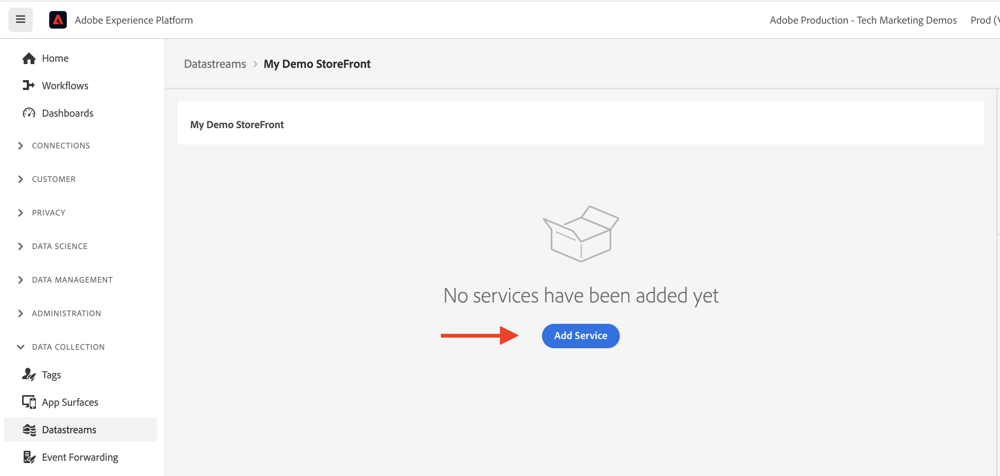
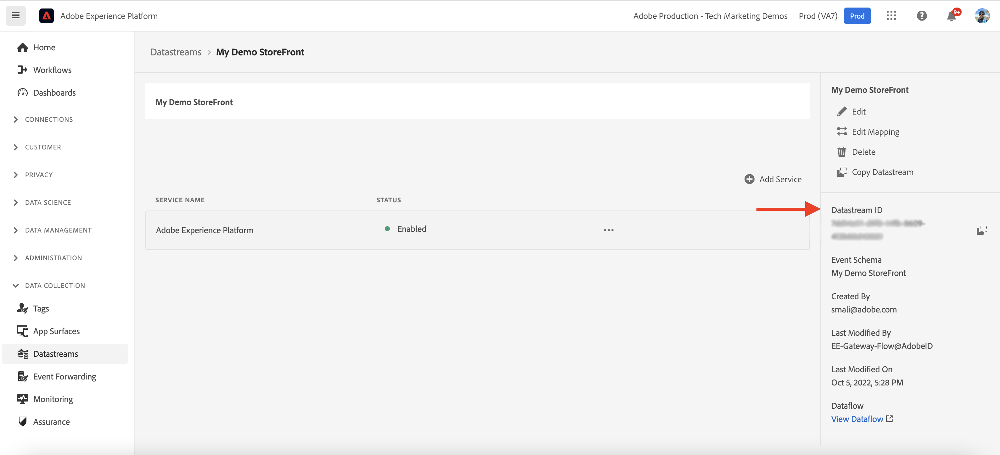

# Integración de componentes principales de AEM y CIF con Adobe Experience Platform {#aem-cif-aep-integration}

Los componentes principales de [Commerce integration framework (CIF)](https://github.com/adobe/aem-core-cif-components) se integran perfectamente con [Adobe Experience Platform](https://experienceleague.adobe.com/docs/experience-platform/landing/platform-overview.html?lang=es) para reenviar eventos de tienda y sus datos a partir de interacciones del lado del cliente, como __agregar al carro de compras__.

El proyecto [Componentes principales de AEM CIF](https://github.com/adobe/aem-core-cif-components) proporciona una biblioteca de JavaScript llamada [Conector de Adobe Experience Platform para Adobe Commerce](https://github.com/adobe/aem-core-cif-components/tree/master/extensions/experience-platform-connector) para recopilar datos de evento de tu tienda Commerce. Esos datos de evento se envían a Experience Platform, donde se utilizan en otros productos de Adobe Experience Cloud, como Adobe Analytics y Adobe Target, para crear un perfil de 360 grados que cubra un recorrido del cliente. Al conectar los datos de Commerce con otros productos de Adobe Experience Cloud, puede realizar tareas como analizar el comportamiento de los usuarios en el sitio, realizar pruebas AB y crear campañas personalizadas.

Obtenga más información acerca del conjunto de tecnologías de [recopilación de datos de Experience Platform](https://experienceleague.adobe.com/docs/experience-platform/collection/home.html?lang=es) que le permiten recopilar datos de experiencia del cliente de fuentes del lado del cliente.

## Enviar datos de evento `addToCart` a Experience Platform {#send-addtocart-to-aep}

Los pasos siguientes muestran cómo enviar los datos de evento `addToCart` desde páginas de producto procesadas por AEM a Experience Platform mediante el Conector CIF - Experience Platform. Con la extensión del explorador Adobe Experience Platform Debugger, puede probar y revisar los datos enviados.


## Requisitos previos {#prerequisites}

Utilice un entorno de desarrollo local para completar esta demostración. Esto incluye una instancia en ejecución de AEM configurada y conectada a una instancia de Adobe Commerce. Revise los requisitos y pasos para [configurar el desarrollo local con AEM as a Cloud Service SDK.](/help/commerce-cloud/cif-storefront/develop.md)

También necesita acceso a [Adobe Experience Platform](https://experienceleague.adobe.com/docs/experience-platform/landing/platform-ui/ui-guide.html?lang=es) y permisos para crear el esquema, el conjunto de datos y los flujos de datos para la recopilación de datos. Para obtener más información, vea [Administración de permisos.](https://experienceleague.adobe.com/docs/experience-platform/collection/permissions.html?lang=es)

## Configuración de AEM Commerce as a Cloud Service {#aem-setup}

Para tener un entorno local de __AEM Commerce as a Cloud Service__ en funcionamiento con el código y la configuración necesarios, complete los siguientes pasos.

### Configuración local

Siga los pasos de la [Configuración local](/help/commerce-cloud/cif-storefront/develop.md#local-setup) para que pueda tener un entorno AEM Commerce as a Cloud Service en funcionamiento.

### Configuración del proyecto

Siga los pasos de [Tipo de archivo del proyecto AEM](/help/commerce-cloud/cif-storefront/develop.md#project) para poder crear un proyecto AEM Commerce (CIF) completamente nuevo.

>[!TIP]
>
>En el ejemplo siguiente, el nombre del proyecto de AEM Commerce es: `My Demo Storefront`, sin embargo, puede elegir su propio nombre de proyecto.


Cree e implemente el proyecto de AEM Commerce creado en el SDK local de AEM ejecutando el siguiente comando desde el directorio raíz del proyecto.

```bash
$ mvn clean install -PautoInstallSinglePackage
```

El sitio de comercio `My Demo StoreFront` implementado localmente con código y contenido predeterminados tiene el siguiente aspecto:


### Instalación de las dependencias del conector Peregrine y CIF-AEP

Para recopilar y enviar los datos de evento desde las páginas de categorías y productos de este sitio de AEM Commerce, instale los paquetes de claves `npm` en el módulo `ui.frontend` del proyecto de AEM Commerce.

Vaya al módulo `ui.frontend` e instale los paquetes necesarios ejecutando los siguientes comandos desde la línea de comandos.

```bash
npm i --save lodash.get@^4.4.2 lodash.set@^4.3.2
npm i --save apollo-cache-persist@^0.1.1
npm i --save redux-thunk@~2.3.0
npm i --save @adobe/apollo-link-mutation-queue@~1.1.0
npm i --save @magento/peregrine@~12.5.0
npm i --save @adobe/aem-core-cif-react-components --force
npm i --save-dev @magento/babel-preset-peregrine@~1.2.1
npm i --save @adobe/aem-core-cif-experience-platform-connector --force
```

>[!IMPORTANT]
>
>El argumento `--force` es necesario a veces, ya que [PWA Studio](https://developer.adobe.com/commerce/pwa-studio/) es restrictivo con las dependencias del mismo nivel admitidas. Normalmente, esto no debería causar ningún problema.


### Configurar Maven para que use el argumento `--force`

Como parte del proceso de generación de Maven, se activa la instalación limpia de npm (con `npm ci`). Esto también requiere el argumento `--force`.

Vaya al archivo POM raíz del proyecto `pom.xml` y busque el bloque de ejecución `<id>npm ci</id>`. Actualice el bloque para que tenga el siguiente aspecto:

```xml
<execution>
    <id>npm ci</id>
    <goals>
    <goal>npm</goal>
    </goals>
    <configuration>
    <arguments>ci --force</arguments>
    </configuration>
</execution>
```

### Cambiar el formato de configuración de Babel

Cambie del formato predeterminado del archivo de configuración relativa de `.babelrc` al formato `babel.config.js`. Este es un formato de configuración para todo el proyecto y permite que los complementos y ajustes preestablecidos se apliquen a `node_module` con mayor control.

1. Vaya al módulo `ui.frontend` y elimine el archivo `.babelrc` existente.

1. Crear un archivo `babel.config.js` que use el ajuste preestablecido `peregrine`.

   ```javascript
   const peregrine = require('@magento/babel-preset-peregrine');
   
   module.exports = (api, opts = {}) => {
       const config = {
           ...peregrine(api, opts),
           sourceType: 'unambiguous'
       } 
   
       config.plugins = config.plugins.filter(plugin => plugin !== 'react-refresh/babel');
   
       return config;
   }
   ```

### Configurar Webpack para usar Babel

Para transformar los archivos de JavaScript mediante el cargador de Babel (`babel-loader`) y el webpack, edite el archivo `webpack.common.js`.

Vaya al módulo `ui.frontend` y actualice el archivo `webpack.common.js` para que pueda tener la siguiente regla dentro del valor de propiedad `module`:

```javascript
{
    test: /\.jsx?$/,
    exclude: /node_modules\/(?!@magento\/)/,
    loader: 'babel-loader'
}
```

### Configurar el cliente Apollo

El cliente [Apollo](https://www.apollographql.com/docs/react/) se usa para administrar datos locales y remotos con GraphQL. También almacena los resultados de las consultas de GraphQL en una memoria caché local normalizada en memoria.

Para que [`InMemoryCache`](https://www.apollographql.com/docs/react/caching/cache-configuration/) funcione correctamente, necesita un archivo de `possibleTypes.js`. Para generar este archivo, consulte [Generando possibleTypes automáticamente.](https://www.apollographql.com/docs/react/data/fragments/#generating-possibletypes-automatically)

Vea también la [implementación de referencia de PWA Studio](https://github.com/magento/pwa-studio/blob/1977f38305ff6c0e2b23a9da7beb0b2f69758bed/packages/pwa-buildpack/lib/Utilities/graphQL.js#L106-L120) y un ejemplo de archivo [`possibleTypes.js`](../assets/aep-integration/possibleTypes.js).

1. Vaya al módulo `ui.frontend` y guarde el archivo como `./src/main/possibleTypes.js`

1. Actualice la sección `webpack.common.js` del archivo `DefinePlugin` para que pueda reemplazar las variables estáticas necesarias durante la generación.

   ```javascript
   const { DefinePlugin } = require('webpack');
   const { POSSIBLE_TYPES } = require('./src/main/possibleTypes');
   
   ...
   
   plugins: [
       ...
       new DefinePlugin({
           'process.env.USE_STORE_CODE_IN_URL': false,
           POSSIBLE_TYPES
       })
   ]
   ```

### Inicialización de los componentes principales de Peregrine y CIF

Para inicializar los componentes principales de React-based Peregrine y CIF, cree la configuración y los archivos de JavaScript necesarios.

1. Vaya al módulo `ui.frontend` y cree la carpeta siguiente: `src/main/webpack/components/commerce/App`

1. Crear un archivo de `config.js` con el siguiente contenido:

   ```javascript
   // get and parse the CIF store configuration from the <head>
   const storeConfigEl = document.querySelector('meta[name="store-config"]');
   const storeConfig = storeConfigEl ? JSON.parse(storeConfigEl.content) : {};
   
   // the following global variables are needed for some of the peregrine features
   window.STORE_VIEW_CODE = storeConfig.storeView || 'default';
   window.AVAILABLE_STORE_VIEWS = [
       {
           code: window.STORE_VIEW_CODE,
           base_currency_code: 'USD',
           default_display_currency_code: 'USD',
           id: 1,
           locale: 'en',
           secure_base_media_url: '',
           store_name: 'My Demo StoreFront'
       }
   ];
   window.STORE_NAME = window.STORE_VIEW_CODE;
   window.DEFAULT_COUNTRY_CODE = 'en';
   
   export default {
       storeView: window.STORE_VIEW_CODE,
       graphqlEndpoint: storeConfig.graphqlEndpoint,
       // Can be GET or POST. When selecting GET, this applies to cache-able GraphQL query requests only.
       // Mutations will always be executed as POST requests.
       graphqlMethod: storeConfig.graphqlMethod,
       headers: storeConfig.headers,
   
       mountingPoints: {
           // TODO: define the application specific mount points as they may be used by <Portal> and <PortalPlacer>
       },
       pagePaths: {
           // TODO: define the application specific paths/urls as they may be used by the components
           baseUrl: storeConfig.storeRootUrl
       },
       eventsCollector: {
           eventForwarding: {
               acds: true,
               aep: false,
           }
       }
   };
   ```

   >[!IMPORTANT]
   >
   >Aunque es posible que ya esté familiarizado con el archivo [`config.js`](https://github.com/adobe/aem-cif-guides-venia/blob/main/ui.frontend/src/main/components/App/config.js) de __AEM Guides - Proyecto Venia de CIF__, debe realizar algunos cambios en este archivo. Primero, revise cualquier comentario de __TODO__. A continuación, dentro de la propiedad `eventsCollector`, busque el objeto `eventsCollector > aep` y actualice las propiedades `orgId` y `datastreamId` a los valores correctos. [Más información.](#add-aep-values-to-aem)

1. Crear un archivo de `App.js` con el siguiente contenido. Este archivo es similar al típico archivo de punto de inicio de la aplicación React y contiene los enlaces React y personalizados, así como el uso de React Context para facilitar la integración de Experience Platform.

   ```javascript
   import config from './config';
   
   import React, { useEffect } from 'react';
   import ReactDOM from 'react-dom';
   import { IntlProvider } from 'react-intl';
   import { BrowserRouter as Router } from 'react-router-dom';
   import { combineReducers, createStore } from 'redux';
   import { Provider as ReduxProvider } from 'react-redux';
   import { createHttpLink, ApolloProvider } from '@apollo/client';
   import { ConfigContextProvider, useCustomUrlEvent, useReferrerEvent, usePageEvent, useDataLayerEvents, useAddToCartEvent } from '@adobe/aem-core-cif-react-components';
   import { EventCollectorContextProvider, useEventCollectorContext } from '@adobe/aem-core-cif-experience-platform-connector';
   import { useAdapter } from '@magento/peregrine/lib/talons/Adapter/useAdapter';
   import { customFetchToShrinkQuery } from '@magento/peregrine/lib/Apollo/links';
   import { BrowserPersistence } from '@magento/peregrine/lib/util';
   import { default as PeregrineContextProvider } from '@magento/peregrine/lib/PeregrineContextProvider';
   import { enhancer, reducers } from '@magento/peregrine/lib/store';
   
   const storage = new BrowserPersistence();
   const store = createStore(combineReducers(reducers), enhancer);
   
   storage.setItem('store_view_code', config.storeView);
   
   const App = () => {
       const [{ sdk: mse }] = useEventCollectorContext();
   
       // trigger page-level events
       useCustomUrlEvent({ mse });
       useReferrerEvent({ mse });
       usePageEvent({ mse });
       // listen for add-to-cart events and enable forwarding to the magento storefront events sdk
       useAddToCartEvent(({ mse }));
       // enable CIF specific event forwarding to the Adobe Client Data Layer
       useDataLayerEvents();
   
       useEffect(() => {
           // implement a proper marketing opt-in, for demo purpose you hard-set the consent cookie
           if (document.cookie.indexOf('mg_dnt') < 0) {
               document.cookie += '; mg_dnt=track';
           }
       }, []);
   
       // TODO: use the App to create Portals and PortalPlaceholders to mount the CIF / Peregrine components to the server side rendered markup
       return <></>;
   };
   
   const AppContext = ({ children }) => {
       const { storeView, graphqlEndpoint, graphqlMethod = 'POST', headers = {}, eventsCollector } = config;
       const { apolloProps } = useAdapter({
           apiUrl: new URL(graphqlEndpoint, window.location.origin).toString(),
           configureLinks: (links, apiBase) =>
               // reconfigure the HTTP link to use the configured graphqlEndpoint, graphqlMethod and storeView header
   
               links.set('HTTP', createHttpLink({
                   fetch: customFetchToShrinkQuery,
                   useGETForQueries: graphqlMethod !== 'POST',
                   uri: apiBase,
                   headers: { ...headers, 'Store': storeView }
               }))
       });
   
       return (
           <ApolloProvider {...apolloProps}>
               <IntlProvider locale='en' messages={{}}>
                   <ConfigContextProvider config={config}>
                       <ReduxProvider store={store}>
                           <PeregrineContextProvider>
                               <EventCollectorContextProvider {...eventsCollector}>
                                   {children}
                               </EventCollectorContextProvider>
                           </PeregrineContextProvider>
                       </ReduxProvider>
                   </ConfigContextProvider>
               </IntlProvider>
           </ApolloProvider>
       );
   };
   
   window.onload = async () => {
       const root = document.createElement('div');
       document.body.appendChild(root);
   
       ReactDOM.render(
           <Router>
               <AppContext>
                   <App />
               </AppContext>
           </Router>,
           root
       );
   };
   ```

   `EventCollectorContext` exporta el contexto de React que:

   - carga la biblioteca commerce-events-sdk y commerce-events-collector,
   - los inicializa con una configuración determinada para Experience Platform o ACDS
   - se suscribe a todos los eventos de Peregrine y los reenvía a los eventos de SDK

   Puede revisar los detalles de implementación de `EventCollectorContext`. Consulte [aem-core-cif-components en GitHub.](https://github.com/adobe/aem-core-cif-components/blob/3d4e44d81fff2f398fd2376d24f7b7019f20b31b/extensions/experience-platform-connector/src/events-collector/EventCollectorContext.js)

### Cree e implemente el proyecto de AEM actualizado {#build-and-deploy}

Para asegurarse de que los cambios de instalación, código y configuración del paquete anterior son correctos, vuelva a generar e implemente el proyecto de AEM Commerce actualizado con el siguiente comando de Maven: `$ mvn clean install -PautoInstallSinglePackage`.

## Configuración de Experience Platform {#aep-setup}

Para recibir y almacenar los datos de evento procedentes de las páginas de Commerce de AEM, como la categoría y el producto, complete los siguientes pasos:

>[!AVAILABILITY]
>
>Asegúrese de que forma parte de los __perfiles de producto__ correctos en __Adobe Experience Platform__ y __Recopilación de datos de Adobe Experience Platform__. Si es necesario, trabaje con el administrador del sistema para crear, actualizar o asignar __perfiles de producto__ en [Admin Console.](https://adminconsole.adobe.com/)

### Crear esquema con el grupo de campos de Commerce {#create-schema}

Para definir la estructura de los datos de evento de comercio, debe crear un esquema del Modelo de datos de experiencia (XDM). Un esquema es un conjunto de reglas que representan y validan la estructura y el formato de los datos.

1. En el explorador, vaya a la página de inicio del producto __Adobe Experience Platform__. Por ejemplo, <https://experience.adobe.com/#/@YOUR-ORG-NAME/sname:prod/platform/home>.

1. Busque el menú __Esquemas__ en la sección de navegación izquierda, haga clic en el botón __Crear esquema__ de la sección superior derecha y seleccione __XDM ExperienceEvent__.

   

1. Asigne un nombre al esquema mediante el campo __Propiedades del esquema > Nombre para mostrar__ y agregue grupos de campos mediante el botón __Composición > Grupos de campos > Agregar__.

   

1. En el cuadro de diálogo __Agregar grupos de campos__, busque `Commerce`, seleccione la casilla __Detalles de Commerce__ y haga clic en __Agregar grupos de campos__.

   


>[!TIP]
>
>Vea los [conceptos básicos de la composición de esquemas](https://experienceleague.adobe.com/docs/experience-platform/xdm/schema/composition.html?lang=es) para obtener más información.

### Crear conjunto de datos {#create-dataset}

Para almacenar los datos de evento, debe crear un Conjunto de datos que se ajuste a la definición del esquema. Un conjunto de datos es una construcción de almacenamiento y administración para una colección de datos (normalmente una tabla) que contiene un esquema (columnas) y campos (filas).

1. En el explorador, vaya a la página de inicio del producto __Adobe Experience Platform__. Por ejemplo, <https://experience.adobe.com/#/@YOUR-ORG-NAME/sname:prod/platform/home>.

1. Busque el menú __Conjuntos de datos__ en la sección de navegación izquierda y haga clic en el botón __Crear conjunto de datos__ de la sección superior derecha.

   

1. En la nueva página, seleccione la tarjeta __Crear conjunto de datos a partir del esquema__.

   

   En la nueva página, __busque y seleccione__ el esquema que creó en el paso anterior y haga clic en el botón __Siguiente__.

   

1. Asigne un nombre al conjunto de datos utilizando el campo __Configurar conjunto de datos > Nombre__ y haga clic en el botón __Finalizar__.

   

>[!TIP]
>
>Consulte la [Información general de conjuntos de datos](https://experienceleague.adobe.com/docs/experience-platform/catalog/datasets/overview.html?lang=es) para obtener más información.


### Crear flujo de datos {#create-datastream}

Complete los siguientes pasos para poder crear una secuencia de datos en Experience Platform.

1. En el explorador, vaya a la página de inicio del producto __Adobe Experience Platform__. Por ejemplo, <https://experience.adobe.com/#/@YOUR-ORG-NAME/sname:prod/platform/home>.

1. Busque el menú __Datastreams__ en la sección de navegación izquierda y haga clic en el botón __Nuevo flujo de datos__ en la sección superior derecha.

   

1. Asigne un nombre a su secuencia de datos utilizando el campo obligatorio __Name__. En el campo __Esquema de evento__, seleccione el esquema creado y haga clic en __Guardar__.

   

1. Abra la secuencia de datos creada y haga clic en __Agregar servicio__.

   

1. En el campo __Servicio__, seleccione la opción __Adobe Experience Platform__. En el campo __Conjunto de datos de evento__, seleccione el nombre del conjunto de datos del paso anterior y haga clic en __Guardar__.

   

>[!TIP]
>
>Consulte la [Información general de secuencia de datos](https://experienceleague.adobe.com/docs/experience-platform/datastreams/overview.html?lang=es) para obtener más información.

## Añadir valor de secuencia de datos a la configuración de AEM Commerce {#add-aep-values-to-aem}

Después de completar la configuración de Experience Platform anterior, debería tener `datastreamId` en el carril izquierdo de los detalles de la secuencia de datos y `orgId` en la esquina superior derecha del modal __Imagen de perfil > Información de cuenta > Información del usuario__.



1. En el módulo `ui.frontend` del proyecto AEM Commerce, actualice el archivo `config.js` y, específicamente, las propiedades del objeto `eventsCollector > aep`.

1. Cree e implemente el proyecto actualizado de AEM Commerce


## Déclencheur el evento `addToCart` y compruebe la recopilación de datos {#event-trigger-verify}

Los pasos anteriores completan la configuración de AEM Commerce y Experience Platform. Ahora puede almacenar en déclencheur un evento `addToCart` y comprobar la recopilación de datos con la extensión de Google Chrome _Inspector Snowplow_ y el conjunto de datos __Métricas y gráficos__ en la interfaz de usuario del producto.

Para almacenar el evento en déclencheur, puede utilizar el autor de AEM o el servicio de publicación desde la configuración local. Para este ejemplo, inicie sesión en su cuenta para utilizar el autor de AEM.

1. En la página Sitios, seleccione la página __Mi StoreFront de demostración > usar > en__ y haga clic en __Editar__ en la barra de acciones superior.

1. En la barra de acciones superior, haz clic en __Ver como publicado__ y luego haz clic en cualquier categoría preferida en la navegación de la tienda.

1. Haga clic en cualquier tarjeta de producto preferida de la __página de productos__ y, a continuación, seleccione __color, tamaño__ para habilitar el botón __Agregar al carro de compras__.

1. Abra la extensión __Snowplow Inspector__ en el panel de extensión del explorador y seleccione __Experience Platform Wed SDK__ en el carril izquierdo.

1. Vuelva a la __página de productos__ y haga clic en el botón __Agregar al carro__. Esto envía datos a Experience Platform. La extensión __Adobe Experience Platform Debugger__ muestra los detalles del evento.

   

1. En la interfaz de usuario del producto de Experience Platform, vaya a __Conjuntos de datos > Mi tienda de demostración__, en la pestaña __Actividad del conjunto de datos__. Si __Métricas y gráficos__ está habilitado, se mostrarán las estadísticas de datos de evento.

   

## Detalles de implementación {#implementation-details}

El [conector Experience Platform de CIF](https://github.com/adobe/aem-core-cif-components/tree/master/extensions/experience-platform-connector) se basa en la [conexión de datos para Adobe Commerce](https://commercemarketplace.adobe.com/magento-experience-platform-connector.html), que forma parte del proyecto [PWA Studio](https://developer.adobe.com/commerce/pwa-studio/).

El proyecto de PWA Studio le permite crear tiendas de Progressive Web Application (PWA) con la tecnología de Adobe Commerce o Magento Open Source. El proyecto también contiene una biblioteca de componentes llamada [Peregrin](https://developer.adobe.com/commerce/pwa-studio/api/peregrine/) para agregar lógica a los componentes visuales. La biblioteca [Peregrin](https://developer.adobe.com/commerce/pwa-studio/api/peregrine/) también proporciona los vínculos React personalizados que usa [CIF Experience Platform Connector](https://github.com/adobe/aem-core-cif-components/tree/master/extensions/experience-platform-connector) para integrarse perfectamente con Experience Platform.

## Eventos admitidos {#supported-events}

A partir de ahora, se admiten los siguientes eventos:

__Eventos XDM de experiencia :__

1. Añadir al carro (AEM)
1. Ver página (AEM)
1. Ver producto (AEM)
1. Solicitud de búsqueda enviada (AEM)
1. Respuesta de búsqueda recibida (AEM)

Cuando se reutilizan [componentes peregrinos](https://developer.adobe.com/commerce/pwa-studio/guides/packages/peregrine/) en el proyecto de AEM Commerce:

__Eventos XDM de experiencia :__

1. Eliminar del carro
1. Abrir carro
1. Ver carro
1. Compra instantánea
1. Iniciar cierre de compra
1. Finalizar pago y envío

__Eventos XDM de perfil :__

1. Iniciar sesión
1. Crear cuenta
1. Editar cuenta

## Recursos adicionales {#additional-resources}

Para obtener más información, consulte los siguientes recursos:

- [PWA Studio](https://developer.adobe.com/commerce/pwa-studio/)
- [[!DNL Data Connection] descripción general](https://experienceleague.adobe.com/docs/commerce-merchant-services/data-connection/overview.html?lang=es)
- [[!DNL Data Connection] Eventos](https://experienceleague.adobe.com/docs/commerce-merchant-services/data-connection/event-forwarding/events.html?lang=es)
- [Información general de Adobe Experience Platform](https://experienceleague.adobe.com/docs/experience-platform/landing/home.html?lang=es)
