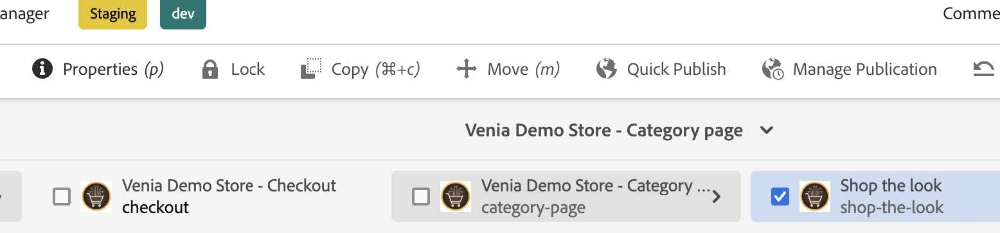

# [!DNL Live Search] componente de CIF {#live-search-cif-component}

Live Search para Adobe Commerce ofrece una experiencia de búsqueda rápida, relevante e intuitiva sin coste adicional. Live Search con tecnología Adobe Sensei usa inteligencia artificial y algoritmos de aprendizaje automático para realizar un análisis profundo de los datos agregados del visitante. Cuando se combinan estos datos con su catálogo de Adobe Commerce, las experiencias de compra resultan relevantes y personalizadas.

En este tema se describe cómo utilizar un componente CIF de AEM para implementar el widget de página de lista de productos (PLP) [!DNL Live Search] en el sitio de AEM.

## Requisitos previos {#prerequisites}

En este tema se supone que tiene configurado un [entorno de AEM](https://experienceleague.adobe.com/docs/experience-manager-learn/foundation/development/set-up-a-local-aem-development-environment.html?lang=es) local.

El componente PLP requiere que se instale [[!DNL Live Search] Popover CIF component](/help/commerce-cloud/cif-storefront/integrating/live-search-popover.md). El widget PLP requiere una variable de sesión del explorador generada por la ventana emergente.

## Compositor de actualizaciones {#update-composer}

Agregar módulos de eventos a `ui.frontend/package.json`.

En la línea 27, cambie:

```json
...
  },

  "devDependencies": {

    "@babel/core": "^7.3.4",
...
```

hasta:

```json
...
  },
  "type": "module",
  "devDependencies": {
    "@adobe/magento-storefront-event-collector": "^1.5.4",
    "@adobe/magento-storefront-events-sdk": "^1.5.4",
    "@babel/core": "^7.3.4",
...
```

## Cambios de archivos {#files-changes}

Se deben actualizar varios archivos para habilitar la funcionalidad [!DNL Live Search]. Edite los siguientes archivos. Los números de línea pueden ser ligeramente diferentes a los que se muestran aquí.

* `ui.apps/src/main/content/jcr_root/apps/venia/clientlibs/clientlib-cif/.content.xml`

  Anexe `core.cif.productlist.v1` a la línea `embed`.

  ```text
  embed="[core.cif.components.common,core.cif.components.product.v3,core.cif.components.productcarousel.v1,core.cif.components.productcollection.v2,core.cif.components.productteaser.v1,core.cif.components.searchbar.v2,core.cif.components.header.v1,core.cif.components.carousel.v1,core.cif.components.categorycarousel.v1,core.cif.components.featuredcategorylist.v1,core.cif.components.storefront-events.v1,core.cif.components.extensions.product-recs.storefront-events-collector.v1,core.wcm.components.commons.site.link,core.cif.productlist.v1]"
  ```

* `ui.apps/src/main/content/jcr_root/apps/venia/components/commerce/productlist/clientlibs/.content.xml`

  Crear un archivo `.content.xml`:

  ```xml
  <?xml version="1.0" encoding="UTF-8"?>
  <jcr:root xmlns:cq="http://www.day.com/jcr/cq/1.0" xmlns:jcr="http://www.jcp.org/jcr/1.0"
    jcr:primaryType="cq:ClientLibraryFolder"
    allowProxy="{Boolean}true"
    categories="[core.cif.productlist.v1]"
    jsProcessor="[default:none,min:none]"/>
  ```

* `ui.apps/src/main/content/jcr_root/apps/venia/components/commerce/productlist/clientlibs/css.txt`

  Crear el archivo `css.txt`:

  ```text
  #base=css
  
  productlist.css
  ```

* `ui.apps/src/main/content/jcr_root/apps/venia/components/commerce/productlist/clientlibs/css/productlist.css`

  Crear el archivo `productlist.css`

  ```css
    /* #search-plp-root */
  
  html {
    font-size: 62.5% !important;
  }
  
  body {
    font-size: 1.6rem;
  }
  
  .root.container {
    max-width: inherit;
  }
  
  .container {
    margin-left: auto;
    margin-right: auto;
  }
  
  div.ds-sdk-sort-dropdown {
    z-index: 9;
  }
  ```

* `ui.apps/src/main/content/jcr_root/apps/venia/components/commerce/productlist/clientlibs/js.txt`

  Crear el archivo `js.txt`:

  ```text
  js/productlist.js
  ```

* `ui.apps/src/main/content/jcr_root/apps/venia/components/commerce/productlist/clientlibs/js/productlist.js`

  Crear el archivo `productlist.js`:

  ```javascript
  /*~~~~~~~~~~~~~~~~~~~~~~~~~~~~~~~~~~~~~~~~~~~~~~~~~~~~~~~~~~~~~~~~~~~~~~~~~~~~~~
  ~ Copyright 2023 Adobe
  ~
  ~ Licensed under the Apache License, Version 2.0 (the "License");
  ~ you may not use this file except in compliance with the License.
  ~ You may obtain a copy of the License at
  ~
  ~     http://www.apache.org/licenses/LICENSE-2.0
  ~
  ~ Unless required by applicable law or agreed to in writing, software
  ~ distributed under the License is distributed on an "AS IS" BASIS,
  ~ WITHOUT WARRANTIES OR CONDITIONS OF ANY KIND, either express or implied.
  ~ See the License for the specific language governing permissions and
  ~ limitations under the License.
  ~~~~~~~~~~~~~~~~~~~~~~~~~~~~~~~~~~~~~~~~~~~~~~~~~~~~~~~~~~~~~~~~~~~~~~~~~~~~~*/
  "use strict";
  
  class ProductList {
    constructor() {
      const stateObject = {
        categoryName: null,
        currentCategoryUrlPath: null,
      };
      this._state = stateObject;
      this._init();
    }
  
    _init() {
      this._initWidgetPLP();
    }
  
    _injectStoreScript(src) {
      const script = document.createElement("script");
      script.type = "text/javascript";
      script.src = src;
  
      document.head.appendChild(script);
    }
  
    async _getStoreData() {
      // get from session storage
      const sessionData = sessionStorage.getItem(
        "WIDGET_STOREFRONT_INSTANCE_CONTEXT"
      );
      // WIDGET_STOREFRONT_INSTANCE_CONTEXT is set from searchbar/clientlibs/js/searchbar.js
      // if not, we will need to retrieve from graphql separately here.
  
      if (sessionData) {
        this._state.dataServicesSessionContext = JSON.parse(sessionData);
        return;
      }
    }
  
    getStoreConfigMetadata() {
      const storeConfig = JSON.parse(
        document
          .querySelector("meta[name='store-config']")
          .getAttribute("content")
      );
  
      const { storeRootUrl } = storeConfig;
      const redirectUrl = storeRootUrl.split(".html")[0];
      return { storeConfig, redirectUrl };
    }
  
    async _initWidgetPLP() {
      if (!window.LiveSearchPLP) {
        const liveSearchPlpSrc =
          "https://plp-widgets-ui.magento-ds.com/v1/search.js";
        this._injectStoreScript(liveSearchPlpSrc);
        // wait until script is loaded
        await new Promise((resolve) => {
          const interval = setInterval(() => {
            if (window.LiveSearchPLP && window.LiveSearchAutocomplete) {
              // Widget expects LiveSearchAutocomplete already loaded to rely on data-service-graphql
              clearInterval(interval);
              resolve();
            }
          }, 200);
        });
      }
      await this._getStoreData();
      const { dataServicesSessionContext } = this._state;
      if (!dataServicesSessionContext) {
        console.log("no dataServicesSessionContext");
        return;
      }
  
      const root = document.getElementById("search-plp-root");
      if (!root) {
        console.log("plp root not found.");
        return;
      }
      // get dataset from root
      const categoryUrlPath = root.getAttribute("data-plp-urlPath") || "";
      const categoryName = root.getAttribute("data-plp-title") || "";
      const storeDetails = {
        environmentId: dataServicesSessionContext.environment_id,
        environmentType: dataServicesSessionContext.environment,
        apiKey: dataServicesSessionContext.api_key,
        websiteCode: dataServicesSessionContext.website_code,
        storeCode: dataServicesSessionContext.store_code,
        storeViewCode: dataServicesSessionContext.store_view_code,
        config: {
          pageSize: dataServicesSessionContext.page_size,
          perPageConfig: {
            pageSizeOptions: dataServicesSessionContext.page_size_options,
            defaultPageSizeOption:
              dataServicesSessionContext.default_page_size_option,
          },
          minQueryLength: dataServicesSessionContext.min_query_length,
          currencySymbol: dataServicesSessionContext.currency_symbol,
          currencyRate: dataServicesSessionContext.currency_rate,
          displayOutOfStock: dataServicesSessionContext.display_out_of_stock,
          allowAllProducts: dataServicesSessionContext.allow_all_products,
          locale: dataServicesSessionContext.locale,
          currentCategoryUrlPath: categoryUrlPath,
          categoryName,
          displayMode: "", // "" for plp || "PAGE" for category/catalog
        },
        context: {
          customerGroup: dataServicesSessionContext.customer_group,
        },
        route: ({ sku }) => {
          return `${
            this.getStoreConfigMetadata().redirectUrl
          }.cifproductredirect.html/${sku}`;
        },
        searchQuery: "search_query",
      };
      setTimeout(() => {
        console.log("init PLP");
        window.LiveSearchPLP({ storeDetails, root });
      }, 0);
    }
  }
  
  (function () {
    function onDocumentReady() {
      new ProductList({});
    }
  
    if (document.readyState !== "loading") {
      onDocumentReady();
    } else {
      document.addEventListener("DOMContentLoaded", onDocumentReady);
    }
  })();
  ```

* `ui.apps/src/main/content/jcr_root/apps/venia/components/commerce/productlist/productlist.html`

  Crear archivo `productlist.html`:

  ```html
  <div
  data-sly-use.productList="com.adobe.cq.commerce.core.components.models.productlist.ProductList"
  id="search-plp-root"
  class="productlist__root"
  data-plp-urlPath="${productList.storefrontContext.urlPath}"
  data-plp-title="${productList.title}">
  </div>
  ```

* `ui.apps/src/main/content/jcr_root/apps/venia/components/commerce/searchresults/.content.xml`

  Editar `.content.xml` en línea 6:

  ```xml
  sling:resourceSuperType="venia/components/commerce/productlist"
  ```

* `ui.content/src/main/content/jcr_root/content/venia/language-masters/en/search/.content.xml`

  Editar `.content.xml` en la línea 21-22:

  ```xml
  sling:resourceType="venia/components/commerce/productlist"
  ```

* `ui.content/src/main/content/jcr_root/content/venia/us/en/search/.content.xml`

  Editar `.content.xml` en línea 26:

  ```xml
  sling:resourceType="venia/components/commerce/productlist"
  ```

* `ui.frontend/src/main/components/App/App.js`

  Editar `App.js` en la línea 47, justo encima de `../../site/main.scss`:

  ```javascript
  import '@adobe/magento-storefront-event-collector';
  ```

* `ui.tests/test-module/specs/venia/productlist-dialog.js`

  Editar `productlist-dialog.js` y cambiar `describe` a `describe.skip` en la línea 20:

  ```javascript
  describe.skip('Product List Component Dialog', function () {
  ```

## Páginas que no son PLP {#non-plp-pages}

Puede haber algunas categorías en las que se desee la categoría predeterminada o la página del catálogo en lugar de utilizar el widget PLP. En AEM, estas páginas de categoría deben configurarse manualmente.

1. En la página Autor, seleccione una plantilla de página de categoría. _Tienda Venia - Inicio_ > _Página del catálogo_ > _Tienda Venia - Página de categoría_ y selecciona &quot;Ver el aspecto&quot; o crea una nueva plantilla de página.


1. Haga clic en la sección _Propiedades_ y seleccione la pestaña _Commerce_.



1. Elija la categoría que desea mostrar con la plantilla de página de categoría seleccionada.


