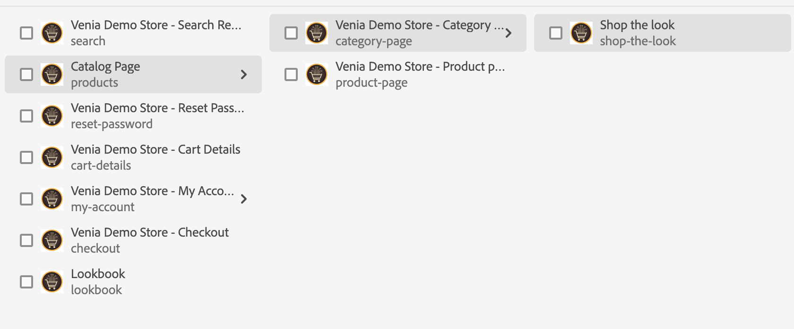
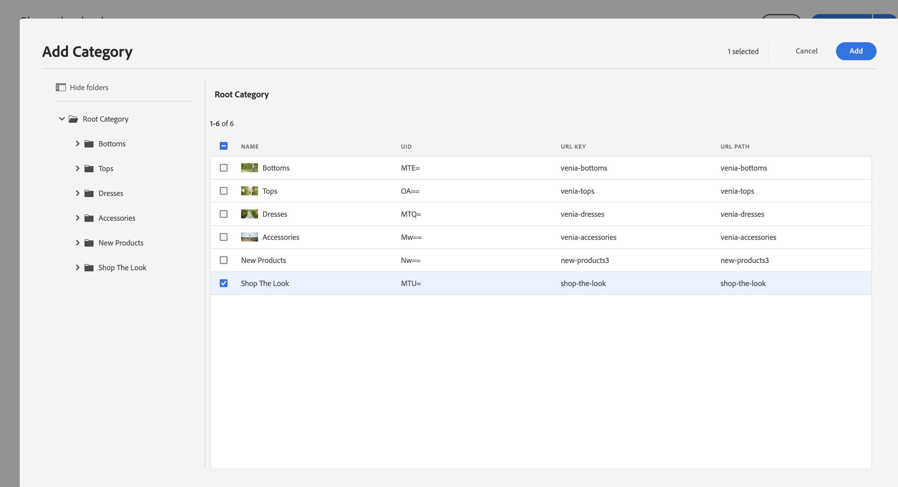

# Administrar páginas y plantillas del catálogo de productos {#product-catalog}

Obtenga información sobre cómo administrar páginas y plantillas de catálogo de productos.

## La historia hasta ahora {#story-so-far}

AEM En el documento anterior del recorrido de creación de Contenido y comercio de la, [AEM CIF Introducción a los conceptos básicos de creación de la](getting-started.md)CIF , ha aprendido los conceptos básicos de la creación de la.

Este artículo se basa en estos aspectos básicos.

## Objetivo {#objective}

Este documento le ayuda a comprender cómo administrar las páginas y plantillas del catálogo de productos. Después de leer, debería haber logrado lo siguiente:

* comprender los conceptos de las plantillas de catálogo
* cómo funcionan las plantillas genéricas
* ha creado una plantilla individual

## El concepto básico {#basic-concept}

La tienda Venia incluye una experiencia típica de catálogo de productos con navegación y aterrizaje, categoría (PLP) y páginas de detalles de producto (PDP).

AEM CIF Las páginas de catálogo se crean dinámicamente mediante una plantilla de catálogo de de datos y datos de producto en tiempo real que se recuperan del extremo de comercio cuando es necesario. Cada catálogo tiene una plantilla genérica para páginas de productos y categorías.

El componente de navegación muestra el contenido y las páginas del catálogo. Es posible mostrar la página de aterrizaje del catálogo o las categorías de primer nivel en la navegación. Al pasar el ratón por encima de una categoría, se mostrarán las categorías de segundo nivel como una segunda línea.

Al hacer clic en una categoría, se abre la página de categoría (o la página de lista de productos).

Al hacer clic en un producto, se abre la página de detalles del producto.

## Las plantillas {#templates}

### Plantillas genéricas {#generic}

La plantilla de catálogo de Venia genérica utiliza el componente principal de la lista de productos. Este componente muestra la imagen de la categoría si está disponible y los productos de la categoría.

La plantilla de producto genérica Venia utiliza el componente principal Detalles del producto. Este componente muestra información del producto para varios tipos de productos y acciones de complemento al carro de compras.

### Editar plantillas {#edit-templates}

Las plantillas se pueden editar abriendo directamente la página de la plantilla o cambiando al modo de edición mientras navega por una página del catálogo de productos. Tenga en cuenta que al cambiar la página se cambiará la plantilla y no solo la página específica del producto/categoría.

### Plantillas específicas de categoría o producto {#specific}

CIF La aplicación admite varias plantillas en solo unos clics. Para crear otra plantilla, seleccione la plantilla genérica de la categoría correspondiente y cree una nueva página utilizando **Crear** acción.

Seleccione la plantilla de producto o categoría correspondiente.

Introduzca el título y cree la página.

Observe que ahora tiene una plantilla específica debajo de la genérica.

Abra la plantilla. Se parece exactamente a la plantilla de categoría genérica.

Añada cualquier imagen en la parte superior de la página.

La plantilla se puede previsualizar con cualquier categoría o producto. Abrir **Información de página** y luego seleccione **Ver con categoría / producto**. Seleccione el producto/categoría del selector para obtener una vista previa de este producto/categoría. Seleccionar **Compra El Look** para obtener una vista previa de la plantilla actualizada.

Ahora tenemos que asignar esta plantilla a la categoría específica. Abra las propiedades en **Información de página** y cambie a la pestaña commerce. Haga clic en el icono de la carpeta para seleccionar **Compra El Look** del selector de categorías. Es posible asignar varias categorías a una plantilla e incluir también subcategorías activando la casilla de verificación.

Vuelva a la página principal y haga clic en **Compra El Look** para ver la plantilla específica. Todas las demás categorías seguirán utilizando la plantilla genérica.

Se puede aplicar el mismo flujo de trabajo para crear plantillas de producto individuales.

## Siguientes pasos {#what-is-next}

Ahora que ha completado esta parte del recorrido, debe:

* comprender los conceptos de las plantillas de catálogo
* cómo funcionan las plantillas genéricas
* ha creado una plantilla individual

Aproveche este conocimiento y continúe con su recorrido revisando el documento a continuación [Administrar experiencias del catálogo de productos clasificados](staged-catalog.md)AEM , donde aprenderá a trabajar con los datos de los productos clasificados y los lanzamientos de la.

## Recursos adicionales {#additional-resources}

Aunque se recomienda pasar a la siguiente parte del recorrido revisando el documento [Administrar experiencias del catálogo de productos clasificados](staged-catalog.md)Sin embargo, los siguientes son algunos recursos opcionales extra. Profundizan en varios conceptos mencionados en este documento, pero no son necesarios para continuar con el recorrido sin encabezado:

* [Creación de páginas de múltiples productos y categorías](/help/commerce-cloud/authoring/multi-template-usage.md)
* [Guía de migración para el Experience Manager Cloud Service](/help/commerce-cloud/migration.md) AEM - Cómo migrar al complemento de Commerce integration framework CIF de () desde una versión antigua
