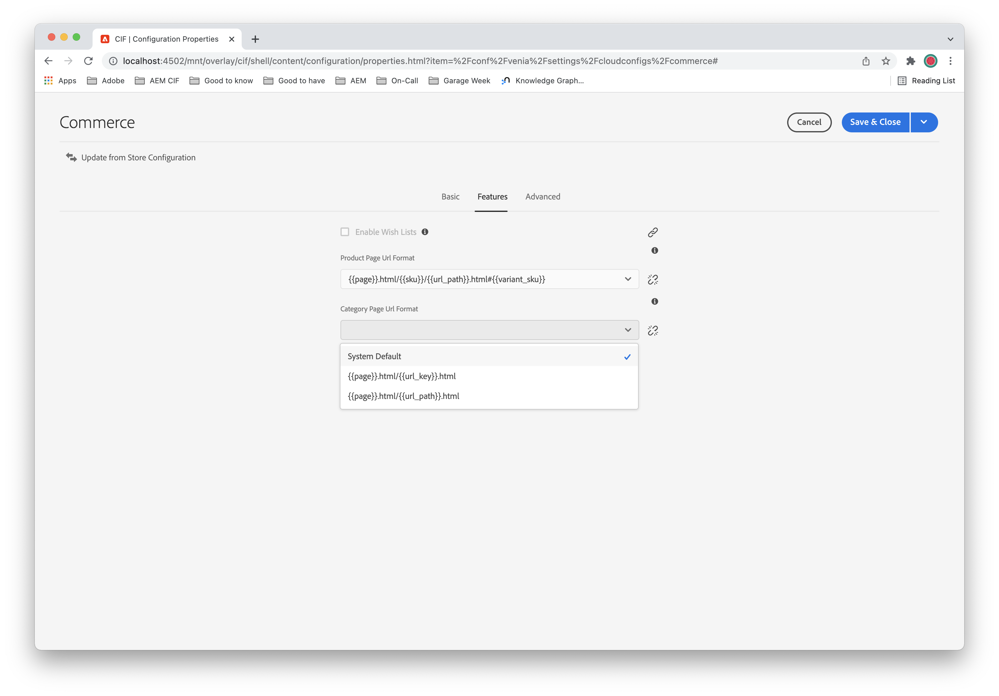

# Configuraciones de URL avanzadas {#url}

>[!NOTE]
>
> La optimización de los motores de búsqueda (SEO) se ha convertido en una preocupación clave para muchos expertos en marketing. Como resultado, las preocupaciones de SEO deben abordarse en muchos proyectos en Adobe Experience Manager (AEM) as a Cloud Service. Consulte [Prácticas recomendadas para la administración de direcciones URL y SEO](https://experienceleague.adobe.com/docs/experience-manager-cloud-service/content/overview/seo-and-url-management.html?lang=es) para obtener más información.

Los [componentes principales del CIF de AEM](https://github.com/adobe/aem-core-cif-components) proporcionan configuraciones avanzadas para personalizar las direcciones URL de las páginas de productos y categorías. Muchas implementaciones personalizan estas direcciones URL con fines de optimización de los motores de búsqueda (SEO). En el siguiente vídeo se explica cómo configurar el `UrlProvider` servicio y las funciones de las [Asignaciones de Mapping](https://sling.apache.org/documentation/the-sling-engine/mappings-for-resource-resolution.html) para personalizar las direcciones URL de las páginas de productos y categorías.

>[!VIDEO](https://video.tv.adobe.com/v/34350/?quality=12)

## Configuración {#configuration}

Para configurar el servicio `UrlProvider` según los requisitos y necesidades de SEO, un proyecto debe proporcionar una configuración OSGI para la _configuración del proveedor de URL de CIF_.

>[!NOTE]
>
> Desde la versión 2.0.0 de los componentes principales de CIF de AEM, la configuración del proveedor de URL solo proporciona formatos de URL predefinidos, en lugar de formatos de texto libre configurables conocidos en las versiones 1.x. Además, el uso de selectores para pasar datos en direcciones URL se ha sustituido por sufijos.

### Formato de URL de página de producto {#product}

Configura las direcciones URL de las páginas de productos y admite las siguientes opciones:

* `{{page}}.html/{{sku}}.html#{{variant_sku}}` (predeterminada)
* `{{page}}.html/{{sku}}/{{url_key}}.html#{{variant_sku}}`
* `{{page}}.html/{{sku}}/{{category}}/{{url_key}}.html#{{variant_sku}}`
* `{{page}}.html/{{sku}}/{{url_path}}.html#{{variant_sku}}`
* `{{page}}.html/{{url_key}}.html#{{variant_sku}}`
* `{{page}}.html/{{category}}/{{url_key}}.html#{{variant_sku}}`
* `{{page}}.html/{{url_path}}.html#{{variant_sku}}`

Si existe la [Tienda de referencia de Venia](https://github.com/adobe/aem-cif-guides-venia):

* `{{page}}` se ha reemplazado por `/content/venia/us/en/products/product-page`
* `{{sku}}` se ha reemplazado por el SKU del producto, por ejemplo, `VP09`
* `{{url_key}}` se ha reemplazado por la propiedad `url_key` del producto, por ejemplo, `lenora-crochet-shorts`
* `{{url_path}}` se ha reemplazado por `url_path` del producto, por ejemplo, `venia-bottoms/venia-pants/lenora-crochet-shorts`
* `{{variant_sku}}` se ha reemplazado por la variante seleccionada actualmente, por ejemplo, `VP09-KH-S`

Dado que `url_path` quedó obsoleto, los formatos de URL de producto predefinidos utilizan `url_rewrites` de un producto y eligen el que tenga la mayor cantidad de segmentos de ruta como alternativa si `url_path` no está disponible.

Con los datos de ejemplo anteriores, una URL de variante de producto con formato de URL predeterminada es `/content/venia/us/en/products/product-page.html/VP09.html#VP09-KH-S`.

### Formato de URL de página de categoría {#product-list}

Configura las direcciones URL de las páginas de categorías o listas de productos y admite las siguientes opciones:

* `{{page}}.html/{{url_path}}.html` (predeterminada)
* `{{page}}.html/{{url_key}}.html`

Si existe la [Tienda de referencia de Venia](https://github.com/adobe/aem-cif-guides-venia):

* `{{page}}` se ha reemplazado por `/content/venia/us/en/products/category-page`
* `{{url_key}}` se ha reemplazado por la propiedad `url_key` de la categoría
* `{{url_path}}` se ha reemplazado por `url_path` de la categoría

Con los datos del ejemplo anterior, la dirección URL de una página de categoría con formato de dirección URL predeterminada es `/content/venia/us/en/products/category-page.html/venia-bottoms/venia-pants.html`.

>[!NOTE]
> 
> `url_path` es una concatenación de `url_keys` de los antecesores de un producto o categoría y `url_key` del producto o categoría separados por `/` barra diagonal. Cada `url_key` se considera único dentro de un almacén determinado.

### Configuración específica de la tienda {#store-specific-urlformats}

Los formatos de URL de categoría y página de producto para todo el sistema establecidos por la _configuración del proveedor de URL de CIF_ se pueden cambiar en cada tienda.

En la configuración de CIF, un editor puede seleccionar un formato de dirección URL de página de categoría o producto alternativo. Si no se selecciona nada allí, la implementación vuelve a la configuración de todo el sistema.

Cambiar el formato de URL de un sitio web activo puede tener un impacto negativo en el tráfico orgánico del sitio. Consulte las [Prácticas recomendadas](#best-practices) que se describen a continuación y planifique cuidadosamente el cambio de formato de URL con anticipación.



>[!NOTE]
>
> La configuración específica del almacén de los formatos de URL requiere [CIF Core Components 2.6.0](https://github.com/adobe/aem-core-cif-components/releases/tag/core-cif-components-reactor-2.6.0) y la versión más reciente del complemento Commerce y contenido de Adobe Experience Manager.

## URL de páginas de productos según las categorías {#context-aware-pdps}

Dado que es posible codificar la información de la categoría en una dirección URL de producto, los productos que se encuentran en varias categorías también se pueden abordar con varias direcciones URL de producto.

Los formatos de URL predeterminados seleccionan una de las posibles alternativas utilizando el siguiente esquema:

* si el backend de comercio electrónico define `url_path`, utilícelo (obsoleto)
* de `url_rewrites` usar las direcciones URL que terminan con `url_key` del producto como alternativas
* de estas alternativas utilice la que tenga la mayor cantidad de segmentos de ruta
* si hay varios, tome el primero en el orden dado por el backend de comercio electrónico

Este esquema selecciona el(la) `url_path` con la mayor cantidad de antecesores, basándose en la suposición de que una categoría secundaria es más específica que su categoría principal. El elemento `url_path` seleccionado se considera _canónico_ y siempre se usa como vínculo canónico en las páginas de productos o en el mapa del sitio del producto.

Sin embargo, cuando un comprador navega de una página de categoría a una página de producto, o de una página de producto a otra página de producto relacionada en la misma categoría, vale la pena conservar el contexto de categoría actual. En este caso, la selección `url_path` debería preferir las alternativas que se encuentran dentro del contexto de categoría actual sobre la selección _canónica_ descrita anteriormente.

Esta característica debe habilitarse en la _configuración del proveedor de URL de CIF_. Si se habilita, las alternativas de puntuaciones de selección serán más altas cuando

* coinciden con partes de `url_path` de una categoría determinada desde el principio (coincidencia de prefijo difuso)
* o coinciden con `url_key` de una categoría determinada en cualquier lugar (coincidencia parcial exacta)

Por ejemplo, considere la respuesta para una [consulta de productos](https://devdocs.magento.com/guides/v2.4/graphql/queries/products.html) a continuación. Dados lo siguiente:

* el usuario se encuentra en la página de categoría &quot;Nuevos productos / Novedades en verano de 2022&quot;
* la tienda utiliza el formato de dirección URL de página de categoría predeterminado

La alternativa &quot;new-products/new-in-summer-2022/gold-cirque-earrings.html&quot; coincide con dos de los segmentos de ruta del contexto desde el principio. Es decir, &quot;nuevos productos&quot; y &quot;nuevos en verano de 2022&quot;. Si la tienda usa un formato de dirección URL de página de categoría que sólo contiene la categoría `url_key`, se seleccionaría la misma alternativa, ya que coincide con el `url_key` del contexto en cualquier lugar. En ambos casos, la dirección URL de la página de producto se crea para &quot;new-products/new-in-summer-2022/gold-cirque-earrings.html&quot; `url_path`.

```
{
  "data": {
    "products": {
      "items": [
        {
          "sku": "VA18-GO-NA",
          "url_key": "gold-cirque-earrings",
          "url_rewrites": [
            {
              "url": "gold-cirque-earrings.html"
            },
            {
              "url": "venia-accessories/gold-cirque-earrings.html"
            },
            {
              "url": "venia-accessories/venia-jewelry/gold-cirque-earrings.html"
            },
            {
              "url": "new-products/gold-cirque-earrings.html"
            },
            {
              "url": "new-products/new-in-summer-2022/gold-cirque-earrings.html"
            }
          ]
        }
      ]
    }
  }
}
```

>[!NOTE]
>
> Las direcciones URL de productos según la categoría requieren [Componentes principales de CIF 2.6.0](https://github.com/adobe/aem-core-cif-components/releases/tag/core-cif-components-reactor-2.6.0) o posterior.

## Categoría específica y páginas del producto {#specific-pages}

Es posible crear [páginas de múltiples categorías y productos](../authoring/multi-template-usage.md) solo para un subconjunto específico de categorías o productos de un catálogo.

### Criterios de selección {#specific-pages-selection}

La selección de una página de categoría específica es sencilla, según la categoría `url_path` o `url_key`. La coincidencia de subcategorías solo se admite para los formatos de dirección URL que contienen la categoría completa `url_path`. De lo contrario, solo es posible una coincidencia exacta de `url_key`.

Las páginas de productos específicas se seleccionan según el SKU o la categoría del producto. Esto último requiere que se codifique parte de la información de la categoría en la dirección URL del producto. Esta funcionalidad solo está disponible para algunos de los formatos de URL predeterminados. Consulte la siguiente tabla para ver una comparación sobre qué formato de URL admite la selección de páginas específicas por SKU o categoría.


| Formato de URL | por SKU | por categoría |
| ----------------------------------------------------- | ------ | ---------------- |
| `{{page}}.html/{{url_key}}.html` | no | no |
| `{{page}}.html/{{category}}/{{url_key}}.html` | no | solo coincidencia exacta |
| `{{page}}.html/{{url_path}}.html` | no | sí |
| `{{page}}.html/{{sku}}.html` | sí | no |
| `{{page}}.html/{{sku}}/{{url_key}}.html` | sí | no |
| `{{page}}.html/{{sku}}/{{category}}/{{url_key}}.html` | sí | solo coincidencia exacta |
| `{{page}}.html/{{sku}}/{{url_path}}.html` | sí | sí |

{style="table-layout:auto"}

>[!NOTE]
>
> Para seleccionar páginas de productos específicas por categoría se requieren [Componentes principales de CIF 2.6.0](https://github.com/adobe/aem-core-cif-components/releases/tag/core-cif-components-reactor-2.6.0) o posterior.

### Vinculación profunda {#specific-pages-deep-linking}

`UrlProvider` está preconfigurado para generar vínculos profundos a categorías específicas y páginas de productos en instancias de nivel de creación. Esta capacidad es útil para los editores que exploran un sitio mediante el modo de vista previa, navegan a una página de producto o categoría específica y vuelven al modo de edición para editar la página.

En las instancias de nivel de publicación, por otro lado, las direcciones URL de la página del catálogo deben mantenerse estables para no perder ganancias en las clasificaciones de los motores de búsqueda, por ejemplo. Debido a ese nivel de publicación, las instancias no representan vínculos profundos a páginas de catálogo específicas de forma predeterminada. Para cambiar este comportamiento, se puede configurar la _estrategia de página específica del proveedor de URL de CIF_ para que siempre genere direcciones URL de página específicas.

### Varias páginas del catálogo {#multiple-product-pages}

Cuando los editores desean tener un control total de la navegación de nivel superior de un sitio, es posible que no deseen utilizar una sola página del catálogo para procesar las categorías de nivel superior de un catálogo. En su lugar, los editores pueden crear varias páginas de catálogo, una para cada categoría del catálogo que deseen incluir en la navegación de nivel superior.

Para ese caso de uso, cada una de las páginas del catálogo puede tener una referencia a una página de producto y categoría específica para la categoría configurada para la página del catálogo. `UrlProvider` utiliza estas conexiones para crear vínculos para las páginas y categorías de la categoría configurada. Sin embargo, por motivos de rendimiento solo se tienen en cuenta los elementos secundarios de la página de catálogo directa de la raíz de navegación o la página de aterrizaje de un sitio.

Se recomienda que las páginas de producto y categoría de una página del catálogo desciendan a esa página del catálogo; de lo contrario, es posible que componentes como Navegación o Ruta de exploración no funcionen correctamente.

>[!NOTE]
>
> La compatibilidad total con varias páginas del catálogo requiere [Componentes principales de CIF 2.10.0](https://github.com/adobe/aem-core-cif-components/releases/tag/core-cif-components-reactor-2.10.0) o posterior.

## Personalizaciones {#customization}

### Formatos de URL personalizados {#custom-url-format}

Para proporcionar un formato de dirección URL personalizado, un proyecto puede implementar la interfaz de servicio [`ProductUrlFormat`](https://javadoc.io/doc/com.adobe.commerce.cif/core-cif-components-core/latest/com/adobe/cq/commerce/core/components/services/urls/ProductUrlFormat.html) o [`CategoryUrlFormat`](https://javadoc.io/doc/com.adobe.commerce.cif/core-cif-components-core/latest/com/adobe/cq/commerce/core/components/services/urls/CategoryUrlFormat.html) y registrar la implementación como servicio OSGI. Estas implementaciones, si están disponibles, reemplazan el formato configurado y predefinido. Si hay varias implementaciones registradas, la que tenga la clasificación de servicio más alta reemplaza a las que tienen la clasificación de servicio más baja.

Las implementaciones de formato de URL personalizadas deben implementar un par de métodos para crear una dirección URL a partir de parámetros determinados y para analizar una dirección URL y devolver los mismos parámetros respectivamente.

### Combinación con asignaciones de Sling {#sling-mapping}

Además de `UrlProvider`, también es posible configurar [Asignaciones de Sling](https://sling.apache.org/documentation/the-sling-engine/mappings-for-resource-resolution.html) para reescribir y procesar direcciones URL. El proyecto AEM Archetype también proporciona [una configuración de ejemplo](https://github.com/adobe/aem-cif-project-archetype/tree/master/src/main/archetype/samplecontent/src/main/content/jcr_root/etc/map.publish) para configurar algunas asignaciones de Sling para el puerto 4503 (publicación) y 80 (Dispatcher).

### Combinación con AEM Dispatcher {#dispatcher}

Las reescrituras de URL también se pueden lograr utilizando el servidor HTTP AEM Dispatcher con el módulo `mod_rewrite`. El [tipo de archivo del proyecto AEM](https://github.com/adobe/aem-project-archetype) proporciona una referencia a la configuración de AEM Dispatcher que ya incluye las [reglas de reescritura](https://github.com/adobe/aem-project-archetype/tree/master/src/main/archetype/dispatcher.cloud) básicas para el tamaño generado.

## Prácticas recomendadas {#best-practices}

### Elija el mejor formato de URL {#choose-url-format}

Como se mencionó antes de seleccionar uno de los formatos predeterminados disponibles, o incluso implementar un formato personalizado, depende en gran medida de las necesidades y requisitos de una tienda. Las siguientes sugerencias pueden ayudar a tomar una decisión informada.

_&#x200B;**Use un formato de dirección URL de página de producto que contenga el SKU.**&#x200B;_

Los componentes principales de CIF utilizan el SKU como identificador principal en todos los componentes. Si el formato de URL de la página del producto no contiene el SKU, es necesario realizar una consulta GraphQL para resolverlo. Esta resolución puede afectar al tiempo hasta el primer byte. Además, es posible que los compradores puedan encontrar productos por SKU utilizando motores de búsqueda.

_&#x200B;**Use un formato de dirección URL de página de producto que contenga el contexto de categoría.**&#x200B;_

Algunas características del proveedor de URL de CIF solo están disponibles cuando se usan formatos de URL de productos que codifican el contexto de categoría, como la categoría `url_key` o la categoría `url_path`. Incluso si estas funciones pueden no ser necesarias para una tienda nueva, el uso de uno de estos formatos de URL al principio ayuda a reducir los esfuerzos de migración en el futuro.

_&#x200B;**Equilibrio entre la longitud de la dirección URL y la información codificada.**&#x200B;_

Según el tamaño del catálogo y, en particular, el tamaño y la profundidad del árbol de categorías, puede que no sea razonable codificar todo el `url_path` de categorías en la dirección URL. En ese caso, la longitud de la dirección URL podría reducirse incluyendo solo el `url_key` de la categoría. Este método admite la mayoría de las características disponibles al usar la categoría `url_path`.

Además, usa [Asignaciones de Sling](#sling-mapping) para combinar el SKU con el producto `url_key`. En la mayoría de los sistemas de comercio electrónico, el SKU sigue un formato concreto y debería ser posible separarlo del `url_key` para las solicitudes entrantes. Con esto en mente, debería ser posible reescribir una URL de página de producto a `/p/{{category}}/{{sku}}-{{url_key}}.html` y una URL de categoría a `/c/{{url_key}}.html` respectivamente. El prefijo `/p` y `/c` siguen siendo necesarios para distinguir las páginas de productos y categorías de otras páginas de contenido.

### Migración a un nuevo formato de URL {#migrate-url-formats}

Muchos de los formatos de URL predeterminados son compatibles entre sí, lo que significa que las URL con formato de uno pueden ser analizadas por otro. Esto ayuda a migrar entre formatos de URL.

Por otro lado, los motores de búsqueda necesitan tiempo para volver a rastrear todas las páginas del catálogo con el nuevo formato de URL. Para admitir este proceso y también para mejorar la experiencia del usuario final, se recomienda proporcionar redirecciones que reenvíen al usuario de las direcciones URL antiguas a las nuevas.

Un método para hacerlo sería conectar un entorno de ensayo al back-end de comercio electrónico de producción y configurarlo para utilizar el nuevo formato de URL. Después, obtenga el [mapa del sitio del producto generado por el generador de mapas del sitio de productos de CIF](../../overview/seo-and-url-management.md) tanto para el entorno de ensayo como de producción y úselo para crear un [mapa de reescritura Apache httpd](https://httpd.apache.org/docs/2.4/rewrite/rewritemap.html). Esta asignación de reescritura se puede implementar en Dispatcher junto con el despliegue del nuevo formato de URL.

## Ejemplo {#example}

El proyecto [Tienda de referencia de Venia](https://github.com/adobe/aem-cif-guides-venia) incluye configuraciones de muestra para demostrar el uso de direcciones URL personalizadas para páginas de productos y categorías. Esta configuración permite que cada proyecto configure patrones de URL individuales para páginas de productos y categorías según sus necesidades de SEO. Se utiliza una combinación de asignaciones de CIF `UrlProvider` y de Sling como se describe anteriormente.

>[!NOTE]
>
>Esta configuración debe ajustarse con el dominio externo utilizado por el proyecto. Las asignaciones de Sling funcionan según el nombre de host y el dominio. Por lo tanto, esta configuración está deshabilitada de forma predeterminada y debe habilitarse antes de la implementación. Para ello, cambie el nombre de la carpeta `hostname.adobeaemcloud.com` de la asignación de Sling en `ui.content/src/main/content/jcr_root/etc/map.publish/https` según el nombre de dominio utilizado y habilite esta configuración agregando `resource.resolver.map.location="/etc/map.publish"` a la configuración `JcrResourceResolver` del proyecto.

## Recursos adicionales {#additional}

* [Tienda de referencia de Venia](https://github.com/adobe/aem-cif-guides-venia)
* [Asignación de recursos de AEM](https://experienceleague.adobe.com/docs/experience-manager-65/deploying/configuring/resource-mapping.html?lang=es)
* [Asignaciones de Sling](https://sling.apache.org/documentation/the-sling-engine/mappings-for-resource-resolution.html)
