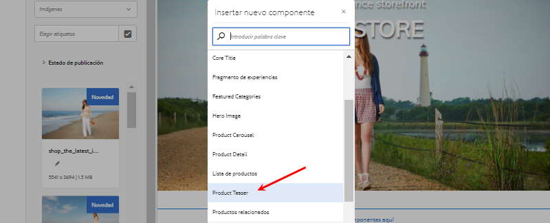
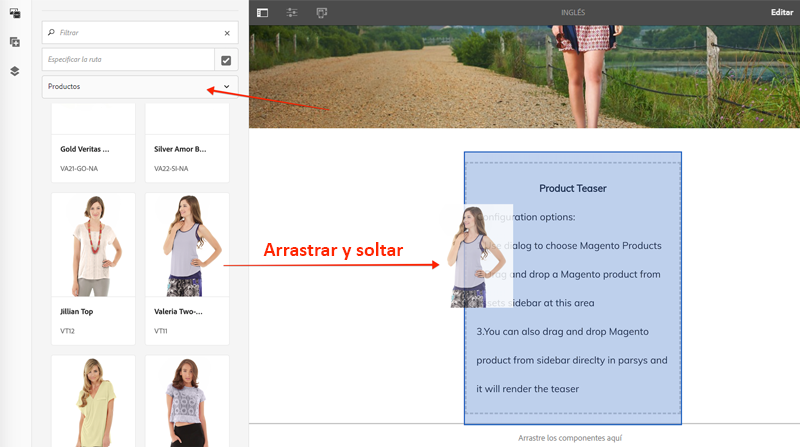
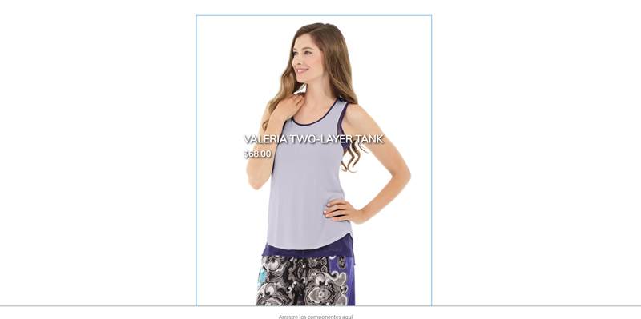

# AEM CIF Personalizar componentes principales de {#customize-cif-components}

CIF CIF El [Proyecto Venia ](https://github.com/adobe/aem-cif-guides-venia)es una base de código de referencia para usar [Componentes principales](https://github.com/adobe/aem-core-cif-components) de. En este tutorial, se amplía aún más el componente [teaser de productos](https://github.com/adobe/aem-core-cif-components/tree/master/ui.apps/src/main/content/jcr_root/apps/core/cif/components/commerce/productteaser/v1/productteaser) para mostrar un atributo personalizado de Adobe Commerce. También obtendrá más información acerca de la integración de GraphQL AEM entre los componentes principales y Adobe Commerce CIF, y los vínculos de extensión que ofrecen los componentes principales, que son los componentes principales.

>[!TIP]
>
> AEM Utilice el [tipo de archivo del proyecto de](https://github.com/adobe/aem-project-archetype) al iniciar su propia implementación comercial.

## Qué va a generar

La marca Venia comenzó recientemente a fabricar algunos productos con materiales sostenibles y a la empresa le gustaría mostrar una insignia **Eco Friendly** como parte del teaser de productos. Se crea un nuevo atributo personalizado en Adobe Commerce para indicar si un producto usa el material **respetuoso con el medio ambiente**. Este atributo personalizado se agrega como parte de la consulta de GraphQL y se muestra en el teaser de productos para productos especificados.


## Requisitos previos {#prerequisites}

Se requiere un entorno de desarrollo local para completar este tutorial. AEM Este entorno incluye una instancia en ejecución de la configurada y conectada a una instancia de Adobe Commerce. Revise los requisitos y pasos para [configurar un desarrollo local con AEM as a Cloud Service SDK](../develop.md). Para seguir el tutorial por completo, necesita permiso para agregar [Atributos a un producto](https://docs.magento.com/user-guide/catalog/product-attributes-add.html) en Adobe Commerce.

También necesita un IDE de GraphQL como [GraphiQL](https://github.com/graphql/graphiql) o una extensión de explorador para ejecutar los ejemplos de código y los tutoriales. Si instala una extensión de explorador, asegúrese de que puede establecer encabezados de solicitud. En Google Chrome, _Altair GraphQL Client_ es una extensión que puede realizar el trabajo.

## Clonar el proyecto Venia {#clone-venia-project}

Clona el [proyecto Venia](https://github.com/adobe/aem-cif-guides-venia) y luego reemplaza los estilos predeterminados.

>[!NOTE]
>
> AEM CIF **Siéntase libre de usar un proyecto existente** (basado en el tipo de archivo del proyecto en el que se ha incluido la) y omita esta sección.

1. Ejecute el siguiente comando de Git para poder clonar el proyecto:

   ```shell
   $ git clone git@github.com:adobe/aem-cif-guides-venia.git
   ```

1. Cree e implemente el proyecto en una instancia local de AEM:

   ```shell
   $ cd aem-cif-guides-venia/
   $ mvn clean install -PautoInstallSinglePackage,cloud
   ```

1. AEM Añada las configuraciones de OSGi necesarias para conectar la instancia de a una instancia de Adobe Commerce o añadir las configuraciones al proyecto creado.

1. En este punto, debería tener una versión de trabajo de una tienda conectada a una instancia de Adobe Commerce. Vaya a la página `US` > `Home` en: [http://localhost:4502/editor.html/content/venia/us/en.html](http://localhost:4502/editor.html/content/venia/us/en.html).

   Hay que ver que la tienda esté usando actualmente el tema de Venia. Al expandir el menú principal de la tienda, verá varias categorías que indican que la conexión con Adobe Commerce está funcionando.

   

## Crear el teaser de productos {#author-product-teaser}

El componente teaser de productos se amplía a través de este tutorial. Como primer paso, añada una instancia del teaser de productos a la página de inicio para comprender la funcionalidad de línea de base.

1. Vaya hasta la **Página de inicio** del sitio: [http://localhost:4502/editor.html/content/acme/us/en.html](http://localhost:4502/editor.html/content/acme/us/en.html)

2. Inserte un nuevo componente **teaser de productos** en el contenedor del diseño principal de la página.

   

3. Expanda el panel lateral (si no está activado) y cambie la lista desplegable del buscador de recursos a **Productos**. Esta lista debe mostrar una lista de los productos disponibles de una instancia de Adobe Commerce conectada. Seleccione un producto y **arrástrelo y suéltelo** en el componente **teaser de productos** de la página.

   

   >[!NOTE]
   >
   > Tenga en cuenta que también puede configurar el producto mostrado configurando el componente con el cuadro de diálogo (haga clic en el icono de _llave inglesa_).

4. Ahora debería ver un producto que muestra el teaser de productos. Se muestran el nombre y el precio del producto ya que son atributos predeterminados.

   

## Añadir un atributo personalizado en Adobe Commerce {#add-custom-attribute}

AEM Los productos y los datos de productos que se muestran en la lista de productos se almacenan en Adobe Commerce. A continuación, agregue un atributo para **Eco Friendly** como parte del conjunto de atributos de producto usando la interfaz de usuario de Adobe Commerce.

>[!TIP]
>
> ¿Ya tienes un atributo personalizado **Sí/No** como parte del conjunto de atributos del producto? No dude en usarlo y saltarse esta sección.

1. Inicie sesión en la instancia de Adobe Commerce.
1. Vaya a **Catálogo** > **Productos**.
1. Actualice el filtro de búsqueda para que pueda encontrar el **producto configurable** que se utilizó cuando se agregó al componente Teaser en el ejercicio anterior. Abra el producto en modo de edición.

   

1. En la vista del producto, haga clic en **Agregar atributo** > **Crear nuevo atributo**.
1. Rellene el formulario **Nuevo atributo** con los siguientes valores (deje la configuración predeterminada para otros valores)

   | Conjunto de campos | Etiqueta de campo | Valor |
   | ----------------------------- | ------------------ | ---------------- |
   | Propiedades de atributo | Etiqueta de atributo | **Respetuoso con el medio ambiente** |
   | Propiedades de atributo | Tipo de entrada de catálogo | **Sí/No** |
   | Propiedades de atributo avanzadas | Código de atributo | **respetuoso con el medio ambiente** |

   

   Haga clic en **Guardar atributo** cuando termine.

1. Desplácese hasta la parte inferior del producto y expanda el encabezado **Atributos**. Debería ver el nuevo campo **Respetuoso con el medio ambiente**. Cambie el conmutador a **Yes**.

   

   **Guardar** los cambios en el producto.

   >[!TIP]
   >
   > Encontrará más detalles sobre la administración de [Atributos de producto en la guía del usuario de Adobe Commerce](https://docs.magento.com/user-guide/catalog/attribute-best-practices.html).

1. Vaya a **Sistema** > **Herramientas** > **Administración de caché**. Dado que se ha realizado una actualización del esquema de datos, debe invalidar algunos de los tipos de caché en Adobe Commerce.
1. Marque la casilla junto a **Configuración** y envíe el tipo de caché para **Actualizar**

   

   >[!TIP]
   >
   > Encontrará más detalles sobre [Administración de caché en la guía del usuario de Adobe Commerce](https://docs.magento.com/user-guide/system/cache-management.html).

## Utilizar un IDE de GraphQL para comprobar el atributo {#use-graphql-ide}

AEM Antes de saltar al código de la, es útil explorar la [Información general de GraphQL](https://devdocs.magento.com/guides/v2.4/graphql/) mediante un IDE de GraphQL. La integración de Adobe Commerce AEM con se realiza principalmente mediante una serie de consultas de GraphQL. Comprender y modificar las consultas de GraphQL CIF es una de las formas clave en que se pueden ampliar los componentes principales de la.

A continuación, utilice un IDE de GraphQL para comprobar que el atributo `eco_friendly` se ha agregado al conjunto de atributos del producto. Las capturas de pantalla de este tutorial utilizan la extensión _Altair GraphQL Client_ Google Chrome.

1. Abra el IDE de GraphQL e introduzca la dirección URL `http://<commerce-server>/graphql` en la barra URL del IDE o la extensión.
2. Agregue la siguiente [consulta de productos](https://devdocs.magento.com/guides/v2.4/graphql/queries/products.html), donde `YOUR_SKU` es el **SKU** del producto utilizado en el ejercicio anterior:

   ```json
     {
       products(
       filter: { sku: { eq: "YOUR_SKU" } }
       ) {
           items {
           name
           sku
           eco_friendly
           }
       }
   }
   ```

3. Ejecute la consulta y debería obtener una respuesta como la siguiente:

   ```json
   {
     "data": {
       "products": {
         "items": [
           {
             "name": "Valeria Two-Layer Tank",
             "sku": "VT11",
             "eco_friendly": 1
           }
         ]
       }
     }
   }
   ```

   

   El valor de **Yes** es un número entero de **1**. Este valor es útil cuando se escribe la consulta de GraphQL en Java™.

   >[!TIP]
   >
   > Para obtener más información, consulte [Adobe Commerce GraphQL](https://devdocs.magento.com/guides/v2.4/graphql/index.html).

## Actualización del modelo de Sling para el teaser de productos {#updating-sling-model-product-teaser}

A continuación, amplíe la lógica empresarial del teaser de productos implementando un modelo Sling. [Los modelos Sling](https://sling.apache.org/documentation/bundles/models.html) son objetos Java™ antiguos comunes (&quot;POJO&quot;) impulsados por anotaciones que implementan la lógica empresarial que necesita el componente. Los modelos Sling se utilizan con scripts HTL como parte del componente. Siga el patrón de delegación [para modelos Sling](https://github.com/adobe/aem-core-wcm-components/wiki/Delegation-Pattern-for-Sling-Models) para poder ampliar partes del modelo de teaser de productos existente.

Los modelos Sling se implementan como Java™ y se pueden encontrar en el módulo **core** del proyecto generado.

Use [el IDE de su elección](https://experienceleague.adobe.com/docs/experience-manager-learn/cloud-service/local-development-environment-set-up/development-tools.html?lang=es#set-up-the-development-ide) para importar el proyecto Venia. Las capturas de pantalla utilizadas provienen del [IDE de código de Visual Studio](https://experienceleague.adobe.com/docs/experience-manager-learn/cloud-service/local-development-environment-set-up/development-tools.html?lang=es#microsoft-visual-studio-code).

1. En su IDE, vaya al módulo **core** a: `core/src/main/java/com/venia/core/models/commerce/MyProductTeaser.java`.

   

   CIF `MyProductTeaser.java` es una interfaz de Java™ que amplía la interfaz de [ProductTeaser](https://github.com/adobe/aem-core-cif-components/blob/master/bundles/core/src/main/java/com/adobe/cq/commerce/core/components/models/productteaser/ProductTeaser.java) de la aplicación de la manera más avanzada que existe en el mercado.

   Ya se ha agregado un nuevo método denominado `isShowBadge()` para mostrar un distintivo si el producto se considera &quot;Nuevo&quot;.

1. Agregar `isEcoFriendly()` a la interfaz:

   ```java
   @ProviderType
   public interface MyProductTeaser extends ProductTeaser {
       // Extend the existing interface with the additional properties which you
       // want to expose to the HTL template.
       public Boolean isShowBadge();
   
       public Boolean isEcoFriendly();
   }
   ```

   Este nuevo método se ha introducido para encapsular la lógica a fin de indicar si el producto tiene el atributo `eco_friendly` establecido en **Yes** o **No**.

1. A continuación, inspeccione `MyProductTeaserImpl.java` a las `core/src/main/java/com/venia/core/models/commerce/MyProductTeaserImpl.java`.

   El patrón de delegación [para modelos Sling](https://github.com/adobe/aem-core-wcm-components/wiki/Delegation-Pattern-for-Sling-Models) permite que `MyProductTeaserImpl` haga referencia al modelo `ProductTeaser` a través de la propiedad `sling:resourceSuperType`:

   ```java
   @Self
   @Via(type = ResourceSuperType.class)
   private ProductTeaser productTeaser;
   ```

   Para los métodos que no desea anular o cambiar, puede devolver el valor que devuelve `ProductTeaser`. Por ejemplo:

   ```java
   @Override
   public String getImage() {
       return productTeaser.getImage();
   }
   ```

   Este método minimiza la cantidad de código Java™ que debe escribir una implementación.

1. AEM CIF Uno de los puntos de extensión adicionales proporcionados por los componentes principales de la de datos es el `AbstractProductRetriever`, que proporciona acceso a atributos de producto específicos. Inspect el método `initModel()`:

   ```java
   import javax.annotation.PostConstruct;
   ...
   @Model(adaptables = SlingHttpServletRequest.class, adapters = MyProductTeaser.class, resourceType = MyProductTeaserImpl.RESOURCE_TYPE)
   public class MyProductTeaserImpl implements MyProductTeaser {
       ...
       private AbstractProductRetriever productRetriever;
   
       /* add this method to initialize the productRetriever */
       @PostConstruct
       public void initModel() {
           productRetriever = productTeaser.getProductRetriever();
   
           if (productRetriever != null) {
               productRetriever.extendProductQueryWith(p -> p.createdAt());
           }
   
       }
   ...
   ```

   La anotación `@PostConstruct` garantiza que se llame a este método cuando se inicialice el modelo Sling.

   Observe que la consulta de GraphQL del producto ya se ha extendido usando el método `extendProductQueryWith` para recuperar el atributo `created_at` adicional. Este atributo se utiliza posteriormente como parte del método `isShowBadge()`.

1. Actualice la consulta de GraphQL para incluir el atributo `eco_friendly` en la consulta parcial:

   ```java
   //MyProductTeaserImpl.java
   
   private static final String ECO_FRIENDLY_ATTRIBUTE = "eco_friendly";
   
   @PostConstruct
   public void initModel() {
       productRetriever = productTeaser.getProductRetriever();
   
       if (productRetriever != null) {
           productRetriever.extendProductQueryWith(p -> p
               .createdAt()
               .addCustomSimpleField(ECO_FRIENDLY_ATTRIBUTE)
           );
       }
   }
   ```

   Agregar al método `extendProductQueryWith` es una forma eficaz de asegurarse de que el resto del modelo disponga de atributos de producto adicionales. También minimiza el número de consultas ejecutadas.

   En el código anterior, `addCustomSimpleField` se usa para recuperar el atributo `eco_friendly`. Este atributo ilustra cómo se puede consultar cualquier atributo personalizado que forme parte del esquema de Adobe Commerce.

   >[!NOTE]
   >
   > El método `createdAt()` se ha implementado como parte de la [interfaz de producto](https://github.com/adobe/commerce-cif-magento-graphql/blob/master/src/main/java/com/adobe/cq/commerce/magento/graphql/ProductInterface.java). Se han implementado la mayoría de los atributos de esquema encontrados con frecuencia, por lo que solo debe utilizarse `addCustomSimpleField` para atributos verdaderamente personalizados.

1. Añada un registrador para poder depurar el código Java™:

   ```java
   import org.slf4j.Logger;
   import org.slf4j.LoggerFactory;
   ...
   @Model(adaptables = SlingHttpServletRequest.class, adapters = MyProductTeaser.class, resourceType = MyProductTeaserImpl.RESOURCE_TYPE)
   public class MyProductTeaserImpl implements MyProductTeaser {
   
   private static final Logger LOGGER = LoggerFactory.getLogger(MyProductTeaserImpl.class);
   ```

1. A continuación, implemente el método `isEcoFriendly()`:

   ```java
   @Override
   public Boolean isEcoFriendly() {
   
       Integer ecoFriendlyValue;
       try {
           ecoFriendlyValue = productRetriever.fetchProduct().getAsInteger(ECO_FRIENDLY_ATTRIBUTE);
           if(ecoFriendlyValue != null && ecoFriendlyValue.equals(Integer.valueOf(1))) {
               LOGGER.info("*** Product is Eco Friendly**");
               return true;
           }
       } catch (SchemaViolationError e) {
           LOGGER.error("Error retrieving eco friendly attribute");
       }
       LOGGER.info("*** Product is not Eco Friendly**");
       return false;
   }
   ```

   En el método anterior, `productRetriever` se usa para recuperar el producto y el método `getAsInteger()` para obtener el valor del atributo `eco_friendly`. Según las consultas de GraphQL que ejecutó anteriormente, sabe que el valor esperado cuando el atributo `eco_friendly` está establecido en &quot;**Yes**&quot; es en realidad un número entero de **1**.

   Ahora que se ha actualizado el modelo Sling, el marcado del componente debe actualizarse para mostrar realmente un indicador de **Eco Friendly** basado en el modelo Sling.

## Personalización del marcado del teaser de productos {#customize-markup-product-teaser}

Una extensión común de los componentes de AEM es modificar el marcado que genera el componente. Esta edición se realiza anulando el [script HTL](https://experienceleague.adobe.com/docs/experience-manager-htl/content/overview.html?lang=es) que el componente usa para representar su marcado. El lenguaje de plantilla de HTML AEM (HTL) es un lenguaje de plantilla ligero que los componentes de la plantilla utilizan para representar dinámicamente el marcado basado en contenido creado, lo que permite reutilizar los componentes. El teaser de productos, por ejemplo, se puede reutilizar una y otra vez para mostrar diferentes productos.

En este caso, desea renderizar un titular sobre el teaser para indicar que el producto es &quot;Respetuoso con el medio ambiente&quot; basado en un atributo personalizado. AEM AEM CIF El patrón de diseño para [personalizar el marcado](https://experienceleague.adobe.com/docs/experience-manager-core-components/using/developing/customizing.html?lang=es#customizing-the-markup) de un componente es estándar para todos los componentes principales, no solo para los componentes principales de la.

>[!NOTE]
>
> CIF CIF Si personaliza un componente mediante los selectores de productos y categorías de la, como este teaser de productos o el componente de página de la página, asegúrese de incluir la clientlib `cif.shell.picker` necesaria para los cuadros de diálogo de componentes. CIF Consulte [Uso del selector de productos y categorías de la](use-cif-pickers.md) para obtener más información.

1. En el IDE, navegue y expanda el módulo `ui.apps` y expanda la jerarquía de carpetas a: `ui.apps/src/main/content/jcr_root/apps/venia/components/commerce/productteaser` e inspeccione el archivo `.content.xml`.

   

   ```xml
   <?xml version="1.0" encoding="UTF-8"?>
   <jcr:root xmlns:sling="http://sling.apache.org/jcr/sling/1.0" xmlns:cq="http://www.day.com/jcr/cq/1.0" xmlns:jcr="http://www.jcp.org/jcr/1.0"
       jcr:description="Product Teaser Component"
       jcr:primaryType="cq:Component"
       jcr:title="Product Teaser"
       sling:resourceSuperType="core/cif/components/commerce/productteaser/v1/productteaser"
       componentGroup="Venia - Commerce"/>
   ```

   La definición del componente anterior es para el componente teaser de productos en su proyecto. Observe la propiedad `sling:resourceSuperType="core/cif/components/commerce/productteaser/v1/productteaser"`. Esta propiedad es un ejemplo de cómo crear un [componente Proxy](https://experienceleague.adobe.com/docs/experience-manager-core-components/using/get-started/using.html?lang=es#create-proxy-components). AEM CIF En lugar de copiar y pegar las secuencias de comandos HTL del teaser de productos de los componentes principales de la, puede usar `sling:resourceSuperType` para heredar toda la funcionalidad.

1. Abra el archivo `productteaser.html`. CIF Este archivo es una copia del archivo `productteaser.html` del [teaser de productos](https://github.com/adobe/aem-core-cif-components/blob/master/ui.apps/src/main/content/jcr_root/apps/core/cif/components/commerce/productteaser/v1/productteaser/productteaser.html) de la.

   ```html
   <!--/* productteaser.html */-->
   <sly
     data-sly-use.product="com.venia.core.models.commerce.MyProductTeaser"
     data-sly-use.templates="core/wcm/components/commons/v1/templates.html"
     data-sly-use.actionsTpl="actions.html"
     data-sly-test.isConfigured="${properties.selection}"
     data-sly-test.hasProduct="${product.url}"
   ></sly>
   ```

   Observe que el modelo Sling para `MyProductTeaser` se utiliza y se asigna a la variable `product`.

1. Modifique `productteaser.html` para poder llamar al método `isEcoFriendly` implementado en el ejercicio anterior:

   ```html
   ...
   <div
     data-sly-test="${isConfigured && hasProduct}"
     class="item__root"
     data-cmp-is="productteaser"
     data-virtual="${product.virtualProduct}"
   >
     <div data-sly-test="${product.showBadge}" class="item__badge">
       <span>${properties.text || 'New'}</span>
     </div>
     <!--/* Insert call to Eco Friendly here */-->
     <div data-sly-test="${product.ecoFriendly}" class="item__eco">
       <span>Eco Friendly</span>
     </div>
     ...
   </div>
   ```

   Al llamar a un método del modelo Sling en HTL, la parte `get` y `is` del método se borra y la primera letra se convierte a minúsculas. Así que `isShowBadge()` se convierte en `.showBadge` y `isEcoFriendly` se convierte en `.ecoFriendly`. En función del valor booleano devuelto por `.isEcoFriendly()`, determina si se muestra `<span>Eco Friendly</span>`.

   Encontrará más información sobre `data-sly-test` y otras instrucciones de bloque HTL en [Especificación de HTL](https://experienceleague.adobe.com/docs/experience-manager-htl/content/specification.html?lang=es).

1. AEM Guarde los cambios e implemente las actualizaciones para que se puedan usar con sus habilidades con Maven, desde un terminal de línea de comandos:

   ```shell
   $ cd aem-cif-guides-venia/
   $ mvn clean install -PautoInstallSinglePackage,cloud
   ```

1. AEM Abra una nueva ventana del explorador y vaya a la consola **OSGi** > **Estado** > **Modelos Sling**: [http://localhost:4502/system/console/status-slingmodels](http://localhost:4502/system/console/status-slingmodels)

1. Busque `MyProductTeaserImpl` y debería ver una línea como la siguiente:

   ```plain
   com.venia.core.models.commerce.MyProductTeaserImpl - venia/components/commerce/productteaser
   ```

   Esta línea indica que el modelo Sling está correctamente implementado y asignado al componente correcto.

1. Actualice a la **página principal de Venia** en [http://localhost:4502/editor.html/content/venia/us/en.html](http://localhost:4502/editor.html/content/venia/us/en.html) donde se agregó el teaser de productos.

   

   Si el producto tiene el atributo `eco_friendly` establecido en **Sí**, debería ver el texto &quot;Eco Friendly&quot; en la página. Intente cambiar a diferentes productos para ver el cambio de comportamiento.

1. AEM A continuación, abra la `error.log` para ver las instrucciones de registro agregadas. El `error.log` se encuentra en `<AEM SDK Install Location>/crx-quickstart/logs/error.log`.

   AEM Busque los registros de la para ver las instrucciones de registro agregadas en el modelo Sling:

   ```plain
   2020-08-28 12:57:03.114 INFO [com.venia.core.models.commerce.MyProductTeaserImpl] *** Product is Eco Friendly**
   ...
   2020-08-28 13:01:00.271 INFO [com.venia.core.models.commerce.MyProductTeaserImpl] *** Product is not Eco Friendly**
   ...
   ```

   >[!CAUTION]
   >
   > También puede ver algunos seguimientos de pila si el producto utilizado en el teaser no tiene el atributo `eco_friendly` como parte de su conjunto de atributos.

## Añadir estilos para la insignia ecológica {#add-styles}

En este punto está funcionando la lógica de cuándo mostrar el distintivo **Eco Friendly**, pero el texto sin formato podría usar algunos estilos. A continuación, agregue un icono y estilos al módulo `ui.frontend` para completar la implementación.

1. Descargue el archivo [eco_friendly.svg](../assets/customize-cif-components/eco_friendly.svg). Este archivo se usa como el distintivo **Eco Friendly**.
1. Vuelva al IDE y navegue hasta la carpeta `ui.frontend`.
1. Agregar el archivo `eco_friendly.svg` a la carpeta `ui.frontend/src/main/resources/images`:

   

1. Abra el archivo `productteaser.scss` en `ui.frontend/src/main/styles/commerce/_productteaser.scss`.
1. Agregue las siguientes reglas Sass dentro de la clase `.productteaser`:

   ```scss
   .productteaser {
       ...
       .item__eco {
           width: 60px;
           height: 60px;
           left: 0px;
           overflow: hidden;
           position: absolute;
           padding: 5px;
   
       span {
           display: block;
           position: absolute;
           width: 45px;
           height: 45px;
           text-indent: -9999px;
           background: no-repeat center center url('../resources/images/eco_friendly.svg');
           }
       }
   ...
   }
   ```

   >[!NOTE]
   >
   > CIF Consulte [Estilo de componentes principales de la](./style-cif-component.md) para obtener más información sobre los flujos de trabajo front-end.

1. AEM Guarde los cambios e implemente las actualizaciones para que se puedan usar con sus habilidades con Maven, desde un terminal de línea de comandos:

   ```shell
   $ cd aem-cif-guides-venia/
   $ mvn clean install -PautoInstallSinglePackage,cloud
   ```

1. Actualice a la **página principal de Venia** en [http://localhost:4502/editor.html/content/venia/us/en.html](http://localhost:4502/editor.html/content/venia/us/en.html) donde se agregó el teaser de productos.

   

## Felicitaciones {#congratulations}

AEM CIF Ha personalizado su primer componente de la. Puede [descargar los archivos de la solución aquí](../assets/customize-cif-components/customize-cif-component-SOLUTION_FILES.zip).

## Desafío de bonificación {#bonus-challenge}

Revise la funcionalidad del distintivo **Nuevo** que ya se ha implementado en el teaser de productos. Intente agregar una casilla de verificación adicional para que los autores controlen cuándo se debe mostrar el distintivo **Eco Friendly**. Actualice el cuadro de diálogo del componente en `ui.apps/src/main/content/jcr_root/apps/venia/components/commerce/productteaser/_cq_dialog/.content.xml`.


## Recursos adicionales {#additional-resources}

- [Tipo de archivo de AEM](https://experienceleague.adobe.com/docs/experience-manager-core-components/using/developing/archetype/overview.html?lang=es)
- [Componentes principales del CIF de AEM](https://github.com/adobe/aem-core-cif-components)
- [Personalización de los componentes principales del CIF de AEM](https://experienceleague.adobe.com/docs/experience-manager-cloud-service/content/content-and-commerce/storefront/developing/customize-cif-components.html?lang=es)
- [Personalización de componentes principales](https://experienceleague.adobe.com/docs/experience-manager-core-components/using/developing/customizing.html?lang=es)
- [Introducción a AEM Sites](https://experienceleague.adobe.com/docs/experience-manager-learn/getting-started-wknd-tutorial-develop/overview.html?lang=es)
- [CIF Uso del selector de productos y categorías de la](use-cif-pickers.md)
