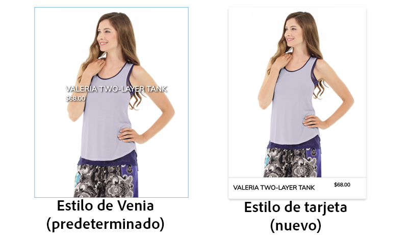
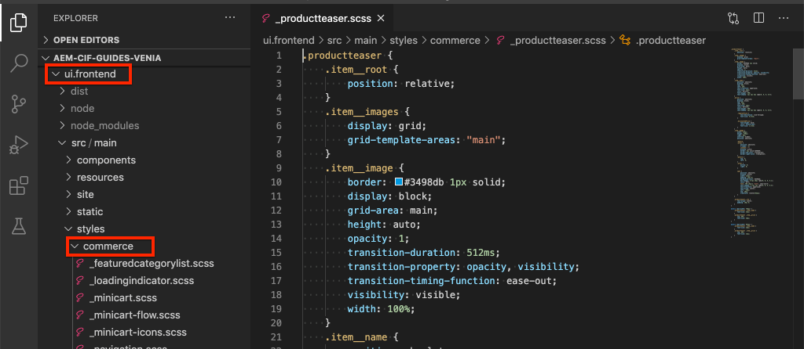
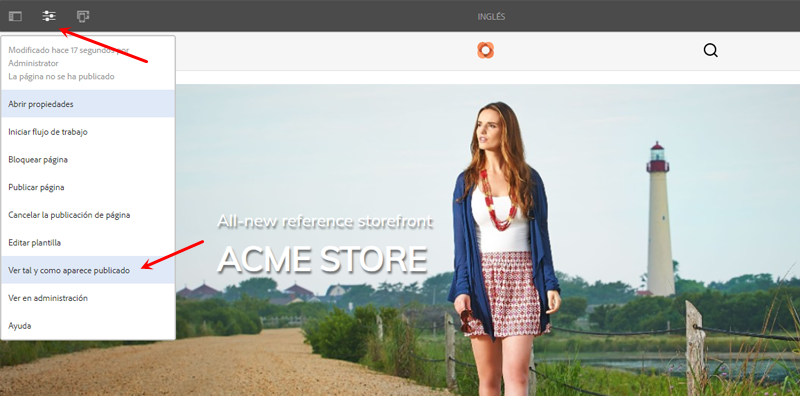
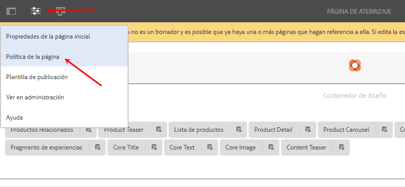
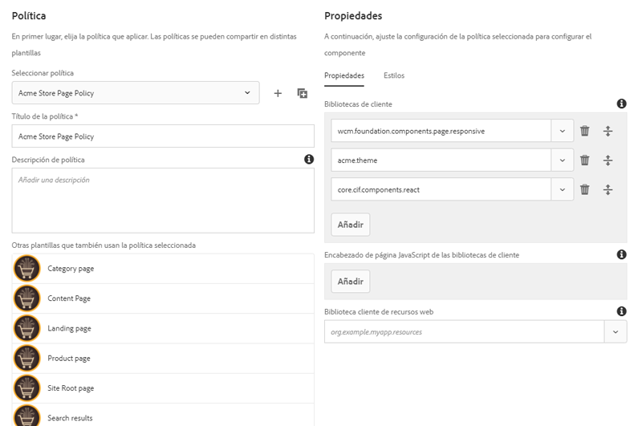
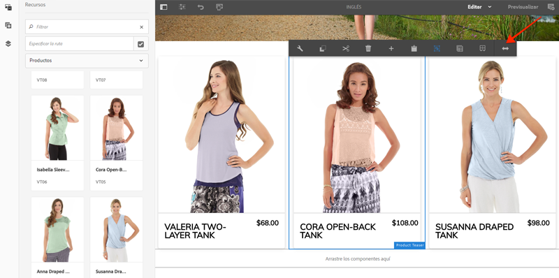
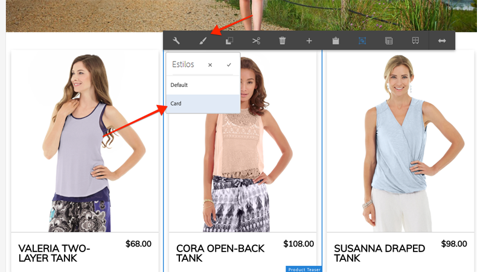

# Diseño de los componentes principales del CIF de AEM {#style-aem-cif-core-components}

El [Proyecto Venia del CIF](https://github.com/adobe/aem-cif-guides-venia) es una base de código de referencia para utilizar [Componentes principales del CIF](https://github.com/adobe/aem-core-cif-components). AEM En este tutorial, inspeccionará el proyecto de referencia de Venia y comprenderá cómo se organizan los componentes principales de CIF y CSS y JavaScript que utilizan los componentes principales de la aplicación de código de tiempo de ejecución (CSS) de la plataforma de administración de datos. También creará un nuevo estilo con CSS para actualizar el estilo predeterminado de **Teaser de productos** componente.

>[!TIP]
>
> Utilice el [AEM Arquetipo de proyecto](https://github.com/adobe/aem-project-archetype) al iniciar su propia implementación de commerce.

## Qué va a generar

En este tutorial, se implementa un nuevo estilo para el componente teaser de productos que se parece a una tarjeta. Las lecciones aprendidas en el tutorial se pueden aplicar a otros componentes principales del CIF.



## Requisitos previos {#prerequisites}

Se requiere un entorno de desarrollo local para completar este tutorial. AEM Esto incluye una instancia de ejecución de la instancia de que está configurada y conectada a una instancia de Adobe Commerce. Revise los requisitos y pasos para [AEM configuración de un desarrollo local con SDK as a Cloud Service](../develop.md).

## Clonar el proyecto Venia {#clone-venia-project}

Vamos a clonar el [Proyecto Venia](https://github.com/adobe/aem-cif-guides-venia) y, a continuación, invalide los estilos predeterminados.

>[!NOTE]
>
> **Siéntase libre de usar un proyecto existente** AEM (en función del Tipo de archivo del proyecto de la con CIF incluido) y omita esta sección.

1. Ejecute el siguiente comando de Git para clonar el proyecto:

   ```shell
   $ git clone git@github.com:adobe/aem-cif-guides-venia.git
   ```

1. Cree e implemente el proyecto en una instancia local de AEM:

   ```shell
   $ cd aem-cif-guides-venia/
   $ mvn clean install -PautoInstallPackage,cloud
   ```

1. AEM Añada las configuraciones de OSGi necesarias para conectar la instancia de a una instancia de Adobe Commerce o añadir las configuraciones al proyecto recién creado.

1. En este punto, debería tener una versión de trabajo de una tienda conectada a una instancia de Adobe Commerce. Vaya a `US` > `Home` página en: [http://localhost:4502/editor.html/content/venia/us/en.html](http://localhost:4502/editor.html/content/venia/us/en.html).

   Hay que ver que la tienda esté usando actualmente el tema de Venia. Al expandir el menú principal de la tienda, verá varias categorías que indican que la conexión con Adobe Commerce está funcionando.

   

## Bibliotecas de cliente y módulo ui.frontend {#introduction-to-client-libraries}

CSS y JavaScript responsables de procesar el tema o los estilos de la tienda se gestionan en AEM en una [biblioteca de cliente](/help/implementing/developing/introduction/clientlibs.md) o clientlibs para abreviar. Las bibliotecas de cliente proporcionan un mecanismo para organizar CSS y Javascript en el código de un proyecto y luego distribuirlas en la página.

AEM Los estilos específicos de la marca se pueden aplicar a los componentes principales del CIF de manera independiente agregando y anulando el CSS administrado por estas bibliotecas de cliente. Es fundamental comprender cómo se estructuran e incluyen las bibliotecas de cliente en la página.

El [ui.frontend](https://experienceleague.adobe.com/docs/experience-manager-core-components/using/developing/archetype/uifrontend.html) es un dedicado [webpack](https://webpack.js.org/) proyecto para administrar todos los recursos front-end de un proyecto. Esto permite a los desarrolladores de front-end utilizar cualquier número de lenguajes y tecnologías como [TypeScript](https://www.typescriptlang.org/), [Sass](https://sass-lang.com/) y mucho más.

El `ui.frontend` módulo es también un módulo Maven e integrado con el proyecto más grande a través del uso de un módulo NPM el [aem-clientlib-generator](https://github.com/wcm-io-frontend/aem-clientlib-generator). Durante una compilación, la variable `aem-clientlib-generator` copia los archivos CSS y JavaScript compilados en una biblioteca de cliente en la `ui.apps` módulo.


*CSS y Javascript compilados se copian del `ui.frontend` en el módulo `ui.apps` como una biblioteca de cliente durante una compilación de Maven*

## Actualizar el estilo del teaser {#ui-frontend-module}

A continuación, realice un pequeño cambio en el estilo Teaser para ver cómo se define la variable `ui.frontend` Las bibliotecas de módulo y cliente funcionan. Uso [el IDE de su elección](https://experienceleague.adobe.com/docs/experience-manager-learn/cloud-service/local-development-environment-set-up/development-tools.html#set-up-the-development-ide) para importar el proyecto Venia. Las capturas de pantalla utilizadas son de [IDE de código de Visual Studio](https://experienceleague.adobe.com/docs/experience-manager-learn/cloud-service/local-development-environment-set-up/development-tools.html#microsoft-visual-studio-code).

1. Navegue y expanda el **ui.frontend** y expanda la jerarquía de carpetas a: `ui.frontend/src/main/styles/commerce`:

   

   Observe que hay varios Sass (`.scss`) archivos debajo de la carpeta. Estos son los estilos específicos de Commerce para cada uno de los componentes de Commerce.

1. Abra el archivo `_productteaser.scss`.

1. Actualice el `.item__image` y modifique la regla de borde:

   ```scss
   .item__image {
       border: #ea00ff 8px solid; /* <-- modify this rule */
       display: block;
       grid-area: main;
       height: auto;
       opacity: 1;
       transition-duration: 512ms;
       transition-property: opacity, visibility;
       transition-timing-function: ease-out;
       visibility: visible;
       width: 100%;
   }
   ```

   La regla anterior debe agregar un borde rosa muy negrita al componente teaser de productos.

1. Abra una nueva ventana de terminal y vaya al `ui.frontend` carpeta:

   ```shell
   $ cd <project-location>/aem-cif-guides-venia/ui.frontend
   ```

1. Ejecute el siguiente comando Maven:

   ```shell
   $ mvn clean install
   ...
   [INFO] ------------------------------------------------------------------------
   [INFO] BUILD SUCCESS
   [INFO] ------------------------------------------------------------------------
   [INFO] Total time:  29.497 s
   [INFO] Finished at: 2020-08-25T14:30:44-07:00
   [INFO] ------------------------------------------------------------------------
   ```

   Inspect la salida del terminal. Verá que el comando Maven ejecutó varios scripts NPM incluyendo `npm run build`. El `npm run build` se define en la variable `package.json` y tiene el efecto de compilar el proyecto webpack y activar la generación de la biblioteca de cliente.

1. Inspect el archivo `ui.frontend/dist/clientlib-site/site.css`:

   

   El archivo es la versión compilada y minificada de todos los archivos Sass del proyecto.

   >[!NOTE]
   >
   > Los archivos de este tipo se omiten desde el control de código fuente, ya que deben generarse durante la generación.

1. Inspect el archivo `ui.frontend/clientlib.config.js`.

   ```js
   /* clientlib.config.js*/
   ...
   // Config for `aem-clientlib-generator`
   module.exports = {
       context: BUILD_DIR,
       clientLibRoot: CLIENTLIB_DIR,
       libs: [
           {
               ...libsBaseConfig,
               name: 'clientlib-site',
               categories: ['venia.site'],
               dependencies: ['venia.dependencies', 'aem-core-cif-react-components'],
               assets: {
   ...
   ```

   Archivo de configuración para. [aem-clientlib-generator](https://github.com/wcm-io-frontend/aem-clientlib-generator) AEM y determina dónde y cómo el CSS compilado y JavaScript se transformarán en una biblioteca de cliente de la biblioteca de la aplicación de cliente de la aplicación de datos de y de la aplicación de código de cliente de la aplicación de datos de cliente.

1. En el `ui.apps` módulo inspeccione el archivo: `ui.apps/src/main/content/jcr_root/apps/venia/clientlibs/clientlib-site/css/site.css`:

   

   Este es el copiado `site.css` en el archivo `ui.apps` proyecto. Ahora forma parte de una biblioteca de cliente denominada `clientlib-site` con una categoría de `venia.site`. Una vez que el archivo forme parte de `ui.apps` AEM módulo para el que se puede implementar el módulo de forma.

   >[!NOTE]
   >
   > Los archivos como este también se omiten desde el control de código fuente, ya que deben generarse durante la generación.

1. A continuación, inspeccione las demás bibliotecas de cliente generadas por el proyecto:

   

   El administrador no administra estas bibliotecas de cliente `ui.frontend` módulo. En su lugar, estas bibliotecas de cliente incluyen dependencias CSS y JavaScript proporcionadas por Adobe. La definición de estas bibliotecas de cliente se encuentra en `.content.xml` debajo de cada carpeta.

   **clientlib-base**: es una biblioteca de cliente vacía que simplemente incrusta las dependencias necesarias de los [componentes principales de AEM](https://experienceleague.adobe.com/docs/experience-manager-core-components/using/introduction.html?lang=es). La categoría es `venia.base`.

   **clientlib-cif** : también es una biblioteca de cliente vacía que simplemente incrusta las dependencias necesarias de [AEM Componentes principales de CIF](https://github.com/adobe/aem-core-cif-components). La categoría es `venia.cif`.

   **clientlib-grid** AEM : Esto incluye el CSS necesario para habilitar la función Cuadrícula interactiva de. AEM El uso de la cuadrícula de habilita [Modo de diseño](/help/sites-cloud/authoring/features/responsive-layout.md) AEM en el editor de y permite a los autores de contenido cambiar el tamaño de los componentes. La categoría es `venia.grid` y está incrustado en `venia.base` biblioteca.

1. Inspect los archivos `customheaderlibs.html` y `customfooterlibs.html` debajo `ui.apps/src/main/content/jcr_root/apps/venia/components/page`:

   

   Estos scripts incluyen **venia.base** y **venia.cif** como parte de todas las páginas.

   >[!NOTE]
   >
   > Solo las bibliotecas base están &quot;codificadas&quot; como parte de los scripts de página. `venia.site` no se incluye en estos archivos y, en su lugar, se incluye como parte de la plantilla de página para una buena flexibilidad. Este proceso se inspecciona más adelante.

1. AEM Desde el terminal, cree e implemente todo el proyecto en una instancia local de:

   ```shell
   $ cd aem-cif-guides-venia/
   $ mvn clean install -PautoInstallPackage,cloud
   ```

## Crear un teaser de productos {#author-product-teaser}

AEM Ahora que se han implementado las actualizaciones de código, añada una nueva instancia del componente teaser de productos a la página de inicio del sitio con las herramientas de creación de. Esto nos permitirá ver los estilos actualizados.

1. Abra una nueva pestaña del explorador y vaya a **Página principal** del sitio: [http://localhost:4502/editor.html/content/venia/us/en.html](http://localhost:4502/editor.html/content/venia/us/en.html).

1. Expanda el Buscador de recursos (el carril lateral) en **Editar** modo. Cambiar el filtro de recursos a **Productos**.

   

1. Arrastre y suelte un nuevo producto en la página de inicio del contenedor de diseño principal:

   

   Debería ver que el teaser de productos ahora tiene un borde rosa brillante en función del cambio de regla CSS creado anteriormente.

## Verificación de las bibliotecas de cliente en la página {#verify-client-libraries}

A continuación, compruebe la inclusión de las bibliotecas de cliente en la página.

1. Vaya a **Página principal** del sitio: [http://localhost:4502/editor.html/content/venia/us/en.html](http://localhost:4502/editor.html/content/venia/us/en.html).

1. Seleccione el menú **Información de página** y haga clic en **Ver tal y como aparece publicado**:

   

   De este modo se abre la página sin que se hayan cargado los archivos JavaScript del Autor de AEM, ya que aparecería en el sitio publicado. Observe que la dirección URL tiene el parámetro de consulta `?wcmmode=disabled` anexado. Al desarrollar CSS y Javascript, se recomienda utilizar este parámetro para simplificar la página sin ningún elemento del Autor de AEM.

1. Vea el origen de la página y para identificar varias bibliotecas de cliente:

   ```html
   <!DOCTYPE html>
   <html lang="en-US">
   <head>
       ...
       <link rel="stylesheet" href="/etc.clientlibs/venia/clientlibs/clientlib-base.min.css" type="text/css">
       <link rel="stylesheet" href="/etc.clientlibs/venia/clientlibs/clientlib-site.min.css" type="text/css">
   </head>
   ...
       <script type="text/javascript" src="/etc.clientlibs/venia/clientlibs/clientlib-site.min.js"></script>
       <script type="text/javascript" src="/etc.clientlibs/core/wcm/components/commons/site/clientlibs/container.min.js"></script>
       <script type="text/javascript" src="/etc.clientlibs/venia/clientlibs/clientlib-base.min.js"></script>
   <script type="text/javascript" src="/etc.clientlibs/core/cif/clientlibs/common.min.js"></script>
   <script type="text/javascript" src="/etc.clientlibs/venia/clientlibs/clientlib-cif.min.js"></script>
   </body>
   </html>
   ```

   Las bibliotecas de cliente cuando se entregan a la página tienen el prefijo `/etc.clientlibs` y se sirven a través de una [proxy](/help/implementing/developing/introduction/clientlibs.md) para evitar exponer elementos confidenciales en `/apps` o `/libs`.

   Aviso `venia/clientlibs/clientlib-site.min.css` y `venia/clientlibs/clientlib-site.min.js`. Estos son los archivos CSS y Javascript compilados derivados del `ui.frontend` módulo.

## Inclusión de la biblioteca de clientes con plantillas de página {#client-library-inclusion-pagetemplates}

Existen varias opciones para incluir una biblioteca del lado del cliente. A continuación, inspeccione cómo el proyecto generado incluye el `clientlib-site` bibliotecas mediante [Plantillas de página](/help/implementing/developing/components/templates.md).

1. Vaya a **Página principal** AEM del sitio dentro del Editor de la: [http://localhost:4502/editor.html/content/venia/us/en.html](http://localhost:4502/editor.html/content/venia/us/en.html).

1. Seleccione el **Información de página** y haga clic en **Editar plantilla**:

   

   Esto abrirá el **Página de aterrizaje** plantilla el **Inicio** se basa en.

   >[!NOTE]
   >
   > AEM Para ver todas las plantillas disponibles desde la pantalla Inicio de la, vaya a **Herramientas** > **General** > **Plantillas**.

1. En la esquina superior izquierda, seleccione el icono **Información de página** y haga clic en **Política de página**.

   

1. Se abrirá la directiva de página para la plantilla Página de aterrizaje:

   

   A la derecha puede ver una lista de bibliotecas de clientes **categorías** que se incluyen en todas las páginas que utilizan esta plantilla.

   * `venia.dependencies` : proporciona cualquier biblioteca de proveedor que `venia.site` depende de.
   * `venia.site` - Esta es la categoría de `clientlib-site` que el `ui.frontend` genera el módulo.

   Tenga en cuenta que otras plantillas utilizan la misma directiva, la **página de contenido**, la **página de aterrizaje**, etc. Al reutilizar la misma directiva, podemos garantizar que se incluyan las mismas bibliotecas de cliente en todas las páginas.

   La ventaja de utilizar las plantillas y las directivas de página para administrar la inclusión de bibliotecas de cliente es que puede cambiar la directiva por plantilla. Por ejemplo: quizás esté administrando dos marcas diferentes dentro de la misma instancia de AEM. Cada marca tiene su propio estilo único o *tema* pero las bibliotecas base y el código son iguales. Otro ejemplo: si tiene una biblioteca de cliente más grande que solo desea que aparezca en determinadas páginas, puede crear una directiva de página única solo para esa plantilla.

## Desarrollo de Webpack local {#local-webpack-development}

En el ejercicio anterior, se realizó una actualización de los archivos Sass en el `ui.frontend` AEM y, a continuación, después de realizar una compilación de Maven, los cambios se implementan en el módulo de. A continuación, veremos cómo aprovechar un webpack-dev-server para desarrollar rápidamente los estilos front-end.

AEM El webpack-dev-server proporciona imágenes y algunos de los elementos CSS/JavaScript de la instancia local de la aplicación, pero permite al desarrollador modificar los estilos y el código JavaScript de la aplicación de forma predeterminada. `ui.frontend` módulo.

1. En el explorador, vaya a **Inicio** página y **Ver como aparece publicado**: [http://localhost:4502/content/venia/us/en.html?wcmmode=disabled](http://localhost:4502/content/venia/us/en.html?wcmmode=disabled).

1. Ver el origen de la página y el **copia** el HTML sin procesar de la página.

1. Vuelva al IDE de su elección debajo de `ui.frontend` módulo abra el archivo: `ui.frontend/src/main/static/index.html`

   

1. Sobrescribir el contenido de `index.html` y **pegar** el HTML copió en el paso anterior.

1. Busque las inclusiones para `clientlib-site.min.css`, `clientlib-site.min.js` y **quitar** a ellos.

   ```html
   <head>
       <!-- remove this link -->
       <link rel="stylesheet" href="/etc.clientlibs/venia/clientlibs/clientlib-base.min.css" type="text/css">
       ...
   </head>
   <body>
       ...
        <!-- remove this link -->
       <script type="text/javascript" src="/etc.clientlibs/venia/clientlibs/clientlib-site.min.js"></script>
   </body>
   ```

   Se eliminan porque representan la versión compilada de CSS y JavaScript generados por `ui.frontend` módulo. AEM Deje las demás bibliotecas de cliente tal como se van a proxy desde la instancia de la instancia de la instancia de en ejecución.

1. Abra una nueva ventana de terminal y navegue hasta la `ui.frontend` carpeta. Ejecute el comando `npm start`:

   ```shell
   $ cd ui.frontend
   $ npm start
   ```

   Se iniciará el webpack-dev-server el [http://localhost:8080/](http://localhost:8080/)

   >[!CAUTION]
   >
   > Si aparece un error relacionado con Sass, detenga el servidor y ejecute el comando `npm rebuild node-sass` y repita los pasos anteriores. Esto puede ocurrir si tiene una versión diferente de `npm` y `node` luego se especifica en el proyecto `aem-cif-guides-venia/pom.xml`.

1. Vaya a [http://localhost:8080/](http://localhost:8080/) AEM en una nueva pestaña con el mismo explorador que una instancia de inicio de sesión de. Debería ver la página de inicio de Venia a través del webpack-dev-server:

   

   Deje el webpack-dev-server en ejecución. Se utiliza en el siguiente ejercicio.

## Implementar el estilo de tarjeta para el teaser de productos {#update-css-product-teaser}

A continuación, modifique los archivos Sass en `ui.frontend` para implementar un estilo de tarjeta para el teaser de productos. El webpack-dev-server se utiliza para ver rápidamente los cambios.

Vuelva al IDE y al proyecto generado.

1. En el **ui.frontend** módulo vuelva a abrir el archivo `_productteaser.scss` en `ui.frontend/src/main/styles/commerce/_productteaser.scss`.

1. Realice los siguientes cambios en el borde del teaser de productos:

   ```diff
       .item__image {
   -       border: #ea00ff 8px solid;
   +       border-bottom: 1px solid #c0c0c0;
           display: block;
           grid-area: main;
           height: auto;
           opacity: 1;
           transition-duration: 512ms;
           transition-property: opacity, visibility;
           transition-timing-function: ease-out;
           visibility: visible;
           width: 100%;
       }
   ```

   Guarde los cambios y el webpack-dev-server debe actualizarse automáticamente con los nuevos estilos.

1. En el teaser de productos, añada una sombra paralela e incluya esquinas redondeadas.

   ```scss
    .item__root {
        position: relative;
        box-shadow: 0 4px 8px 0 rgba(0,0,0,0.2);
        transition: 0.3s;
        border-radius: 5px;
        float: left;
        margin-left: 12px;
        margin-right: 12px;
   }
   
   .item__root:hover {
      box-shadow: 0 8px 16px 0 rgba(0,0,0,0.2);
   }
   ```

1. Actualice el nombre del producto para que aparezca en la parte inferior del teaser y modifique el color del texto.

   ```css
   .item__name {
       color: #000;
       display: block;
       float: left;
       font-size: 22px;
       font-weight: 900;
       line-height: 1em;
       padding: 0.75em;
       text-transform: uppercase;
       width: 75%;
   }
   ```

1. Actualice el precio del producto para que también aparezca en la parte inferior del teaser y modifique el color del texto.

   ```css
   .price {
       color: #000;
       display: block;
       float: left;
       font-size: 18px;
       font-weight: 900;
       padding: 0.75em;
       padding-bottom: 2em;
       width: 25%;
   
       ...
   ```

1. Actualice la consulta de medios en la parte inferior para apilar el nombre y el precio en pantallas de menos de **992 px**.

   ```css
   @media (max-width: 992px) {
       .productteaser .item__name {
           font-size: 18px;
           width: 100%;
       }
       .productteaser .item__price {
           font-size: 14px;
           width: 100%;
       }
   }
   ```

   Ahora debería ver el estilo de tarjeta reflejado en el webpack-dev-server:

   

   AEM Sin embargo, aún no se han implementado los cambios en la configuración de los recursos de la. Puede descargar el archivo [solution aquí](../assets/style-cif-component/_productteaser.scss).

1. AEM Implemente las actualizaciones para que se utilicen sus habilidades con Maven, desde un terminal de línea de comandos:

   ```shell
   $ cd aem-cif-guides-venia/
   $ mvn clean install -PautoInstallPackage,cloud
   ```

   >[!NOTE]
   >Existen [herramientas y configuración IDE](https://experienceleague.adobe.com/docs/experience-manager-learn/foundation/development/set-up-a-local-aem-development-environment.html#set-up-an-integrated-development-environment) adicionales que pueden sincronizar los archivos de proyecto directamente con una instancia de AEM local sin tener que realizar una compilación completa de Maven.

## Visualización de teaser de productos actualizado {#view-updated-product-teaser}

Una vez que el código del proyecto se haya implementado en AEM, debería poder ver los cambios en el teaser de productos.

1. Vuelva al explorador y vuelva a actualizar la página de inicio: [http://localhost:4502/editor.html/content/venia/us/en.html](http://localhost:4502/editor.html/content/venia/us/en.html). Debe ver los estilos aplicados del teaser de productos actualizado.

   

1. Experimente añadiendo teaser de productos adicionales. Utilice el modo Diseño para cambiar la anchura y el desplazamiento de los componentes y mostrar varios teasers en una fila.

   

## Solución de problemas {#troubleshooting}

Puede verificarlo en [CRXDE-Lite](http://localhost:4502/crx/de/index.jsp) Compruebe que se ha implementado el archivo CSS actualizado: [http://localhost:4502/crx/de/index.jsp#/apps/venia/clientlibs/clientlib-site/css/site.css](http://localhost:4502/crx/de/index.jsp#/apps/venia/clientlibs/clientlib-site/css/site.css)

Al implementar nuevos archivos CSS o JavaScript, también es importante asegurarse de que el explorador no muestre archivos antiguos. Se pueden eliminar borrando la caché del explorador o iniciando una nueva sesión del explorador.

AEM también intenta almacenar en caché las bibliotecas de cliente para el rendimiento. En ocasiones, tras una implementación de código, se muestran los archivos más antiguos. Puede invalidar manualmente la caché de la biblioteca de cliente de AEM con la herramienta [Reconstruir bibliotecas de cliente](http://localhost:4502/libs/granite/ui/content/dumplibs.rebuild.html). *Invalidar cachés es el método preferido si sospecha que AEM ha almacenado en caché una versión antigua de una biblioteca de cliente. La reconstrucción de bibliotecas es ineficiente y lleva mucho tiempo.*

## Felicitaciones {#congratulations}

AEM Acaba de diseñar su primer componente principal del CIF de la y ha utilizado un servidor de desarrollo de Webpack.

## Desafío para una bonificación {#bonus-challenge}

Utilice el [sistema de estilos de AEM](/help/sites-cloud/authoring/features/style-system.md) para crear dos estilos que se puedan activar o desactivar con el autor de contenido. [El desarrollo con el sistema de estilos](https://experienceleague.adobe.com/docs/experience-manager-learn/getting-started-wknd-tutorial-develop/style-system.html?lang=es) incluye pasos detallados e información sobre cómo hacerlo.



## Recursos adicionales {#additional-resources}

* [Tipo de archivo del proyecto AEM](https://github.com/adobe/aem-project-archetype)
* [Componentes principales del CIF de AEM](https://github.com/adobe/aem-core-cif-components)
* [Configuración de un Entorno de desarrollo de AEM local](https://experienceleague.adobe.com/docs/experience-manager-learn/cloud-service/local-development-environment-set-up/overview.html?lang=es)
* [Bibliotecas de cliente](/help/implementing/developing/introduction/clientlibs.md)
* [Introducción a AEM Sites](https://experienceleague.adobe.com/docs/experience-manager-learn/getting-started-wknd-tutorial-develop/overview.html?lang=es)
* [Desarrollo con el sistema de estilos](https://experienceleague.adobe.com/docs/experience-manager-learn/getting-started-wknd-tutorial-develop/style-system.html?lang=es)
