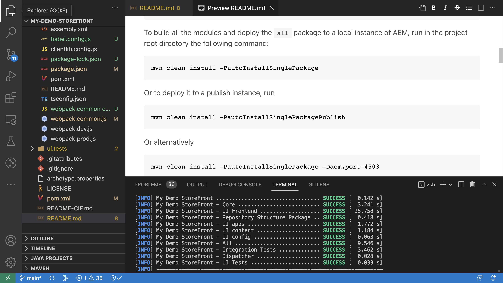

# Integración de los componentes principales AEM-CIF y Adobe Experience Platform {#aem-cif-aep-integration}

La variable [Commerce Integration Framework (CIF)](https://github.com/adobe/aem-core-cif-components) los componentes principales ofrecen una integración perfecta con [Adobe Experience Platform](https://experienceleague.adobe.com/docs/experience-platform/landing/platform-overview.html?lang=en) para reenviar eventos de tienda y sus datos a partir de interacciones del lado del cliente, como __agregar al carro de compras__.

La variable [Componentes principales del CIF de AEM](https://github.com/adobe/aem-core-cif-components) project proporciona una biblioteca JavaScript llamada [Conector de Adobe Experience Platform para Adobe Commerce](https://github.com/adobe/aem-core-cif-components/tree/master/extensions/experience-platform-connector) para recopilar datos de evento de su tienda de Commerce. Los datos de ese evento se envían al Experience Platform, donde se utilizan en otros productos de Adobe Experience Cloud, como Adobe Analytics y Adobe Target, para crear un perfil de 360 grados que cubra el recorrido de un cliente. Al conectar los datos de comercio con otros productos de Adobe Experience Cloud, puede realizar tareas como analizar el comportamiento de los usuarios en el sitio, realizar pruebas A/B y crear campañas personalizadas.

Obtenga más información sobre [Recopilación de datos del Experience Platform](https://experienceleague.adobe.com/docs/experience-platform/collection/home.html) conjunto de tecnologías que le permiten recopilar datos de experiencia del cliente de fuentes del lado del cliente.

## Enviar `addToCart` datos de evento a Experience Platform {#send-addtocart-to-aep}

Los siguientes pasos muestran cómo enviar la variable `addToCart` datos de evento de páginas de productos procesadas AEM al Experience Platform mediante el conector del CIF - Experience Platform. Con la extensión del explorador de Adobe Experience Platform Debugger, puede probar y revisar los datos enviados.


## Requisitos previos {#prerequisites}

Debe utilizar un entorno de desarrollo local para completar esta demostración. Esto incluye una instancia de AEM en ejecución configurada y conectada a una instancia de Adobe Commerce. Consulte los requisitos y pasos para [configuración del desarrollo local con AEM SDK as a Cloud Service](../develop.md).

También necesita acceder a [Adobe Experience Platform](https://experienceleague.adobe.com/docs/experience-platform/landing/platform-ui/ui-guide.html) y permisos para crear esquemas, conjuntos de datos y conjuntos de datos para la recopilación de datos. Para obtener más información, consulte [Administración de permisos](https://experienceleague.adobe.com/docs/experience-platform/collection/permissions.html).

## Configuración as a Cloud Service de AEM Commerce {#aem-setup}

Para tener un trabajo __AEM Commerce as a Cloud Service__ entorno local con el código y la configuración necesarios, complete los siguientes pasos.

### Configuración local

Siga las [Configuración local](https://experienceleague.adobe.com/docs/experience-manager-cloud-service/content/content-and-commerce/storefront/developing/develop.html?#local-setup) pasos para tener un entorno AEM Commerce as a Cloud Service.

### Configuración del proyecto

Siga las [Tipo de archivo del proyecto AEM](https://experienceleague.adobe.com/docs/experience-manager-cloud-service/content/content-and-commerce/storefront/developing/develop.html?#project) pasos para crear un nuevo proyecto de AEM Commerce (CIF).

>[!TIP]
>
>En el siguiente ejemplo, se nombra el proyecto AEM Commerce: `My Demo Storefront`, sin embargo, puede elegir su propio nombre de proyecto.




Cree e implemente el proyecto de comercio de AEM recién creado en el SDK de AEM local ejecutando el siguiente comando desde el directorio raíz del proyecto.

```bash
$ mvn clean install -PautoInstallSinglePackage
```

Implementación local `My Demo StoreFront` sitio de comercio con código y contenido predeterminados tiene el siguiente aspecto:


### Instalación de las dependencias del conector Peregrine y CIF-AEP

Para recopilar y enviar los datos de evento de las páginas de categoría y producto de este sitio de AEM Commerce, debe instalar la clave `npm` en `ui.frontend` del proyecto AEM Commerce.

Vaya a la `ui.frontend` e instale los paquetes necesarios ejecutando los siguientes comandos desde la línea de comandos.

```bash
npm i --save lodash.get@^4.4.2 lodash.set@^4.3.2
npm i --save apollo-cache-persist@^0.1.1
npm i --save redux-thunk@~2.3.0
npm i --save @adobe/apollo-link-mutation-queue@~1.1.0
npm i --save @magento/peregrine@~12.5.0
npm i --save @adobe/aem-core-cif-react-components --force
npm i --save-dev @magento/babel-preset-peregrine@~1.2.1
npm i --save @adobe/aem-core-cif-experience-platform-connector --force
```

>[!IMPORTANT]
>
>La variable `--force` El argumento es obligatorio a veces como [PWA Studio](https://developer.adobe.com/commerce/pwa-studio/) es restrictivo con las dependencias del mismo nivel admitidas. Normalmente, esto no debería causar ningún problema.


### Configurar Maven para usar `--force` argumento

Como parte del proceso de compilación de Maven, la instalación de npm clean (utilizando `npm ci`). Esto también requiere que `--force` argumento.

Vaya al archivo POM raíz del proyecto `pom.xml` y busque la variable `<id>npm ci</id>` bloque de ejecución. Actualice el bloque para que tenga el siguiente aspecto:

```xml
<execution>
    <id>npm ci</id>
    <goals>
    <goal>npm</goal>
    </goals>
    <configuration>
    <arguments>ci --force</arguments>
    </configuration>
</execution>
```

### Cambiar el formato de configuración de Babel

Cambiar desde el valor predeterminado `.babelrc` formato de archivo de configuración relativa de archivo a `babel.config.js` formato. Este es un formato de configuración para todo el proyecto y permite aplicar los complementos y ajustes preestablecidos al `node_module` con bueno control.

1. Vaya a la `ui.frontend` y elimine el `.babelrc` archivo.

1. Cree un `babel.config.js` que utiliza la variable `peregrine` preestablecido.

   ```javascript
   const peregrine = require('@magento/babel-preset-peregrine');
   
   module.exports = (api, opts = {}) => {
       const config = {
           ...peregrine(api, opts),
           sourceType: 'unambiguous'
       } 
   
       config.plugins = config.plugins.filter(plugin => plugin !== 'react-refresh/babel');
   
       return config;
   }
   ```

### Configurar el webpack para utilizar Babel

Para transformar los archivos JavaScript mediante Babel Loader (`babel-loader`) y el webpack, debe modificar el `webpack.common.js` archivo.

Vaya a la `ui.frontend` y actualice el `webpack.common.js` para tener la siguiente regla dentro del `module` valor de propiedad:

```javascript
{
    test: /\.jsx?$/,
    exclude: /node_modules\/(?!@magento\/)/,
    loader: 'babel-loader'
}
```

### Configurar el cliente Apollo

La variable [Cliente Apollo](https://www.apollographql.com/docs/react/) se utiliza para administrar datos locales y remotos con GraphQL. También almacena los resultados de las consultas de GraphQL en una caché local, normalizada y en memoria.

Para [`InMemoryCache`](https://www.apollographql.com/docs/react/caching/cache-configuration/) para trabajar de forma eficaz, necesita un `possibleTypes.js` archivo. Para generar este archivo, consulte [Generación automática de possibleTypes](https://www.apollographql.com/docs/react/data/fragments/#generating-possibletypes-automatically). Consulte también la [implementación de referencia del PWA Studio](https://github.com/magento/pwa-studio/blob/1977f38305ff6c0e2b23a9da7beb0b2f69758bed/packages/pwa-buildpack/lib/Utilities/graphQL.js#L106-L120) y un ejemplo de [`possibleTypes.js`](../assets/aep-integration/possibleTypes.js) archivo.


1. Vaya a la `ui.frontend` y guarde el archivo como `./src/main/possibleTypes.js`

1. Actualice el `webpack.common.js` del archivo `DefinePlugin` para reemplazar las variables estáticas necesarias durante el tiempo de compilación.

   ```javascript
   const { DefinePlugin } = require('webpack');
   const { POSSIBLE_TYPES } = require('./src/main/possibleTypes');
   
   ...
   
   plugins: [
       ...
       new DefinePlugin({
           'process.env.USE_STORE_CODE_IN_URL': false,
           POSSIBLE_TYPES
       })
   ]
   ```

### Inicializar componentes principales de Peregrine y CIF

Para inicializar los componentes principales Peregrine y CIF basados en React, cree los archivos de configuración y JavaScript necesarios.

1. Vaya a la `ui.frontend` y cree la siguiente carpeta: `src/main/webpack/components/commerce/App`

1. Cree un `config.js` con el siguiente contenido:

   ```javascript
   // get and parse the CIF store configuration from the <head>
   const storeConfigEl = document.querySelector('meta[name="store-config"]');
   const storeConfig = storeConfigEl ? JSON.parse(storeConfigEl.content) : {};
   
   // the following global variables are needed for some of the peregrine features
   window.STORE_VIEW_CODE = storeConfig.storeView || 'default';
   window.AVAILABLE_STORE_VIEWS = [
       {
           code: window.STORE_VIEW_CODE,
           base_currency_code: 'USD',
           default_display_currency_code: 'USD',
           id: 1,
           locale: 'en',
           secure_base_media_url: '',
           store_name: 'My Demo StoreFront'
       }
   ];
   window.STORE_NAME = window.STORE_VIEW_CODE;
   window.DEFAULT_COUNTRY_CODE = 'en';
   
   export default {
       storeView: window.STORE_VIEW_CODE,
       graphqlEndpoint: storeConfig.graphqlEndpoint,
       // Can be GET or POST. When selecting GET, this applies to cache-able GraphQL query requests only.
       // Mutations will always be executed as POST requests.
       graphqlMethod: storeConfig.graphqlMethod,
       headers: storeConfig.headers,
   
       mountingPoints: {
           // TODO: define the application specific mount points as they may be used by <Portal> and <PortalPlacer>
       },
       pagePaths: {
           // TODO: define the application specific paths/urls as they may be used by the components
           baseUrl: storeConfig.storeRootUrl
       },
       eventsCollector: {
           // Enable the Experience Platform Connector and define the org and datastream to use
           aep: {
               orgId: // TODO: add your orgId
               datastreamId: // TODO: add your datastreamId
           }
       }
   };
   ```

   >[!IMPORTANT]
   >
   >Aunque es posible que ya esté familiarizado con el [`config.js`](https://github.com/adobe/aem-cif-guides-venia/blob/main/ui.frontend/src/main/components/App/config.js) del archivo __Guías AEM - Proyecto Venia del CIF__, hay algunos cambios que debe realizar en este archivo. Primero, revise cualquier __TODO__ comentarios. A continuación, dentro de la variable `eventsCollector` busque la `eventsCollector > aed` y actualice la variable `orgId` y `datastreamId` propiedades con los valores correctos. [Más información](./aep.md#add-aep-values-to-aem).

1. Cree un `App.js` con el siguiente contenido. Este archivo se parece a un archivo de punto de inicio de aplicación React típico y contiene vínculos React y personalizados, así como el uso de Contexto React para facilitar la integración del Experience Platform.

   ```javascript
   import config from './config';
   
   import React, { useEffect } from 'react';
   import ReactDOM from 'react-dom';
   import { IntlProvider } from 'react-intl';
   import { BrowserRouter as Router } from 'react-router-dom';
   import { combineReducers, createStore } from 'redux';
   import { Provider as ReduxProvider } from 'react-redux';
   import { createHttpLink, ApolloProvider } from '@apollo/client';
   import { ConfigContextProvider, useCustomUrlEvent, useReferrerEvent, usePageEvent, useDataLayerEvents, useAddToCartEvent } from '@adobe/aem-core-cif-react-components';
   import { EventCollectorContextProvider, useEventCollectorContext } from '@adobe/aem-core-cif-experience-platform-connector';
   import { useAdapter } from '@magento/peregrine/lib/talons/Adapter/useAdapter';
   import { customFetchToShrinkQuery } from '@magento/peregrine/lib/Apollo/links';
   import { BrowserPersistence } from '@magento/peregrine/lib/util';
   import { default as PeregrineContextProvider } from '@magento/peregrine/lib/PeregrineContextProvider';
   import { enhancer, reducers } from '@magento/peregrine/lib/store';
   
   const storage = new BrowserPersistence();
   const store = createStore(combineReducers(reducers), enhancer);
   
   storage.setItem('store_view_code', config.storeView);
   
   const App = () => {
       const [{ sdk: mse }] = useEventCollectorContext();
   
       // trigger page-level events
       useCustomUrlEvent({ mse });
       useReferrerEvent({ mse });
       usePageEvent({ mse });
       // listen for add-to-cart events and enable forwarding to the magento storefront events sdk
       useAddToCartEvent(({ mse }));
       // enable CIF specific event forwarding to the Adobe Client Data Layer
       useDataLayerEvents();
   
       useEffect(() => {
           // implement a proper marketing opt-in, for demo purpose we hard-set the consent cookie
           if (document.cookie.indexOf('mg_dnt') < 0) {
               document.cookie += '; mg_dnt=track';
           }
       }, []);
   
       // TODO: use the App to create Portals and PortalPlaceholders to mount the CIF / Peregrine components to the server side rendered markup
       return <></>;
   };
   
   const AppContext = ({ children }) => {
       const { storeView, graphqlEndpoint, graphqlMethod = 'POST', headers = {}, eventsCollector } = config;
       const { apolloProps } = useAdapter({
           apiUrl: new URL(graphqlEndpoint, window.location.origin).toString(),
           configureLinks: (links, apiBase) =>
               // reconfigure the HTTP link to use the configured graphqlEndpoint, graphqlMethod and storeView header
   
               links.set('HTTP', createHttpLink({
                   fetch: customFetchToShrinkQuery,
                   useGETForQueries: graphqlMethod !== 'POST',
                   uri: apiBase,
                   headers: { ...headers, 'Store': storeView }
               }))
       });
   
       return (
           <ApolloProvider {...apolloProps}>
               <IntlProvider locale='en' messages={{}}>
                   <ConfigContextProvider config={config}>
                       <ReduxProvider store={store}>
                           <PeregrineContextProvider>
                               <EventCollectorContextProvider {...eventsCollector}>
                                   {children}
                               </EventCollectorContextProvider>
                           </PeregrineContextProvider>
                       </ReduxProvider>
                   </ConfigContextProvider>
               </IntlProvider>
           </ApolloProvider>
       );
   };
   
   window.onload = async () => {
       const root = document.createElement('div');
       document.body.appendChild(root);
   
       ReactDOM.render(
           <Router>
               <AppContext>
                   <App />
               </AppContext>
           </Router>,
           root
       );
   };
   ```

   La variable `EventCollectorContext` exporta el contexto React que:

   - carga la biblioteca commerce-events-sdk y commerce-events-collector,
   - los inicializa con una configuración determinada para Experience Platform o ACDS
   - se suscribe a todos los eventos de Peregrine y los reenvía al SDK de eventos

   Puede revisar los detalles de implementación del `EventCollectorContext` [here](https://github.com/adobe/aem-core-cif-components/blob/3d4e44d81fff2f398fd2376d24f7b7019f20b31b/extensions/experience-platform-connector/src/events-collector/EventCollectorContext.js).

### Creación e implementación del proyecto AEM actualizado

Para asegurarse de que los cambios de instalación, código y configuración del paquete anteriores son correctos, vuelva a compilar e implemente el proyecto AEM Comercio actualizado con el siguiente comando Maven: `$ mvn clean install -PautoInstallSinglePackage`.

## configuración del Experience Platform {#aep-setup}

Para recibir y almacenar los datos de evento procedentes de las páginas de comercio de AEM, como categoría y producto, complete los siguientes pasos:

>[!AVAILABILITY]
>
>Asegúrese de que forma parte de las __Perfiles de producto__ under __Adobe Experience Platform__ y __Recopilación de datos de Adobe Experience Platform__. Si es necesario, trabaje con el administrador del sistema para crear, actualizar o asignar __Perfiles de producto__ en el [Admin Console](https://adminconsole.adobe.com/).

### Crear esquema con el grupo de campos Comercio

Para definir la estructura de los datos de evento de comercio, debe crear un esquema de Experience Data Model (XDM). Un esquema es un conjunto de reglas que representan y validan la estructura y el formato de los datos.

1. En el navegador, vaya a la __Adobe Experience Platform__ página principal del producto. Por ejemplo, <https://experience.adobe.com/#/@YOUR-ORG-NAME/sname:prod/platform/home>.

1. Busque la variable __Esquemas__ en la sección de navegación izquierda, haga clic en la __Crear esquema__ en la sección superior derecha y seleccione __XDM ExperienceEvent__.

   

1. Asigne un nombre al esquema mediante la variable __Propiedades del esquema > Mostrar nombre__ y agregar grupos de campos utilizando la variable  __Composición > Grupos de campos > Agregar__ botón.

   

1. En el __Agregar grupos de campos__ cuadro de diálogo, buscar `Commerce`, seleccione __Detalles del comercio__ y haga clic en __Agregar grupos de campos__.

   


>[!TIP]
>
>Consulte la [Aspectos básicos de la composición del esquema](https://experienceleague.adobe.com/docs/experience-platform/xdm/schema/composition.html) para obtener más información.

### Crear conjunto de datos

Para almacenar los datos de evento, debe crear un conjunto de datos que se ajuste a la definición del esquema. Un conjunto de datos es una construcción de almacenamiento y administración para una recopilación de datos, normalmente una tabla, que contiene un esquema (columnas) y campos (filas).

1. En el navegador, vaya a la __Adobe Experience Platform__ página principal del producto. Por ejemplo, <https://experience.adobe.com/#/@YOUR-ORG-NAME/sname:prod/platform/home>.

1. Busque la variable __Conjuntos de datos__ en la sección de navegación izquierda y haga clic en la __Crear conjunto de datos__ en la sección superior derecha.

   

1. En la nueva página, seleccione __Crear conjunto de datos a partir del esquema__ tarjeta.

   

- En la nueva página, __buscar y seleccionar__ el esquema que ha creado en el paso anterior y haga clic en el botón __Siguiente__ botón.

   

1. Asigne un nombre al conjunto de datos mediante la variable __Configurar el conjunto de datos > Nombre__ y haga clic en el botón __Finalizar__ botón.

   

>[!TIP]
>
>Consulte la [Información general sobre conjuntos de datos](https://experienceleague.adobe.com/docs/experience-platform/catalog/datasets/overview.html) para obtener más información.


### Crear conjunto de datos

Complete los siguientes pasos para crear un Datastream en el Experience Platform.

1. En el navegador, vaya a la __Adobe Experience Platform__ página principal del producto. Por ejemplo, <https://experience.adobe.com/#/@YOUR-ORG-NAME/sname:prod/platform/home>.

1. Busque la variable __Datastreams__ en la sección de navegación izquierda y haga clic en la __Nuevo conjunto de datos__ en la sección superior derecha.

   

1. Asigne un nombre al conjunto de datos mediante la variable __Nombre__ campo obligatorio. En el __Esquema de evento__ , seleccione el esquema recién creado y haga clic en __Guardar__.

   

1. Abra el Datastream recién creado y haga clic en __Añadir servicio__.

   

1. En el __Servicio__ , seleccione __Adobe Experience Platform__ . En __Conjunto de datos del evento__ , seleccione el nombre del conjunto de datos del paso anterior y haga clic en __Guardar__.

   

>[!TIP]
>
>Consulte la [Información general del almacén de datos](https://experienceleague.adobe.com/docs/experience-platform/edge/datastreams/overview.html) para obtener más información.

## Añadir el valor datastream a AEM configuración de Commerce {#add-aep-values-to-aem}

Después de completar la configuración del Experience Platform anterior, debe tener `datastreamId` en el carril izquierdo de los detalles del Datastream y `orgId` en la esquina superior derecha del __Imagen de perfil > Información de cuenta > Información de usuario__ modal.


1. En el informe del proyecto AEM Commerce `ui.frontend` , actualice el `config.js` y específicamente el `eventsCollector > aep` propiedades del objeto.

1. Cree e implemente el proyecto AEM Commerce actualizado


## Déclencheur `addToCart` evento y verificación de la recopilación de datos {#event-trigger-verify}

Los pasos anteriores completan la configuración AEM Commerce y Experience Platform. Ahora puede almacenar en déclencheur un `addToCart` y compruebe la recopilación de datos mediante el depurador de Experience Platform y el conjunto de datos __Métricas y gráficos__ alterne en la interfaz de usuario del producto.

Para almacenar en déclencheur el evento, puede usar AEM autor o el servicio de publicación desde la configuración local. Para este ejemplo, utilice AEM autor iniciando sesión en su cuenta.

1. En la página Sitios , seleccione __My Demo StoreFront > us > en__ página y haga clic en __Editar__ en la barra de acciones superior.

1. En la barra de acciones superior, haga clic en __Ver tal y como aparece publicado__, luego haga clic en cualquier categoría preferida desde la navegación de la tienda.

1. Haga clic en cualquier tarjeta de producto preferida en la __Página de productos__ y, a continuación, seleccione __color, tamaño__ para habilitar la variable __Agregar al carro__ botón.


1. Abra el __Adobe Experience Platform Debugger__ del panel de extensiones del explorador y seleccione __SDK de Experience Platform Wed__ en el carril izquierdo.

   


1. Vuelva a la __Página de productos__ y haga clic en __Agregar al carro__ botón. Esto envía datos al Experience Platform. La variable __Adobe Experience Platform Debugger__ muestra los detalles del evento.

   


1. En la interfaz de usuario del producto de Experience Platform, vaya a la __Conjuntos de datos > My Demo StoreFront__, en la sección __Actividad del conjunto de datos__ pestaña . Si la variable __Métricas y gráficos__ está activada, se muestran las estadísticas de datos de evento.

   


## Detalles de implementación {#implementation-details}

La variable [Conector del Experience Platform del CIF](https://github.com/adobe/aem-core-cif-components/tree/master/extensions/experience-platform-connector) se crea sobre la variable [Experience Platform Connector para Adobe Commerce](https://marketplace.magento.com/magento-experience-platform-connector.html), que forma parte del [PWA Studio](https://developer.adobe.com/commerce/pwa-studio/) proyecto.

El proyecto PWA Studio permite crear tiendas de Progressive Web Application (PWA) con tecnología de Adobe Commerce o Magento Open Source. El proyecto también contiene una biblioteca de componentes llamada [Peregrin](https://developer.adobe.com/commerce/pwa-studio/api/peregrine/) para añadir lógica a los componentes visuales. La variable [Biblioteca pertinente](https://developer.adobe.com/commerce/pwa-studio/api/peregrine/) también proporciona los vínculos React personalizados que utiliza el [Conector del Experience Platform](https://github.com/adobe/aem-core-cif-components/tree/master/extensions/experience-platform-connector) para integrarlo con Experience Platform sin problemas.


## Eventos admitidos {#supported-events}

A partir de ahora, se admiten los siguientes eventos:

__Eventos XDM de experiencias:__

1. Agregar al carro de compras (AEM)
1. Ver página (AEM)
1. Ver producto (AEM)
1. Solicitud de búsqueda enviada (AEM)
1. Respuesta de búsqueda recibida (AEM)

When [Componentes de Peregrine](https://developer.adobe.com/commerce/pwa-studio/guides/packages/peregrine/) se vuelven a utilizar en el proyecto AEM Commerce:

__Eventos XDM de experiencias:__

1. Eliminar del carro de compras
1. Abrir carro
1. Ver carro
1. Compra instantánea
1. Iniciar cierre de compra
1. Completar cierre de compra

__Eventos XDM de perfil:__

1. Iniciar sesión
1. Crear cuenta
1. Editar cuenta


## Recursos adicionales {#additional-resources}

Para obtener más información, consulte los siguientes recursos:

- [PWA Studio](https://developer.adobe.com/commerce/pwa-studio/)
- [Información general sobre el conector del Experience Platform](https://experienceleague.adobe.com/docs/commerce-merchant-services/experience-platform-connector/overview.html)
- [Eventos de conector de Experience Platform](https://experienceleague.adobe.com/docs/commerce-merchant-services/experience-platform-connector/event-forwarding/events.html)
- [Información general de Adobe Experience Platform](https://experienceleague.adobe.com/docs/experience-platform/landing/home.html)
