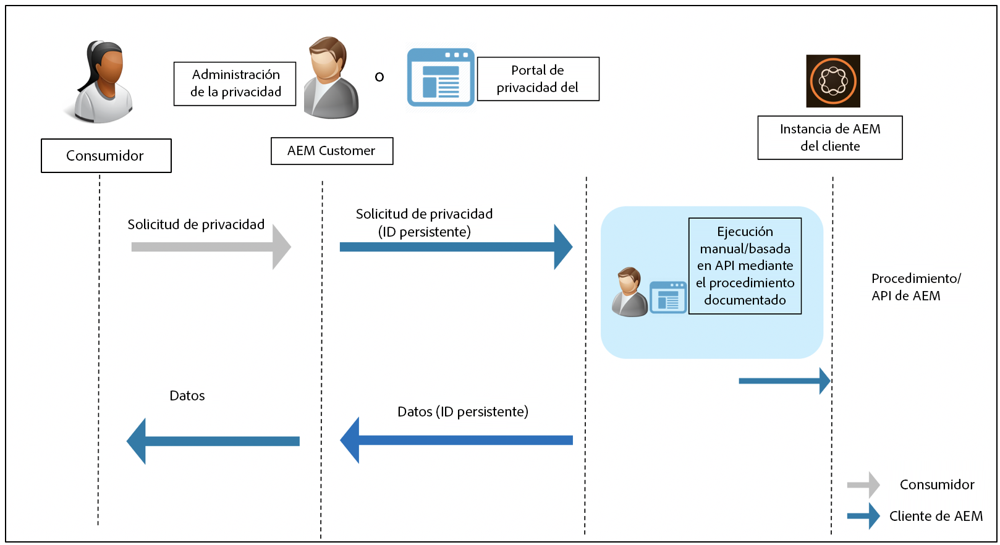

# Preparación de Adobe Experience Manager as a Cloud Service para la protección de datos y las normas de privacidad de datos {#aem-readiness-for-data-protection-and-data-privacy-regulations}

>[!WARNING]
>
>El contenido de este documento no constituye asesoramiento jurídico y no está pensado para sustituirlo.
>
>Consulte con el departamento legal de su empresa para obtener asesoramiento sobre los reglamentos de protección de datos y privacidad de datos.

>[!NOTE]
>
>Para obtener más información sobre las respuestas de Adobe a problemas de privacidad y lo que estas respuestas significan para usted como cliente de Adobe, consulte [Centro de privacidad de Adobe](https://www.adobe.com/es/privacy.html).

Para ayudar a los clientes de Adobe a cumplir con estas regulaciones, el Adobe AEM de proporciona documentación y procedimientos (con API cuando están disponibles) para los administradores de privacidad del cliente y los administradores de la administración de la privacidad del cliente, a saber:

* La documentación ayuda a los administradores a gestionar las solicitudes de protección de datos y de privacidad de datos.
* Los procedimientos documentados permiten a los clientes ejecutar las solicitudes reglamentarias manualmente o realizar llamadas de API, cuando estén disponibles, desde un portal o servicio externo.

>[!CAUTION]
>
>Los detalles documentados aquí están restringidos a Adobe Experience Manager as a Cloud Service.
>
>Los datos de otro servicio bajo demanda de Adobe, junto con cualquier solicitud de privacidad relacionada, requieren que se realicen acciones en ese servicio.
>
>Para obtener más información, consulte [Centro de privacidad de Adobe](https://www.adobe.com/es/privacy.html).

## Introducción {#introduction}

Las instancias de Adobe Experience Manager as a Cloud Service, y las aplicaciones que se ejecutan en ellas, son propiedad de los clientes de Adobe y son operadas por ellos.

Como consecuencia, las regulaciones de protección de datos, como el RGPD, la CCPA y otras, son en gran medida responsabilidad de los clientes.

Como breve introducción, las regulaciones para la privacidad y protección de datos incluyen nuevas reglas a las que deben seguir las funciones de:

* Entidades comerciales (CCPA) y/o controladores de datos (RGPD)

* Proveedores de servicios (CCPA) o procesadores de datos (RGPD)

Las principales disposiciones de esos reglamentos son las siguientes:

1. Definición ampliada de datos personales para incluir todos los ID únicos; como en datos directa e indirectamente identificables.

2. Fortalecimiento de los requisitos de consentimiento.

3. Mayor enfoque a los derechos de eliminación (eliminación de datos).

4. Exclusión de la venta de datos.

Para Adobe Experience Manager as a Cloud Service:

* Las instancias, y las aplicaciones que se ejecutan en ellas, son propiedad del cliente y las gestiona.

   * La propiedad significa que el cliente gestiona de forma eficaz las funciones regulatorias, incluidas las entidades del negocio y el proveedor de servicios, el controlador de datos y el procesador de datos, entre otras.

   * Adobe Experience Platform Privacy Service AEM no forma parte del flujo de trabajo para la creación de informes, como se ilustra en el diagrama siguiente.

* AEM incluye documentación y procedimientos para el administrador de privacidad del cliente o el administrador de AEM para ejecutar las solicitudes de regulación de privacidad; manualmente o a través de API, cuando esté disponible.

* No se ha agregado ningún servicio ni interfaz de usuario nuevos.

   * En su lugar, los procedimientos y las API están documentados para su uso por las IU o portales de los clientes que administran solicitudes de regulación de la privacidad.

* AEM no incluye ninguna herramienta predeterminada para admitir el flujo de trabajo de solicitudes de privacidad.

   * Adobe AEM proporciona documentación y procedimientos para el administrador de privacidad, administrador de privacidad o ambos del cliente, lo que les permite ejecutar manualmente las solicitudes relacionadas con las normas de privacidad.

El Adobe de proporciona procedimientos para administrar solicitudes de privacidad relacionadas con Acceso, Eliminación y Exclusión de Adobe Experience Manager as a Cloud Service. En algunos casos, hay API disponibles a las que se puede llamar desde un portal desarrollado por el cliente o secuencias de comandos para ayudar con la automatización.

El diagrama siguiente ilustra el aspecto que podría tener un flujo de trabajo de solicitud de privacidad (ilustrado con Adobe Experience Manager 6.5):

## Adobe Experience Manager as a Cloud Service y preparación regulatoria {#aem-as-a-cloud-service-and-regulatory-readiness}

AEM Consulte las secciones siguientes para obtener documentación reglamentaria sobre las áreas de producto de la as a Cloud Service.

## Adobe Experience Manager as a Cloud Service Foundation {#aem-foundation}

Consulte la [Preparación de AEM Foundation para la protección de datos y normas de privacidad de datos](/help/compliance/data-privacy-and-protection-readiness/foundation-readiness.md).

## Sitios de Adobe Experience Manager as a Cloud Service {#aem-sites}

Consulte la [Preparación de AEM Sites para la protección de datos y las normas de privacidad de datos](/help/compliance/data-privacy-and-protection-readiness/sites-readiness.md)

## Integración de Adobe Experience Manager as a Cloud Service con Adobe Target y Adobe Analytics {#aem-integration-with-adobe-target-adobe-analytics}

Las integraciones de Adobe Experience Manager as a Cloud Service con Adobe Target y Adobe Analytics se implementan con servicios preparados para la protección de datos y la privacidad (por ejemplo, RGPD). No se almacenan datos personales de Adobe Target o Adobe Analytics en AEM en relación con las integraciones.
Para obtener más información, consulte:

* [Adobe Target: Información general de privacidad](https://experienceleague.adobe.com/docs/target-dev/developer/implementation/privacy/cmp-privacy-and-general-data-protection-regulation.html)

* [Flujo de trabajo de privacidad de datos de Adobe Analytics](https://experienceleague.adobe.com/docs/analytics/admin/admin-tools/data-governance/an-gdpr-workflow.html)
