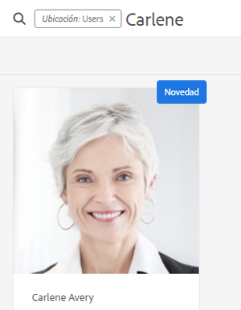
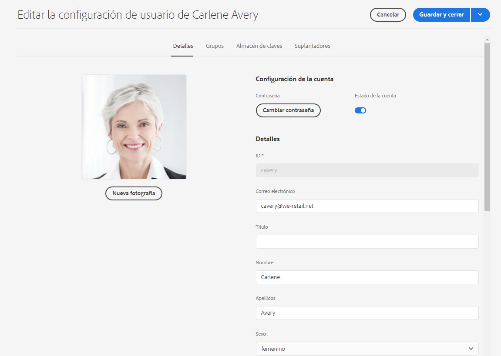
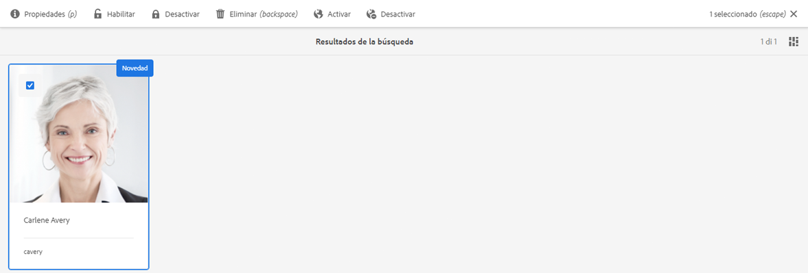
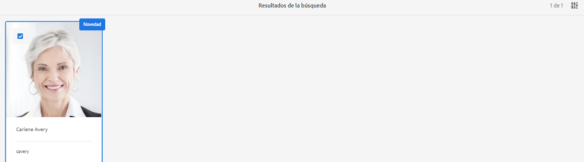

# Preparación de Adobe Experience Manager as a Cloud Service Foundation para los reglamentos de protección de datos y privacidad de datos {#aem-foundation-readiness-for-data-protection-and-data-privacy-regulations}

>[!WARNING]
>
>El contenido de este documento no constituye asesoramiento jurídico y no está pensado para sustituirlo.
>
>Consulte con el departamento legal de su empresa para obtener asesoramiento sobre los reglamentos de protección y privacidad de datos.

>[!NOTE]
>
>Para obtener más información acerca de la respuesta de Adobe a los problemas de privacidad y lo que esto supone para usted como cliente o clienta de Adobe, consulte el [Centro de privacidad de Adobe](https://www.adobe.com/es/privacy.html).

## Soporte para la protección y privacidad de datos de AEM Foundation {#aem-foundation-data-privacy-and-protection-support}

En el nivel de AEM Foundation, los datos personales almacenados se mantienen en el perfil del usuario. Por lo tanto, la información de este artículo se refiere principalmente a cómo acceder y eliminar perfiles de usuario para atender las solicitudes de acceso y eliminación respectivamente.

## Acceso a un perfil de usuario {#accessing-a-user-profile}

### Pasos manuales {#manual-steps}

1. Abra la consola Administración de usuarios navegando hasta **[!UICONTROL Herramientas - Seguridad - Usuarios]** o directamente a `https://<serveraddress>:<serverport>/security/users.html`

<!--
   
-->

1. A continuación, busque el usuario en cuestión escribiendo su nombre en la barra de búsqueda situada en la parte superior de la página:

   

1. Por último, abra el perfil de usuario haciendo clic en él y, a continuación, mire en la pestaña **[!UICONTROL Detalles]**.

   

### API HTTP {#http-api}

Como ya se ha mencionado, Adobe proporciona las API para acceder a los datos de usuario, para facilitar la automatización. Existen varios tipos de API que puede utilizar:

**API UserProperties**

```shell
curl -u user:password http://localhost:4502/libs/granite/security/search/profile.userproperties.json\?authId\=cavery
```

**API Sling**

**Descubrimiento del inicio del usuario:**

```xml
curl -g -u user:password 'http://localhost:4502/libs/granite/security/search/authorizables.json?query={"condition":[{"named":"cavery"}]}'
     {"authorizables":[{"type":"user","authorizableId_xss":"cavery","authorizableId":"cavery","name_xss":"Carlene Avery","name":"Carlene Avery","home":"/home/users/we-retail/DSCP-athB1NYLBXvdTuN"}],"total":1}
```

**Recuperación de datos de usuario:**

Uso de la ruta del nodo desde la propiedad del inicio de la carga útil JSON devuelta desde el comando anterior:

```shell
curl -u user:password  'http://localhost:4502/home/users/we-retail/DSCP-athB1NYLBXvdTuN/profile.-1.json'
```

```shell
curl -u user:password  'http://localhost:4502/home/users/we-retail/DSCP-athB1NYLBXvdTuN/profiles.-1.json'
```

## Desactivación de un usuario y eliminación de los perfiles asociados {#disabling-a-user-and-deleting-the-associated-profiles}

### Desactivación de un usuario {#disable-user}

1. Abra la consola Administración de usuarios y busque el usuario en cuestión, tal como se ha descrito anteriormente.
2. Pase el puntero por encima del usuario y haga clic en el icono de selección. El perfil se vuelve gris para indicar que está seleccionado.

3. En el menú superior, haga clic en **Deshabilitar** para desactivar al usuario:

   

4. Finalmente, confirme la acción.

   La interfaz de usuario indica que la cuenta de usuario se ha desactivado: se atenúa y se agrega un candado a la tarjeta del perfil.

   

### Eliminación de información del perfil de usuario {#delete-user-profile-information}

>[!NOTE]
>
>Para AEM as a Cloud Service no hay ningún procedimiento manual disponible en la IU para la eliminación de un perfil de usuario, ya que CRXDE no es accesible.

### API del HTTP {#http-api-1}

Los siguientes procedimientos utilizan la herramienta de línea de comandos `curl` para ilustrar cómo deshabilitar al usuario con la **[!UICONTROL captura]** `userId` y eliminar sus perfiles disponibles en la ubicación predeterminada.

**Descubrimiento del inicio del usuario:**

```shell
curl -g -u user:password 'http://localhost:4502/libs/granite/security/search/authorizables.json?query={"condition":[{"named":"cavery"}]}'
     {"authorizables":[{"type":"user","authorizableId_xss":"cavery","authorizableId":"cavery","name_xss":"Carlene Avery","name":"Carlene Avery","home":"/home/users/we-retail/DSCP-athB1NYLBXvdTuN"}],"total":1}
```

**Desactivación del usuario:**

Uso de la ruta del nodo desde la propiedad del inicio de la carga útil JSON devuelta desde el comando anterior:

```shell
curl -X POST -u user:password -FdisableUser="describe the reasons for disabling this user (Data Privacy in this case)" 'http://localhost:4502/home/users/we-retail/DSCP-athB1NYLBXvdTuN.rw.userprops.html'
```

**Eliminación de perfiles de usuario**

Usando la ruta del nodo desde la propiedad del inicio de la carga útil JSON devuelta desde el comando de detección de cuentas y las ubicaciones de nodos de perfil conocidas fuera de cuadro:

```shell
curl -X POST -u user:password -H "Accept: application/json,**/**;q=0.9" -d ':operation=delete' 'http://localhost:4502/home/users/we-retail/DSCP-athB1NYLBXvdTuN/profile'
```

```shell
curl -X POST -u user:password -H "Accept: application/json,**/**;q=0.9" -d ':operation=delete' 'http://localhost:4502/home/users/we-retail/DSCP-athB1NYLBXvdTuN/profile'
```
