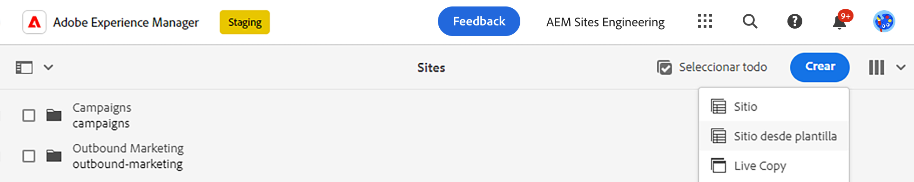
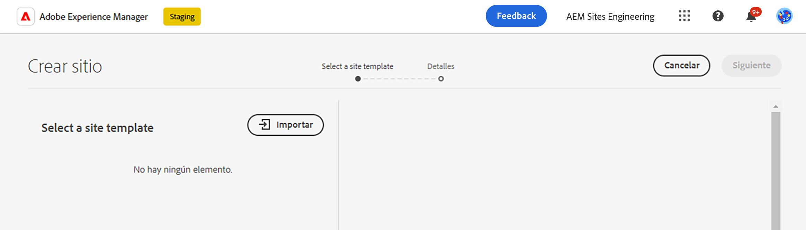
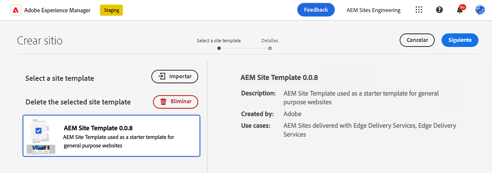
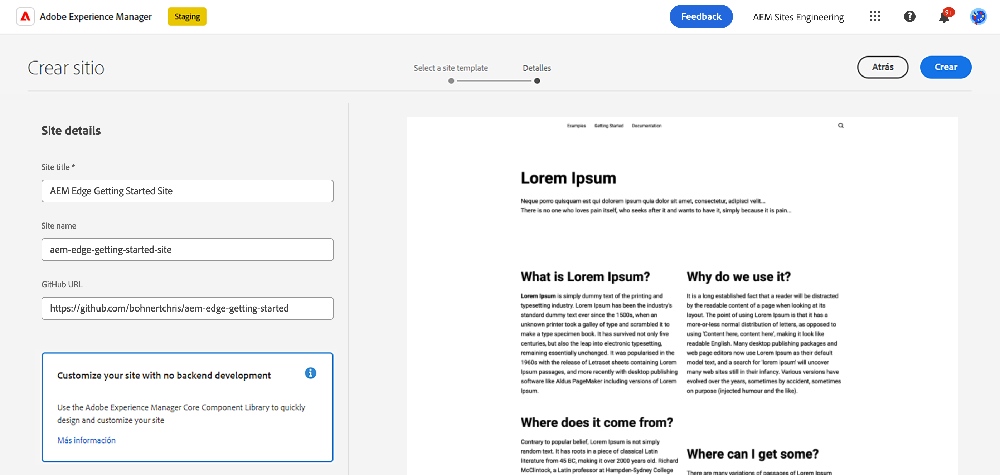
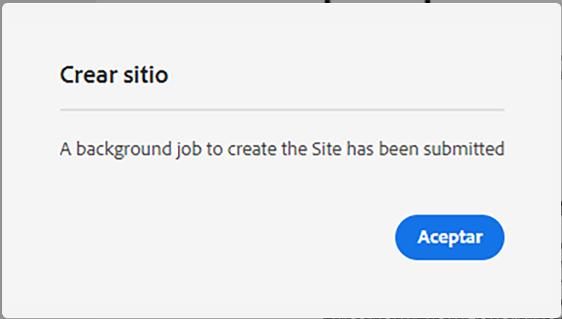
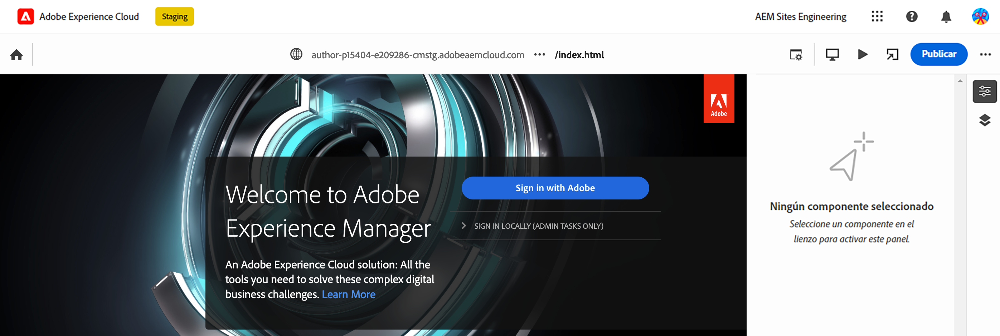
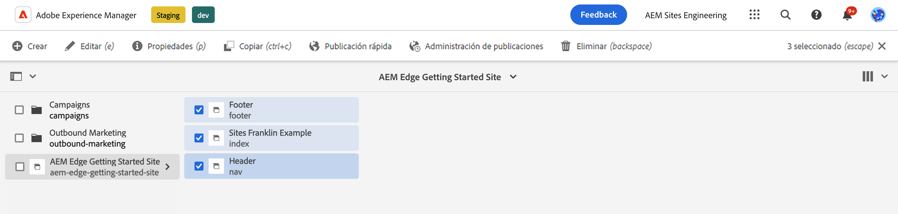
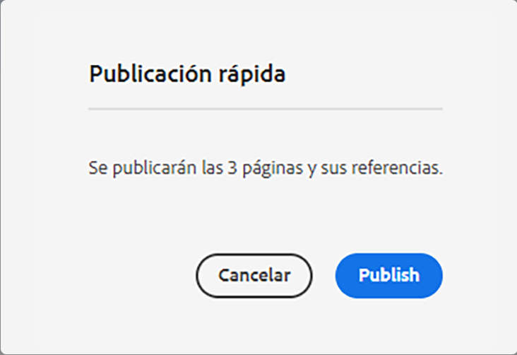

# Guía de introducción para desarrolladores para la creación de contenido de AEM con Edge Delivery Services {#edge-dev-getting-started}

Esta guía le ayudará a ponerse en marcha con un nuevo sitio de Adobe Experience Manager que utiliza Edge Delivery Services y el Editor universal para la creación de contenido.

## Requisitos previos {#prerequisites}

Antes de comenzar esta guía, debe estar familiarizado con los conceptos básicos de y tener acceso a los Edge Delivery Services, incluidos los siguientes:

* Ha completado el [Tutorial del servicio de envío de Edge.](/help/edge/developer/tutorial.md)
* Tiene acceso a una [Zona protegida de AEM Cloud Service.](/help/implementing/cloud-manager/getting-access-to-aem-in-cloud/introduction-sandbox-programs.md)
* Ha [habilitado el Editor universal en el mismo entorno de zona protegida.](/help/implementing/universal-editor/getting-started.md)

## Elija el editor adecuado {#editor-choice}

AEM ofrece dos editores de contenido diferentes y la elección de cuál utilizar depende de su situación.

* **Editor universal**: Esta debe ser la opción predeterminada para los nuevos sitios.
* **Editor de página de AEM**: debe elegirse para una migración de AEM Sites existente a Edge Delivery Services.

Esta guía se centra en los proyectos AEM en Edge Delivery Services que utilizan el Editor universal. Ver el documento [Uso de Edge Delivery Services AEM con](/help/edge/using.md) AEM para obtener más información sobre cómo elegir el editor adecuado y la migración de los sitios de la existentes a los Edge Delivery Services.

## Conceptos principales al desarrollar para Edge Delivery Services {#core-concepts}

Edge Delivery Services se basa en el concepto de bloques. AEM incluye una completa biblioteca de bloques predefinidos, que se puede ampliar para satisfacer las necesidades de cada proyecto.  El código de los proyectos de Edge Delivery Services se administra en GitHub.

### Bloques {#blocks}

Los bloques son la parte más fundamental de una página que envían los Edge Delivery Services. Un bloque encapsula el estilo y el código que impulsa un componente lógico de una página de contenido.

AEM proporciona bloques estándar como parte del producto dentro del elemento repetitivo del proyecto. Estos bloques incluyen encabezados, texto, imágenes, vínculos, listas, etc.

>[!TIP]
>
>Consulte la documentación de la [sección Versión](/help/edge/developer/block-collection.md) de Edge Delivery Services para obtener más información sobre los bloques y cómo desarrollar para los servicios de Edge Delivery.

### Edge Delivery Services y GitHub {#github-edge}

Edge Delivery aprovecha GitHub para que pueda administrar e implementar código directamente desde su repositorio de GitHub. 

Los autores pueden crear contenido mediante la creación basada en documentos o contenidos en AEM con el editor universal. Los desarrolladores pueden personalizar la funcionalidad del sitio utilizando CSS y JavaScript en GitHub, independientemente de cómo creen el contenido los autores.

Los sitios web se crean automáticamente para cada una de las ramas, desde la previsualización de contenido hasta la producción. Todos los recursos que introduce en el repositorio de GitHub están disponibles en el sitio web sin un proceso de compilación.

>[!TIP]
>
>Consulte la documentación de la [sección Versión](/help/edge/developer/block-collection.md) de Edge Delivery Services para obtener más información sobre los bloques y cómo desarrollar para los servicios de Edge Delivery.

## Introducción a la creación con AEM y Edge Delivery Services {#getting-started}

Una vez que haya completado [los requisitos previos](#prerequisites) y haya hecho [la elección de utilizar el Editor universal,](#editor-choice) puede empezar con su propio proyecto.

### Creación de un proyecto de GitHub {#create-github-project}

En primer lugar, deberá crear un nuevo proyecto en GitHub, basado en la plantilla de Adobe.

1. Vaya a [`https://github.com/adobe-rnd/aem-boilerplate-xwalk`](https://github.com/adobe-rnd/aem-boilerplate-xwalk) y haga clic en **Usar esta plantilla** y seleccione **Creación de un nuevo repositorio**.

   * Deberá iniciar sesión en GitHub para ver esta opción.

   

1. De forma predeterminada, se le asignará el repositorio. Cambie esto según sea necesario, proporcione un nombre y una descripción del repositorio y haga clic en **Crear repositorio**.

   

1. En una nueva pestaña del mismo explorador, navegue hasta [`https://github.com/apps/aem-code-sync`](https://github.com/apps/aem-code-sync) y haga clic en **Configurar**.

   

1. Haga clic en **Configurar** para la organización en la que creó el nuevo repositorio en el paso anterior.

   

1. En la página de GitHub de sincronización de código de AEM, en **Acceso al repositorio**, seleccione **Seleccionar solo repositorios**, seleccione el repositorio que creó en el paso anterior y, a continuación, haga clic en **Guardar**.

   

1. Una vez instalada la sincronización de código de AEM, recibirá una pantalla de confirmación. Vuelva a la pestaña del explorador del nuevo repositorio.

   

1. Haga clic en el archivo `fstab.yaml` para abrirlo y, a continuación, el icono **Editar este archivo** para editarlo.

   

1. Edite el archivo `fstab.yaml` para actualizar el punto de montaje del proyecto. Reemplace la URL predeterminada de Google Docs por la URL de la instancia de creación de AEM as a Cloud Service y, a continuación, haga clic en **Confirmar cambios...**.

   * `https://<aem-author>/bin/franklin.delivery/<owner>/<repository>/main`
   * Cambiar el punto de montaje indica a los Edge Delivery Services dónde encontrar el contenido del sitio.

   

1. Añada un mensaje de compromiso como desee y haga clic en **Confirmar cambios**, comprometiéndolos directamente con la rama `main`.

   

1. Vuelva a la raíz del repositorio y haga clic en `paths.json` y luego en el icono **Editar este archivo**.

   

1. La asignación predeterminada utiliza el nombre del repositorio. Actualice la asignación predeterminada según sea necesario para el proyecto con `/content/<site-name>/:/` y haga clic en **Confirmar cambios...**.

   * Proporcione sus propios `<site-name>`. Lo necesitará en un paso posterior.
   * Las asignaciones indican a los Edge Delivery Services cómo asignar el contenido del repositorio de AEM a la dirección URL del sitio.

   

1. Añada un mensaje de confirmación si lo desea y haga clic en **Confirmar cambios**, confirmándolos directamente en la rama `main`.

   

### Crear y editar un nuevo sitio de AEM {#create-aem-site}

Ahora que tiene un proyecto de GitHub, debe crear un nuevo sitio que el proyecto pueda utilizar.

>[!NOTE]
>
>Para editar el sitio con el editor universal, debe utilizar un explorador basado en Chromium.

1. AEM Descargue la última plantilla del sitio Creación de segmentos con Edge Delivery Services de GitHub en [`https://github.com/adobe-rnd/aem-boilerplate-xwalk`](https://github.com/adobe-rnd/aem-boilerplate-xwalk).

1. Inicie sesión en la instancia de creación de AEM as a Cloud Service, vaya a la consola Sitios y pulse o haga clic en **Crear** -> **Sitio a partir de una plantilla**.

   

1. En la pestaña **Seleccionar una plantilla del sitio** en el asistente para crear sitio, haga clic en el botón **lmportar** para importar una plantilla nueva.

   

1. Cargue la plantilla del sitio Creación de AEM con Edge Delivery Services proporcionada por Adobe Engineering.

   * La plantilla solo debe cargarse una vez. Una vez cargado, puede reutilizarse para crear sitios adicionales.

1. Una vez importada la plantilla, aparecerá en el asistente. Haga clic o pulse para seleccionarla y, a continuación, pulse o haga clic en **Siguiente**.

   

1. Proporcione los siguientes campos y pulse o haga clic en **Crear**.

   * **Título del sitio**: añada un título descriptivo para el sitio.
   * **Título del sitio**: utilice el `<site-name>` que definió en el [paso anterior.](#create-github-project)
   * **URL de GitHub**: utilice la dirección URL del proyecto de GitHub que creó en el paso anterior.

   

1. AEM confirma la creación del sitio con un cuadro de diálogo. Haga clic o pulse **OK** para descartar.

   

1. En la consola de sitios, vaya al archivo `index.html` y pulse o haga clic en **Editar** en la barra de herramientas.

   

1. El editor universal se abre en una nueva pestaña. Es posible que tenga que pulsar o hacer clic en **Iniciar sesión con Adobe** para autenticarse y editar su página.

   

Ahora puede editar el sitio usando el editor universal. Consulte la [documentación del editor universal](/help/sites-cloud/authoring/universal-editor/authoring.md) para obtener más información.

### Publicación del nuevo sitio {#publishing}

Una vez que haya terminado de editar el nuevo sitio con el editor universal, puede publicar el contenido.

1. En la consola de sitios, seleccione todas las páginas que creó para el nuevo sitio y pulse o haga clic en **Publicación rápida** en la barra de herramientas.

   

1. Pulse o haga clic en **Publicar** en el cuadro de diálogo de confirmación para iniciar el proceso.

   

1. Abra una nueva pestaña en el mismo explorador y vaya a la dirección URL del nuevo sitio.

   * `https://main--<site-name>--<owner>.hlx.page`

1. Vea el contenido publicado.

   

## Pasos siguientes {#next-steps}

AEM Ahora que tiene un proyecto de creación de proyectos de Edge Delivery Services en funcionamiento, puede empezar a crear y aplicar estilos a sus propios bloques.

Consulte la guía [Creación de bloques instrumentados para su uso con el editor universal](/help/edge/aem-authoring/create-block.md) para obtener más información.

>[!TIP]
>
>Para obtener una guía completa sobre la creación de un nuevo proyecto de Edge Delivery Services AEM AEM habilitado para la creación de contenido con el fin de crear un grupo de usuarios con el fin de crear un grupo de usuarios con el fin de crear un grupo de usuarios que esté as a Cloud Service para la creación de contenido, vea la sección [AEM Este seminario web de GEM de la.](https://experienceleague.adobe.com/en/docs/events/experience-manager-gems-recordings/gems2024/aem-authoring-and-edge-delivery)

