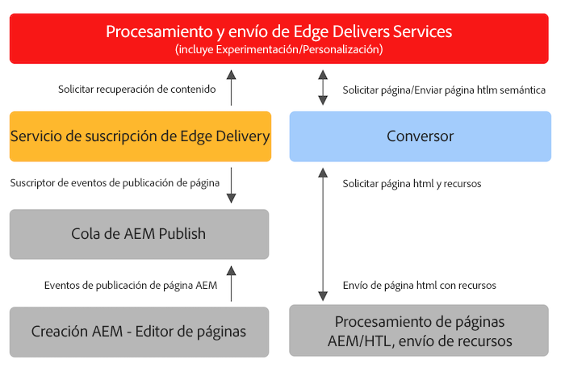

# Uso de Edge Delivery Services con proyectos AEM existentes {#existing-projects}

No es necesario esperar a tener un nuevo proyecto AEM para beneficiarse de Edge Delivery Services.  Edge Delivery Services se puede integrar en su proyecto AEM existente para que pueda aprovechar inmediatamente sus mejoras de rendimiento.

## Limitaciones del editor de páginas de AEM {#page-editor}

Antes de la llegada de Edge Delivery Services, el contenido gestionado en AEM se editaba con el editor de páginas de AEM. Si el proyecto comenzó antes de la introducción de los Edge Delivery Services, es casi seguro que está utilizando el editor de páginas.

El editor de páginas de AEM solo funciona con [componentes de AEM](/help/implementing/developing/components/overview.md) como los [componentes principales.](https://experienceleague.adobe.com/docs/experience-manager-core-components/using/introduction.html?lang=es) Estos componentes son incompatibles con Edge Delivery Services. Debido a esto, son necesarias dos fases para introducir Edge Delivery Services en un proyecto de AEM existente:

* [Fase 1: Reemplazar el front-end](#replace-front-end)
* [Fase 2: Cambiar al editor universal](#switch-ue)

## Fase 1: Reemplazar el front-end {#replace-front-end}

En la fase uno, puede seguir utilizando la estructura, los componentes y las herramientas de creación existentes del sitio de AEM. El procesamiento del sitio web se reconstruirá utilizando bloques con JavaScript y CSS y se enviará a través de Edge Delivery Services.

Consulte la [sección Versión](/help/edge/developer/block-collection.md) de la documentación de Edge Delivery Services para obtener más información sobre los bloques y cómo desarrollarlos para Edge Delivery Services.

Se necesitará un convertidor en el generador de aplicaciones para convertir la salida del HTML procesado de AEM y enviarla a Edge Delivery Services.

La fase dos completa el proceso al eliminar la superposición de tecnología: componentes principales de AEM con HTL y Java en AEM Author, bloques basados en JS en Edge Delivery y un convertidor basado en nodeJS.

## Fase 2: Cambiar al editor universal {#switch-ue}

En esta fase, el editor de páginas de AEM se sustituye por el editor universal. Dado que el editor universal puede trabajar directamente con bloques, ya no se necesitarán los componentes principales y el convertidor de AEM.

