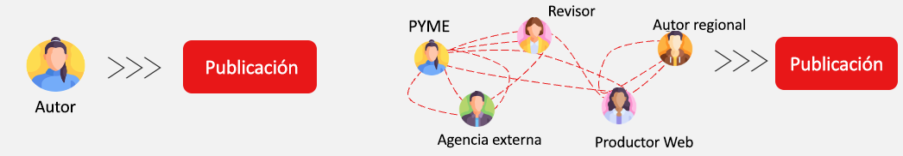
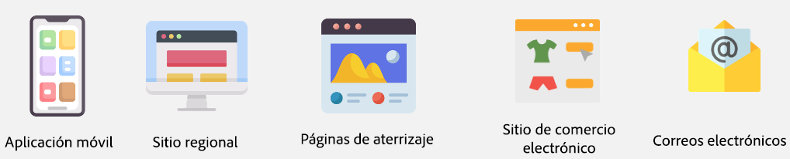
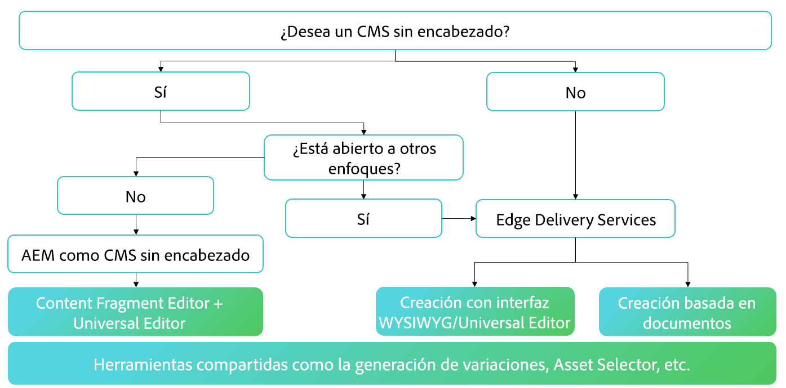
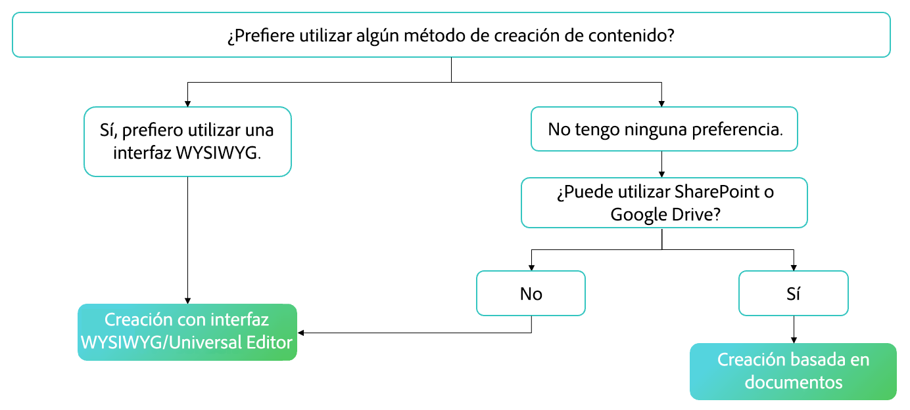

# Elección de un método de creación {#authoring-methods}

Conozca las consideraciones importantes a la hora de decidir cómo crear su contenido en AEM para ayudarle a tomar la mejor decisión para sus autores de contenido.

## Información general sobre las consideraciones que debe tener en cuenta {#overview}

La flexibilidad de AEM garantiza que sus necesidades de creación queden cubiertas independientemente de si elige la creación basada en documentos o la creación WYSIWYG. Tenga en cuenta los siguientes aspectos a la hora de tomar una decisión.

* **Incluya siempre a sus autores de contenido en la toma de decisiones.**: los autores de contenido son sus expertos y su conocimiento es vital.
* **Se pueden implementar múltiples métodos de creación.**: aunque Adobe recomienda empezar de forma sencilla e ir añadiendo complejidad a medida que surja la necesidad, varios métodos de creación pueden funcionar juntos en un mismo proyecto.
* **Siempre puede cambiar su método de creación a posteriori.**: decida lo que decida, seguirá teniendo la opción de cambiar de método. El cambio de un método a otro es sencillo con la ayuda de las herramientas de migración automatizada de Adobe.
* **Esta decisión no es necesario hacerla antes de la implementación, sino que forma parte de la misma.**: AEM es un producto unificado, por lo que esta decisión tan importante no tiene que formar parte de las negociaciones de contratos. Cuando adquiere AEM, obtiene todos los métodos. Se trata más bien de una decisión que se lleva a cabo durante la implementación.

Adobe puede ayudarle a determinar qué método (o métodos) se ajustan mejor a sus necesidades como parte de la implementación.

## No hay una solución válida para todos {#one-size}

Cada implementación de AEM tiene sus propios flujos de trabajo y objetivos. Un proyecto puede implicar un modelo de creación simple con autores de contenido responsables de sus propias publicaciones. Mientras que otro puede tener una compleja red de colaboradores y aprobaciones.

Diferentes proyectos pueden tener diferentes (y múltiples) casos de uso.

Adobe es consciente de ello y por eso no ofrece un enfoque único para todos. AEM es una solución única que le ofrece diferentes enfoques para la entrega y creación de contenido con el fin de adaptarse mejor a sus necesidades.

Para decidir cuál es el mejor enfoque, debe tener en cuenta cuatro factores.

1. [¿Tiene alguna preferencia en cuanto a la entrega de contenido?](#content-delivery)
1. [¿Tiene alguna preferencia en cuanto a la creación de contenido?](#content-authoring)
1. [¿Cuál es el objetivo del proyecto?](#project-goals)
1. [¿A qué desafíos de creación se enfrenta en la actualidad?](#authoring-challenges)

## Preferencias de entrega de contenido {#content-delivery}

Lo primero que debe tener en cuenta es cómo quiere entregar su contenido. Edge Delivery Services ofrece sitios increíblemente rápidos, pero tal vez su enfoque esté en la entrega sin encabezado. El siguiente árbol de decisión puede ayudarle a considerar sus opciones.

Puede ayudarle a decidir si necesita lo siguiente:

* [AEM como CMS sin encabezado](/help/headless/introduction.md) utilizando el editor de fragmentos de contenido o el editor universal.
* AEM Edge Delivery Services con la [edición basada en documentos](/help/edge/docs/authoring.md) o la [creación WYSIWYG con el editor universal](/help/edge/wysiwyg-authoring/authoring.md).

## Preferencias de creación de contenido {#content-authoring}

La siguiente consideración debería ser cómo desea crear el contenido. El siguiente árbol de decisión puede ayudarle a considerar sus opciones.

Puede ayudarle a decidir si necesita lo siguiente:

* AEM Edge Delivery Services con la [edición basada en documentos](/help/edge/docs/authoring.md).
* [Creación WYSIWYG con el editor universal](/help/edge/wysiwyg-authoring/authoring.md).

## Objetivos del proyecto {#project-goals}

¿Qué significa para usted que la creación sea un éxito? ¿Qué significa para usted que su proyecto sea un éxito?

* Tal vez necesite capacitar a más personas para crear contenido, pero no quiere impartir formación sobre un nuevo conjunto de herramientas. (Este es el caso de la creación basada en documentos).
* Tal vez necesite aumentar la cantidad de contenido que genera. (Este es el caso de la creación basada en documentos).
* Tal vez necesite centrarse en el diseño del contenido visual, pero minimizar la necesidad de conocimientos de codificación. (Este es el caso de la creación WYSIWYG).

Contar con unos objetivos de proyecto claramente definidos al inicio de su implementación le ayudará a elegir con conocimiento de causa su método de creación.

## Desafíos de la creación {#authoring-challenges}

Por último, considere los desafíos específicos a los que se enfrenta hoy en día a la hora de crear su contenido.

* Tal vez tenga que duplicar el trabajo con contenido creado fuera de su CMS, que luego hay que importar o copiar y pegar. (Este es el caso de la creación basada en documentos).
* Tal vez necesite reducir el tiempo necesario para formar a los autores en el uso de un CMS. (Este es el caso de la creación basada en documentos).
* Tal vez sus autores necesiten editar a menudo el diseño visual de su contenido, lo que requiere la ayuda constante de los desarrolladores. (Este es el caso de la creación WYSIWYG).
