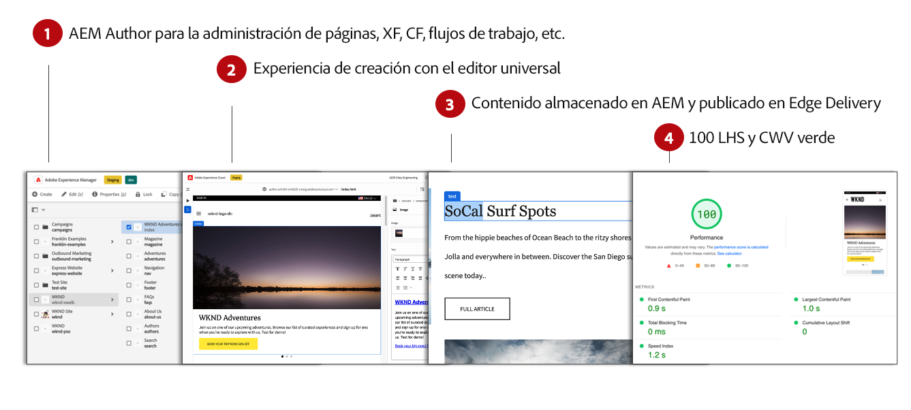
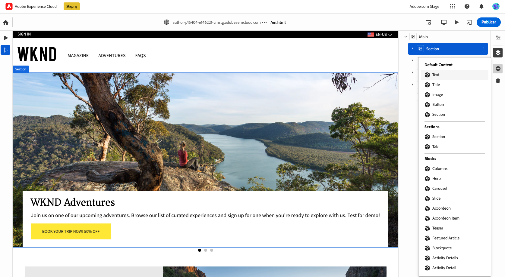
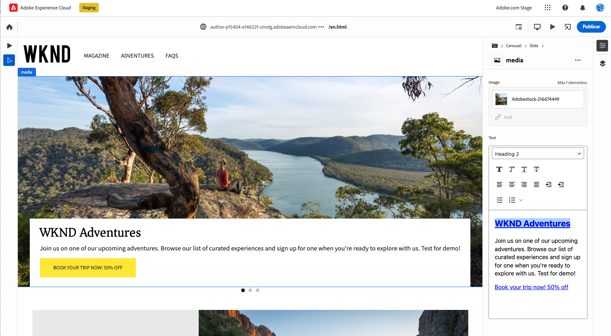

# Creación de contenido para Edge Delivery Services {#authoring-edge}

Con los Edge Delivery Services, la creación es fácil, rápida y flexible. Tiene dos opciones para crear contenido para Edge Delivery Services:

* [Creación basada en documentos](#document-based) - Como Microsoft Word o Google Docs
* [Editor universal](#universal-editor) AEM - Una interfaz de usuario moderna para crear contenido dentro de la

## Creación basada en documentos {#document-based}

En el caso de la creación basada en documentos, puede trabajar con una variedad de fuentes, como Microsoft Word y Google Docs. Los documentos de estas fuentes se convierten en páginas del sitio web. Encabezados, listas, imágenes, elementos de fuente, vídeos se pueden transferir desde la fuente inicial a su sitio web. Puede añadir metadatos con fines de SEO o utilizar bloques para trabajar con contenido estructurado y añadir funcionalidad.

Para obtener más información sobre la creación basada en documentos, consulte [este documento se encuentra en la documentación de Edge Delivery Services.](/help/edge/docs/authoring.md)

## Creación del editor universal {#universal-editor}

Cuando se utilizan Edge Delivery Services AEM con as a Cloud Service AEM, el hecho más fundamental para comprender es que el contenido que crea persiste en el as a Cloud Service de la.

1. [AEM El entorno de creación de](/help/sites-cloud/authoring/getting-started/quick-start.md) se utiliza para la administración de contenido, como la creación de nuevas páginas, fragmentos de experiencias, fragmentos de contenido, etc.
   * AEM Todas las funciones de la están disponibles, como flujos de trabajo, MSM, traducción, lanzamientos, etc.
1. [El editor universal](/help/implementing/universal-editor/authoring.md) AEM se utiliza para crear el contenido gestionado en el.
   * El editor universal ofrece una interfaz de usuario nueva y moderna para la creación de contenido.
   * AEM Para la creación, procesa el HTML, pero incluye los scripts, estilos, iconos y otros recursos de los Edge Delivery Services.
   * AEM Aunque se utiliza el Editor universal, todos los cambios persisten hasta el momento de la creación de la.
   * AEM AEM El editor universal aún no tiene paridad de características con el editor de páginas de la página de la y es posible que algunas características no estén disponibles en el editor universal.
1. AEM El contenido que crea con el editor universal y persiste en la publicación se publica a los Edge Delivery Services de la aplicación.
   * AEM El contenido permanece almacenado en la.
   * AEM El HTML semántico de procesamientos de datos que se necesita para la ingesta de datos se procesa de forma incorrecta.
   * El contenido se publica para los Edge Delivery Services.
1. [Edge Delivery Services](/help/edge/developer/keeping-it-100.md) Asegúrate de una puntuación del 100% en Lighthouse.

Los bloques son componentes fundamentales de una página que envían los Edge Delivery Services. Los autores pueden elegir entre bloques predeterminados proporcionados como estándar por Adobe o entre bloques personalizados para su proyecto por los desarrolladores.

El editor universal proporciona una interfaz gráfica de usuario moderna e intuitiva para crear su contenido arrastrando y soltando bloques.

Los detalles de los bloques se pueden configurar en el carril Propiedades.

Para obtener más información sobre cómo crear contenido con el editor universal, consulte el documento [Creación de contenido con el editor universal.](/help/implementing/universal-editor/authoring.md)

## Cómo empezar a trabajar {#how-to-get-started}

Póngase en contacto con el representante del Adobe para obtener acceso a esta función.
