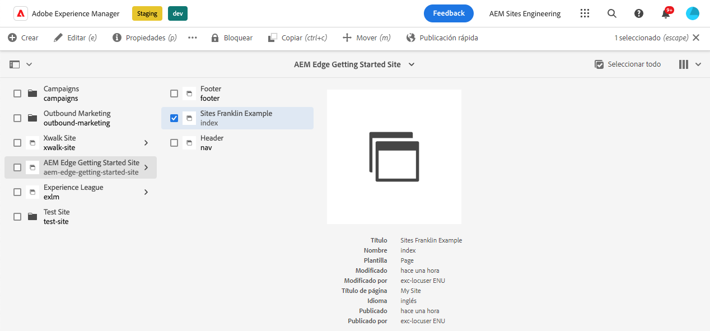
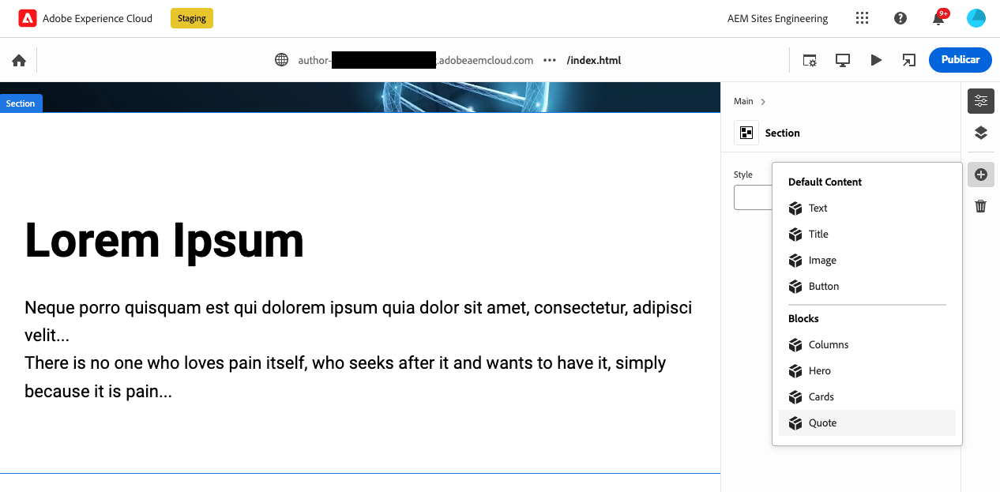
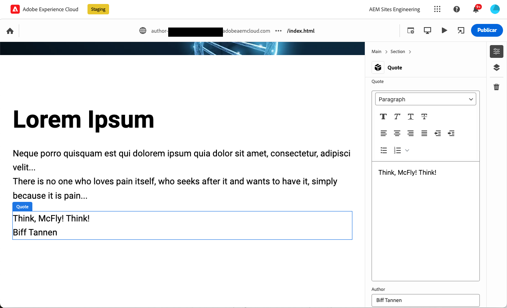
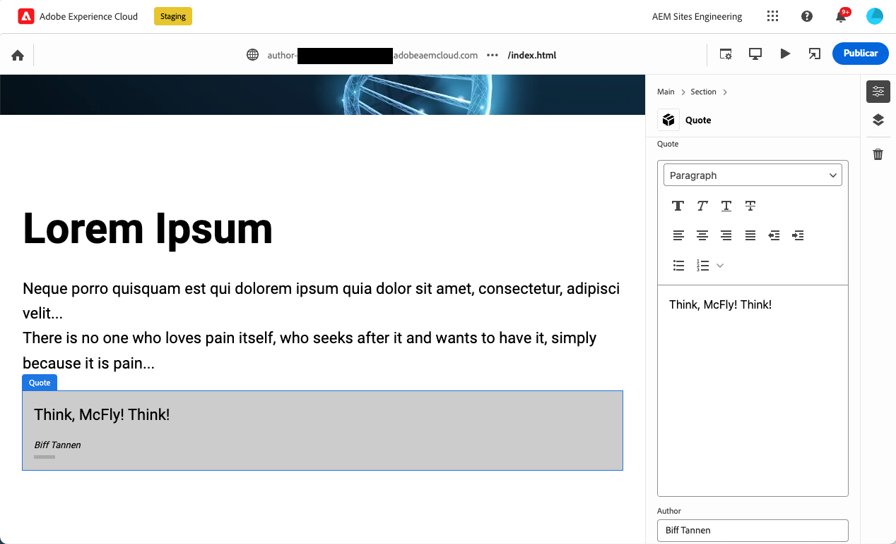

# Creación de bloques instrumentados para su uso con el editor universal {#create-block}

AEM Aprenda a crear bloques instrumentados para utilizarlos con el editor universal en la creación de proyectos de Edge Delivery Services de la creación de la.

{{aem-authoring-edge-early-access}}

## Requisitos previos {#prerequisites}

AEM Esta guía proporciona instrucciones paso a paso para crear bloques instrumentados para el Editor universal en la creación de proyectos de Edge Delivery Services de la creación de la aplicación de la manera más rápida y eficaz. Abarca la adición de componentes, la carga de definiciones de componentes en el editor universal, la publicación de páginas, la implementación de decoración y estilos de bloque, la introducción de los cambios en la producción y su verificación. Al completar esta guía, puede crear e implementar un nuevo bloque para su propio proyecto.

AEM Esta guía requiere necesariamente conocimientos existentes sobre la creación de proyectos con Edge Delivery Services, así como sobre la creación de proyectos con el Editor universal de. Antes de comenzar esta guía, ya debería tener acceso a los Edge Delivery Services y estar familiarizado con sus conceptos básicos, incluidos los siguientes:

* Ha completado la [Tutorial del servicio de envío de Edge.](/help/edge/developer/tutorial.md)
* Tiene acceso a un [Zona protegida de AEM Cloud Service.](/help/implementing/cloud-manager/getting-access-to-aem-in-cloud/introduction-sandbox-programs.md)
* Tiene [se habilitó el editor universal en el mismo entorno de zona protegida.](/help/implementing/universal-editor/getting-started.md)
* Ha completado la [AEM Guía de introducción para desarrolladores para la creación de contenido con Edge Delivery Services en la creación de](/help/edge/edge-dev-getting-started.md) guía.

Esta guía se basa en el trabajo realizado en [AEM Guía de introducción para desarrolladores para la creación de contenido con Edge Delivery Services en la creación de](/help/edge/edge-dev-getting-started.md) guía.

## Adición de un nuevo bloque al proyecto {#add-block}

En esta guía, creará un bloque para procesar una cita memorable en su página.

Para simplificar este ejemplo, se realizan todos los cambios en el `main` rama del repositorio del proyecto. Por supuesto, para su proyecto real, [debe seguir las prácticas recomendadas de desarrollo](https://www.aem.live/docs/dev-collab-and-good-practices) desarrollando en una rama diferente y revisando todos los cambios mediante una solicitud de extracción antes de fusionar en `main`.

Adobe recomienda desarrollar bloques en un enfoque de tres fases:

1. Cree la definición y el modelo para el bloque, revíselo y llevelo a producción.
1. Cree contenido con el nuevo bloque.
1. Implemente la decoración y los estilos para el nuevo bloque.

El siguiente ejemplo de bloque de comillas sigue este enfoque.

### Crear definición y modelo de bloque {#create-block-model}

1. Clone el proyecto de GitHub localmente que ha creado en [AEM Guía de introducción para desarrolladores para la creación de contenido con Edge Delivery Services en la creación de](/help/edge/edge-dev-getting-started.md) y ábrala en un editor de su elección.

   * El código Microsoft se utiliza aquí con fines ilustrativos.

   

1. Edite el `component-definition.json` en la raíz del proyecto, agregue la siguiente definición para el nuevo bloque de comillas y guarde el archivo.

   ```json
   {
     "title": "Quote",
     "id": "quote",
     "plugins": {
       "xwalk": {
         "page": {
           "resourceType": "core/franklin/components/block/v1/block",
           "template": {
             "name": "Quote",
             "model": "quote",
             "quote": "<p>Think, McFly! Think!</p>",
             "author": "Biff Tannen"
           }
         }
       }
     }
   }
   ```

   

1. Edite el `component-models.json` en la raíz del proyecto y agregue lo siguiente [definición de modelo](/help/implementing/universal-editor/field-types.md#model-structure) para el nuevo bloque de presupuesto y guarde el archivo.

   * Consulte el documento [AEM Modelado de contenido para la creación de con proyectos de Edge Delivery Services](/help/edge/content-modeling.md) para obtener más información acerca de lo que es importante tener en cuenta al crear modelos de contenido.

   ```json
   {
     "id": "quote",
     "fields": [
        {
          "component": "text-area",
          "name": "quote",
          "value": "",
          "label": "Quote",
          "valueType": "string"
        },
        {
          "component": "text-input",
          "valueType": "string",
          "name": "author",
          "label": "Author",
          "value": ""
        }
      ]
   }
   ```

   

1. Edite el `component-filters.json` en la raíz del proyecto y añada el bloque de comillas al [definición de filtro](/help/implementing/universal-editor/customizing.md#filtering-components) para permitir que el bloque se añada a cualquier sección y guardar el archivo.

   ```json
   {
     "id": "section",
     "components": [
       "text",
       "image",
       "button",
       "title",
       "hero",
       "cards",
       "columns",
       "quote"
      ]
   }
   ```

   

1. Con Git, confirme estos cambios en su `main` Rama.

   * Comprometiéndose a `main` es solo para fines ilustrativos. [Seguir prácticas recomendadas](https://www.aem.live/docs/dev-collab-and-good-practices) y utilice una solicitud de extracción para el trabajo real del proyecto.

### Creación de contenido con el bloque {#create-content}

Ahora que el bloque de comillas básico está definido y comprometido con el proyecto de muestra, puede agregar un bloque de comillas a una página existente.

1. AEM En un explorador, inicie sesión en as a Cloud Service de la. [Mediante la consola Sitios,](/help/sites-cloud/authoring/getting-started/basic-handling.md) vaya al sitio que creó en la [AEM Guía de introducción para desarrolladores para la creación de contenido con Edge Delivery Services en la creación de](/help/edge/edge-dev-getting-started.md) y seleccione una página.

   * En este caso, `index` se utiliza con fines ilustrativos.

   

1. Haga clic o pulse **Editar** en la barra de herramientas de la consola y se abrirá el Editor universal.

   * Para cargar la página, es posible que tenga que tocar o hacer clic en **Iniciar sesión con el Adobe** AEM para autenticarse en el Editor universal para la autenticación de los usuarios en el Editor universal.

1. En el Editor universal, seleccione una sección. En el carril de propiedades, pulse o haga clic en **Añadir** y, a continuación, seleccione la nueva **Cita** Bloque de del menú.

   * El **Añadir** es un símbolo más.
   * Sabe que ha seleccionado una sección si el contorno azul del objeto seleccionado tiene una etiqueta **Sección**.
   * En este ejemplo, toque o haga clic ligeramente por encima de **Lorem Ipsum** heading selecciona una sección que contiene el encabezado y el texto de lorem ipsum.

   

1. La página se vuelve a cargar y el bloque de comillas se agrega al final de la sección seleccionada con el contenido predeterminado especificado en la `component-definitions.json` archivo.

   * El bloque de comillas se puede seleccionar y editar como cualquier otro bloque local o en el carril de propiedades.
   * El estilo se aplicará en un paso posterior.

   

1. Una vez que esté satisfecho con el contenido de su cotización, puede publicar la página tocando o haciendo clic en el **Publish** en la barra de herramientas del Editor universal.

1. Compruebe que el contenido se publicó navegando a la página publicada. El vínculo es similar al siguiente `https://<branch>--<repo>--<owner>.hlx.page`

   

### Aplicar estilo al bloque {#style-block}

Ahora que tiene un bloque de comillas de trabajo, puede aplicarle estilo.

1. Vuelva al editor del proyecto.

1. Crear un `quote` en la carpeta `blocks` carpeta.

   

1. En el nuevo `quote` carpeta, añadir una `quote.js` para implementar la decoración de bloques, agregue el siguiente JavaScript y guarde el archivo.

   ```javascript
   export default function decorate(block) {
     const [quoteWrapper] = block.children;
   
     const blockquote = document.createElement('blockquote');
     blockquote.textContent = quoteWrapper.textContent.trim();
     quoteWrapper.replaceChildren(blockquote);
   }
   ```

   


1. En el `quote` carpeta, añadir una `quote.css` para definir el estilo del bloque añadiendo el siguiente código CSS y guardando el archivo.

   ```css
   .block.quote {
       background-color: #ccc;
       padding: 0 0 24px;
       display: flex;
       flex-direction: column;
       margin: 1rem 0;
   }
   
   .block.quote blockquote {
       margin: 16px;
       text-indent: 0;
   }
   
   .block.quote > div:last-child > div {
       margin: 0 16px;
       font-size: small;
       font-style: italic;
       position: relative;
   }
   
   .block.quote > div:last-child > div::after {
       content: "";
       display: block;
       position: absolute;
       left: 0;
       bottom: -8px;
       height: 5px;
       width: 30px;
       background-color: darkgray;
   }
   ```

   

1. Con Git, confirme estos cambios en su `main` Rama.

   * Comprometiéndose a `main` es solo para fines ilustrativos. [Seguir prácticas recomendadas](https://www.aem.live/docs/dev-collab-and-good-practices) y utilice una solicitud de extracción para el trabajo real del proyecto.

1. Vuelva a la pestaña del explorador del editor universal donde estaba editando la página del proyecto y vuelva a cargar la página para ver el bloque con estilo.

1. Consulte el bloque de comillas con estilo actual en la página.

   

1. Compruebe que los cambios se hayan insertado en producción navegando a la página publicada. El vínculo es similar al siguiente `https://<branch>--<repo>--<owner>.hlx.page`

   

Felicitaciones. Ahora tiene un bloque de comillas completamente funcional y con estilo. Puede utilizar este ejemplo como base para diseñar sus propios bloques específicos de proyectos.

## Uso de otras ramas de trabajo {#other-branches}

Esta guía le indica que se ha comprometido directamente con el `main` Rama por el bien de la simplicidad. Para la experimentación en un repositorio de muestra, esto no suele ser un problema. Para el trabajo real del proyecto, [debe seguir las prácticas recomendadas de desarrollo](https://www.aem.live/docs/dev-collab-and-good-practices) desarrollando en una rama diferente y revisando todos los cambios mediante una solicitud de extracción antes de fusionar en `main`.

Cuando no esté desarrollando en `main` rama, puede anexar `?ref=<branch>` en la barra de ubicación del Editor universal para cargar la página desde la rama. `<branch>` es el nombre de la rama que se usaría para la vista previa del proyecto o las URL activas, p. ej. `https://<branch>--<repo>--<owner>.hlx.page`.

La publicación de contenido con un nuevo modelo solo se admite cuando el modelo se combina con el `main` Rama.
