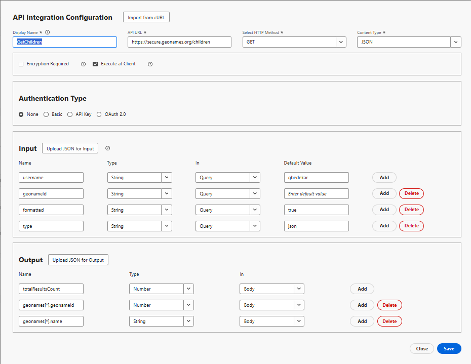

# Crear integración de API

En este tutorial, se crean 2 integraciones de API

- GetAllCountries devuelve una lista de países
- GetChildren: devuelve elementos secundarios inmediatos del país o estado representado por geonameId

## GetAllCountries - Configuración de integración de API

- Configuración de integración de API

   - Nombre para mostrar: GetAllCountries → una etiqueta para esta API en su sistema.

   - URL de API: `https://secure.geonames.org/countryInfoJSON`: el extremo al que llama.

   - Método HTTP: GET: está realizando una solicitud GET simple.

   - Tipo de contenido: JSON; la respuesta se espera en formato JSON.

- Opciones:

   - Cifrado Necesario sin marcar: sin capa de cifrado más allá de HTTPS.

   - Ejecutar en cliente comprobado: la llamada se ejecuta desde el cliente/explorador, no desde el lado del servidor.
- Tipo de autenticación
   - Ninguno: dado que la API GeoNames no requiere claves OAuth o API en los encabezados.
- Entrada:
   - La sección de entrada define lo que se envía a la API
   - **nombre de usuario** tipo de →: Cadena, enviado en la consulta, predeterminado: gbedekar.
   - Cada solicitud añade ?username=gbedekar a la dirección URL
- Salida
   - La salida define qué campos de la respuesta JSON se van a extraer y utilizar.
La respuesta de GeoNames tiene este aspecto:

  
   - Se asignaron dos campos desde dentro de la matriz geonames:

     geonames[*].geonameId → como número

     geonames[*].countryName → as a String

     [*] significa que se repite en cada país de la matriz.

## GetChildren

Solicita a GeoNames los elementos secundarios inmediatos del lugar cuyo geonamesId se pasa como parámetro de consulta

- Configuración de integración de API

   - Nombre para mostrar: GetAllCountries → una etiqueta para esta API en su sistema.

   - URL de API: `https://secure.geonames.org/children` → el extremo al que llama.

   - Método HTTP: GET → realiza una solicitud GET simple.

   - Tipo de contenido: se espera una respuesta de → JSON en formato JSON.

- Opciones:

   - Cifrado Necesario sin marcar → ninguna capa de cifrado que no sea HTTPS.

   - Ejecutar en el cliente comprobado → la llamada se ejecuta desde el cliente o el explorador, no desde el servidor.
- Tipo de autenticación
   - Ninguno: dado que la API GeoNames no requiere claves OAuth o API en los encabezados.
- Entrada:
   - Define lo que se envía a la API
   - **nombre de usuario** tipo de →: Cadena, enviado en la consulta, predeterminado: gbedekar.
   - Cada solicitud añade ?username=gbedekar a la dirección URL
   - **geonameId** -> tipo: String. Devuelve los elementos secundarios del país o estado representado por el elemento geonameId
   - **type** =>String. Si se establece en json, la respuesta se devuelve en formato JSON.
- Salida
   - Define qué campos de la respuesta JSON se van a extraer y utilizar.
La respuesta de GeoNames tiene este aspecto:

  
   - Se asignaron dos campos desde dentro de la matriz geonames:

     geonames[*].geonameId → como número

     geonames[*].name → as a String

     [*] significa que se repite en cada país de la matriz.

