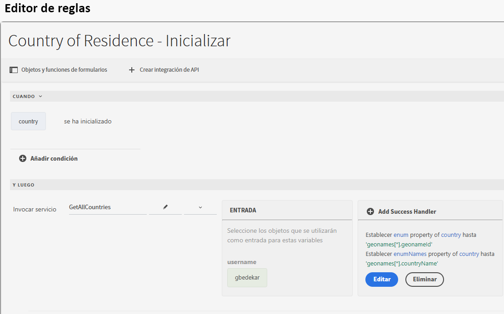
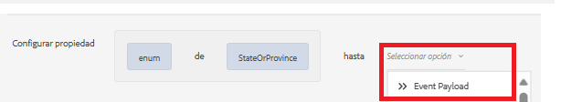
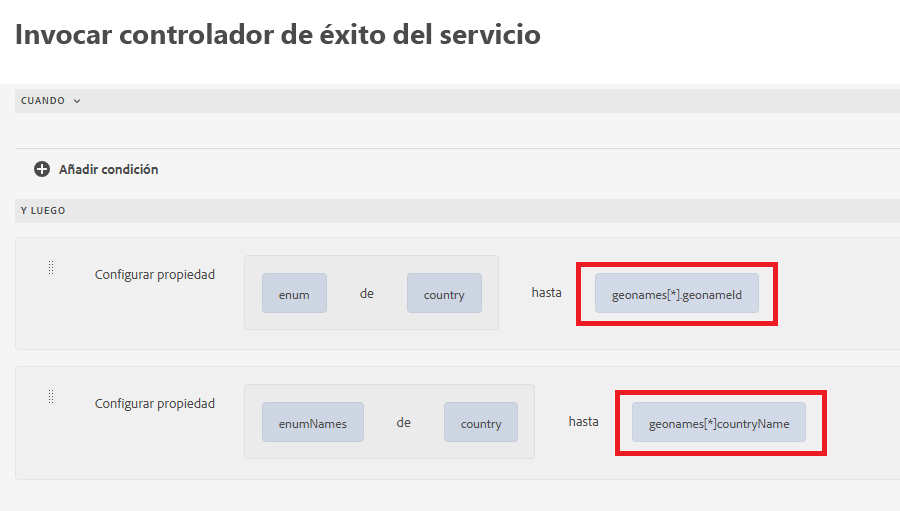
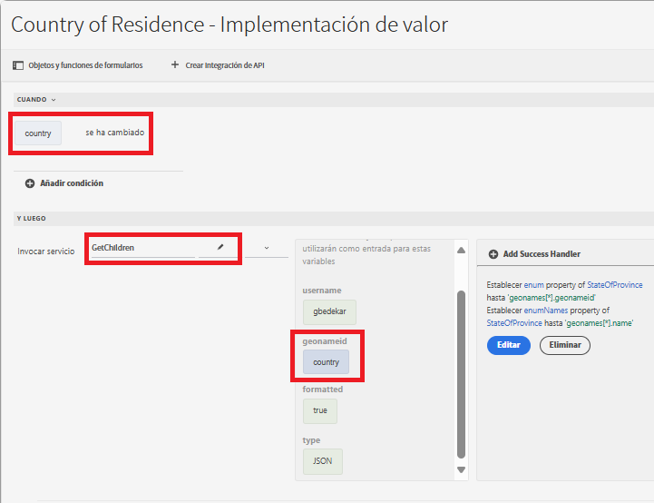
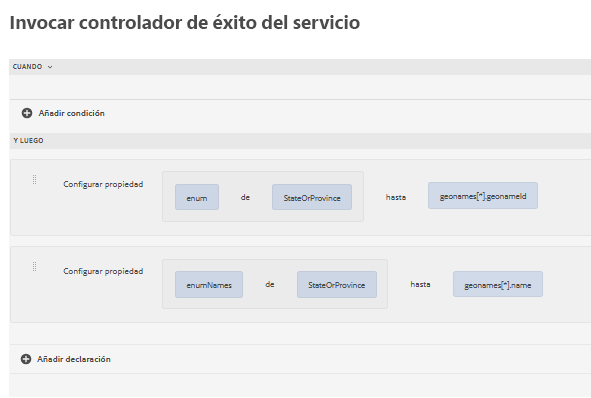

# Crear formulario mediante el editor universal

Cree el siguiente formulario mediante el editor universal. El formulario tiene 3 listas desplegables, cuyos valores se rellenan mediante la integración de la API

## País de residencia

En la inicialización, la lista desplegable del país de residencia se rellenará con los resultados de la llamada de API.

## Controlador de éxito

El controlador de éxito se definió para establecer los enum y enumNames de la lista desplegable del país con los valores adecuados de la matriz geonames. La matriz geonames está disponible en la opción Carga útil de evento

## Recuperar valores secundarios

La lista desplegable de estado o provincia se rellena cuando el usuario realiza una selección en la lista desplegable País de residencia. El geonameId asociado con el país seleccionado se pasa como parámetro de entrada a la integración de la API GetChildren

Se definió el controlador de éxito para establecer los enum/enumNames del campo desplegable StateOrProvince

Cuando se selecciona el estado o la provincia, puede rellenar la lista desplegable de la ciudad siguiendo el patrón mencionado anteriormente utilizado para rellenar la lista desplegable del estado o la provincia.