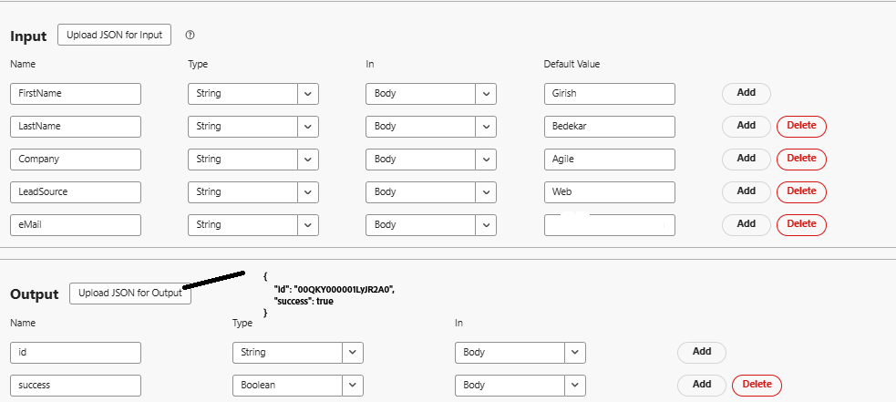
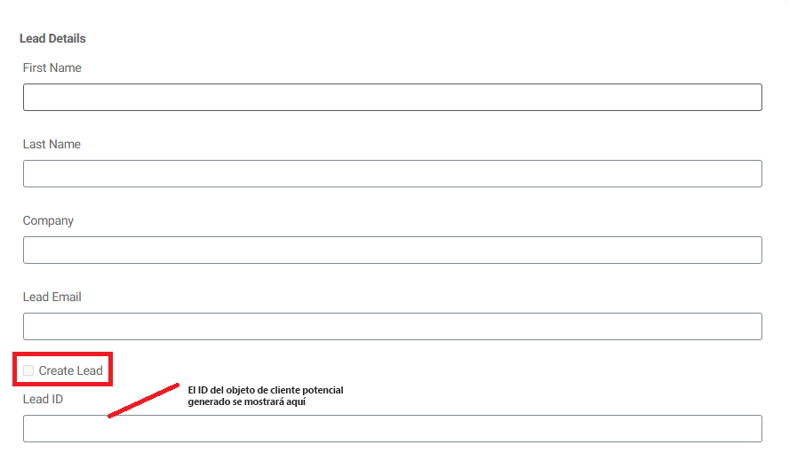
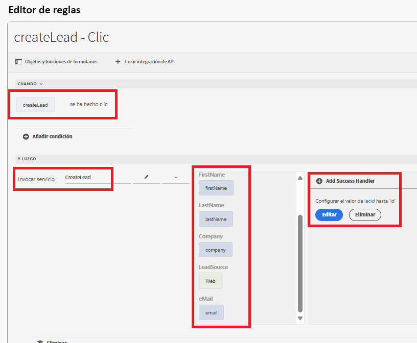

# Crear un objeto de posible cliente de Salesforce mediante integración de API

Este caso de uso explica cómo crear un posible cliente en Salesforce mediante la integración de API. Al final del proceso, aprenderá a hacer lo siguiente:

Configurar una [aplicación conectada en Salesforce](https://help.salesforce.com/s/articleView?id=platform.ev_relay_create_connected_app.htm&type=5) para habilitar el acceso seguro a la API.

Configurar CORS (Intercambio de recursos de origen cruzado) para permitir que el código (como JavaScript) que se ejecuta en un explorador web se comunique con Salesforce desde un origen específico, añada el origen a la lista de permitidos como se muestra a continuación


## Configuración de aplicación conectada

En la aplicación conectada se utiliza la siguiente configuración. Puede asignar los ámbitos de OAuth según sus necesidades.


## Crear integración de API

| Nombre | Value |
|--------------------------------|------------------|
| URL de API | https://`<your-domain>`d.my.salesforce.com/services/data/v32.0/sobjects/Lead |
| ID del cliente | Específico de la aplicación conectada |
| Secreto de cliente | Específico de la aplicación conectada |
| URL de OAuth | https://login.salesforce.com/services/oauth2/authorize |
| URL de token de acceso | https://`<your-domain>`/services/oauth2/token |
| URL de token de actualización | https://`<your-domain>`/services/oauth2/token |
| Ámbito de autorización | api chatter_api full id openid refresh_token visualforce web |
| Encabezado de autorización | Portador de autorización |


## Parámetros de entrada y salida

Defina los parámetros de entrada para la llamada de API y asigne los parámetros de salida mediante el siguiente json

```json
{
    "id": "00QKY000001LyJR2A0",
    "success": true
}
```



## Crear un formulario

Cree un formulario adaptable simple con el editor universal para capturar los detalles del objeto de posible cliente como se muestra a continuación


Controle el evento de clic en la casilla de verificación Crear posible cliente con el editor de reglas. Asigne los parámetros de entrada a los valores de los objetos de formulario adecuados, como se muestra a continuación. Mostrar el identificador del objeto de posible cliente recién creado en el objeto TextField `leadid`


## Prueba de la integración

- Obtener una vista previa del formulario
- Introducir algunos valores significativos
- Seleccione la casilla de verificación `Create Lead` para activar la llamada de API
- El identificador de posible cliente del objeto de posible cliente recién creado se mostrará en el campo de texto `Lead ID`.
