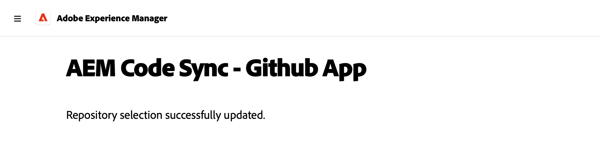
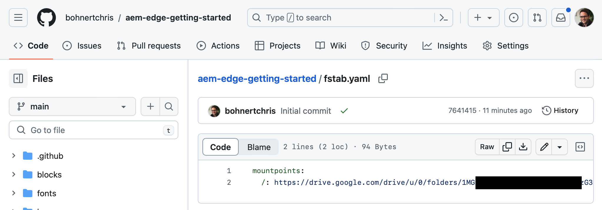
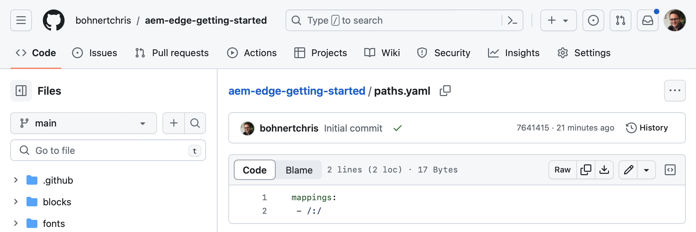
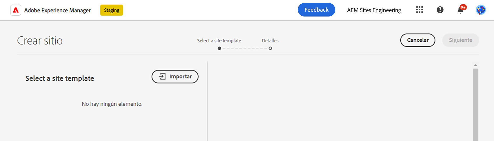
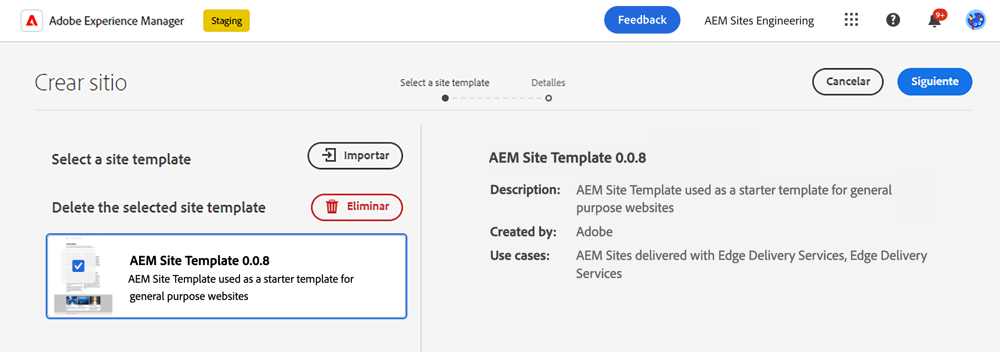
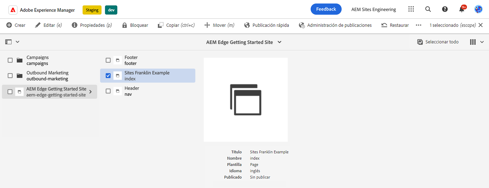
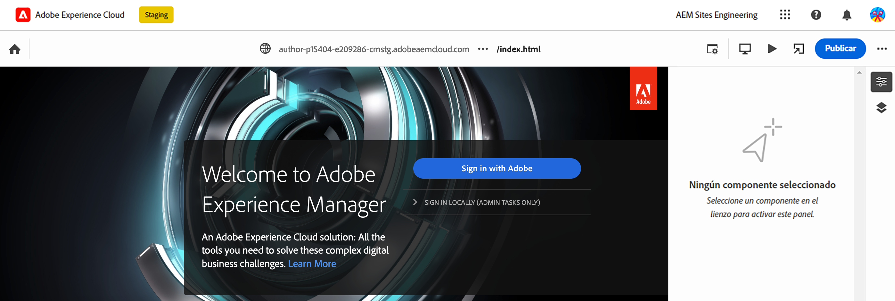
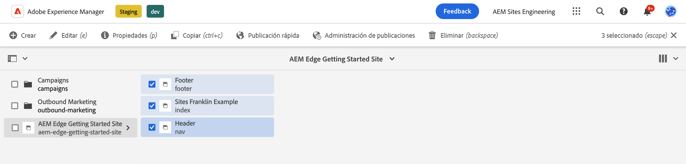
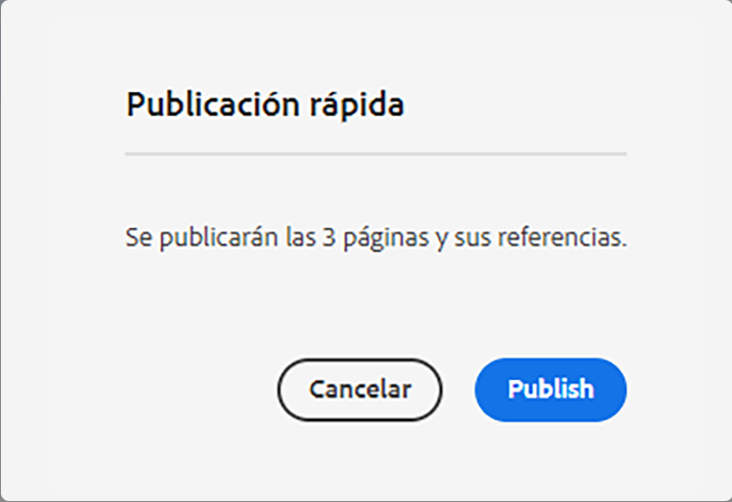

# AEM Creación de con Edge Delivery Services {#edge-dev-getting-started}

Esta guía le ayudará a ponerse en marcha con un nuevo sitio de Adobe Experience Manager que utiliza Edge Delivery Services y el editor universal para la creación de contenido.

{{aem-authoring-edge-early-access}}

## Requisitos previos {#prerequisites}

Antes de comenzar esta guía, debe estar familiarizado con los conceptos básicos de y tener acceso a los Edge Delivery Services, incluidos los siguientes:

* Ha completado la [Tutorial del servicio de envío de Edge.](/help/edge/developer/tutorial.md)
* Tiene acceso a un [Zona protegida de AEM Cloud Service.](/help/implementing/cloud-manager/getting-access-to-aem-in-cloud/introduction-sandbox-programs.md)
* Tiene [se habilitó el editor universal en el mismo entorno de zona protegida.](/help/implementing/universal-editor/getting-started.md)

## Elija el editor adecuado {#editor-choice}

AEM ofrece dos editores de contenido diferentes y la elección de cuál utilizar depende de su situación.

* **Editor universal** : esta debe ser la opción predeterminada para los nuevos sitios.
* **AEM Editor de página** : Debe elegirse para una migración de AEM Sites existente a Edge Delivery Services.

AEM Esta guía se centra en los proyectos de la en Edge Delivery Services que utilizan el Editor universal. Ver el documento [Desarrollo para Edge Delivery Services](/help/edge/developing.md) AEM para obtener más información sobre cómo elegir el editor adecuado y la migración de los sitios de la existentes a los Edge Delivery Services.

## AEM Introducción a la creación y los Edge Delivery Services de {#getting-started}

Una vez que haya completado [los requisitos previos](#prerequisites) y han hecho [la opción de utilizar el editor universal,](#editor-choice) puede empezar con su propio proyecto.

### Creación de un proyecto de GitHub {#create-github-project}

En primer lugar, deberá crear un nuevo proyecto en GitHub basado en la plantilla de Adobe.

1. Vaya a [`https://github.com/adobe-rnd/aem-boilerplate-xwalk`](https://github.com/adobe-rnd/aem-boilerplate-xwalk) y haga clic en **Usar esta plantilla** y seleccione **Creación de un nuevo repositorio**.

   * Deberá iniciar sesión en GitHub para ver esta opción.

   

1. De forma predeterminada, se le asignará el repositorio. Cambie esto según sea necesario, proporcione un nombre y una descripción del repositorio y haga clic en **Crear repositorio**.

   

1. En una nueva pestaña del mismo explorador, navegue hasta [`https://github.com/apps/aem-code-sync`](https://github.com/apps/aem-code-sync) y haga clic en **Configurar**.

   

1. Clic **Configurar** para la organización en la que creó el nuevo repositorio en el paso anterior.

   

1. AEM En la página de GitHub de sincronización de código de la, en **Acceso al repositorio**, seleccione **Seleccionar solo repositorios**, seleccione el repositorio que creó en el paso anterior y, a continuación, haga clic en **Guardar**.

   

1. AEM Una vez instalada la sincronización de código de la, recibirá una pantalla de confirmación. Vuelva a la pestaña del explorador del nuevo repositorio.

   

1. Haga clic en `fstab.yaml` para abrirlo y, a continuación, el archivo **Editar este archivo** para editarlo.

   

1. Edite el `fstab.yaml` para actualizar el punto de montaje del proyecto. Reemplace la URL predeterminada de Google AEM Docs por la URL de la instancia de creación as a Cloud Service de la instancia de creación de la aplicación y, a continuación, haga clic en **Confirmar cambios...**.

   * `https://<aem-author>/bin/franklin.delivery/<owner>/<repository>/main`
   * Cambiar el punto de montaje indica a los Edge Delivery Services dónde encontrar el contenido del sitio.

   

1. Añada un mensaje de compromiso como desee y haga clic en **Confirmar cambios**, comprometiéndolos directamente con el `main` Rama.

   

1. Vuelva a la raíz del repositorio y haga clic en `paths.yaml` y luego el **Editar este archivo** icono.

   

1. Reemplace las asignaciones predeterminadas por `/content/<site-name>/:/` y haga clic en **Confirmar cambios...**.

   * Proporcione sus propios `<site-name>`. Lo necesitará en un paso posterior.
   * Las asignaciones indican a los Edge Delivery Services AEM cómo asignar el contenido del repositorio de la a la dirección URL del sitio.

   

1. Añada un mensaje de compromiso como desee y haga clic en **Confirmar cambios**, comprometiéndolos directamente con el `main` Rama.

   

### AEM Creación y edición de un nuevo sitio de {#create-aem-site}

AEM Ahora que tiene un proyecto de GitHub, debe crear un nuevo sitio de que el proyecto pueda utilizar.

>[!NOTE]
>
>Para editar el sitio con el editor universal, debe utilizar un explorador basado en Chromium.

1. AEM Solicite la última plantilla del sitio de creación de informes de Edge Delivery Services a través de Adobe Engineering [canal del Slack del proyecto.](/help/edge/docs/slack.md)

1. AEM Inicie sesión en la instancia de creación as a Cloud Service de la aplicación de, vaya a la consola Sitios y toque o haga clic en **Crear** -> **Sitio a partir de plantilla**.

   

1. En el **Seleccione una plantilla del sitio** en el asistente crear sitio, haga clic en la pestaña **Importar** para importar una plantilla nueva.

   

1. AEM Cargue la plantilla de sitio Creación de con Edge Delivery Services proporcionada por Ingeniería de Adobes.

1. Una vez importada la plantilla, aparece en el asistente. Haga clic o pulse en para seleccionarlo y, a continuación, en o en **Siguiente**.

   

1. Proporcione los siguientes campos y toque o haga clic en **Crear**.

   * **Título del sitio** : Añada un título descriptivo para el sitio.
   * **Título del sitio** - Utilice el `<site-name>` que definió en el [paso anterior.](#create-github-project)
   * **URL de GitHub** : utilice la dirección URL del proyecto de GitHub que creó en el paso anterior.

   

1. AEM La creación del sitio se confirma con un cuadro de diálogo. Haga clic o pulse **OK** para descartar.

   

1. En la consola Sitios, vaya al `index.html` del sitio recién creado y toque o haga clic en **Editar** en la barra de herramientas.

   

1. El editor universal se abre en una nueva pestaña. Es posible que tenga que tocar o hacer clic en **Iniciar sesión con el Adobe** para autenticarse y editar su página.

   

Ahora puede editar el sitio mediante el Editor universal. Consulte la [Documentación del editor universal](/help/sites-cloud/authoring/universal-editor/authoring.md) para obtener más información.

### Publicación del nuevo sitio {#publishing}

Una vez que haya terminado de editar el nuevo sitio con el editor universal, puede publicar el contenido.

1. En la consola Sitios, seleccione todas las páginas que creó para el nuevo sitio y toque o haga clic en **Publicación rápida** en la barra de herramientas.

   

1. Haga clic o pulse **Publish** en el cuadro de diálogo de confirmación para iniciar el proceso.

   

1. Abra una nueva pestaña en el mismo explorador y vaya a la dirección URL del nuevo sitio.

   * `https://main--<site-name>--<owner>.hlx.page`

1. Ver el contenido publicado.

   

## Pasos siguientes {#next-steps}

AEM Ahora que tiene un proyecto de creación de proyectos de Edge Delivery Services de trabajo en el que trabaja en la creación de proyectos de trabajo en el que puede empezar a crear y aplicar estilos a sus propios bloques.

Consulte la guía [Creación de bloques instrumentados para su uso con el editor universal](/help/edge/create-block.md) para obtener más información.
