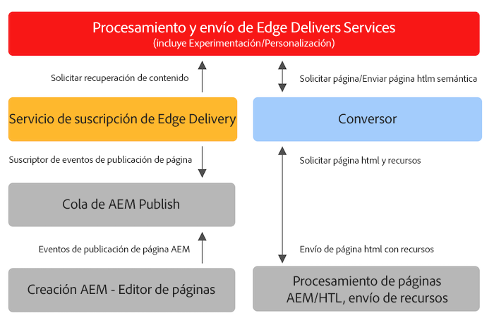

# Uso de Edge Delivery Services AEM con proyectos existentes en la {#existing-projects}

AEM No hace falta esperar a que un nuevo proyecto de se beneficie de los Edge Delivery Services. Los Edge Delivery Services AEM se pueden integrar en su proyecto de existente para que pueda aprovechar inmediatamente sus mejoras de rendimiento.

## AEM Limitaciones del editor de páginas {#page-editor}

Antes de la llegada de los Edge Delivery Services AEM AEM, el contenido gestionado en la se editaba con el Editor de páginas de la página de la. Si el proyecto comenzó antes de la introducción de los Edge Delivery Services, es casi seguro que está utilizando el Editor de páginas.

AEM El editor de páginas de la solo funciona con [AEM componentes de](/help/implementing/developing/components/overview.md) como el [Componentes principales.](https://experienceleague.adobe.com/docs/experience-manager-core-components/using/introduction.html?lang=es) Estos componentes son incompatibles con los Edge Delivery Services. Debido a esto, se requieren dos fases para presentar a los Edge Delivery Services AEM a un proyecto de existente:

* [Fase 1: Reemplazo de la parte delantera](#replace-front-end)
* [Fase 2: cambiar al editor universal](#switch-ue)

## Fase 1: Reemplazo de la parte delantera {#replace-front-end}

AEM En la fase uno, puede seguir utilizando la estructura, los componentes y las herramientas de creación existentes del sitio de. El procesamiento del sitio web se reconstruirá utilizando bloques de JavaScript y CSS y se enviará a través de Edge Delivery Services.

Consulte la [Sección Generar](https://www.aem.live/docs/#build) Consulte la documentación de Edge Delivery Services para obtener más información sobre los bloques de y cómo desarrollar para los servicios de envío de Edge.

AEM Se necesitará un convertidor en el Generador de aplicaciones para convertir la salida del HTML procesado de la y enviarla a los Edge Delivery Services.

AEM AEM La fase dos completa el proceso al eliminar la superposición de tecnología: componentes principales con HTL y Java en el Autor de, bloques basados en JS en la entrega de Edge y un convertidor basado en JS de nodos.

## Fase 2: cambiar al editor universal {#switch-ue}

AEM En esta fase, el Editor de páginas de la página de la se sustituye por el Editor universal. AEM Dado que el editor universal puede trabajar directamente con bloques, ya no se necesitarán los componentes principales y el convertidor de la.

## Cómo empezar a trabajar {#how-to-get-started}

Póngase en contacto con el representante del Adobe para obtener acceso a esta función.
