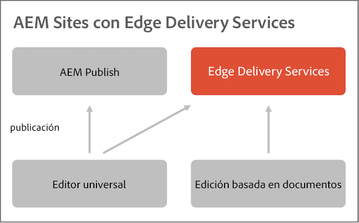

# Información general sobre Edge Delivery Services {#edge-delivery-services}

Con Edge Delivery Services, AEM ofrece experiencias excepcionales que fomentan la participación y las conversiones. AEM lo hace ofreciendo experiencias de alto impacto que son rápidas de crear y desarrollar. Es un conjunto de servicios que admite composición que permite un entorno de desarrollo rápido en el que los autores pueden actualizar y publicar rápidamente y en el que los nuevos sitios se inician rápidamente. De este modo, con Edge Delivery Services puede mejorar la conversión, reducir costes y proporcionar una velocidad de contenido extrema.

Mediante Edge Delivery Services, puede:

* Cree sitios rápidos con una puntuación de Lighthouse perfecta y monitorice continuamente el rendimiento de su sitio a través de la telemetría operativa.
* Aumentar la eficacia de la creación desacoplando las fuentes de contenido. De forma predeterminada, puede utilizar tanto la creación en AEM con el editor universal como la creación basada en documentos. De este modo, puede trabajar con varias fuentes de contenido en el mismo sitio web.
* Utilice un marco de trabajo de experimentación integrado que permita la creación y ejecución rápidas de pruebas sin impacto en el rendimiento y la publicación rápida en producción de un ganador de pruebas.

>[!TIP]
>
>**¿Quieres ponerte en contacto de inmediato?**
>
>Si desea ponerse en contacto de inmediato, puede iniciar su propio proyecto de Edge Delivery Services con la creación de AEM en menos de 30 minutos [consultando el tutorial en aem.live.](https://www.aem.live/developer/ue-tutorial)

## Reacción ágil a las necesidades empresariales {#agile-reaction}

Como reconocido líder del sector desde hace mucho, Adobe sabe lo importante que es poder crear y publicar con rapidez contenido nuevo y significativo para sus clientes. El mercado ha dejado claros los desafíos comunes para escalar la creación de contenido, entre los que se incluyen:

1. **La demanda de contenido sigue creciendo.**
   * Es necesario desbloquear nuevos autores de contenido para satisfacer esta demanda.
   * El proceso de creación de contenido debe escalarse de forma eficaz en toda la empresa.
   * Los autores deben poder reaccionar de manera rápida a los cambios de tendencias.
1. **Se necesita contenido omnicanal.**
   * El control del diseño es necesario, con independencia de la entrega de contenido.
   * Es necesario facultar a los autores para que cambien de forma directa el diseño del contenido.
1. **Aumenta la presión para aumentar el ROI en el contenido.**
   * Los propios autores necesitan la capacidad de optimizar el contenido que crean.

Estas tendencias han demostrado ser coherentes en todo el sector. Sin embargo, los requisitos individuales varían de forma inevitable de un proyecto a otro. La meta de cualquier proyecto de Edge Delivery Services es encontrar una solución que funcione para sus usuarios.

1. **Céntrese en el valor, en lugar de en las características.**: determine el flujo de trabajo más optimizado para asistir a los autores, en lugar de perderse en el amplio conjunto de funciones de AEM.
1. **Aproveche la flexibilidad de AEM.**: no es necesario usar las características de AEM en vacío. Utilice las funciones que necesite en cada caso de uso.
1. **Aproveche los conocimientos de su autor.**: involucre a autores de contenido real en el proyecto desde el principio para asegurarse de ofrecerles lo que necesitan implementando funciones que tienen sentido.

Al centrarse en el valor para los autores, su proyecto de Edge Delivery Services puede satisfacer las modernas exigencias del sector a las que se enfrentan los creadores y proporcionar contenido de manera rápida para agradar a sus clientes.

## Herramientas flexibles para los creadores de contenido {#overview}

Edge Delivery Services es un conjunto de servicios componibles que permite un alto grado de flexibilidad en la forma en que se crea contenido en su sitio web. Puede utilizar tanto la [gestión de contenidos de AEM](/help/sites-cloud/authoring/author-publish.md) como la creación de contenido mediante el [editor universal](/help/sites-cloud/authoring/universal-editor/authoring.md), así como la [creación basada en documentos.](https://www.aem.live/docs/authoring)

El diagrama siguiente ilustra cómo puede editar contenido en Microsoft Word (creación basada en documentos) y publicarlo en Edge Delivery Services junto con la creación de contenido de AEM mediante el editor universal.

Edge Delivery Services utiliza GitHub para que pueda administrar e implementar código directamente desde su repositorio de GitHub. El nuevo contenido se añade al instante sin que sea necesario un proceso de reconstrucción.

### Creación de AEM con el editor universal.{#wysiwyg-authoring}

El editor universal es un lugar “lo que se ve es lo que se obtiene” (WYSIWYG) personalizable y único para editar contenido en directo y en contexto con una vista previa visual.

* Con la creación de AEM con el editor universal, aumenta la eficacia del autor, ya sea sin encabezado o con encabezado.
* Puede aprovechar las completas funcionalidades de gestión de contenido de AEM, incluidas las de flujo de trabajo y control de la gestión de contenido.
* Aproveche numerosos puntos de extensión para admitir sus propios procesos e integraciones.
* La funcionalidad del sitio se puede desarrollar mediante CSS y JavaScript en GitHub.

Introducción a la creación de AEM con el editor universal y Edge Delivery Services:

* Para obtener información general de la creación de AEM con el editor universal, consulte el documento [Creación con AEM para Edge Delivery Services](https://www.aem.live/docs/aem-authoring) en la documentación de aem.live.
* Para obtener información general para desarrolladores, consulte el documento [Introducción: Tutorial del editor universal para desarrolladores](https://www.aem.live/developer/ue-tutorial) en la documentación de aem.live.

### Creación basada en documentos {#document-based}

Con la creación basada en documentos, puede utilizar contenido directamente de Microsoft Word o Google Docs para que esos orígenes se conviertan en páginas del sitio web. Los encabezados, las listas, las imágenes y los elementos de tipo de fuente se pueden transferir desde el origen inicial al sitio web.

* Con la creación basada en documentos, cualquier experto en marketing puede crear contenido de manera rápida mediante herramientas conocidas (Microsoft Word, Google Docs, etc.).
* La creación de contenido se optimiza al permitir la creación, revisión y publicación directa dentro de los documentos de origen.
* Dado que se emplean herramientas conocidas, no se requiere ninguna incorporación para los autores de contenido, lo que aumenta su velocidad.
* La funcionalidad del sitio se puede desarrollar mediante CSS y JavaScript en GitHub.

Para obtener más información, consulte la documentación sobre creación basada en documentos:

* Para obtener más información sobre cómo empezar a utilizar Edge Delivery, consulte la sección [Generar de la documentación de aem.live.](https://www.aem.live/docs/#build)
* Para comprender cómo crear y publicar contenido mediante Edge Delivery, consulte la sección [Publicar de la documentación de aem.live.](https://www.aem.live/docs/authoring)
* Para comprender cómo iniciar correctamente el proyecto de su sitio web, consulte la sección [Iniciar de la documentación de aem.live](https://www.aem.live/docs/#launch).

### Decisión de un método de creación {#authoring-method}

La flexibilidad de AEM garantiza que se cubran sus necesidades de creación. Adobe puede ayudarle a determinar qué método (o métodos) se adapta mejor a sus necesidades.

* Incluya siempre a los autores de contenido en la decisión.
* Se pueden implementar varios métodos de creación.
* Siempre puede cambiar el método de creación con posterioridad.
* No es necesario que decida antes de la implementación, sino como parte de la implementación.

## Edge Delivery Services y otros productos de Adobe Experience Cloud {#edge-other-products}

Edge Delivery Services forma parte de Adobe Experience Manager. Como tal, Edge Delivery Services y AEM Sites pueden coexistir en el mismo dominio, lo que es un caso de uso común para sitios web más grandes. Además, las páginas de AEM Sites pueden consumir contenido de Edge Delivery Services sin problemas, y lo mismo sucede a la inversa.

Consulte el documento [Introducción: Tutorial del editor universal para desarrolladores](https://www.aem.live/developer/ue-tutorial) en la documentación de aem.live y aprenda a iniciar su propio proyecto para crear con AEM y Edge Delivery Services.

También puede usar Edge Delivery Services con [Adobe Target](https://www.aem.live/developer/target-integration), [telemetría operativa](https://www.aem.live/developer/rum) para diagnosticar el uso y el rendimiento de sus sitios y [Launch.](https://experienceleague.adobe.com/en/docs/experience-platform/tags/home)

## Obtención de ayuda de Adobe {#getting-help}

Adobe proporciona tres canales para ayudarle con Edge Delivery Services:

* Interactúe con los [recursos de la comunidad](#community-resources) para realizar consultas generales.
* Acceda al [canal de colaboración de productos](#collaboration-channel) para preguntas específicas.
* [Registre un ticket de asistencia](#support-ticket) para resolver problemas importantes y críticos.

### Acceder a recursos de la comunidad {#community-resources}

Adobe se compromete a ofrecerle la mejor participación de la comunidad y asistencia para Edge Delivery Services, la creación de AEM con el editor universal y la creación basada en documentos.

* Participe en la [Comunidad de Experience League](https://adobe.ly/3Q6kTKl) para hacer preguntas, compartir comentarios, iniciar discusiones, buscar ayuda de expertos de Adobe y asesores/expertos de AEM, y conectarse con personas con ideas afines en tiempo real. 
* Únase a nuestro [Canal de la discordia](https://discord.gg/aem-live), una plataforma más informal para interacciones en tiempo real e intercambio rápido de ideas.

### Cómo acceder a su canal de colaboración de productos {#collaboration-channel}

Dado el valor del canal de comunicación directa con los usuarios, todos los proyectos AEM establecerán un canal Slack en el momento del lanzamiento para ofrecer actualizaciones críticas y rápidas, así como sistemas de informes escalados sobre la calidad de la experiencia. Recibe una invitación de Adobe para unirse a un canal Slack específico de su organización.

Para obtener más información, consulte el documento [Uso del bot de Slack](https://www.aem.live/docs/slack) para obtener más información.

Puede interactuar con los equipos de productos de Adobe a través del canal de colaboración de productos suministrado para responder a preguntas sobre el uso del producto o las prácticas recomendadas. No hay públicos destinatarios de nivel de servicio (SLT) asociados con las conversaciones a través del canal de colaboración de productos.

### Registro de un ticket de asistencia {#support-ticket}

{{support-ticket}}
