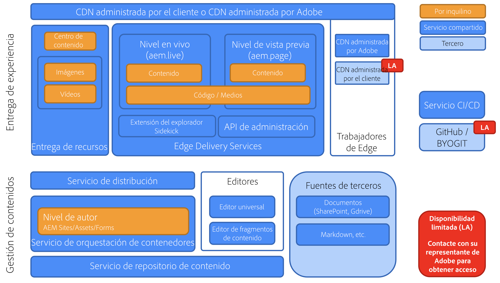

# Información general sobre Edge Delivery Services {#edge-delivery-services}

>[!TIP]
>
>**¿Quiere ponerse manos a la obra de inmediato?**
>
>Si desea ponerse en contacto con Edge Delivery Services de inmediato, tiene dos opciones.
>* [Empiece a crear de inmediato con un entorno de tutoriales prediseñado, completamente configurado y listo para usar.](https://www.aem.live/developer/ue-trial)
>* Ingresa a más detalles y configura tu propio entorno en menos de 30 minutos [consultando el tutorial en aem.live.](https://www.aem.live/developer/ue-tutorial)

## ¿Qué es Edge Delivery Services? {#what-is-edge}

Edge Delivery Services es un moderno marco de trabajo de entrega de contenidos que reinventa la forma en que se crean y envían los sitios web, optimizando la velocidad, la simplicidad y la escalabilidad. Es una parte esencial de Adobe Experience Manager y permite experiencias digitales más rápidas al llevar el renderizado y la entrega más cerca del usuario, al borde de la red.

No reemplaza a una red de distribución de contenido (CDN), pero se integra a la perfección con su propia CDN o con la [CDN administrada por Adobe incluida.](/help/implementing/dispatcher/cdn.md)

## ¿Por qué Edge Delivery Services? {#why-edge}

### Aumenta la detectabilidad y el tráfico {#increase-traffic}

Los sitios web de Edge Delivery están optimizados para motores de búsqueda (SEO) y motores generativos (GEO) para LLM. Esto garantiza una alta visibilidad y detectabilidad en todas las fuentes existentes y futuras para el tráfico orgánico. La **arquitectura de extremo a extremo basada en el rendimiento** garantiza una excelente experiencia del cliente que tendrá un impacto positivo en la participación.

### Eficiencia del desarrollador {#developer-efficientcy}

¡Póngase en marcha en días y semanas en lugar de meses y años! Edge Delivery ofrece todas las herramientas que a **los desarrolladores web modernos** les encantan: GitHub, desarrollo local con recarga automática, rendimiento, simplicidad y ninguna de las complicaciones: sin transpilación, sin paquetes, sin configuraciones, sin sobrecargas.

La simplicidad de Edge Delivery no requiere que utilice marcos de trabajo, herramientas o procesos complicados, lo que resulta ideal para la creación de código de IA. Utilice HTML sin formato, CSS moderno y JavaScript convencional para crear experiencias excepcionales más rápido que nunca. Céntrese en el trabajo y dedique menos tiempo a la formación y al aprendizaje de nuevas herramientas.

Edge Delivery permite que cada desarrollador logre una puntuación de 100 en Lighttouse.

### Compatibilidad con varias fuentes de contenido {#multiple-content-sources}

El contenido de varias soluciones se puede integrar directamente con Edge Delivery, **incluidas todas las instancias de AEM existentes**. Los autores pueden administrar y **publicar contenido desde cualquier sistema, como SharePoint, en Edge Delivery** para ganar más velocidad con las herramientas que ya conocen.

### Arquitectura que admite composición {#composable-architeture}

Ya sea sin encabezado o con encabezado, puede entregar el contenido adecuado en el formato adecuado y añadir la decoración adecuada para que sea una experiencia que se destaque en cualquier canal.

## ¿Cómo funciona? {#how-does-it-work}

Edge Delivery Services es un conjunto de servicios componibles que permite un alto grado de flexibilidad en la forma en que se crea contenido en su sitio web. Sustituye a AEM Publish/Dispatcher y a la forma tradicional de crear experiencias con los componentes principales de AEM con una solución SaaS de varias nubes y un enfoque de desarrollo front-end puro.

Edge Delivery Services utiliza GitHub para que pueda administrar e implementar código directamente desde su repositorio de GitHub. El nuevo contenido se añade al instante sin que sea necesario un proceso de reconstrucción.

## Creación {#authoring}

### Edición en contexto {#in-context-editing}

[El editor universal](/help/implementing/universal-editor/introduction.md) es una herramienta personalizable de tipo WYSIWYG (What-You-See-Is-What-You-Get), que permite editar contenido en directo y en contexto con una vista previa visual, en un solo lugar.

* Con la creación de AEM con el editor universal, aumenta la eficacia del autor, ya sea sin encabezado o con encabezado.
* Puede aprovechar las completas funcionalidades de gestión de contenido de AEM, incluidas las de flujo de trabajo y control de la gestión de contenido.
* Puede aprovechar numerosos puntos de extensión para dar soporte a sus propios procesos e integraciones.
* La funcionalidad del sitio se puede desarrollar mediante CSS y JavaScript en GitHub.

### Edición basada en documentos {#document-based-editing}

[Otro enfoque es la creación basada en documentos](https://www.aem.live/docs/authoring), donde el contenido se administra como documentos. Microsoft Word es una opción popular, ya que muchas empresas cuentan con SharePoint, donde se crea el contenido inicial. No es necesario aprender una nueva herramienta y publicar contenido directamente desde SharePoint y Word elimina la molestia de copiar y pegar contenido en AEM. Los clientes sin SharePoint también pueden utilizar Google Drive como alternativa.

## Telemetría operativa {#telemetry}

Adobe Experience Manager utiliza la [telemetría operativa](https://www.aem.live/docs/operational-telemetry) para recopilar los datos de operaciones que son estrictamente necesarios para detectar y corregir problemas funcionales y de rendimiento en sitios con tecnología de Adobe Experience Manager. Los datos de telemetría operativa pueden utilizarse para diagnosticar problemas de rendimiento y medir la eficacia de los experimentos. La telemetría operativa conserva la privacidad de los visitantes gracias al [muestreo](https://www.aem.live/docs/operational-telemetry#operational-telemetry-data-is-sampled) (solo se supervisará una pequeña parte de todas las vistas de página) y la [exclusión prudente de información de identificación personal](https://www.aem.live/docs/operational-telemetry#what-data-is-being-collected) (PII).

## Comenzar a explorar {#start-exploring}

Introducción a la creación de AEM con el editor universal y Edge Delivery Services:

* Documentación de Edge Delivery Services [Edge Delivery Services](https://www.aem.live)
* Para obtener información general de la creación de AEM con el editor universal, consulte el documento [Creación con AEM para Edge Delivery Services](https://www.aem.live/docs/aem-authoring) en la documentación de aem.live.
* Para obtener información general para desarrolladores, consulte el documento [Introducción: Tutorial del editor universal para desarrolladores](https://www.aem.live/developer/ue-tutorial) en la documentación de aem.live.

## Edge Delivery Services y otros productos de Adobe Experience Cloud {#edge-other-products}

Edge Delivery Services forma parte de Adobe Experience Manager. Como tal, Edge Delivery Services y AEM Sites pueden coexistir en el mismo dominio, lo que es un caso de uso común para sitios web más grandes. Además, las páginas de AEM Sites pueden consumir contenido de Edge Delivery Services sin problemas, y lo mismo sucede a la inversa.

También puede utilizar Edge Delivery Services con [Adobe Target](https://www.aem.live/developer/target-integration) y [Launch.](https://experienceleague.adobe.com/es/docs/experience-platform/tags/home)

## Obtención de ayuda de Adobe {#getting-help}

Adobe proporciona tres capas para ayudarle con Edge Delivery Services:

* Interactúe con los [recursos de la comunidad](#community-resources) para realizar consultas generales.
* Acceda al [canal de colaboración de productos](#collaboration-channel) para preguntas específicas.
* [Registre una incidencia de soporte técnico](#support-ticket) para resolver problemas importantes y críticos **en el SLA de soporte contractual**.

### Acceder a recursos de la comunidad {#community-resources}

Adobe se compromete a ofrecerle la mejor participación de la comunidad y asistencia para Edge Delivery Services, la creación de AEM con el editor universal y la creación basada en documentos.

* Participe en la [Comunidad de Experience League](https://adobe.ly/3Q6kTKl) para hacer preguntas, compartir comentarios, iniciar discusiones, buscar ayuda de expertos de Adobe y asesores/expertos de AEM, y conectarse con personas con ideas afines en tiempo real. 
* Únase a nuestro [Canal de la discordia](https://discord.gg/aem-live), una plataforma más informal para interacciones en tiempo real e intercambio rápido de ideas.

### Registro de un ticket de asistencia {#support-ticket}

{{support-ticket}}
