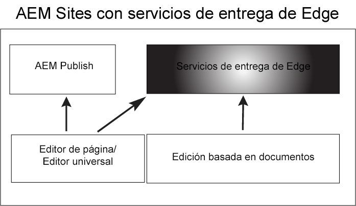

# Introducción a los Edge Delivery Services {#getstart-edge}

Con los Edge Delivery Services AEM, ofrece experiencias excepcionales que impulsan la participación y las conversiones. AEM Lo hace ofreciendo experiencias de alto impacto que son rápidas de crear y desarrollar. Es un conjunto de servicios componibles que permite un entorno de desarrollo rápido en el que los autores pueden actualizar y publicar rápidamente y en el que los nuevos sitios se inician rápidamente. De este modo, los Edge Delivery Services permiten mejorar la conversión, reducir los costes y proporcionar una velocidad de contenido extrema.

Al aprovechar Edge Delivery, puede:

* Cree sitios rápidos con una puntuación de Lighthouse perfecta y monitorice continuamente el rendimiento de su sitio a través de la monitorización real del usuario (RUM).
* Aumente la eficacia de la creación desacoplando las fuentes de contenido. AEM De forma predeterminada, puede utilizar la creación basada en documentos y la creación basada en documentos, tanto en la creación de documentos como en la creación de documentos. De este modo, puede trabajar con varias fuentes de contenido en el mismo sitio web.
* Utilice un marco de experimentación integrado que permita la creación y ejecución rápidas de pruebas sin impacto en el rendimiento y la publicación rápida en producción de un ganador de pruebas.

## Cómo funciona la entrega de Edge {#edge-works}

El diagrama siguiente ilustra cómo se puede editar contenido en Microsoft Word (edición basada en documentos) y publicarlo en Edge Delivery. AEM También muestra el método de publicación tradicional de la publicación de la utilizando los diversos editores.

Edge Delivery es un conjunto de servicios componibles que permiten un alto grado de flexibilidad en la forma en que se crea contenido en el sitio web. Como se mencionó anteriormente, puede utilizar ambos [AEM creación de](https://experienceleague.adobe.com/docs/experience-manager-cloud-service/content/sites/authoring/getting-started/concepts.html) y [creación basada en documentos](https://www.hlx.live/docs/authoring).

Por ejemplo, puede utilizar contenido directamente desde Microsoft Word o Google Docs. Esto significa que los documentos de esas fuentes pueden convertirse en páginas del sitio web. Además, los encabezados, las listas, las imágenes y los elementos de fuente se pueden transferir desde la fuente inicial al sitio web. El nuevo contenido se añadirá instantáneamente sin un proceso de reconstrucción.

Edge Delivery aprovecha GitHub para que los clientes puedan administrar e implementar código directamente desde su repositorio de GitHub. Por ejemplo, puede escribir contenido en Google Docs o en Microsoft Word, y la funcionalidad del sitio se puede desarrollar mediante CSS y JavaScript en GitHub Cuando esté listo, puede utilizar la extensión del explorador Sidekick para previsualizar y publicar actualizaciones de contenido.

Más información:

* Para obtener más información sobre cómo empezar a utilizar la entrega perimetral, consulte [Generar](https://www.hlx.live/docs/#build) de la documentación de entrega de Edge.
* Para comprender cómo crear y publicar contenido mediante Edge Delivery, consulte [Publicar sección](https://www.hlx.live/docs/authoring).
* Para comprender cómo iniciar correctamente el proyecto de sitio web, consulte la [Sección Launch](https://www.hlx.live/docs/#launch).

## Edge Delivery Services y otros productos de Adobe Experience Cloud {#edge-other-products}

Los Edge Delivery Services forman parte de Adobe Experience Manager AEM y, como tales, los sitios de envío perimetral y los sitios de pueden coexistir en el mismo dominio. Este es un caso de uso común para sitios web más grandes. Además, el contenido de Edge Delivery se puede consumir fácilmente en sus páginas de AEM Sites y viceversa.

También puede utilizar Edge Delivery Services en combinación con Adobe Target, Analytics y Launch.

## Acceso a los Edge Delivery Services {#getting-access}

Es fácil empezar a usar Edge Delivery Services. Empiece siguiendo los pasos de [Introducción: Tutorial para desarrolladores](https://www.hlx.live/developer/tutorial).

## Obtención de ayuda del Adobe {#adobe-gethelp}

Puede interactuar con los equipos de productos de Adobe a través del canal de colaboración de productos aprovisionado (consulte a continuación para obtener detalles de acceso) para responder a preguntas sobre el uso del producto o las prácticas recomendadas. Tenga en cuenta que no hay términos de nivel de servicio (SLT) asociados con las conversaciones a través del canal de colaboración de productos. Si un problema de producto necesita más investigación y solución de problemas, y necesita cumplir con los SLT de respuesta, puede enviar un ticket de asistencia después de la [proceso de soporte](https://experienceleague.adobe.com/?lang=en&amp;support-tab=home#support).

El Adobe de proporciona tres canales para ayudarle con los Edge Delivery Services:

* Interactúe con los recursos de la comunidad para realizar consultas generales
* Acceda al canal de colaboración de productos para preguntas específicas
* Registre un ticket de asistencia para resolver problemas importantes y críticos

### Acceder a recursos de la comunidad {#community-resource}

Adobe tiene dos recursos de la comunidad para ayudarle con la entrega de Edge, [Comunidad de Experience League](https://adobe.ly/3RzitVw) y una [Canal de discordia](https://discord.gg/YFTKQK8M).

### Cómo acceder a su canal de colaboración de productos {#collab-channel}

AEM Dado el valor del canal de comunicación directa con los clientes, todos los clientes en el momento de la presentación de, establecerán un canal Slack con el fin de ofrecer actualizaciones críticas, rapidez y sistemas de informes escalados sobre la calidad de la experiencia. Recibirá una invitación del Adobe para unirse a un canal de Slack específico de su organización.

Para obtener más información, consulte [Uso del bot de Slack](https://www.hlx.live/docs/slack) para obtener más información.

### Registro de un vale de asistencia {#support-ticket}

Pasos para registrar un ticket de asistencia a través del Admin Console:

1. Añadir **Entrega en Edge** en el título del billete.
2. En la descripción, proporcione los siguientes detalles:

   * URL del sitio web activo. Por ejemplo: [www.mydomain.com].
   * URL del sitio web de origen (URL .hlx).

## Siguientes pasos {#whats-next}

Para empezar, lea el artículo siguiente: [Uso de Edge Delivery Services](/help/edge/using.md).

## Recursos útiles {#useful-resources}

Para obtener más información sobre los Edge Delivery Services, consulte la [Documentación de Edge Delivery Services](https://www.hlx.live/docs/).
