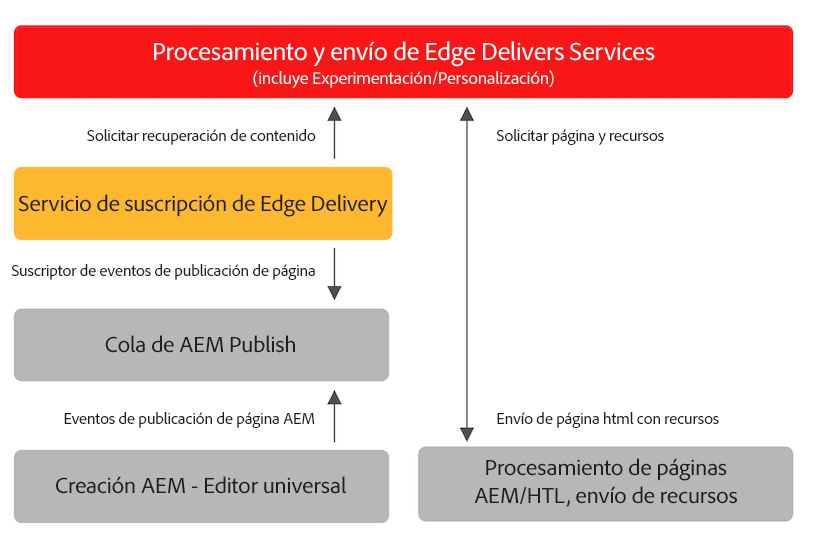

# Publicación de contenido para Edge Delivery Services {#publishing-edge}

Con los Edge Delivery Services, la publicación de contenido es perfecta independientemente de la fuente de contenido:

* Contenido basado en documentos: consulte [Publicar sección](https://www.aem.live/docs/#publish) de la documentación de Edge Delivery Services.
* AEM Contenido de la aplicación: consulte los detalles a continuación.

## AEM Flujo de publicación de la lista de {#publishing-flow}

AEM Cuando se utiliza el Editor universal para crear contenido de, la publicación es tan sencilla como hacer clic en el **Publish** en el Editor universal. Consulte el documento [Publicación de contenido con el editor universal.](/help/implementing/universal-editor/publishing.md)

El flujo de información al publicar es el siguiente. Una vez que el autor inicia la publicación, este flujo es automático y se ilustra aquí con fines informativos.

1. AEM El autor del contenido publica contenido de la en el editor universal.
1. Un evento de publicación se inserta en la cola de canalización de Adobe.
1. El servicio de publicación de entrega perimetral reenvía los eventos relevantes a la API de administración de entrega perimetral.
1. Edge Delivery extrae e e ingiere el HTML AEM semántico de Autor de la.
1. AEM Se actualiza el estado de publicación de la.

## Cómo empezar a trabajar {#how-to-get-started}

Póngase en contacto con el representante del Adobe para obtener acceso a esta función.
