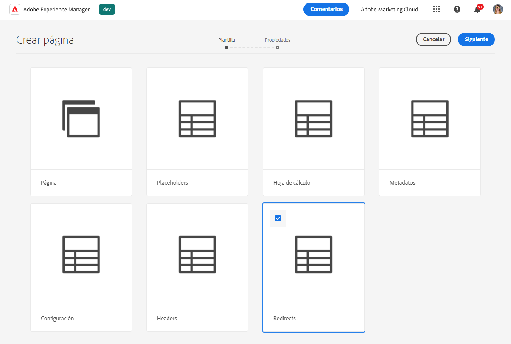
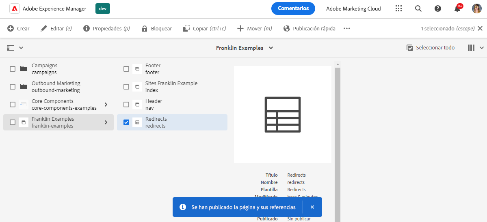
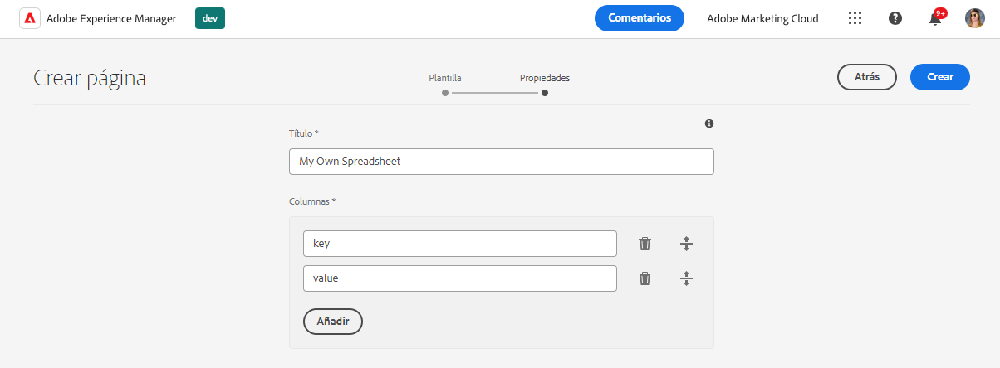

# Uso de hojas de cálculo para administrar datos tabulares {#tabular-data}

AEM Aprenda a utilizar hojas de cálculo para administrar los datos tabulares para varios valores, como metadatos y redirecciones para su sitio de con Edge Delivery Services.

{{aem-authoring-edge-early-access}}

## Casos de uso {#use-cases}

AEM Para cualquier con el sitio de Edge Delivery Services, es necesario mantener listas de datos tabulares como para asignaciones de clave-valor. Pueden ser listas de muchos valores diferentes, como metadatos y redirecciones. Los servicios de entrega perimetral le permiten mantener estas listas tabulares mediante una herramienta intuitiva: la hoja de cálculo. AEM traduce estas hojas de cálculo a archivos JSON que su sitio web o aplicación web puede consumir fácilmente.

Los casos de uso comunes incluyen:

* [Marcadores de posición](/help/edge/docs/placeholders.md)
* [Metadatos](/help/edge/docs/bulk-metadata.md)
* [Encabezados](/help/edge/docs/custom-headers.md)
* [Redireccionamientos](/help/edge/docs/redirects.md)
* [Configuraciones](/help/edge/docs/setup-byo-cdn-push-invalidation.md) como para configuraciones de CDN

Además, puede [creación de hojas de cálculo](#own-spreadsheet) de cualquier estructura para almacenar asignaciones para sus propios fines.

Este documento utiliza el ejemplo de las redirecciones para ilustrar cómo crear dichas hojas de cálculo. Consulte los temas vinculados anteriormente en la documentación de Edge Delivery Services para obtener más información sobre cada caso de uso.

>[!TIP]
>
>Para obtener más información sobre cómo funcionan las hojas de cálculo con los Edge Delivery Services en general, consulte el documento [Hojas de cálculo y JSON.](/help/edge/developer/spreadsheets.md)

>[!TIP]
>
>Las hojas de cálculo solo deben utilizarse para mantener datos tabulares. Para almacenar datos estructurados, [AEM consulte las funciones sin encabezado de la.](/help/headless/introduction.md)

## Requisitos previos {#prerequisites}

AEM Para crear asignaciones con hojas de cálculo en el proyecto de la con Edge Delivery Services, debe haber creado el sitio con la última plantilla del sitio.

Consulte el documento [AEM Guía de introducción para desarrolladores para la creación de contenido con Edge Delivery Services en la creación de](/help/edge/edge-dev-getting-started.md) para obtener más información.

## Creación de una hoja de cálculo {#spreadsheet}

AEM En este ejemplo, se crea una hoja de cálculo para administrar las redirecciones del sitio de con Edge Delivery Services. Los mismos pasos se aplican a [otros tipos de hoja de cálculo](#other) que desea crear.

1. AEM Inicie sesión en la instancia de creación as a Cloud Service de la, vaya a **Sites** y vaya a la raíz del sitio, que requiere una hoja de cálculo. Haga clic o pulse **Crear** -> **Página**.

   

1. En el **Plantilla** del asistente crear página, toque o haga clic en **Redirecciones** plantilla para seleccionarla y luego tocar o hacer clic en **Siguiente**.

   

1. El **Propiedades** del asistente presenta los valores predeterminados para la hoja de cálculo de redirecciones. Haga clic o pulse en **Crear**.

   * **Título** - Deje este valor tal cual.
   * **Columnas** : las columnas mínimas necesarias para redirecciones se rellenan previamente.
      * **origen** - La página que se va a redirigir
      * **destino** - La página a la que redirigir

   

1. En el **Correcto** diálogo, toque o haga clic **Abrir**.

   

1. Se abre una nueva pestaña con la hoja de cálculo cargada en un editor con el **origen** y **destino** columnas. Para definir las redirecciones, toque o haga clic en la fila vacía del **origen** columna. Los cambios se guardan automáticamente al editar la hoja de cálculo.

   

   * El **origen** es relativo al dominio del sitio web, por lo que solo contiene la ruta relativa.
   * El **destino** puede ser una dirección URL completa si está redirigiendo a un sitio web diferente o puede ser una ruta relativa si está redireccionando dentro de su propio sitio web.
   * Utilice la tecla de tabulación para desplazar el enfoque a la siguiente celda.
   * El editor añade nuevas filas a la hoja de cálculo según sea necesario.
   * Para eliminar o mover una fila, utilice el **Eliminar** al final de cada fila y los controladores de arrastre al principio de cada fila, respectivamente.

1. Cuando haya terminado de definir las redirecciones, cierre la pestaña y vuelva a la **Sites** consola.

1. Toque o haga clic para seleccionar la hoja de cálculo de redirecciones que ha creado en la consola y, a continuación, toque o haga clic **Publicación rápida** en la barra de acciones para publicar la hoja de cálculo.

   

1. En el **Publicación rápida** diálogo, toque o haga clic **Publish**.

   

1. Un titular confirma la publicación.

   

La hoja de cálculo de redirecciones ahora está publicada y es accesible públicamente.

## Actualizar paths.json {#paths-json}

AEM Para que los usuarios puedan consumir los datos de la hoja de cálculo, debe actualizar también la hoja de cálculo de `paths.json` del proyecto.

1. Abra la raíz del proyecto en GitHub.

1. Haga clic o pulse en `paths.json` para abrir sus detalles y, a continuación, el **Editar** icono.

   

1. Agregue una línea para asignar la nueva hoja de cálculo a una `redirects.json` recurso.

   ```json
   {
     "mappings": [
      "/content/<site-name>/:/",
      "/content/<site-name>/redirects:/redirects.json"
     ]
   }
   ```

1. Clic **Confirmar cambios...** para guardar los cambios en `main`.

   * Compromiso con `main` o cree una solicitud de extracción de acuerdo con su proceso.

Una vez que los cambios en `paths.json` Cuando se combinan, las redirecciones se activan para el sitio.

## Otros tipos de hoja de cálculo {#other}

Ahora que sabe cómo crear una hoja de cálculo de redirecciones, puede crear cualquier otro tipo de hoja de cálculo estándar:

* Marcadores de posición
* Metadatos
* Encabezados
* Configuración

Simplemente siga los mismos pasos en las secciones [Crear hoja de cálculo](#spreadsheet) y [Actualizar paths.json](#paths-json) y elija la plantilla adecuada y actualice el `paths.json` archivo correctamente.

Además, puede hacer lo siguiente [crear su propia hoja de cálculo](#own-spreadsheet) con columnas arbitrarias para su propio uso.

>[!NOTE]
>
>AEM No es necesario crear una hoja de cálculo para administrar la indexación de los proyectos de as a Cloud Service con Edge Delivery Services.
>
>Si desea crear sus propios índices, [siga esta documentación](https://www.aem.live/developer/indexing#setting-up-more-index-configurations) para crear los suyos propios `helix-query.yaml` archivo.

## Crear su propia hoja de cálculo {#own-spreadsheet}

1. Siga los mismos pasos en la sección [Crear hoja de cálculo.](#spreadsheet)

1. Al seleccionar la plantilla, elija **Hoja de cálculo**.

1. En el **Propiedades** del asistente, puede agregar sus propias columnas.

   

   * En el **Columnas** , toque o haga clic en **Añadir** para añadir una nueva columna.
   * Asigne un nombre a la columna.
   * Elimine o reorganice las columnas utilizando **Eliminar** y arrastre los iconos de control, respectivamente.

1. Cree la hoja de cálculo y publíquela según las instrucciones de la hoja de cálculo de redirecciones.

1. Añada una asignación a `paths.json` según las instrucciones de la hoja de cálculo de redirecciones.
