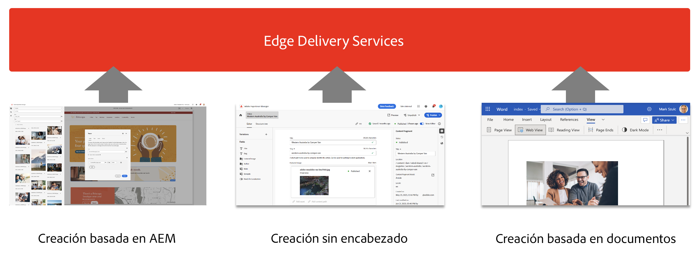
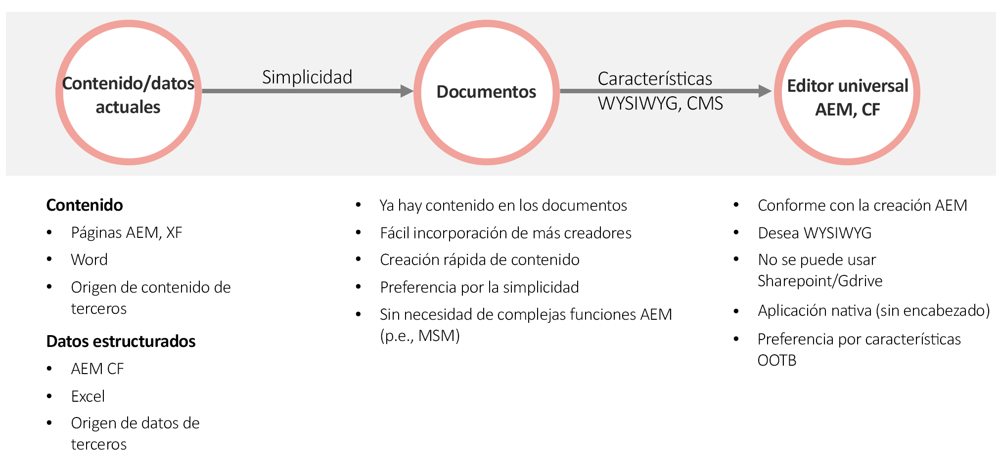

# Uso de Edge Delivery Services {#usingedge}

Con Edge Delivery Services, puede crear entornos de desarrollo rápidos en los que los autores pueden actualizar y publicar contenido rápidamente y en los que se pueden iniciar nuevos sitios rápidamente. Con este fin, puede trabajar con varias fuentes de contenido en el mismo sitio web y la publicación se realizará sin problemas y optimizada, independientemente de la fuente elegida. Como tal, tan solo se tarda un par de segundos en pasar de la edición a ver el contenido en directo en Internet.

Edge Delivery Services está disociado de la fuente de contenido y puede ingerir contenido de diferentes fuentes de contenido.

La ingesta desde múltiples fuentes de contenido ofrece la máxima flexibilidad al usuario.  Adobe ofrece directrices para ayudarle a elegir las fuentes de contenido que mejor se adaptan a su proyecto.

Hay casos en los que el origen de contenido está predefinido o no es flexible (por ejemplo, el proyecto no puede utilizar Sharepoint o Google Drive). Pero en muchos casos, la herramienta no está predeterminada y la elección de la herramienta no es evidente.

El principio rector del Adobe es la simplicidad.  Comience con la creación basada en documentos y añada complejidad cuando sea necesario.  Si se necesita un cambio de herramienta, la integración de Edge Delivery Services de AEM cubre la migración de contenido.

## Creación {#authoring-edge}

Con Edge Delivery Services, la creación es fácil, rápida y flexible.  Puede optar por crear utilizando la creación basada en documentos o la creación en AEM con el Editor universal.

Consulte el documento [Creación de contenido para Edge Delivery Services](authoring.md) para obtener más información.

## Publicación {#publishing-edge}

Con Edge Delivery Services, la publicación de contenido se realiza sin problemas independientemente de la fuente de contenido. 

Consulte el documento [Publicación de contenido para Edge Delivery Services](publishing.md) para obtener más información.

## El desarrollo de {#developing-edge}

Edge Delivery Services se basa en el concepto de bloques. AEM incluye una completa biblioteca de bloques predefinidos, que se puede ampliar para satisfacer las necesidades de cada proyecto.  El código de los proyectos de Edge Delivery Services se administra en GitHub.

Consulte el documento [Desarrollo para Edge Delivery Services](developing.md) para obtener más información.

## Proyectos AEM existentes {#existing-projects}

No es necesario esperar a tener un nuevo proyecto AEM para beneficiarse de Edge Delivery Services.  Edge Delivery Services se puede integrar en su proyecto AEM existente para que pueda aprovechar inmediatamente sus mejoras de rendimiento.

Consulte el documento [Uso de Edge Delivery Services con proyectos AEM existentes](existing-projects.md) para obtener más información.
