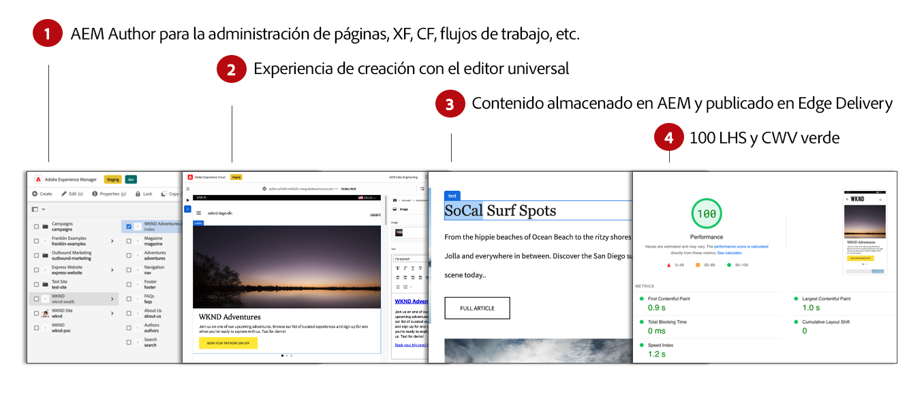
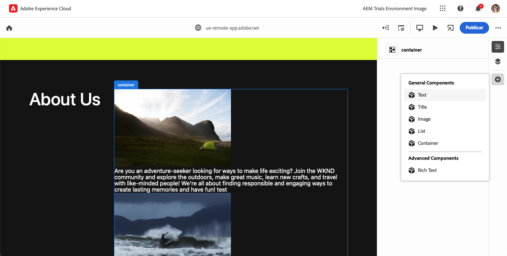
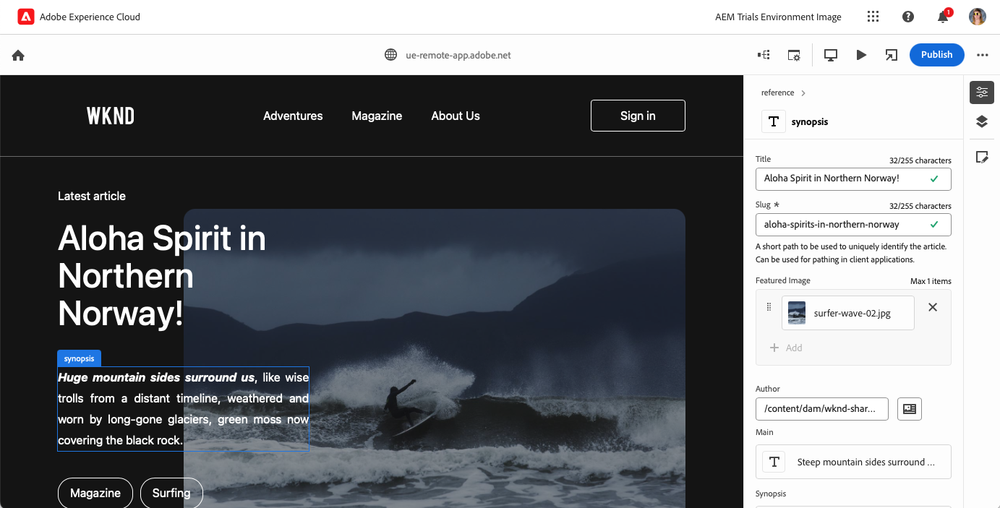

# Creación de contenido WYSIWYG para Edge Delivery Services {#authoring-edge}

Con Edge Delivery Services, la creación es fácil, rápida y flexible.  Tiene dos opciones para crear contenido para Edge Delivery Services:

* [Editor universal](#universal-editor): una moderna interfaz de usuario de tipo “lo que ve es lo que obtiene” (WYSIWYG) para la creación de contenido en AEM.
* [Creación basada en documentos](#document-based), como Microsoft Word o Google Docs

## Creación del Editor universal {#universal-editor}

Cuando se utilizan Edge Delivery Services con AEM as a Cloud Service, el hecho más fundamental para comprender es que el contenido que crea persiste en AEM as a Cloud Service.

1. [El entorno de creación de AEM Sites](/help/sites-cloud/authoring/quick-start.md) se utiliza para la administración de contenido, como la creación de nuevas páginas, fragmentos de experiencias, fragmentos de contenido, etc.
   * Todas las funciones de AEM están disponibles, como flujos de trabajo, MSM, traducción, lanzamientos, etc.
1. [El editor universal](/help/sites-cloud/authoring/universal-editor/authoring.md) se utiliza para crear el contenido gestionado en AEM.
   * El editor universal ofrece una interfaz de usuario nueva y moderna para la creación de contenido.
   * Para la creación, AEM procesa el HTML, pero incluye los scripts, estilos, iconos y otros recursos de los Edge Delivery Services.
   * Aunque se utiliza el Editor universal, todos los cambios se mantienen en AEM.
   * El editor universal aún no tiene paridad de características con el editor de páginas de AEM y es posible que algunas características de AEM no estén disponibles en el editor universal.
1. El contenido que crea con el editor universal y persiste en AEM se publica en los Edge Delivery Services.
   * El contenido permanece almacenado en AEM.
   * AEM renderiza el HTML semántico necesario para la ingesta.
   * El contenido se publica en Edge Delivery Services.
1. [Edge Delivery Services](/help/edge/developer/keeping-it-100.md) garantizan una puntuación del 100 % en Lighthouse.

Los bloques son componentes fundamentales de una página que envían los Edge Delivery Services. Los autores pueden elegir entre bloques predeterminados proporcionados como estándar por Adobe o entre bloques personalizados para su proyecto por los desarrolladores.

El editor universal ofrece una interfaz gráfica de usuario moderna e intuitiva para crear su contenido añadiendo y organizando bloques.

Los detalles de los bloques se pueden configurar en el panel Propiedades.

Para obtener más información sobre cómo crear contenido con el editor universal, consulte el documento [Creación de contenido con el editor universal](/help/sites-cloud/authoring/universal-editor/authoring.md).

Consulte la [Guía de introducción de desarrolladores para la creación WYSIWYG con Edge Delivery Services](/help/edge/wysiwyg-authoring/edge-dev-getting-started.md) y aprenda a crear su propio proyecto con AEM y Edge Delivery Services.

## Métodos de creación adicionales  {#authoring-methods}

La creación WYSIWYG es una herramienta potente e intuitiva para autores de contenido. Sin embargo, existen muchos casos de uso de creación diferentes, por lo que AEM ofrece soluciones de creación adicionales.

Consulte el documento [Información general sobre Edge Delivery Services](/help/edge/overview.md#authoring-method) para obtener más información sobre las soluciones de creación que ofrece AEM, incluida la creación basada en documentos y sin encabezado.
