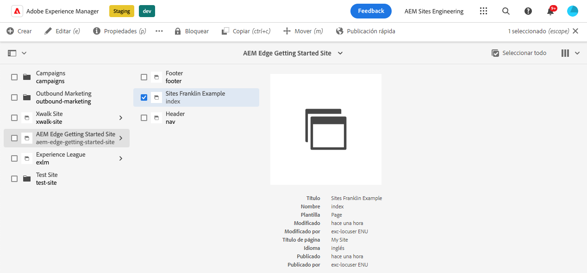
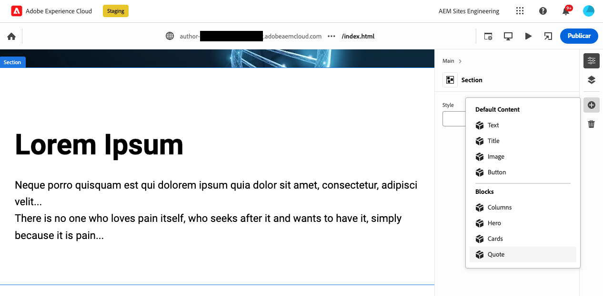
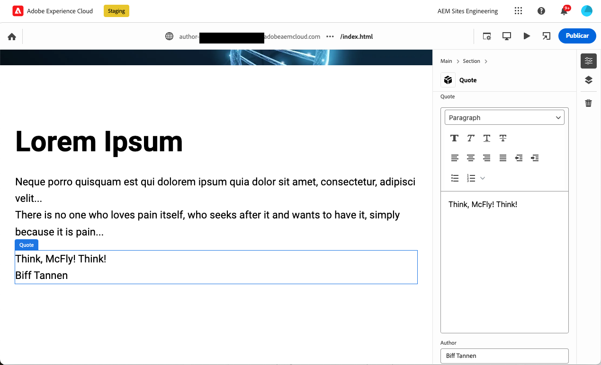
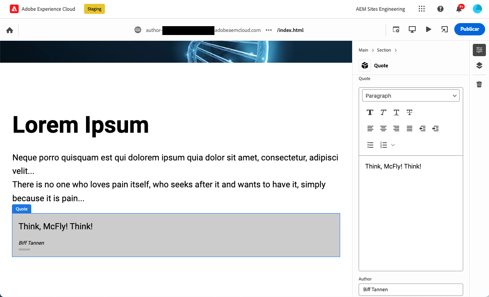

# Creación de bloques instrumentados para su uso con el editor universal {#create-block}

Aprenda a crear bloques instrumentados para utilizarlos con el editor universal en la creación WYSIWYG con proyectos de Edge Delivery Services.

## Requisitos previos {#prerequisites}

Esta guía proporciona instrucciones paso a paso para crear bloques instrumentados para el editor universal en la creación WYSIWYG con proyectos de Edge Delivery Services.  Abarca la adición de componentes, la carga de definiciones de componentes en el editor universal, la publicación de páginas, la implementación de decoración y estilos de bloque, la introducción de los cambios en la producción y su verificación. Al completar esta guía, puede crear e implementar un nuevo bloque para su propio proyecto.

Esta guía requiere necesariamente conocimientos existentes sobre la creación WYSIWYG con proyectos de Edge Delivery Services, así como con el editor universal.  Antes de comenzar esta guía, ya debería tener acceso a Edge Delivery Services y estar familiarizado con sus conceptos básicos, incluidos los siguientes:

* Ha completado el [tutorial de Edge Delivery Services](/help/edge/developer/tutorial.md).
* Tiene acceso a una [zona protegida de AEM Cloud Service](/help/implementing/cloud-manager/getting-access-to-aem-in-cloud/introduction-sandbox-programs.md).
* Ha [habilitado el editor universal en el mismo entorno de zona protegida](/help/implementing/universal-editor/getting-started.md).
* Ha completado la [Guía de introducción para desarrolladores para la creación WYSIWYG con Edge Delivery Services](/help/edge/wysiwyg-authoring/edge-dev-getting-started.md).

Esta guía se basa en el trabajo realizado en la guía [Guía de introducción para desarrolladores para la creación WYSIWYG con Edge Delivery Services](/help/edge/wysiwyg-authoring/edge-dev-getting-started.md).

## Adición de un nuevo bloque al proyecto {#add-block}

En esta guía, creará un bloque para incluir una cita memorable en su página.

Para simplificar este ejemplo, se realizan todos los cambios en la rama `main` del repositorio del proyecto. Por supuesto, para su proyecto real, [debe seguir las prácticas recomendadas de desarrollo](https://www.aem.live/docs/dev-collab-and-good-practices) al elaborar en una rama diferente y revisar todos los cambios mediante una solicitud de extracción antes de fusionarlo en `main`.

Adobe recomienda desarrollar bloques en un enfoque de tres fases:

1. Cree la definición y el modelo para el bloque, revíselo y llévelo a producción.
1. Cree contenido con el nuevo bloque.
1. Implemente la decoración y los estilos para el nuevo bloque.

El siguiente ejemplo de bloque de comillas sigue este enfoque.

### Crear la definición y el modelo del bloque {#create-block-model}

1\. Clone localmente el proyecto de GitHub que ha creado en la [Guía de introducción para desarrolladores para la creación WYSIWYG con Edge Delivery Services](/help/edge/wysiwyg-authoring/edge-dev-getting-started.md) y ábralo en un editor de su elección.

* El código Microsoft se utiliza aquí con fines ilustrativos.


2\. Edite el [`component-definition.json`archivo](/help/implementing/universal-editor/component-definition.md) en la raíz del proyecto, añada la siguiente definición para el nuevo bloque de comillas y guarde el archivo.

>[!BEGINTABS]

>[!TAB Ejemplo de JSON]

```json
{
  "title": "Quote",
  "id": "quote",
  "plugins": {
    "xwalk": {
      "page": {
        "resourceType": "core/franklin/components/block/v1/block",
        "template": {
          "name": "Quote",
          "model": "quote",
          "quote": "<p>Think, McFly! Think!</p>",
          "author": "Biff Tannen"
        }
      }
    }
  }
}
```

>[!TAB Captura de pantalla]


>[!ENDTABS]

3\. Edite el archivo `component-models.json` en la raíz del proyecto y añada la siguiente [definición de modelo](/help/implementing/universal-editor/field-types.md#model-structure) para el nuevo bloque de presupuesto; guarde el archivo.

* Consulte el documento [Modelado de contenido para la creación WYSIWYG con proyectos de Edge Delivery Services](/help/edge/wysiwyg-authoring/content-modeling.md) para obtener más información acerca de lo que es importante tener en cuenta al crear modelos de contenido.

>[!BEGINTABS]

>[!TAB Ejemplo de JSON]

```json
{
  "id": "quote",
  "fields": [
     {
       "component": "richtext",
       "name": "quote",
       "value": "",
       "label": "Quote",
       "valueType": "string"
     },
     {
       "component": "text",
       "valueType": "string",
       "name": "author",
       "label": "Author",
       "value": ""
     }
   ]
}
```

>[!TAB Captura de pantalla]


>[!ENDTABS]

4\. Edite el archivo [`component-filters.json`](/help/implementing/universal-editor/filtering.md) en la raíz del proyecto y añada el bloque de comillas a la [definición de filtro](/help/implementing/universal-editor/filtering.md) para permitir que el bloque se añada a cualquier sección y guarde el archivo.

>[!BEGINTABS]

>[!TAB Ejemplo de JSON]

```json
{
  "id": "section",
  "components": [
    "text",
    "image",
    "button",
    "title",
    "hero",
    "cards",
    "columns",
    "quote"
   ]
}
```

>[!TAB Captura de pantalla]


>[!ENDTABS]

5\. Con Git, confirme estos cambios en su rama `main`.

* El compromiso con `main` sólo tiene fines ilustrativos. [Siga las prácticas recomendadas](https://www.aem.live/docs/dev-collab-and-good-practices) y utilice una solicitud de extracción para el trabajo real del proyecto.

### Creación de contenido con el bloque {#create-content}

Ahora que el bloque de comillas básico está definido y comprometido con el proyecto de muestra, puede agregar un bloque de comillas a una página existente.

1. En un explorador, inicie sesión en AEM as a Cloud Service. [Mediante la consola de Sites](/help/sites-cloud/authoring/basic-handling.md), vaya al sitio que creó en la [Guía de introducción para desarrolladores para la creación WYSIWYG con Edge Delivery Services](/help/edge/wysiwyg-authoring/edge-dev-getting-started.md) y seleccione una página.

   * En este caso, `index` se utiliza con fines ilustrativos.

   

1. Haga clic o pulse **Editar** en la barra de herramientas de la consola y se abre el editor universal.

   * Para cargar la página, es posible que tenga que tocar o hacer clic en **Iniciar sesión con Adobe** para autenticarse en AEM en el editor universal.

1. En el Editor universal, seleccione una sección. En el panel de propiedades, pulse o haga clic en el icono de **Añadir** y, a continuación, seleccione el nuevo bloque **Cita** del menú.

   * El icono **Añadir** es un símbolo más.
   * Sabe que ha seleccionado una sección si el contorno azul del objeto seleccionado tiene una etiqueta **Sección**.
   * En este ejemplo, tocar o hacer clic ligeramente por encima del encabezado **Lorem Ipsum** selecciona una sección que contiene el encabezado y el texto de lorem ipsum.

   

1. La página se vuelve a cargar y el bloque de cita se añade al final de la sección seleccionada con el contenido predeterminado especificado en el archivo `component-definitions.json`.

   * El bloque de cita se puede seleccionar y editar como cualquier otro bloque local o en el panel de propiedades.
   * El estilo se aplicará en un paso posterior.

   

1. Una vez que esté satisfecho con el contenido de su cita, puede publicar la página tocando o haciendo clic en el botón **Publicar** en la barra de herramientas del Editor universal.

1. Compruebe que el contenido se haya publicado navegando a la página publicada. El vínculo es similar al siguiente `https://<branch>--<repo>--<owner>.aem.page`

   

### Aplicar estilo al bloque {#style-block}

Ahora que tiene un bloque de cita de trabajo, puede aplicarle estilo.

1\. Vuelva al editor del proyecto.

2\. Cree una carpeta `quote` dentro de la carpeta `blocks`.


3\. En la nueva carpeta `quote`, añada un archivo `quote.js` para implementar la decoración de bloques añadiendo el siguiente JavaScript y guarde el archivo.

>[!BEGINTABS]

>[!TAB Ejemplo de JavaScript]

```javascript
export default function decorate(block) {
  const [quoteWrapper] = block.children;
 
  const blockquote = document.createElement('blockquote');
  blockquote.textContent = quoteWrapper.textContent.trim();
  quoteWrapper.replaceChildren(blockquote);
}
```

>[!TAB Captura de pantalla]


>[!ENDTABS]

4\. En la carpeta `quote`, añada un archivo `quote.css` para definir el estilo del bloque añadiendo el siguiente código CSS y guarde el archivo.

>[!BEGINTABS]

>[!TAB Ejemplo de CSS]

```css
.block.quote {
    background-color: #ccc;
    padding: 0 0 24px;
    display: flex;
    flex-direction: column;
    margin: 1rem 0;
}
 
.block.quote blockquote {
    margin: 16px;
    text-indent: 0;
}
 
.block.quote > div:last-child > div {
    margin: 0 16px;
    font-size: small;
    font-style: italic;
    position: relative;
}
 
.block.quote > div:last-child > div::after {
    content: "";
    display: block;
    position: absolute;
    left: 0;
    bottom: -8px;
    height: 5px;
    width: 30px;
    background-color: darkgray;
}
```

>[!TAB Captura de pantalla]


>[!ENDTABS]

5\. Con Git, confirme estos cambios en su rama `main`.

* El compromiso con `main` sólo tiene fines ilustrativos. [Siga las prácticas recomendadas](https://www.aem.live/docs/dev-collab-and-good-practices) y utilice una solicitud de extracción para el trabajo real del proyecto.

6\. Vuelva a la pestaña del explorador del editor universal donde estaba editando la página del proyecto y vuelva a cargar la página para ver el bloque con estilo.

7\. Vea el bloque de cita ahora con estilo en la página.



8\. Compruebe que los cambios se hayan insertado en producción navegando a la página publicada. El vínculo es similar al siguiente `https://<branch>--<repo>--<owner>.aem.page`


Enhorabuena. Ahora tiene un bloque de cita completamente funcional y con estilo. Puede utilizar este ejemplo como base para diseñar sus propios bloques específicos de proyectos.

### Opciones de bloque {#block-options}

Si necesita que un bloque tenga un aspecto o un comportamiento ligeramente diferente en función de determinadas circunstancias, pero no lo suficientemente diferente como para convertirse en un nuevo bloque en sí mismo, puede permitir que los autores elijan entre las [opciones de bloque](content-modeling.md#type-inference).

Añadiendo una propiedad `classes` al bloque, la propiedad se representa en el encabezado de tabla para bloques simples o como lista de valores para elementos en un bloque de contenedor.

```json
{
  "id": "simpleMarquee",
  "fields": [
    {
      "component": "text",
      "valueType": "string",
      "name": "marqueeText",
      "value": "",
      "label": "Marquee text",
      "description": "The text you want shown in your marquee"
    },
    {
      "component": "select",
      "name": "classes",
      "value": "",
      "label": "Background Color",
      "description": "The marquee background color",
      "valueType": "string",
      "options": [
        {
          "name": "Red",
          "value": "bg-red"
        },
        {
          "name": "Green",
          "value": "bg-green"
        },
        {
          "name": "Blue",
          "value": "bg-blue"
        }
      ]
    }
  ]
}
```

## Uso de otras ramas de trabajo {#other-branches}

Esta guía le indica que se ha comprometido directamente con la rama `main` en aras de la simplicidad. Para la experimentación en un repositorio de muestra, esto no suele ser un problema. Para el trabajo real del proyecto, [debe seguir las prácticas recomendadas de desarrollo](https://www.aem.live/docs/dev-collab-and-good-practices) desarrollando en una rama diferente y revisando todos los cambios mediante una solicitud de extracción antes de combinar en `main`.

Cuando no esté desarrollando en la rama `main`, puede anexar `?ref=<branch>` en la barra de ubicación del Editor universal para cargar la página desde la rama. `<branch>` es el nombre de la rama que se usaría para la vista previa del proyecto o las URL activas, p. ej. `https://<branch>--<repo>--<owner>.aem.page`.

## Reutilización de bloques para la creación basada en documentos {#reusing-blocks}

Puede utilizar los bloques que cree para la creación WYSIWYG con el editor universal para la creación basada en documentos si se adhiere al mismo modelo de contenido.

Consulte el documento [Bloques para WYSIWYG y creación basada en documentos](/help/edge/wysiwyg-authoring/wysiwyg-doc-blocks.md) para obtener más información.

## Siguientes pasos {#next-steps}

Ahora que sabe cómo crear bloques, es esencial comprender cómo modelar contenido de una manera semántica para lograr una experiencia de desarrollador ágil.

Consulte el documento [Modelado de contenido para la creación WYSIWYG con proyectos de Edge Delivery Services](/help/edge/wysiwyg-authoring/content-modeling.md) para saber cómo funciona el modelado de contenido para la creación WYSIWYG con proyectos de Edge Delivery Services.

>[!TIP]
>
>Para obtener un tutorial completo sobre cómo crear un nuevo proyecto de Edge Delivery Services que esté habilitado para la creación WYSIWYG con AEM as a Cloud Service como fuente de contenido, vea [este seminario web de GEM de AEM](https://experienceleague.adobe.com/es/docs/events/experience-manager-gems-recordings/gems2024/aem-authoring-and-edge-delivery).
