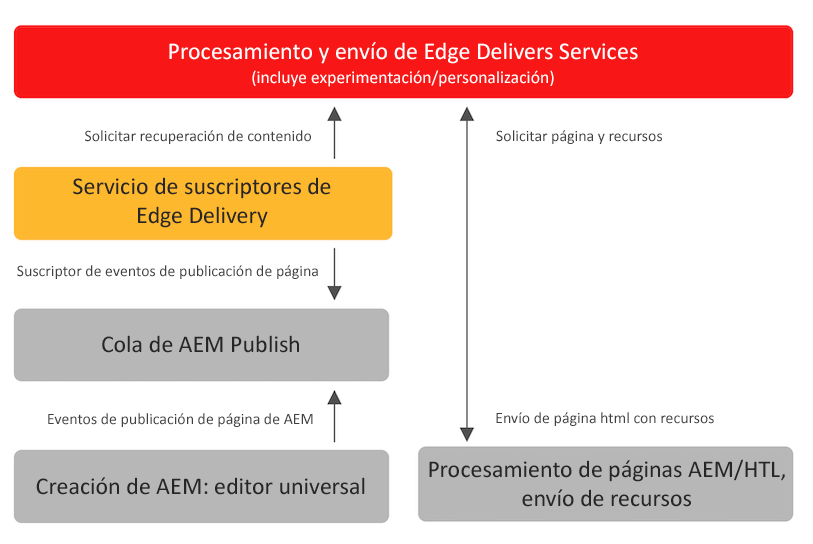

# Publicación de contenido para Edge Delivery Services {#publishing-edge}

Con Edge Delivery Services, la publicación de contenido se realiza sin problemas independientemente de la fuente de contenido:

* Contenido basado en documentos: consulte la [sección Publicar](/help/edge/docs/authoring.md) en la documentación de Edge Delivery Services.
* Contenido de AEM: consulte los detalles que se indican a continuación.

## Flujo de publicación de AEM {#publishing-flow}

Cuando se utiliza el editor universal para crear contenido de AEM, publicar es algo tan sencillo como hacer clic en el botón **Publicar** del editor universal. Consulte el documento [Publicación de contenido con el editor universal](/help/sites-cloud/authoring/universal-editor/publishing.md).

El flujo de información durante la publicación es el siguiente. Una vez que el autor inicia la publicación, este flujo es automático y se ilustra aquí con fines informativos.

>[!NOTE]
>
>Se permiten hasta un máximo de 5000 rutas publicadas desde la interfaz de usuario de creación o por flujos de trabajo al día. No se admiten integraciones que creen cargas de trabajo de publicación masiva. Si su proyecto requiere una capacidad mayor, propóngala para el [Programa VIP](https://www.aem.live/vip/intake).

1. El autor del contenido publica contenido de AEM en el editor universal.
1. Un evento de publicación se envía a la cola de canalización de Adobe.
1. El servicio de publicación de Edge Delivery reenvía los eventos relevantes a la API de administrador de Edge Delivery.
1. Edge Delivery extrae e introduce HTML semántico del autor de AEM.
1. AEM se actualiza con el estado de la publicación.

>[!NOTE]
>
>De forma predeterminada, la API de administrador de Edge Delivery Services no está protegida y se puede utilizar para publicar o cancelar la publicación de documentos sin autenticación. Para configurar la autenticación para la API de administrador tal como se documenta en [Configuración de la autenticación para autores](https://www.aem.live/docs/authentication-setup-authoring), el proyecto debe estar aprovisionado con una API_KEY, que otorga acceso al servicio de publicación. [Póngase en contacto con el equipo de Adobe en Slack](/help/edge/docs/slack.md) para obtener ayuda.

