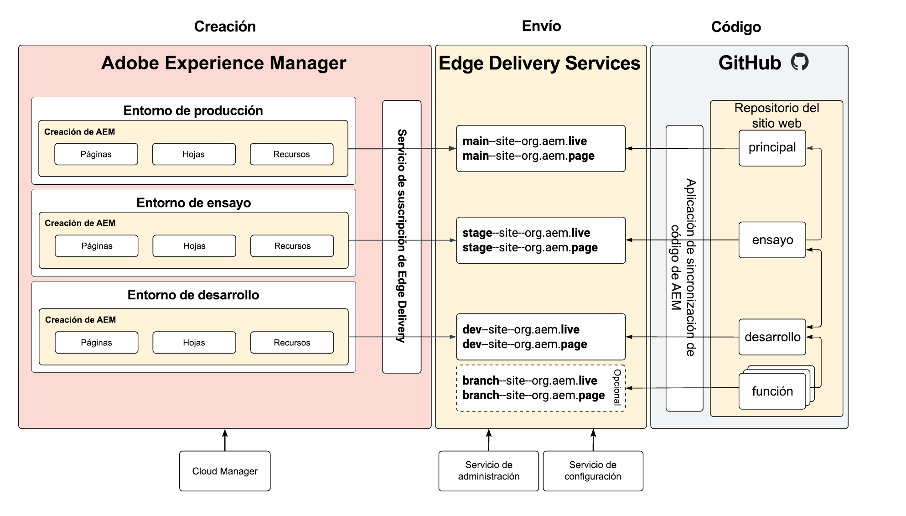

# Entornos de ensayo y producción sin repositorio {#repoless-stage-prod}

Aprenda a configurar sitios independientes para los entornos de ensayo y producción aprovechando una sola base de código de forma independiente.

## Información general {#overview}

Es posible que desee configurar un sitio para el entorno de producción aparte del entorno de ensayo. Configurar un segundo sitio para una configuración de ensayo y producción independiente es similar a la [configuración necesaria para la administración de varios sitios](/help/edge/wysiwyg-authoring/repoless-msm.md). De hecho, se puede combinar con estructuras de sitio de MSM si es necesario.

Este documento utiliza el ejemplo típico de entornos de ensayo y producción independientes. Puede crear entornos independientes para cualquier entorno que desee.

## Requisitos  {#requirements}

Para configurar los entornos de fase y producción de repoless, primero debe completar las siguientes tareas:

* Este documento supone que ya ha creado un sitio para su proyecto basado en la [Guía de introducción para desarrolladores de WYSIWYG Authoring with Edge Delivery Services.](/help/edge/wysiwyg-authoring/edge-dev-getting-started.md)
* Ya debe haber [habilitado la característica de reutilización para su proyecto.](/help/edge/wysiwyg-authoring/repoless.md)

## Configuración {#configuration}

En este documento se describe cómo configurar un sitio de producción independiente para el proyecto utilizando la misma base de código. Se realizan las siguientes suposiciones.

* El sitio de ensayo ya está configurado y ahora desea crear una configuración para el sitio de producción.
* La estructura de contenido en la creación de AEM es similar.
* Se utilizarán las mismas asignaciones de ruta para el ensayo y la producción.

En este ejemplo, suponemos que ya se ha creado un sitio de producción para el proyecto llamado wknd, cuyo repositorio de GitHub también se llama wknd.

Para configurar un sitio de producción independiente hay que seguir dos pasos.

1. [Cree nuevos sitios de Edge Delivery Services para su entorno de producción](#create-edge-site).
1. [Actualice la configuración de nube en AEM para su sitio de producción](#update-cloud-configuration).

### Crear nuevos sitios de Edge Delivery Services para el entorno de producción {#create-edge-site}

1. Recupere el token de autenticación y la cuenta técnica para su programa.
   * Consulte el documento **Reutilización del código en varios sitios** para obtener más información sobre cómo [obtener el token de acceso](/help/edge/wysiwyg-authoring/repoless.md#access-token) y la [cuenta técnica](/help/edge/wysiwyg-authoring/repoless.md#access-control) para su programa.
1. Cree un nuevo sitio realizando la siguiente llamada al servicio de configuración. Tenga en cuenta:
   * El nombre del proyecto en la URL de POST debe ser el nuevo nombre del sitio que está creando. En este ejemplo, es `wknd-prod`.
   * La configuración de `code` debe ser la misma que utilizó para la creación inicial del proyecto.
   * `content` > `source` > `url` debe adaptarse al nombre del nuevo sitio que está creando. En este ejemplo, es `wknd-prod`.
   * Es decir, el nombre del sitio en la URL de POST y `content` > `source` > `url` deben ser iguales.
   * Adapte el bloque `admin` para definir los usuarios que deben tener acceso administrativo completo al sitio.
      * Es una matriz de direcciones de correo electrónico.
      * Se puede usar el comodín `*`.
      * Consulte el documento [Configuración de la autenticación para autores](https://www.aem.live/docs/authentication-setup-authoring#default-roles) para obtener más información.

   ```text
   curl --request POST \
     --url https://admin.hlx.page/config/<your-github-org>/sites/wknd-prod.json \
     --header 'x-auth-token: <your-token>' \
     --header 'Content-Type: application/json' \
     --data '{
       "code": {
           "owner": "<your-github-org>",
           "repo": "wknd",
           "source": {
               "type": "github",
               "url": "https://github.com/<your-github-org>/wknd"
           }
       },
       "content": {
           "source": {
               "url": "https://author-p<programID>-e<environmentID>.adobeaemcloud.com/bin/franklin.delivery/<your-github-org>/wknd-prod/main",
               "type": "markup",
               "suffix": ".html"
           }
       },
       "access": {
           "admin": {
               "role": {
                   "admin": [
                       "<email>@<domain>.<tld>"
                   ],
                   "config_admin": [
                       "<tech-account-id>@techacct.adobe.com"
                   ]
               },
               "requireAuth": "auto"
           }
       }
   }'
   ```

1. Añada la asignación de ruta para el nuevo sitio realizando la siguiente llamada al servicio de configuración.

   ```text
   curl --request POST \
     --url https://admin.hlx.page/config/<your-github-org>/sites/wknd-prod/public.json \
     --header 'x-auth-token: <your-token>' \
     --header 'Content-Type: application/json' \
     --data '{
       "paths": {
           "mappings": [
               "/content/wknd/:/"
           ],
           "includes": [
               "/content/wknd/"
           ]
       }
   }'
   ```

Compruebe que la configuración pública del nuevo sitio funcione llamando a `https://main--wknd-prod--<your-github-org>.aem.page/config.json` y verificando el contenido del JSON devuelto.

### Actualizar las configuraciones de nube en AEM para el sitio de producción {#update-cloud-configuration}

El AEM de producción debe configurarse para utilizar los nuevos sitios de Edge Delivery que creó en la sección anterior para un sitio de producción dedicado. En este ejemplo, el contenido bajo `/content/wknd` en su entorno de producción necesita saber cómo usar el sitio `wknd-prod` que creó.

1. Inicie sesión en la instancia de producción de AEM y vaya a **Herramientas** -> **Cloud Services** -> **Configuración de Edge Delivery Services**.
1. Seleccione la configuración que se creó automáticamente para su proyecto.
1. Pulse o haga clic en **Propiedades** en la barra de herramientas.
1. En la ventana **Configuración de Edge Delivery Services**:
   * Proporcione su organización de GitHub en el campo **Organización**.
   * Cambie el nombre del sitio por el nombre del sitio que creó en la sección anterior. En este caso, sería `wknd-prod`.
   * Cambie el tipo de proyecto a **aem.live con la configuración de repoless**.
1. Haga clic o pulse en **Guardar y cerrar**.

## Verifique su configuración {#verify}

Ahora que ha realizado todos los cambios de configuración necesarios, compruebe que todo funciona según lo esperado.

1. Inicie sesión en la instancia de creación de producción de AEM.
1. Vaya a la consola **Sitios**. Para ello, vaya a **Navegación** -> **Sitios**.
1. Seleccione una página del sitio.
1. Toque o haga clic en **Editar** en la barra de herramientas.
1. Asegúrese de que la página se procesa correctamente en el editor universal y utiliza el mismo código que la raíz del sitio.
1. Realice un cambio en la página y vuelva a publicar.
1. Visite su nuevo sitio de Edge Delivery Services para esa página en `https://main--wknd-prod--<your-github-org>.aem.page`.

Si ve los cambios realizados, la configuración del sitio de producción independiente funciona correctamente.

## Uso {#usage}

Una vez que haya configurado el proyecto con entornos de ensayo y producción reutilizados, puede administrar el código para ellos de forma independiente. El diagrama siguiente ilustra la relación del contenido en los distintos entornos de AEM, los sitios de Edge Delivery Services y los repositorios de GitHub.


