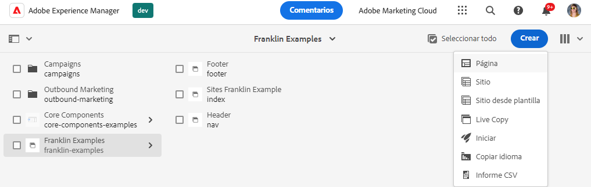
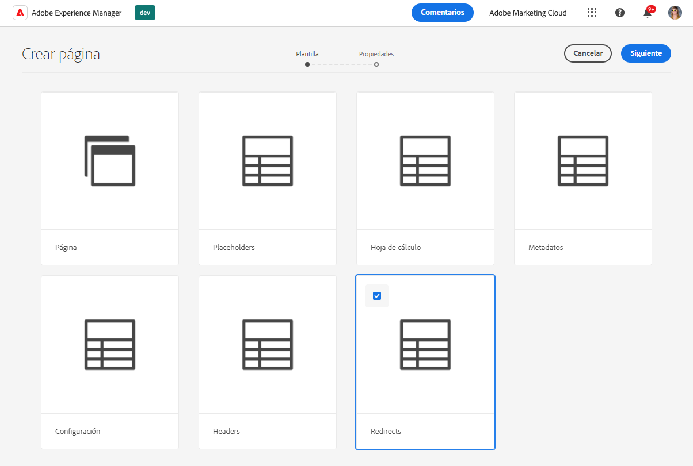
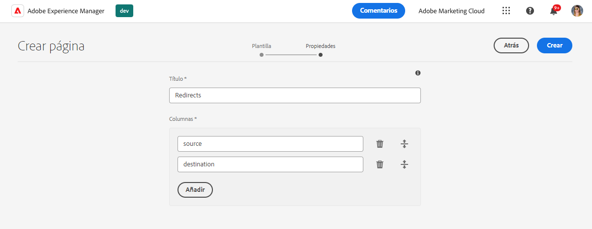
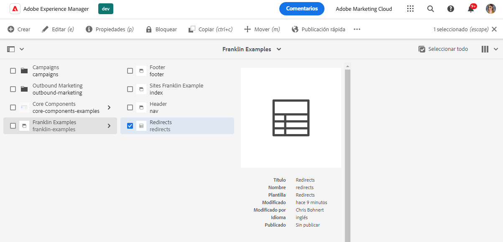
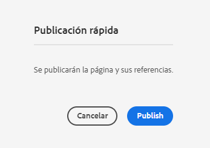
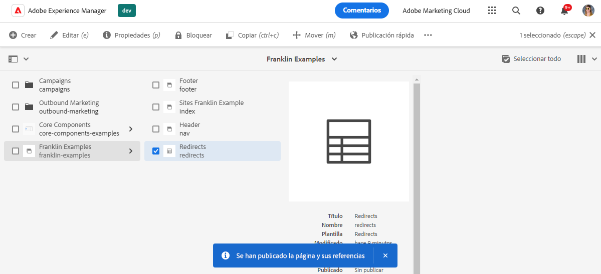
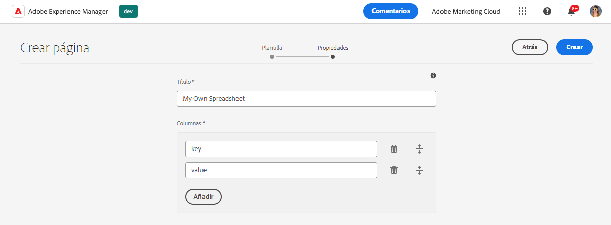

# Uso de hojas de cálculo para administrar datos tabulares {#tabular-data}

Aprenda a utilizar hojas de cálculo para administrar los datos tabulares para varios valores, como metadatos y redirecciones para su sitio de AEM con Edge Delivery Services.

## Casos de uso {#use-cases}

Para cualquier sitio de AEM con Edge Delivery Services, existe la necesidad de mantener listas de datos tabulares, como en el caso de las asignaciones clave-valor. Pueden ser listas de muchos valores diferentes, como metadatos y redirecciones. Edge Deliver Services le permite mantener estas listas tabulares mediante una herramienta intuitiva: la hoja de cálculo. AEM convierte estas hojas de cálculo a archivos JSON que su sitio web o aplicación web puede consumir fácilmente.

Los casos de uso comunes incluyen:

* [Marcadores de posición](/help/edge/docs/placeholders.md)
* [Metadatos](/help/edge/docs/bulk-metadata.md)
* [Encabezados](/help/edge/docs/custom-headers.md)
* [Redireccionamientos](/help/edge/docs/redirects.md)
* [Configuraciones](/help/edge/docs/setup-byo-cdn-push-invalidation.md) como para configuraciones de CDN

Además, puede [crear sus hojas de cálculo](#own-spreadsheet) de cualquier estructura para almacenar asignaciones para sus propios fines.

Este documento utiliza el ejemplo de los redireccionamientos para ilustrar cómo crear dichas hojas de cálculo. Consulte los temas vinculados anteriormente en la documentación de Edge Delivery Services para obtener más información detallada sobre cada caso de uso.

>[!TIP]
>
>Para obtener más información sobre cómo funcionan las hojas de cálculo con Edge Delivery Services en general, consulte el documento [Hojas de cálculo y JSON](/help/edge/developer/spreadsheets.md).

>[!TIP]
>
>Las hojas de cálculo solo deben utilizarse para mantener datos tabulares. Para almacenar datos estructurados, [consulte las funciones sin encabezado de AEM](/help/headless/introduction.md).

## Requisitos previos {#prerequisites}

Para crear asignaciones con hojas de cálculo en su proyecto de AEM con Edge Delivery Services, debe haber creado el sitio con la última plantilla del sitio.

Consulte el documento [Guía de introducción del desarrollador para la creación WYSIWYG con Edge Delivery Services](/help/edge/wysiwyg-authoring/edge-dev-getting-started.md) para obtener más información.

## Creación de una hoja de cálculo {#spreadsheet}

En este ejemplo, se crea una hoja de cálculo para administrar los redireccionamientos del sitio de AEM con Edge Delivery Services. Los mismos pasos se aplican a [otros tipos de hoja de cálculo](#other) que quiera crear.

1. Inicie sesión en la instancia de creación de AEM as a Cloud Service, vaya a la consola **Sities** y a la raíz del sitio, que requiere una hoja de cálculo. Haga clic o pulse **Crear** -> **Página**.

   

1. En la pestaña **plantilla** del asistente de creación de página, toque o haga clic en la plantilla **redireccionamiento** para seleccionarla y luego toque o haga clic en **siguiente**.

   

1. La pestaña **Propiedades** del asistente presenta los valores predeterminados para la hoja de cálculo de redireccionamientos. Haga clic o pulse en **Crear**.

   * **Título**: deje este valor como está.
   * **Columnas**: las columnas mínimas necesarias para redireccionamientos se rellenan previamente.
      * **origen**: la página que se va a redirigir
      * **destino**: la página a la que va a redirigir

   

1. En el cuadro de diálogo **Éxito**, toque o haga clic en **Abrir**.

   

1. Se abre una nueva pestaña con la hoja de cálculo cargada en el editor con las columnas **origen** y **destino**. Para definir los redireccionamientos, toque o haga clic en la fila vacía de la columna **origen**. Los cambios se guardan automáticamente al editar la hoja de cálculo.

   

   * El **origen** es relativo al dominio del sitio web, por lo que solo contiene la ruta relativa.
   * El **destino** puede ser una dirección URL completa si se está redirigiendo a un sitio web diferente o puede ser una ruta relativa si se está redirigiendo dentro de su propio sitio web.
   * Utilice la tecla de tabulación para desplazar el enfoque a la siguiente celda.
   * El editor añade nuevas filas a la hoja de cálculo según sea necesario.
   * Para eliminar o mover una fila, utilice el icono **Eliminar** al final de cada fila y los controladores de arrastre al principio de cada fila, respectivamente.

## Importación de datos de hojas de cálculo {#importing}

Además de editar las hojas de cálculo en el editor de páginas de AEM, también puede importar datos de un archivo CSV.

1. Al editar la hoja de cálculo en AEM, pulse o haga clic en el botón **Cargar** en la parte superior izquierda de la pantalla.
1. En la lista desplegable, seleccione cómo desea importar los datos.
   * **Reemplazar documento** para reemplazar el contenido de toda la hoja de cálculo con el contenido del archivo CSV que va a cargar.
   * **Anexar al documento** para anexar los datos del archivo CSV que cargará al contenido de la hoja de cálculo existente.
1. En el cuadro de diálogo que se abre, seleccione el archivo CSV y, a continuación, toque o haga clic en **Abrir**.

Se abre un cuadro de diálogo a medida que se procesa la importación. Una vez finalizada, los datos del archivo CSV se añaden al contenido de la hoja de cálculo o lo sustituyen. Si se encuentran errores como discrepancias en las columnas, se informa de ellos para que pueda corregir el archivo CSV.

>[!NOTE]
>
>* Los encabezados del archivo CSV deben coincidir exactamente con las columnas de la hoja de cálculo.
>* La importación de todo el CSV no modifica los encabezados de columna, solo las filas de contenido.
>* Si necesita actualizar las columnas, debe hacerlo en el editor de páginas de AEM antes de realizar la importación del CSV.
>* Un archivo CSV no puede tener más de 10 MB para importar.

Según su selección de `mode`, también puede `create`, `replace` o `append` a las hojas de cálculo utilizando un comando CSV y un comando cURL similar al siguiente.

```text
curl --request POST \
  --url http://<aem-instance>/bin/asynccommand \
  --header 'content-type: multipart/form-data' \
  --form file=@/path/to/your.csv \
  --form spreadsheetPath=/content/<your-site>/<your-spreadsheet> \
  --form 'spreadsheetTitle=Your Spreadsheet' \
  --form cmd=spreadsheetImport \
  --form operation=asyncSpreadsheetImport \
  --form _charset_=utf-8 \
  --form mode=append
```

La llamada devuelve una página de HTML con información sobre el ID de trabajo.

```text
Message | Job(Id:2024/9/18/15/27/5cb0cacc-585d-4176-b018-b684ad2dfd02_90) created successfully. Please check status at Async Job Status Navigation.
```

[Puede usar la consola **Trabajos**](/help/operations/asynchronous-jobs.md) para ver el estado del trabajo o usar el ID devuelto para consultarlo.

```text
https://<aem-instance>/bin/asynccommand?optype=JOBINF&jobid=2024/10/24/14/1/8da63f9e-066b-4134-95c9-21a9c57836a5_1
```

## Publicación de un archivo path.json de una hoja de cálculo {#paths-json}

Para que AEM pueda publicar los datos en la hoja de cálculo, también debe actualizar el archivo `paths.json` del proyecto.

1. Abra la raíz del proyecto en GitHub.

1. Haga clic o pulse en el archivo `paths.json` para abrir sus detalles y, a continuación, el icono **Editar**.

   

1. Agregue una línea para asignar la nueva hoja de cálculo a un recurso `redirects.json`.

   ```json
   {
     "mappings": [
      "/content/<site-name>/:/",
      "/content/<site-name>/redirects:/redirects.json"
     ]
   }
   ```

   >[!NOTE]
   >
   >Esta entrada `paths.json` se basa en el ejemplo de creación de redireccionamientos utilizando datos tabulares. Asegúrese de actualizar la ruta correspondiente al [tipo de hoja de cálculo que va a crear](#other).

1. Haga clic en **Confirmar cambios…** para guardar los cambios en `main`.

   * Confirme con `main` o cree una solicitud de extracción de acuerdo con su proceso.

1. Cuando haya terminado de definir las redirecciones y haya actualizado la asignación de ruta, vuelva a la consola **Sites**.

1. Toque o haga clic para seleccionar la hoja de cálculo de redirecciones que ha creado en la consola y, a continuación, toque o haga clic en **Publicación rápida** en la barra de acciones para publicar la hoja de cálculo.

   

1. En el cuadro de diálogo **Publicación rápida**, toque o haga clic en **Publicar**.

   

1. Un banner confirma la publicación.

   

La hoja de cálculo de redirecciones ahora está publicada y se puede acceder públicamente.

>[!TIP]
>
>Para obtener más información acerca de las asignaciones de rutas, consulte el documento [Asignación de rutas para Edge Delivery Services](/help/edge/wysiwyg-authoring/path-mapping.md).

## Otros tipos de hojas de cálculo {#other}

Ahora que sabe cómo crear una hoja de cálculo de redirecciones, puede crear cualquier otro tipo de hoja de cálculo estándar:

* [Marcadores de posición](https://www.aem.live/docs/placeholders)
* [Metadatos](https://www.aem.live/docs/bulk-metadata)
* [Encabezados](https://www.aem.live/docs/custom-headers)
* [Configuración](https://www.aem.live/docs/configuration): como por ejemplo, para la [invalidación de caché](https://www.aem.live/docs/byo-cdn-adobe-managed#setup-push-invalidation)
* [Taxonomía](/help/edge/wysiwyg-authoring/taxonomy.md)

Simplemente, siga los mismos pasos en las secciones [Crear hoja de cálculo](#spreadsheet) y [Actualizar paths.json](#paths-json), elija la plantilla adecuada y actualice el archivo `paths.json` correctamente.

Para [Configuración](https://www.aem.live/docs/configuration), [Encabezados](https://www.aem.live/docs/custom-headers) y [Metadatos](https://www.aem.live/docs/bulk-metadata) asegúrese de añadir una asignación para publicarlos en sus ubicaciones predeterminadas:

* Configuración: `/.helix/config.json`
* Encabezados: `/.helix/headers.json`
* Metadatos: `/metadata.json`
* Taxonomía: consulte el documento [Administración de datos de taxonomía](/help/edge/wysiwyg-authoring/taxonomy.md) para obtener más información.

Además, puede [crear su propia hoja de cálculo](#own-spreadsheet) con columnas arbitrarias para su propio uso.

>[!NOTE]
>
>No es necesario crear una hoja de cálculo para administrar la indexación de los proyectos de AEM as a Cloud Service con Edge Delivery Services.
>
>Si desea crear sus propios índices, [siga esta documentación](https://www.aem.live/developer/indexing#setting-up-more-index-configurations) para crear su propio archivo de `helix-query.yaml`.

## Creación de su propia hoja de cálculo {#own-spreadsheet}

1. Siga los mismos pasos en la sección [Creación de hoja de cálculo](#spreadsheet).

1. Al seleccionar la plantilla, elija **Hoja de cálculo**.

1. En la pestaña **Propiedades** del asistente, puede agregar sus propias columnas.

   

   * En la sección **Columnas**, toque o haga clic en **Añadir** para agregar una nueva columna.
   * Indique un nombre para la columna.
   * Elimine o reorganice las columnas utilizando **Eliminar** y arrastre los iconos de control, respectivamente.

1. Cree la hoja de cálculo y publíquela según las instrucciones de la hoja de cálculo de redirecciones.

1. Añada una asignación al archivo `paths.json` según las instrucciones de la hoja de cálculo de redirecciones.

