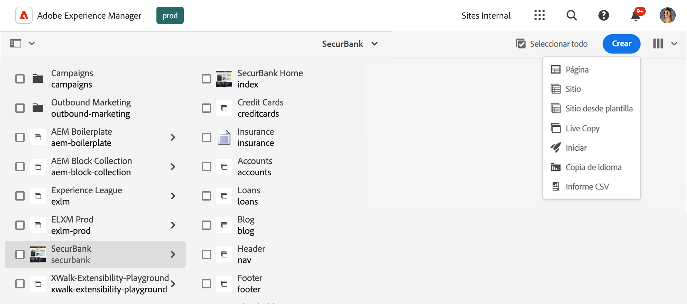
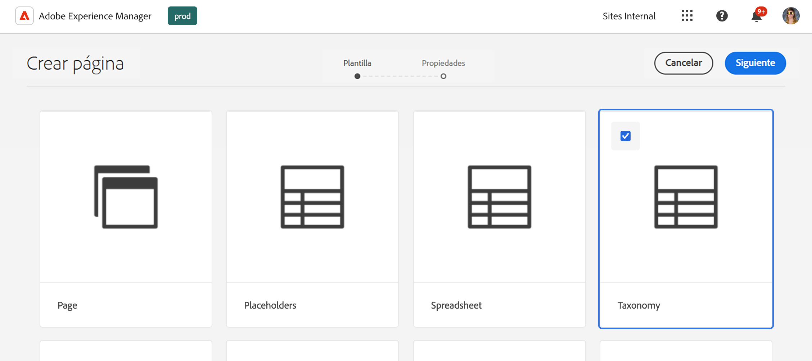
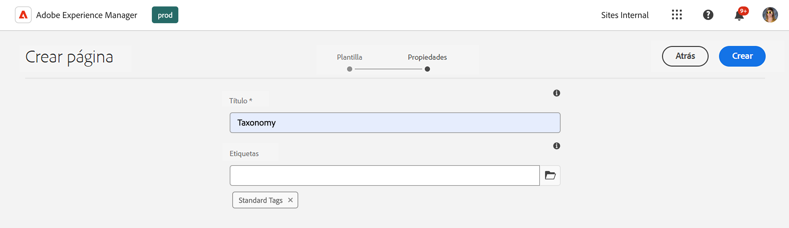
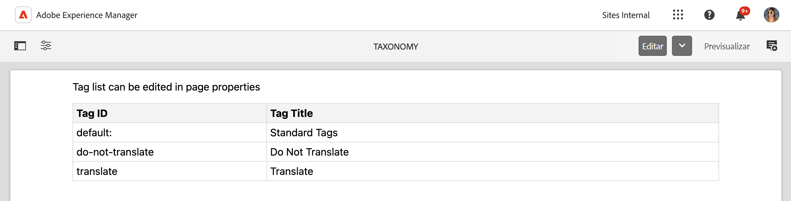
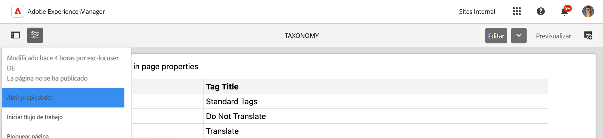
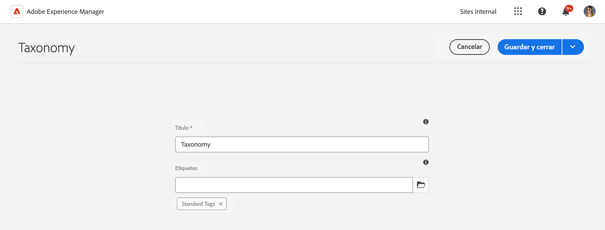

# Administración de datos de taxonomía {#managing-taxonomy-data}

Aprenda a administrar datos de taxonomía para usar etiquetas con AEM con sus sitios de Edge Delivery Services.

## Introducción {#introduction}

El etiquetado es una función importante que le ayuda a organizar y administrar sus páginas. [La consola de etiquetado](/help/sites-cloud/administering/tags.md#tagging-console) de AEM le permite crear una rica taxonomía de etiquetas para organizar sus páginas.

Estas etiquetas son útiles no solo para usted y sus autores a la hora de organizar el contenido, sino que también pueden serlo para sus lectores. Las etiquetas y su taxonomía se pueden utilizar en componentes de la página para ayudar a los lectores a navegar por el contenido.

El editor universal solo funciona con los ID de las etiquetas. Al crear una página de taxonomía para el contenido, se exponen las descripciones de estas etiquetas en todos los idiomas al editor universal para que pueda utilizar esa información al procesar el contenido.

>[!TIP]
>
>Consulte el documento [Definiciones de modelo, campos y tipos de componentes](/help/implementing/universal-editor/field-types.md) para obtener más información sobre el campo Etiqueta de AEM disponible para el editor universal, que puede trabajar con su taxonomía.

## Creación de una página de taxonomía {#creating}

Una taxonomía se crea como [cualquier otra página en AEM](/help/sites-cloud/authoring/sites-console/creating-pages.md).

1. Navegue hasta la consola de [**Sites**](/help/sites-cloud/authoring/sites-console/introduction.md).

1. Seleccione la ubicación donde desea crear la taxonomía.

1. Haga clic o pulse **Crear** -> **Página**.

   

1. En la ficha **Plantilla** del asistente **Crear página**, seleccione la plantilla **Taxonomía** y pulse o haga clic en **Siguiente**.

   

1. En la pestaña **Propiedades** del asistente **Crear página**, proporcione un **Título** significativo para la página y, en el campo **Etiquetas** [, use el selector de etiquetas](/help/sites-cloud/authoring/sites-console/tags.md) para seleccionar las etiquetas o los espacios de nombres que desee incluir en su taxonomía.

   

1. Haga clic o pulse en **Crear**.

Se ha creado la página de taxonomía. En el cuadro de diálogo **Correcto**, puede tocar o hacer clic en **Listo** para descartar el mensaje o en **Abrir** para editar la página en el [Editor de página](/help/sites-cloud/authoring/page-editor/introduction.md).

Tome nota del nombre de página resultante de la página de taxonomía para utilizarlo en los pasos siguientes.

## Edición de una página de taxonomía {#editing}

Se empieza editando una página de taxonomía como cualquier otra página en AEM.

1. Navegue hasta la consola de [**Sites**](/help/sites-cloud/authoring/sites-console/introduction.md).

1. Seleccione la taxonomía que desee editar.

1. Pulse o haga clic en **Editar** en la barra de acciones.

1. Se abrirá el Editor de página, donde se mostrará la taxonomía.

   * La página de taxonomía es de solo lectura en el Editor de página.

   

1. Pulse o haga clic en el icono **Información de la página** de la barra de herramientas y seleccione **Abrir propiedades**.

   

1. En la ventana **Propiedades de página**, puede actualizar el nombre de la página y usar el selector de etiquetas para actualizar las etiquetas y los espacios de nombres incluidos en su taxonomía.

   

1. Haga clic o pulse en **Guardar y cerrar**.

La página mostrada en el Editor de página es de solo lectura porque el contenido de la taxonomía se genera automáticamente a partir de las etiquetas y los espacios de nombres seleccionados. Actúan como una especie de filtro para generar automáticamente el contenido de la taxonomía. Por lo tanto, no es necesario editar directamente la página en el editor.

AEM actualiza automáticamente el contenido de la página de taxonomía cuando se actualizan las etiquetas y los espacios de nombres subyacentes. Sin embargo, debe [volver a publicar la taxonomía](#publishing) después de realizar cualquier cambio para que los cambios estén disponibles para los usuarios.

## Actualizar paths.json para la publicación de taxonomías {#paths-json}

Al igual que cuando [administra y publica datos tabulares para el sitio de Edge Delivery Services](/help/edge/wysiwyg-authoring/tabular-data.md), necesita actualizar el archivo `paths.json` del proyecto para permitir la publicación de los datos de taxonomía.

1. Abra la raíz del proyecto en GitHub.

1. Haga clic o pulse en el archivo `paths.json` para abrir sus detalles y, a continuación, el icono **Editar**.

   

1. Añada una línea para asignar su nueva página de taxonomía a un recurso `.json`.

   ```json
   {
     "mappings": [
      "/content/<site-name>/:/",
      "/content/<site-name>/<taxonomy-page-name>:/<taxonomy-json-name>.json"
     ]
   }
   ```

   * `<taxonomy-page-name>` debe coincidir con el nombre de la página de taxonomía [ que ha creado](#creating).
   * `<taxonomy-json-name>` puede ser cualquier nombre válido que elija.

1. Haga clic en **Confirmar cambios…** para guardar los cambios en `main`.

   * Confirme con `main` o cree una solicitud de extracción de acuerdo con su proceso.

Este proceso solo debe realizarse una vez por página de taxonomía. Una vez finalizado, puede publicar la taxonomía.

>[!TIP]
>
>Para obtener más información acerca de las asignaciones de rutas, consulte el documento [Asignación de rutas para Edge Delivery Services](/help/edge/wysiwyg-authoring/path-mapping.md).

## Publicación de una taxonomía {#publishing}

El editor universal o los usuarios no pueden acceder a una taxonomía hasta que se publique.

Las páginas de taxonomía se publican como cualquier otra página [mediante los iconos **Publicación rápida** o **Administrar publicación** de la barra de herramientas](/help/sites-cloud/authoring/sites-console/publishing-pages.md).

Debe volver a publicar la página de taxonomía cada vez que:

* Edite la página de taxonomía.
* Edite o añada a las etiquetas y espacios de nombres incluidos en la página de taxonomía.

Si crea una nueva página de taxonomía, primero debe [añadir una asignación al archivo `paths.json` del proyecto](#paths-json).

## Acceso a la información de la taxonomía {#accessing}

Una vez publicada la taxonomía, el editor universal puede aprovechar su información y hacerla visible para los usuarios.

Puede acceder a la taxonomía como datos JSON en la siguiente dirección.

`https://<branch>--<repository>--<owner>.aem.page/<taxonomy-json-name>.json`

Utilice el elemento `<taxonomy-json-name>` que ha definido al [asignar la taxonomía al archivo `paths.json` de su proyecto](#paths-json). Los datos de taxonomía se devuelven como datos JSON, como en el ejemplo siguiente.

```json
{
  "total": 3,
  "offset": 0,
  "limit": 3,
  "data": [
    {
      "tag": "default:",
      "title": "Standard Tags"
    },
    {
      "tag": "do-not-translate",
      "title": "Do Not Translate"
    },
    {
      "tag": "translate",
      "title": "Translate"
    }
  ],
  "columns": [
    "tag",
    "title"
  ],
  ":type": "sheet"
}
```

Estos datos JSON se actualizarán automáticamente a medida que actualice la taxonomía y vuelva a publicarla. Su aplicación puede acceder mediante programación a esta información para los usuarios.

[Si mantiene etiquetas en varios idiomas](/help/sites-cloud/administering/tags.md#managing-tags-in-different-languages), puede tener acceso a esos idiomas pasando el código de idioma ISO2 como valor de un parámetro `sheet=`.

## Exposición de propiedades de etiqueta adicionales {#additional-properties}

De manera predeterminada, su taxonomía contendrá los valores `tag` y `title` como se vio [en el ejemplo anterior](#accessing). Puede configurar su taxonomía para exponer propiedades de etiquetas adicionales. En este ejemplo, se muestra la descripción de la etiqueta.

1. Utilice la consola Sitios para seleccionar la taxonomía que creó.
1. Toque o haga clic en el icono **Propiedades** de la barra de herramientas.
1. En la sección **Propiedades adicionales**, pulse o haga clic en **Añadir** para añadir un campo.
1. En el nuevo campo, introduzca el nombre de la propiedad JRC que desea exponer. En este caso, escriba `jcr:description` para la descripción de la etiqueta.
1. Haga clic o pulse en **Guardar y cerrar**.
1. Con la taxonomía aún seleccionada, toque o haga clic en **Publicación rápida** en la barra de herramientas.

Ahora [al acceder a su taxonomía](#accessing), la descripción de la etiqueta (o la propiedad que haya elegido exponer) se incluye en el JSON.

```json
{
  "total": 3,
  "offset": 0,
  "limit": 3,
  "data": [
    {
      "tag": "default:",
      "title": "Standard Tags",
      "jcr:description": "These are the standard tags"
    },
    {
      "tag": "do-not-translate",
      "title": "Do Not Translate",
      "jcr:description": "Tag to mark pages that should not be translated"
    },
    {
      "tag": "translate",
      "title": "Translate",
      "jcr:description": "Tag to mark pages that should be translated"
    }
  ],
  "columns": [
    "tag",
    "title",
    "jcr:description"
  ],
  ":type": "sheet"
}
```
