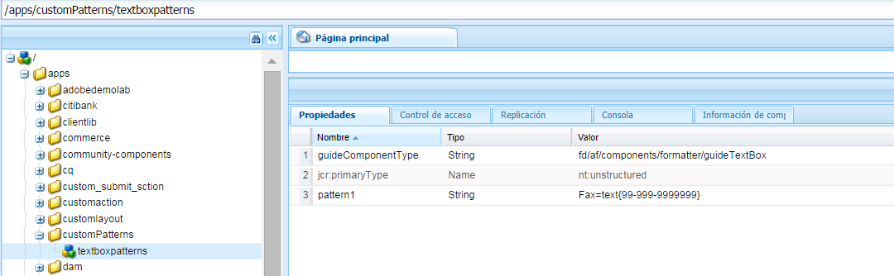

# Expresiones de formularios adaptables {#adaptive-form-expressions}

Los formularios adaptables ofrecen una experiencia de cumplimentación de formularios optimizada y simplificada para los usuarios finales con funciones de scripts dinámicos. Permiten escribir expresiones para agregar varios comportamientos, como mostrar u ocultar campos y paneles dinámicos. También permiten agregar campos calculados, crear campos de solo lectura, agregar lógica de validación y mucho más. El comportamiento dinámico se basa en los datos introducidos por el usuario o rellenados previamente.

JavaScript™ es el lenguaje de expresión de los formularios adaptables. Todas las expresiones son expresiones JavaScript™ válidas y utilizan API de modelos de scripts de formularios adaptables. Estas expresiones devuelven valores de ciertos tipos. Para obtener la lista completa de clases, eventos, objetos y API públicas de los formularios adaptables, consulte [Referencia de la API de la biblioteca JavaScript™ para formularios adaptables](https://helpx.adobe.com/es/experience-manager/6-5/forms/javascript-api/index.html).

## Prácticas recomendadas para escribir expresiones {#best-practices-for-writing-expressions}

* Al escribir expresiones, para acceder a campos y paneles, puede utilizar el nombre del campo o panel. Para acceder al valor de un campo, utilice la propiedad “value”. Por ejemplo, `field1.value`
* Utilice nombres únicos para los campos y paneles de todo el formulario. Ayuda a evitar posibles conflictos con los nombres de campo utilizados al escribir expresiones.
* Cuando escriba expresiones de varias líneas, utilice un punto y coma para terminar un enunciado.

## Prácticas recomendadas para expresiones que implican un panel de repetición {#best-practices-for-expressions-involving-repeating-panel}

Los paneles de repetición son instancias de un panel que se agregan o eliminan de manera dinámica mediante scripts de API o datos rellenados previamente. <!--  For detailed information about using repeating panel, see [creating forms with repeatable sections](creating-forms-repeatable-sections.md). -->

* Para crear un panel de repetición, en el cuadro de diálogo del panel, abra la configuración y establezca el valor del campo de recuento máximo en más de uno.
* El valor de recuento mínimo de la configuración de repetición del panel puede ser uno o más, pero no puede ser superior al valor del recuento máximo.
* Cuando una expresión haga referencia a un campo de panel de repetición, los nombres de campo de la expresión se resolverán en el elemento de repetición más cercano.
* Los formularios adaptables proporcionan algunas funciones especiales para simplificar el cálculo de paneles repetibles, como suma, recuento, mínimo, máximo, filtrar y mucho más. Para obtener la lista completa de funciones, consulte [Referencia de la API de la biblioteca JavaScript™ para formularios adaptables](https://helpx.adobe.com/es/aem-forms/6/javascript-api/af.html)
* Las API para manipular instancias de panel de repetición son las siguientes:

   * Para agregar una instancia de panel: `panel1.instanceManager.addInstance()`
   * Para obtener un índice de repetición de panel: `panel1.instanceIndex`
   * Para obtener el instanceManager de un panel: `_panel1 or panel1.instanceManager`
   * Para quitar una instancia de un panel: `_panel1.removeInstance(panel1.instanceIndex)`

## Tipos de expresión {#expression-types}

En los formularios adaptables, puede escribir expresiones para agregar comportamientos como mostrar/ocultar campos y paneles dinámicos. También puede escribir expresiones para agregar campos calculados, convertir campos en de solo lectura, lógica de validación y mucho más. Los formularios adaptables admiten las siguientes expresiones:

* **[Expresiones de acceso](#access-expression-enablement-expression)**: para habilitar o deshabilitar un campo.
* **[Calcular expresiones](#calculate-expression)**: para calcular automáticamente el valor de un campo.
* **[Expresión de clics](#click-expression)**: para controlar las acciones al hacer clic en un botón.
* **[Script de inicialización](#initialization-script):** realiza una acción sobre la inicialización de un campo.
* **[Expresión de opciones](#options-expression)**: para rellenar dinámicamente una lista desplegable.
* **[Expresión de resumen](#summary)**: para calcular de manera dinámica el título de un acordeón.
* **[Validar expresiones](#validate-expression)**: para validar un campo.
* **[Script de implementación de valor](#value-commit-script):** para cambiar los componentes de un formulario después de cambiar el valor de un campo.
* **[Expresión de visibilidad](#visibility-expression)**: para controlar la visibilidad de un campo y de un panel.
* **[Expresión de finalización de un paso](#step-completion-expression)**: para evitar que un usuario vaya al siguiente paso de un asistente.

### Expresión de acceso (expresión de habilitación) {#access-expression-enablement-expression}

Puede utilizar la expresión “access” para habilitar o deshabilitar un campo. Si la expresión utiliza el valor de un campo, cada vez que cambie el valor del campo, se recuperará la expresión.

**Se aplica a**: campos

**Tipo de devolución**: la expresión devuelve un valor Booleano, que representa si el campo está habilitado o deshabilitado. **true** representa que el campo está habilitado y **false** representa el campo deshabilitado.

**Ejemplo**: Para habilitar un campo solo cuando el valor de **field1** está establecido como **X**, la expresión de acceso es: `field1.value == "X"`

### Expresión “calculate” {#calculate-expression}

La expresión “calculate” se utiliza para calcular automáticamente el valor de un campo mediante una expresión. Normalmente, esta expresión utiliza la propiedad “value” de otros campos. Por ejemplo, `field2.value + field3.value`. Cada vez que el valor de `field2` o `field3`cambia, la expresión se vuelve a habilitar y el valor se vuelve a calcular.

**Se aplica a**: campos

**Tipo de devolución**: la expresión devuelve un valor compatible con el campo en el que se muestra el resultado de la expresión (por ejemplo, decimal).

**Ejemplo**: La expresión “calculate” para mostrar la suma de dos campos en **field1** es:
`field2.value + field3.value`

### Expresión “click” {#click-expression}

La expresión “click” administra las acciones realizadas al hacer clic con un botón. GuideBridge proporciona API para realizar varias funciones, como enviar y validar, que se utilizan junto con la expresión “click”. Para obtener una lista completa de las API, consulte [API de GuideBridge](https://helpx.adobe.com/es/aem-forms/6/javascript-api/GuideBridge.html).

**Se aplica a**: campos de botón

**Tipo de devolución**: La expresión “click” no devuelve ningún valor. Si alguna expresión devuelve un valor, este se ignorará.

**Ejemplo**: Rellenar un cuadro de texto **textbox1** en la acción “click” de un botón con valor **AEM Forms**, la expresión “click” del botón es `textbox1.value="AEM Forms"`

### Script de inicialización {#initialization-script}

El script de inicialización se activa cuando se inicializa un formulario adaptable. Según los escenarios, el script de inicialización se comporta de la siguiente manera:

* Cuando se procesa un formulario adaptable sin un relleno previo de datos, el script de inicialización se ejecuta después de que se inicialice el formulario.
* Cuando se procesa un formulario adaptable con un relleno previo de datos, el script se ejecuta una vez finalizada la operación de rellenado previo.
* Cuando se activa la revalidación del lado del servidor de un formulario adaptable, se ejecuta el script de inicialización.

**Se aplica a:** campos y panel

**Tipo de devolución:** El script de inicialización no devuelve ningún valor. Si alguna expresión devuelve un valor, este se ignorará.

**Ejemplo:** En un escenario de rellenado previo de datos, para rellenar campos con valor predeterminado `'Adaptive Forms'` cuando su valor se guarda como nulo, la expresión del script de inicialización es:
`if(this.value==null) this.value='Adaptive Forms';`

### Expresión “options” {#options-expression}

La expresión “options” se utiliza para rellenar de manera dinámica las opciones de un campo de lista desplegable.

**Se aplica a**: campos de lista desplegable

**Tipo de devolución**: La expresión “options” devuelve una matriz de valores en cadena. Cada valor puede ser una cadena simple, como **Hombre**, o un formato par de clave-valor, como **1=Hombre**

**Ejemplo**: Para rellenar el valor de un campo, en función del valor de otro campo, proporcione una expresión “options” simple. Por ejemplo, para rellenar el campo **Número de niños**, en función del **Estado civil** expresado en otro campo, la expresión es la siguiente:

**`marital_status.value == "married" ? ["1=One", "2=two"] : ["0=Zero"]`.**

Siempre que el valor de **marital_status** cambia, se recupera la expresión. También puede rellenar el menú desplegable desde un servicio REST. <!-- For detailed information, see [Dynamically populating dropdowns](dynamically-populate-dropdowns.md). -->

### Expresión “summary” {#summary}

La expresión “summary” calcula de manera dinámica el título de un panel secundario de un panel con diseño de acordeón. Puede especificar la expresión “summary” en una regla, la cual utiliza un campo de formulario o una lógica personalizada para evaluar el título. La expresión se ejecutará cuando se inicialice el formulario. Si está rellenando previamente un formulario, la expresión se ejecutará después de rellenar previamente los datos o cuando cambie el valor de los campos dependientes utilizados en la expresión.

La expresión “summary” se utiliza generalmente para repetir elementos secundarios de un panel con diseño de acordeón para proporcionar un título significativo a cada panel secundario.

**Se aplica a:** Paneles derivados directamente de un panel cuyo diseño está configurado como acordeón.

**Tipo de devolución:** La expresión devuelve un valor String que se convierte en el título del acordeón.

**Ejemplo:** “Número de cuenta: ” + textbox1.value

### Expresión “validate” {#validate-expression}

La expresión “validate” se utiliza para validar los campos mediante la expresión dada. Normalmente, estas expresiones utilizan expresiones regulares junto con el valor del campo para validar un campo. La expresión se vuelve a habilitar y el estado de validación del campo se vuelve a calcular ante cualquier cambio en el valor de un campo.

**Se aplica a**: campos

**Tipo de devolución**: La expresión devuelve un valor Booleano, que representa el estado de validación del campo. El valor **false** representa que el campo no es válido y **true** representa que el campo es válido. 
**Ejemplo**: Para un campo que representa el código postal del Reino Unido, la expresión de validación es:

(**this.value** &amp;&amp; `this.value.match(/^(GIR 0AA|[A-Z]{1,2}\d[A-Z0-9]? ?[0-9][A-Z]{2}\s*)$/i) == null) ? false : true`

En el ejemplo anterior, si el valor no vacío no coincide con el motivo, la expresión devuelve **false** para indicar que el campo no es válido.

>[!NOTE]
>
>Si escribe una expresión de validación para un campo no obligatorio u obligatorio, la expresión se evaluará independientemente del estado de visibilidad del campo. Para detener la validación de los campos ocultos, establezca en true la propiedad validationsDisabled en el script de inicialización o de implementación de valor. Por ejemplo, `this.validationsDisabled=true`

### Script de implementación de valor {#value-commit-script}

El script de implementación de valor se activa cuando:

* Un usuario cambia el valor de un campo de la IU.
* El valor de un campo cambia de manera programada debido a cambios en otro campo.

**Se aplica a:** campos

**Tipo de devolución:** El valor script de implementación de valor no devuelve ningún valor. Si alguna expresión devuelve un valor, este se ignorará.

**Ejemplo:**Para convertir el caso de los alfabetos introducidos en el campo a mayúsculas en el momento de la confirmación, la expresión de implementación de valor es:
`this.value=this.value.toUpperCase()`

>[!NOTE]
>
>Puede deshabilitar la ejecución del script de implementación de valor cuando el valor de un campo se cambie mediante programación. Para ello, vaya a https://&#39;[server]:[port]&#39;/system/console/configMgr y cambie **Versión de los formularios adaptables por compatibilidad** a **AEM Forms 6.1**. A partir de entonces, el script de implementación de valor solo se ejecutará cuando el usuario cambie el valor del campo de la IU.

### Expresión “visibility” {#visibility-expression}

La expresión “visibility” se utiliza para controlar la visibilidad del campo o panel. Normalmente, la expresión “visibility” utiliza la propiedad “value” de un campo y se recupera cada vez que cambia ese valor.

**Se aplica a**: campos y panel

**Tipo de devolución**: La expresión devuelve un valor Booleano, que representa si el campo o panel es visible o no. **false** representa que el campo o panel no es visible y true representa que el campo o panel es visible.

**Ejemplo**: Para un panel que se vuelve visible solo si el valor de **field1** está configurado como **Hombre**, la expresión de visibilidad es: `field1.value == "Male"`

### Expresión “step completion” {#step-completion-expression}

La expresión “step completion” se utiliza para evitar que un usuario vaya al siguiente paso de un diseño de asistente. Esta expresión se utiliza cuando los paneles tienen un diseño de asistente (formularios de varios pasos que muestran un paso a la vez). El usuario puede pasar al siguiente paso, panel o subsección solo si todos los valores requeridos de la sección actual están rellenados y son válidos.

**Se aplica a**: Paneles con diseño de elemento establecido como asistente.

**Tipo de devolución**: La expresión devuelve un valor Booleano, que representa si el panel actual es válido o no. **True** representa que el panel actual es válido y el usuario puede navegar hasta el siguiente panel.

**Ejemplo**: En un formulario organizado en varios paneles, antes de navegar hasta el panel siguiente, se valida el panel actual. En estos casos, se utiliza la expresión “step completion”. Por lo general, estas expresiones utilizan la API de validación de GuideBridge. Un ejemplo de expresión “step completion” es:
`window.guideBridge.validate([],this.panel.navigationContext.currentItem.somExpression)`

## Validaciones en formularios adaptables {#validations-in-adaptive-form}

Existen varios métodos para agregar la validación de campos a un formulario adaptable. Si se agrega una comprobación de validación en un campo, **True** representa que el valor introducido en el campo es válido. **False** representa que el valor no es válido. Si entra y sale de un campo, no se genera el mensaje de error.

Los métodos para agregar validaciones en un campo son los siguientes:

### Requerido {#required}

Para hacer que un componente sea obligatorio, en el diálogo **Editar** del componente, puede seleccionar la opción **Título y texto > Requerido**. También puede agregar el mensaje necesario correspondiente (opcional).

### motivos de validación {#validation-patterns}

Hay varios motivos de validación disponibles para un campo. Para seleccionar un motivo de validación, en el diálogo **Editar** del componente, busque la sección **motivos** y seleccione **motivos**. Puede crear su propio motivo de validación personalizado en un cuadro de texto del **motivo**. Se devuelve el estado de validación **True** solo si los datos rellenados cumplen el motivo de validación, de lo contrario, se devuelve **False**. <!-- To write your own custom validation pattern, see [Picture clause support for HTML5 forms](picture-clause-support.md). -->

### Expresiones de validación {#validation-expressions}

La validación de un campo también se puede calcular mediante expresiones en diferentes campos. Estas expresiones se escriben dentro del campo **Script de validación** de la pestaña **Script** en el diálogo **Editar** de un componente. El estado de validación de un campo depende del valor que devuelva la expresión. Para obtener información sobre cómo escribir estas expresiones, consulte [Expresión “validate”](adaptive-form-expressions.md#p-validate-expression-p).

## Información adicional {#additional-information}

### Uso del formato de visualización de campo {#using-field-display-format}

El formato de visualización puede utilizarse para mostrar los datos en distintos formatos. Por ejemplo, puede utilizar el formato de visualización para mostrar un número de teléfono con guiones, aplicar formato a código postal o a un selector de fechas. Estos motivos de visualización se pueden seleccionar desde la sección **motivos** del cuadro de diálogo Editar de un componente. Puede escribir motivos de visualización personalizados similares a los motivos de validación mencionados anteriormente.

### GuideBridge: API y eventos {#guidebridge-apis-and-events}

GuideBridge es una colección de API que se pueden usar para interactuar con formularios adaptables en el modelo de memoria en un explorador. Para obtener una introducción detallada a la API de Guide Bridge, los métodos de clase y los eventos expuestos, consulte [Referencia de la API de la biblioteca JavaScript™ para formularios adaptables](https://helpx.adobe.com/es/aem-forms/6/javascript-api/).

>[!NOTE]
>
>Se recomienda no utilizar los oyentes de eventos GuideBridge en las expresiones.

#### Uso de GuideBridge en varias expresiones {#guidebridge-usage-in-various-expressions}

* Para restablecer los campos del formulario, puede habilitar la `guideBridge.reset()` API en la expresión “click” de un botón. Del mismo modo, existe una API de envío que puede llamarse expresión “clic” `guideBridge.submit()`.

* Puede usar la API `setFocus()` para establecer el enfoque en varios campos o paneles (para el panel, el enfoque se establece en el primer campo automáticamente). `setFocus()` proporciona una amplia gama de opciones de navegación, como la navegación entre paneles, el desplazamiento anterior/siguiente, el enfoque en un campo concreto, etc. Por ejemplo, para desplazarse al siguiente panel, puede utilizar lo siguiente: `guideBridge.setFocus(this.panel.somExpression, 'nextItem')`

* Para validar un formulario adaptable o sus paneles específicos, utilice `guideBridge.validate(errorList, somExpression).`

#### Utilizar GuideBridge fuera de las expresiones  {#using-guidebridge-outside-expressions-nbsp}

También puede utilizar las API de GuideBridge fuera de las expresiones. Por ejemplo, puede utilizar la API de GuideBridge para establecer la comunicación entre el HTML que aloja el formulario adaptable y el modelo de formulario. Además, puede establecer el valor que proviene del elemento principal de Iframe que aloja el formulario.

Para utilizar la API de GuideBridge para el ejemplo mencionado anteriormente, capture una instancia de GuideBridge. Para capturar la instancia, escuche `bridgeInitializeStart` evento de un objeto`window`:

```javascript
window.addEventListener("bridgeInitializeStart", function(evnt) {

     // get hold of the guideBridge object

     var gb = evnt.detail.guideBridge;

     //wait for the completion of AF

     gb.connect(function (){

        //this function is called after Adaptive Form is initialized

     })

})
```

>[!NOTE]
>
>En AEM, es recomendable escribir código en clientLib e incluirlo en su página (header.jsp o footer.jsp de la página)

Para utilizar GuideBridge después de inicializar el formulario (el evento `bridgeInitializeComplete` es Dispatcher), obtenga la instancia de GuideBridge mediante `window.guideBridge`. Puede comprobar el estado de inicialización de GuideBridge mediante la API `guideBride.isConnected`.

#### Eventos de GuideBridge {#guidebridge-events}

GuideBridge también proporciona ciertos eventos para scripts externos en la página de alojamiento. Los scripts externos pueden escuchar estos eventos y realizar diversas operaciones. Por ejemplo, cada vez que cambia el nombre de usuario en un formulario, también cambia el nombre que se muestra en el encabezado de la página. Para obtener más información sobre estos eventos, consulte [Referencia de la API de la biblioteca JavaScript™ para formularios adaptables](https://helpx.adobe.com/es/aem-forms/6/javascript-api/GuideBridge.html).

Utilice el siguiente código para registrar los controladores:

```javascript
guideBridge.on("elementValueChanged", function (event, data)  {

      // execute some logic when value of a field is changed

});
```

### Crear motivos personalizados para un campo {#creating-custom-patterns-for-a-field}

Como se ha mencionado anteriormente, los formularios adaptables permiten al autor proporcionar patrones para los formatos de validación o visualización. Además de utilizar motivos predeterminados, puede definir motivos personalizados reutilizables para un componente de un formulario adaptable. Por ejemplo, puede definir un campo de texto o un campo numérico. Una vez definidos, se pueden utilizar estos motivos en todos los formularios para un tipo de componente específico. Por ejemplo, puede crear un motivo personalizado para un campo de texto y utilizarlo en los campos de texto de su formulario adaptable. Puede seleccionar el motivo personalizado si accede a la sección motivo del cuadro de diálogo Editar de un componente. <!-- For details about Pattern definition or format, see [Picture clause support for HTML5 forms](picture-clause-support.md).-->

Realice los siguientes pasos para crear un motivo personalizado para un tipo de campo específico y reutilizarlo para otros campos del mismo tipo:

1. Navegue hasta CRXDE Lite de la instancia de autor.
1. Cree una carpeta para mantener los motivos personalizados. En el directorio /apps, cree un nodo de tipo sling::folder. Por ejemplo, cree un nodo con el nombre `customPatterns`. Bajo este nodo, cree otro nodo de tipo `nt:unstructed` y asígnele un nombre `textboxpatterns`. Este nodo contiene los distintos motivos personalizados que desea agregar.
1. Abra la pestaña Propiedades del nodo que ha creado. Por ejemplo, abra la pestaña Propiedades de `textboxpatterns`. Agregue la propiedad `guideComponentType` a este nodo y establezca su valor en *fd/af/components/formatter/guideTextBox*.

1. El valor de esta propiedad varía según el campo para el que desee definir los motivos. Para el campo numérico, el valor de la propiedad `guideComponentType` es *fd/af/components/formatter/guideNumericBox*. El valor del campo Marcador de datos es *fd/af/components/formatter/guideDatepicker*.
``
1. Puede agregar un motivo personalizado al asignar una propiedad al `textboxpatterns` nodo. Agrega una propiedad con un nombre (por ejemplo, `pattern1`) y establece su valor en el motivo que desees agregar. Por ejemplo, agregue una propiedad `pattern1` con el valor Fax=text{99-999-9999999}. El motivo estará disponible para todos los cuadros de texto que utilice en formularios adaptables.

   

   Crear motivos personalizados
