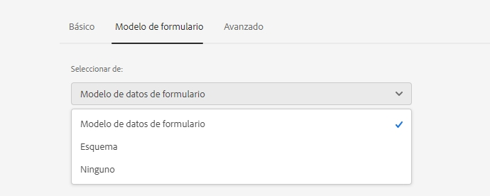
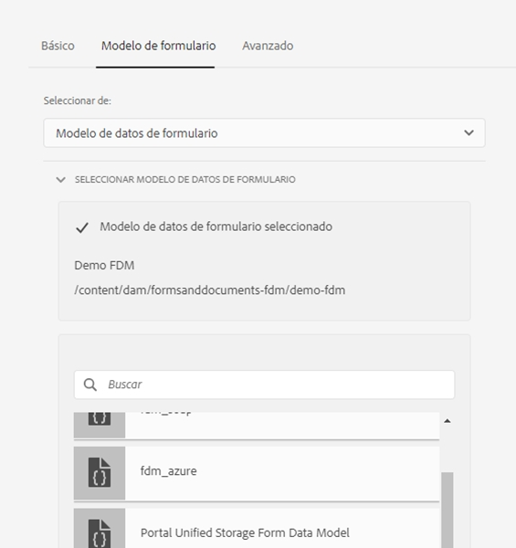

# Crear y utilizar fragmentos de Formularios adaptables en un formulario adaptable basado en componentes principales {#adaptive-form-fragments}

| Versión | Vínculo del artículo |
| -------- | ---------------------------- |
| AEM as a Cloud Service (componentes principales) | Este artículo |
| AEM as a Cloud Service (componentes de base) | [Haga clic aquí](/help/forms/adaptive-form-fragments.md) |
| AEM 6.5 | [Haga clic aquí](https://experienceleague.adobe.com/docs/experience-manager-65/forms/adaptive-forms-basic-authoring/adaptive-form-fragments.html?lang=es) |

Aunque cada formulario está diseñado para un propósito específico, hay algunos segmentos comunes en la mayoría de los formularios, como para proporcionar detalles personales como nombre y dirección, detalles familiares, detalles de ingresos, etc. Los desarrolladores de formularios deben crear estos segmentos comunes cada vez que se crea un nuevo formulario.

Los formularios adaptables proporcionan un mecanismo cómodo para crear segmentos de formulario como un panel o un grupo de campos solo una vez y reutilizarlos. Estos segmentos reutilizables e independientes se denominan fragmentos de formulario adaptables.

Los fragmentos de formulario se integran perfectamente en varios formularios, lo que optimiza la creación de formularios coherentes y de aspecto profesional. Los fragmentos de formulario garantizan la reutilización, la estandarización y la coherencia de la marca mediante la funcionalidad “cambiar una vez y reflejar en todas partes”. Experimente una mayor capacidad de mantenimiento y eficacia, ya que las actualizaciones realizadas en un solo lugar se propagan automáticamente a todos los formularios que utilizan estos fragmentos.

Puede agregar un fragmento varias veces a un documento y utilizar las propiedades de enlace de datos de sus componentes para vincularlo a diferentes fuentes de datos o esquemas. Por ejemplo, puede utilizar el mismo fragmento de dirección para la dirección permanente, de comunicación y de facturación y conectarlo a diferentes campos de un origen de datos o esquema.

>[!NOTE]
>
> Puede personalizar fácilmente la experiencia del fragmento para los usuarios con el cuadro de diálogo [Configurar y el cuadro de diálogo Diseño del componente Fragmento de formulario](https://experienceleague.adobe.com/es/docs/experience-manager-core-components/using/adaptive-forms/adaptive-forms-components/adaptive-form-fragment).

## Crear un fragmento de formulario adaptable {#create-a-fragment}

Puede crear un fragmento de formulario adaptable desde cero o guardar un panel en un formulario adaptable existente como un fragmento. Para crear un fragmento de formulario:

1. Inicie sesión en una instancia de AEM Forms en https://[*hostname*]:[*port*]/aem/forms.html.
1. Haga clic en **Crear > fragmento de formulario adaptable**.

   

1. Especifique el título, el nombre, la descripción y las etiquetas del fragmento. Asegúrese de especificar un nombre único para el fragmento. Si ya existe otro fragmento con el mismo nombre, el fragmento no se creará.
1. Seleccione una plantilla de formulario. Puede crear un fragmento de formulario para formularios adaptables basados en componentes principales o formularios adaptables basados en componentes de base. Para crear un fragmento de formulario para formularios basados en componentes principales, seleccione una plantilla basada en componentes principales.

   Cuando cree un fragmento de formulario para formularios basados en componentes principales, utilice la opción Seleccionar tema de formulario para seleccionar un tema basado en componentes principales.

1. Haga clic para abrir el **modelo de formulario** y desde el menú desplegable **Seleccionar desde**, seleccione uno de los siguientes modelos para el fragmento:

   

   * **Ninguno**: especifica que se cree el fragmento desde cero sin usar ningún modelo de formulario.

     >[!NOTE]
     >
     > En Formularios adaptables, puede utilizar un solo fragmento de formulario (basado en componentes principales) varias veces. Admite fragmentos de formulario basados en ninguno y en esquema.

   * **Esquema**: especifica que se crea el fragmento con un esquema XML o JSON cargado en AEM Forms. Puede cargar o seleccionar entre los esquemas XML disponibles como modelo de formulario para el fragmento. Al seleccionar un esquema XML, también puede crear un fragmento de formulario adaptable seleccionando un complexType presente en el esquema seleccionado del cuadro desplegable **[!UICONTROL Tipo complejo de esquema XML]**. Al seleccionar un esquema JSON, también puede crear un fragmento de formulario adaptable seleccionando una definición de esquema presente en el esquema seleccionado del cuadro desplegable **[!UICONTROL Definiciones de esquema JSON]**.
   * **Modelo de datos de formulario**: especifica que se cree el fragmento mediante un modelo de datos de formulario (FDM). Puede crear un fragmento de formulario adaptable basado en un único objeto de modelo de datos de un modelo de datos de formulario (FDM). Expanda el menú desplegable Definiciones del modelo de datos de formulario (FDM). Esta lista enumera todos los objetos de modelo de datos del modelo de datos de formulario (FDM) especificado. Seleccione un objeto de modelo de datos de la lista.

   

1. Haga clic en **Crear** y luego haga clic en **Abrir** para abrir el fragmento, con una plantilla predeterminada, en el modo de edición. En el modo de edición, puede agregar cualquier componente del formulario adaptable al fragmento.

<!-- For information about Adaptive Form components, see [Introduction to authoring Adaptive Forms](../../forms/using/introduction-forms-authoring.md). --> Además, si ha seleccionado un esquema XML como modelo de formulario para el fragmento, aparecerá una nueva pestaña que mostrará la jerarquía del modelo de formulario en el buscador de contenido. Le permite arrastrar y soltar los elementos del modelo de formulario en el fragmento.<!--The added form-model elements get converted into form components while retaining the original properties from the associated XDP or XSD. -->

Una vez creado el fragmento de formulario adaptable basado en un esquema o modelo de datos de formulario (FDM), los elementos del modelo de datos de formulario (FDM o del esquema aparecen en la pestaña Fuentes de datos del Explorador de contenido en el Editor de formularios adaptables. Puede arrastrar y soltar elementos del modelo de formulario en el fragmento. Los elementos del modelo de formulario agregados se convierten en componentes de formulario, al tiempo que se conservan las propiedades originales del esquema asociado.

## Añadir un fragmento a un formulario adaptable {#insert-a-fragment-in-an-adaptive-form}

Para agregar un fragmento de formulario adaptable en un formulario adaptable, haga lo siguiente:

1. Abra el formulario adaptable en modo de edición.
1. Añada el componente **Fragmento de formulario adaptable** al formulario.
1. Abra el cuadro de diálogo Configuración del componente **Fragmento de formulario adaptable**.
1. Seleccione la **Referencia de fragmento** en la pestaña **Básico**. Aparecerán todos los fragmentos de Formularios adaptables disponibles para el formulario, según el modelo del formulario.

1. Seleccione un fragmento de formulario adaptable en el componente **Fragmento de formulario adaptable** de su formulario adaptable.

   

<!-- >[!NOTE]
   >
   >The Adaptive Form fragment is not enabled for authoring from within the Adaptive Form. Moreover, you cannot use an XSD-based fragment in a JSON-based Adaptive Form and the opposite way. -->

El fragmento de formulario adaptable se inserta por referencia en el formulario adaptable y se sincroniza con el fragmento de formulario adaptable independiente. Esto implica que cualquier modificación realizada en el fragmento de formulario adaptable se reflejará en todas las instancias en las que el fragmento se incorpore a Formularios adaptables.

<!--### Embed a fragment in Adaptive Form {#embed-a-fragment-in-adaptive-form}

You can choose to embed an Adaptive Form fragment in an Adaptive Form by clicking the  icon the panel toolbar of the added fragment

The embedded fragment is no longer linked with the standalone fragment. You can edit the components in the embedded fragment from within the Adaptive Form.-->

<!-- 
## Configure fragment appearance {#configure-fragment-appearance}

Any fragment you insert in Adaptive Forms appears as a placeholder image. The placeholder displays titles of up to a maximum of ten child panels in the fragment. You can configure AEM Forms to show the complete fragment instead of the placeholder image.

Perform the following steps to show complete fragments in forms:

1. Go to AEM web console configuration page at https:[*host*]:[*port*]/system/console/configMgr.

1. Search and click **[!UICONTROL Adaptive Form and Interactive Communication Web Channel Configuration]** to open it in edit mode.
1. Disable **[!UICONTROL Enable Placeholder in place of Fragment]** checkbox to show complete fragments rather than the placeholder image.

-->

### Uso de fragmentos dentro de fragmentos {#using-fragments-within-fragments}

Puede crear fragmentos de formulario adaptable anidados, lo que significa que puede arrastrar y soltar un fragmento en otro fragmento y tener una estructura anidada.

### Uso de un fragmento de formulario varias veces en un formulario adaptable {#using-form-fragment-mutiple-times-in-af}

Puede utilizar un fragmento de formulario basado en esquemas y no basado en esquema varias veces en un formulario adaptable para guardar datos de forma única para cada campo de fragmento de formulario.  Por ejemplo, puede utilizar un fragmento de formulario de dirección para recopilar detalles de dirección para direcciones permanentes, de comunicación y actuales en un formulario de solicitud de préstamo.

## Compatibilidad con la asignación automática para fragmentos de un formulario adaptable

Cuando crea un fragmento de formulario adaptable basado en una definición de esquema JSON, se puede reutilizar automáticamente en formularios creados a partir del mismo esquema.
Si arrastra y suelta un objeto de esquema o cualquier objeto anidado que coincida con la asignación de definición de esquema JSON de un fragmento de formulario adaptable, el objeto se reemplazará por el fragmento de formulario adaptable coincidente. En lugar de añadir un panel con campos individuales, el formulario inserta el fragmento de formulario adaptable asignado.

También puede arrastrar y soltar un fragmento de formulario adaptable enlazado desde la biblioteca de fragmentos de formularios adaptables en el buscador de contenido de AEM y proporcionar la referencia de enlace correcta desde el diálogo Editar componente del panel de fragmentos de formulario adaptable.

## Administrar fragmentos {#manage-fragments}

Puede realizar varias operaciones en los fragmentos de formularios adaptables mediante la interfaz de usuario de AEM Forms.

1. Vaya a `https://[hostname]/aem/forms.html`.

1. Haga clic en **Seleccionar** en la barra de herramientas de la IU de AEM Forms y seleccione un fragmento de formulario adaptable. La barra de herramientas muestra las siguientes operaciones que puede realizar en el fragmento de formulario adaptable seleccionado.

<table>
 <tbody>
  <tr>
   <td>
<strong>Operación</strong>
 </td>
   <td>
<strong>Descripción</strong>
 </td>
  </tr>
  <tr>
   <td>
Editar
 </td>
   <td>
Abre el fragmento de formulario adaptable seleccionado en el modo de edición.    
 </td>
  </tr>
   <tr>
   <td>
Vista previa
 </td>
   <td>
Proporciona opciones para obtener una vista previa del fragmento como HTML o una vista previa personalizada mediante la combinación de datos de un archivo XML con el fragmento. Para obtener más información, consulte <a>Previsualizar un formulario</a>.    
 </td>
  </tr>
  <tr>
   <td>
Descargar
 </td>
   <td>
Descarga el fragmento seleccionado.    
 </td>
  </tr>
  <tr>
   <td>
Iniciar revisión y Administrar revisión
 </td>
   <td>
Permite iniciar y administrar una revisión del fragmento seleccionado. Para obtener más información, consulte <a>Crear y administrar revisiones</a>.    
 </td>
  </tr>
  <tr>
   <td>
Agregar diccionario
 </td>
   <td>
Genera un diccionario para localizar el fragmento seleccionado. Para obtener más información, consulte <a>Localizar formularios adaptables</a>.    
 </td>
  </tr>
  <tr>
   <td>
Publicar o cancelar la publicación
 </td>
   <td>
Publica/cancela la publicación del fragmento seleccionado.    
 </td>
  </tr>
  <tr>
   <td>
Eliminar
 </td>
   <td>
Elimina el fragmento seleccionado.    
 </td>
  </tr>
 </tbody>
</table>

## Puntos clave que se deben recordar al trabajar con fragmentos {#key-points-to-remember-when-working-with-fragments}

* Asegúrese de que el nombre del fragmento sea único. El fragmento no se creará si hay un fragmento existente con el mismo nombre.
* Cualquier expresión, script o estilo de un fragmento de formulario adaptable independiente se conservará cuando se inserte por referencia o se incruste en un formulario adaptable.
* No puede editar un fragmento de formulario adaptable, que se inserte por referencia, desde un formulario adaptable. Para editarlo, modifique el fragmento de formulario adaptable independiente.
* Cuando publique un formulario adaptable, deberá publicar los fragmentos de formulario adaptable independientes insertados por referencia en el formulario adaptable.
* Cuando vuelva a publicar un fragmento de formulario adaptable actualizado, los cambios se reflejarán en las instancias publicadas del formulario adaptable en el que se utilice el fragmento.
* El formulario adaptable que contenga el componente Verificar no admitirá usuarios anónimos. Además, no se recomienda utilizar el componente Verificar en un fragmento de formulario adaptable.

## Fragmentos de referencia {#reference-fragments}

Los fragmentos de formulario adaptables de referencia que se pueden usar para crear el formulario están disponibles.
<!-- For more information, see [Reference Fragments](../../forms/using/reference-adaptive-form-fragments.md). -->

## Ver también {#see-also}

{{see-also}}