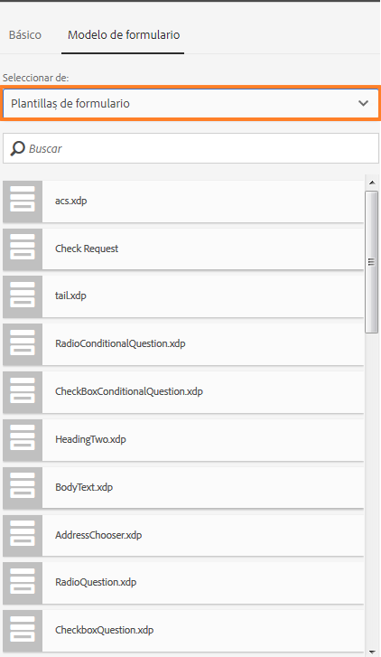
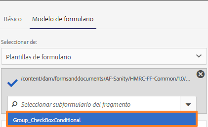
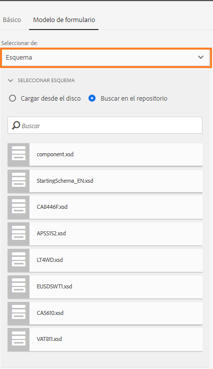
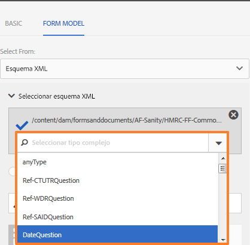
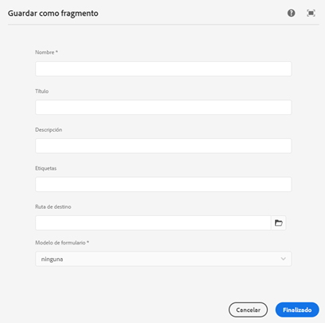
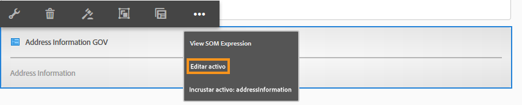
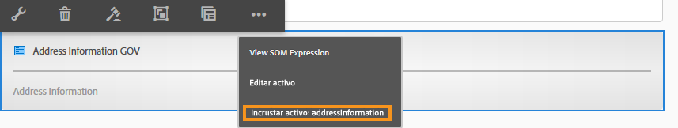

# Fragmentos de formulario adaptable {#adaptive-form-fragments}

| Versión | Vínculo del artículo |
| -------- | ---------------------------- |
| AEM 6.5 | [Haga clic aquí](https://experienceleague.adobe.com/docs/experience-manager-65/forms/adaptive-forms-basic-authoring/adaptive-form-fragments.html?lang=en) |
| AEM as a Cloud Service | Este artículo |

Aunque cada formulario está diseñado para un propósito específico, hay algunos segmentos comunes en la mayoría de las formas, como para proporcionar detalles personales como nombre y dirección, detalles familiares, detalles de ingresos, etc. Los desarrolladores de formularios deben crear estos segmentos comunes cada vez que se crea un nuevo formulario. Los formularios adaptables proporcionan un mecanismo cómodo para crear segmentos de formulario como un panel o un grupo de campos solo una vez y reutilizarlos. Estos segmentos reutilizables e independientes se denominan fragmentos de formulario adaptables.

## Creación de un fragmento {#create-a-fragment}

Puede crear un fragmento de formulario adaptable desde cero o guardar un panel en un formulario adaptable existente como fragmento.

### Crear fragmento desde cero {#create-fragment-from-scratch}

1. Inicie sesión en una [!DNL AEM Forms] instancia de autor en https://[*hostname*]:[*port*]/aem/forms.html.
1. Haga clic en **Crear > fragmento de formulario adaptable**.
1. Especifique el título, el nombre, la descripción y las etiquetas del fragmento.

   >[!NOTE]
   >
   >Asegúrese de especificar un nombre único para el fragmento. Si ya existe otro fragmento con el mismo nombre, el fragmento no se creará.

1. Haga clic para abrir el **modelo de formulario** y desde el menú desplegable **Seleccionar desde**, seleccione uno de los siguientes modelos para el fragmento:

   * **Ninguno**: Especifica que se cree el fragmento desde cero sin usar ningún modelo de formulario.
   * **Plantilla de formulario**: Especifica la creación del fragmento mediante una plantilla XDP cargada en [!DNL AEM Forms]. Seleccione la plantilla XDP adecuada como modelo de formulario para el fragmento.

   

   También se muestran los subformularios marcados como fragmentos en la plantilla de formulario seleccionada. Puede seleccionar un subformulario para el fragmento de formulario adaptable de la lista desplegable.

   

   Además, puede crear un fragmento de formulario adaptable mediante subformularios que no estén marcados como fragmentos en la plantilla de formulario al especificar la expresión SOM para el subformulario en el cuadro desplegable.

   * **Esquema XML**: Especifica que se crea el fragmento con un esquema XML cargado en [!DNL AEM Forms]. Puede cargar o seleccionar entre los esquemas XML disponibles como modelo de formulario para el fragmento.

   

   También puede crear un fragmento de formulario adaptable si selecciona un complexType presente en el esquema seleccionado del cuadro desplegable.

   

1. Haga clic en **Crear** y luego haga clic en **Abrir** para abrir el fragmento, con una plantilla predeterminada, en el modo de edición.

En el modo de edición, puede arrastrar y soltar cualquier componente del formulario adaptable de la barra de tareas de AEM en el fragmento. <!-- For information about Adaptive Form components, see Introduction to authoring Adaptive Forms. -->

Además, si ha seleccionado un esquema XML o una plantilla de formulario XDP como modelo de formulario para el fragmento, aparecerá una nueva pestaña que mostrará la jerarquía del modelo de formulario en el buscador de contenido. Permite arrastrar y soltar elementos del modelo de formulario en el fragmento. Los elementos del modelo de formulario agregados se convierten en componentes de formulario, al tiempo que se conservan las propiedades originales del XDP o XSD asociado.

### Guardar panel como fragmento {#save-panel-as-a-fragment}

1. Abra un formulario adaptable que contenga el panel que desea guardar como fragmento de formulario adaptable.
1. En la barra de herramientas del panel, haga clic en **[!UICONTROL Guardar como fragmento]**. Se abrirá el cuadro de diálogo Guardar como fragmento.

   >[!NOTE]
   >
   >Si el panel que está guardando como fragmento contiene un panel secundario, el fragmento resultante lo incluirá.

1. En el cuadro de diálogo Creación de fragmentos, especifique la siguiente información:

   * **Nombre**: Nombre del fragmento. El valor predeterminado es el nombre de elemento del panel. Es un campo obligatorio.

     >[!NOTE]
     >
     >Asegúrese de especificar un nombre único para el fragmento. Si ya existe otro fragmento con el mismo nombre, el fragmento no se creará.

   * **Título**: Título del fragmento. El valor predeterminado es el título del panel.

   * **Descripción**: Descripción del fragmento.

   * **Etiquetas**: Etiquetas de metadatos para el fragmento.

   * **Ruta del público destinatario**: ruta del repositorio en la que se guarda el fragmento. Si no especifica una ruta, se creará un nodo con el mismo nombre que el del fragmento junto al nodo que contiene el formulario adaptable. El fragmento se guardará en este nodo.

   * **Modelo de formulario**: En función del modelo de formulario para el formulario adaptable, este campo muestra **Esquema XML**, **Plantilla de formulario** o **Ninguno**. Es un campo no editable.

   * **Raíz del modelo de fragmento**: Solo aparece en formularios adaptables basados en XSD. Especifica la raíz del modelo de fragmento. Puede elegir **/** o el tipo complejo XSD de la lista desplegable. Tenga en cuenta que solo puede reutilizar el fragmento en otro formulario adaptable si selecciona el tipo complejo como raíz del modelo de fragmento. 
Si elige **/** como raíz del modelo de fragmento, el árbol XSD completo de la raíz se podrá ver en la pestaña Modelo de datos del formulario adaptable. Para una raíz de modelo de fragmento de tipo complejo, solo los descendientes del tipo complejo seleccionado serán visibles en la pestaña Modelo de datos de formulario adaptable.

   * **XSD Ref**: Solo aparece en formularios adaptables basados en XSD. Muestra la ubicación del esquema XML.

   * **XDP Ref**: Solo aparece en formularios adaptables basados en XDP. Muestra la ubicación de la plantilla de formulario XDP.

   

   Guardar como diálogo de fragmento

1. Haga clic en **Aceptar**.

   El panel se guardará en la ubicación especificada o predeterminada del repositorio. En el formulario adaptable, el panel se reemplazará por una captura del fragmento. Como se muestra a continuación, el panel Información general y sus paneles secundarios, Información personal y Dirección, se guardarán como un fragmento.

   Para editar el fragmento, haga clic en **[!UICONTROL Editar recurso]** en la barra de herramientas del panel. El fragmento se abre en una nueva pestaña o ventana en modo de edición.

   

## Trabajar con fragmentos {#working-with-fragments}

### Configurar el aspecto del fragmento {#configure-fragment-appearance}

Cualquier fragmento que inserte en formularios adaptables aparecerá como una imagen de marcador de posición. El marcador de posición muestra títulos de hasta un máximo de diez paneles secundarios en el fragmento. Puede configurar [!DNL AEM Forms] para mostrar el fragmento completo en lugar de la imagen del marcador de posición.

Para mostrar fragmentos completos en formularios, haga lo siguiente:

1. Vaya a la página de configuración de la consola web de AEM en https:[*host*]:[*port*]/system/console/configMgr.

1. Busque y haga clic en **[!UICONTROL Servicio de configuración de formularios adaptables]** para abrirlo en modo de edición.
1. Deshabilite **[!UICONTROL Habilitar marcador de posición en lugar de fragmento]** para mostrar fragmentos completos en lugar de la imagen del marcador de posición.

### Insertar un fragmento en un formulario adaptable {#insert-a-fragment-in-an-adaptive-form}

Los fragmentos de formulario adaptable que cree aparecerán en la pestaña Fragmentos de formulario adaptables del buscador de contenido de AEM. Para insertar un fragmento de formulario adaptable en un formulario adaptable, haga lo siguiente:

1. Abra en modo de edición el formulario adaptable en el que desea insertar un fragmento de formulario adaptable.
1. Haga clic en **Activos**  en la barra lateral. En el explorador de activos, seleccione **Fragmentos de formulario adaptable** de la lista desplegable.

   También puede elegir mostrar todos los fragmentos de formulario adaptables o filtrar según su modelo de formulario: Plantilla de formulario, Esquema XML o Básico.

1. Arrastre y suelte un fragmento de formulario adaptable en el formulario adaptable.

   >[!NOTE]
   >
   >El fragmento de formulario adaptable no está habilitado para la creación desde el formulario adaptable. Además, no puede utilizar un fragmento basado en XSD en un formulario adaptable basado en JSON y viceversa.

El fragmento de formulario adaptable se inserta por referencia en el formulario adaptable y se sincroniza con el fragmento de formulario adaptable independiente. Significa que, al actualizar el fragmento de formulario adaptable, los cambios se reflejarán en todos los formularios adaptables donde se utilice el fragmento.

### Incrustar un fragmento en el formulario adaptable {#embed-a-fragment-in-adaptive-form}

Puede incrustar un fragmento de formulario adaptable en un formulario adaptable si hace clic en el botón **Incrustar activo: &lt;*fragmentName*>** de la barra de herramientas del panel del fragmento agregado, como se muestra en la siguiente imagen de ejemplo.

>[!NOTE]
>
>El fragmento incrustado ya no estará vinculado al fragmento independiente. Puede editar los componentes del fragmento incrustado desde el formulario adaptable.

### Usar fragmentos dentro de fragmentos {#using-fragments-within-fragments}

Puede crear fragmentos de formulario adaptable anidados, lo que significa que puede arrastrar y soltar un fragmento en otro fragmento y tener una estructura anidada.

### Cambiar fragmentos {#change-fragments}

Puede reemplazar o cambiar un fragmento de formulario adaptable por otro fragmento mediante la propiedad **Seleccionar activo de fragmento** en el cuadro de diálogo Editar componente para un panel de fragmento de formulario adaptable.

## Asignar automáticamente fragmentos para enlazar datos {#auto-mapping-of-fragments-for-data-binding}

Cuando crea un fragmento de formulario adaptable mediante una plantilla de formulario XFA o un tipo complejo XSD y arrastra y suelta el fragmento en un formulario adaptable, el fragmento XFA o el tipo complejo XSD se reemplazará automáticamente por el fragmento de formulario adaptable correspondiente cuya raíz del modelo de fragmento estará asignada al fragmento XFA o al tipo complejo XSD.

Puede cambiar el activo del fragmento y sus enlaces desde el cuadro de diálogo Editar componente.

>[!NOTE]
>
>También puede arrastrar y soltar un fragmento de formulario adaptable enlazado desde la biblioteca de fragmentos de formularios adaptables en el buscador de contenido de AEM y proporcionar la referencia de enlace correcta desde el diálogo Editar componente del panel de fragmentos de formulario adaptable.

## Administrar fragmentos {#manage-fragments}

Puede realizar varias operaciones en los fragmentos de formulario adaptables mediante la [!DNL AEM Forms] IU.

1. Vaya a `https://[hostname]:'port'/aem/forms.html`.

1. Haga clic en **Seleccionar** en la [!DNL AEM Forms]barra de herramientas de la IU y seleccione un fragmento de formulario adaptable. La barra de herramientas muestra las siguientes operaciones que puede realizar en el fragmento de formulario adaptable seleccionado.

<table>
 <tbody>
  <tr>
   <td>
<strong>Operación</strong>
 </td>
   <td>
<strong>Descripción</strong>
 </td>
  </tr>
  <tr>
   <td>
Abrir
 </td>
   <td>
Abre el fragmento de formulario adaptable seleccionado en el modo de edición.    
 </td>
  </tr>
  <tr>
   <td>
Ver propiedades
 </td>
   <td>
Abre el panel Propiedades. Desde el panel Propiedades, puede ver y editar propiedades, generar una vista previa y cargar una imagen en miniatura del fragmento seleccionado. Para obtener más información, consulte <a href="manage-form-metadata.md" target="_blank">Administrar metadatos</a>.    
 </td>
  </tr>
  <tr>
   <td>
Copiar
 </td>
   <td>
Copia el fragmento seleccionado. El botón Pegar aparece en la barra de herramientas.    
 </td>
  </tr>
  <tr>
   <td>
Descargar
 </td>
   <td>
Descarga el fragmento seleccionado.    
 </td>
  </tr>
  <tr>
   <td>
Vista previa
 </td>
   <td>
Proporciona opciones para obtener una vista previa del fragmento como HTML o una vista previa personalizada mediante la combinación de datos de un archivo XML con el fragmento. <!-- For more information, see <a href="previewing-forms.md" target="_blank">Previewing a form</a>.    -->
 </td>
  </tr>
  <tr>
   <td>
Iniciar revisión/Administrar revisión
 </td>
   <td>
Permite iniciar y administrar una revisión del fragmento seleccionado. <!-- For more information, see <a href="create-reviews-forms.md" target="_blank">Creating and managing reviews</a>.    
 --> </td>
  </tr>
  <tr>
   <td>
Crear diccionario
 </td>
   <td>
Genera un diccionario para localizar el fragmento seleccionado. <!-- For more information, see <a href="lazy-loading-adaptive-forms.md" target="_blank">Localizing Adaptive Forms</a>.    --> 
 </td>
  </tr>
  <tr>
   <td>
Publicar o cancelar la publicación
 </td>
   <td>
Publica/cancela la publicación del fragmento seleccionado.    
 </td>
  </tr>
  <tr>
   <td>
Eliminar
 </td>
   <td>
Elimina el fragmento seleccionado.    
 </td>
  </tr>
 </tbody>
</table>

## Localizar el formulario adaptable que contiene fragmentos {#localizing-adaptive-form-containing-fragments}

Para localizar un formulario adaptable que contenga fragmentos de formulario adaptables, debe localizar el fragmento y el formulario por separado. La idea es localizar un fragmento una vez y reutilizarlo en varios formularios adaptables.

>[!NOTE]
>
>Las claves de localización del fragmento no aparecerán en el archivo XLIFF de un formulario adaptable.

## Puntos clave que se deben recordar al trabajar con fragmentos {#key-points-to-remember-when-working-with-fragments}

* Asegúrese de que el nombre del fragmento sea único. El fragmento no se creará si hay un fragmento existente con el mismo nombre.
* En un formulario adaptable basado en XDP, si guarda un panel como fragmento que incluye otro fragmento XDP, el fragmento resultante se enlaza automáticamente al fragmento XDP secundario. En el caso de un formulario adaptable basado en XSD, el fragmento resultante se enlaza a la raíz del esquema.
* Cuando cree un fragmento de formulario adaptable, se creará un nodo de fragmento en CRXDe Lite, similar al nodo guideContainer para un formulario adaptable.
* No se admite un fragmento de un formulario adaptable que utilice un modelo de datos de formulario diferente. Por ejemplo, un fragmento basado en XDP no es compatible con un formulario adaptable basado en XSD y viceversa.
* Los fragmentos de formulario adaptables están disponibles para su uso a través de la pestaña Fragmentos de formulario adaptables en el buscador de contenido de AEM.
* Cualquier expresión, script o estilo de un fragmento de formulario adaptable independiente se conservará cuando se inserte por referencia o se incruste en un formulario adaptable.
* No puede editar un fragmento de formulario adaptable, que se inserte por referencia, desde un formulario adaptable. Para editarlo, edite el fragmento de formulario adaptable independiente o incruste el fragmento en el formulario adaptable.
* Cuando publique un formulario adaptable, deberá publicar los fragmentos de formulario adaptable independientes insertados por referencia en el formulario adaptable.
* Cuando vuelva a publicar un fragmento de formulario adaptable actualizado, los cambios se reflejarán en las instancias publicadas del formulario adaptable en el que se utilice el fragmento.
* El formulario adaptable que contenga el componente Verificar no admitirá usuarios anónimos. Además, no se recomienda utilizar el componente Verificar en un fragmento de formulario adaptable.
* (**Solo Mac**) Para asegurarse de que la funcionalidad de los fragmentos del formulario funciona perfectamente en todas las situaciones, agregue la siguiente entrada al archivo /private/etc/hosts:
  `127.0.0.1 <Host machine>` **Equipo host**: El equipo Mac de Apple en el que [!DNL AEM Forms] está implementado.

## Fragmentos de referencia {#reference-fragments}

Los fragmentos de formulario adaptables de referencia que se pueden usar para crear el formulario están disponibles. Para obtener más información, consulte [Usar fragmentos de referencia](reference-adaptive-form-fragments.md).
