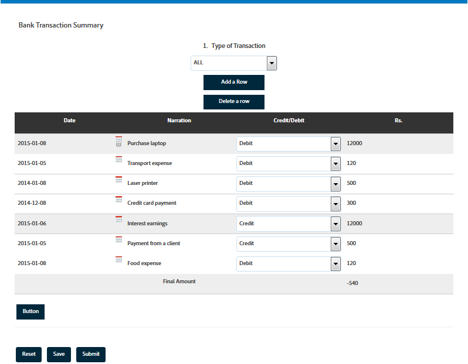

# Tablas en formularios adaptables {#tables-in-adaptive-forms}

<span class="preview"> Adobe recomienda utilizar la captura de datos moderna y ampliable [Componentes principales](https://experienceleague.adobe.com/docs/experience-manager-core-components/using/adaptive-forms/introduction.html?lang=es) para [crear un nuevo Forms adaptable](/help/forms/creating-adaptive-form-core-components.md) o [adición de Forms adaptable a páginas de AEM Sites](/help/forms/create-or-add-an-adaptive-form-to-aem-sites-page.md). Estos componentes representan un avance significativo en la creación de Forms adaptable, lo que garantiza experiencias de usuario impresionantes. Este artículo describe un enfoque más antiguo para crear Forms adaptable mediante componentes de base. </span>


| Versión | Vínculo del artículo |
| -------- | ---------------------------- |
| AEM 6.5 | [Haga clic aquí](https://experienceleague.adobe.com/docs/experience-manager-65/forms/adaptive-forms-basic-authoring/adaptive-forms-tables.html) |
| AEM as a Cloud Service | Este artículo |


El uso de tablas es una forma eficaz, simple y organizada de presentar datos complejos. Ayuda a los usuarios a identificar la información fácilmente y a proporcionar entradas en una disposición ordenada de filas y columnas. La mayoría de formularios de los servicios financieros y las organizaciones gubernamentales requieren tablas de datos grandes para poner números y realizar cálculos.

AEM Forms proporciona un componente Tabla en el explorador de componentes de la barra lateral que permite crear tablas en formularios adaptables. Algunas de las funciones clave que proporciona son las siguientes:

* Diseño interactivo en dispositivos móviles
* Filas y columnas configurables
* Adición y eliminación dinámicas de filas durante la ejecución
* Combinación o unión y división de celdas
* Accesible para lectores de pantalla
* Diseño personalizado con CSS
* Compatible y asignado con el componente de tabla XDP
* Compatibilidad para agregar filas o celdas mediante el uso de elementos complejos XSD
* Combinación de datos de un archivo XML

## Crear una tabla {#create-a-table}

Para crear una tabla, arrastre y suelte el componente Tabla desde el explorador de componentes de la barra de tareas del formulario adaptable. De forma predeterminada, la tabla contiene dos columnas y tres filas, incluida la fila de encabezado.


### Acerca del encabezado y las celdas del cuerpo {#about-header-and-body-cells}

Las celdas del encabezado son campos de texto. Para cambiar la etiqueta de un encabezado, haga clic con el botón derecho en la celda del encabezado y haga clic en **Editar**. En el cuadro de diálogo Editar, actualice la etiqueta en el campo **Valor** y haga clic en **Aceptar**.

De forma predeterminada, las celdas del cuerpo son cuadros de texto. Puede reemplazar una celda de cuerpo por cualquier otro componente de formularios adaptables disponible en la barra de tareas, como un cuadro numérico, un selector de fecha o una lista desplegable.

Por ejemplo, la primera fila de la siguiente tabla incluye componentes de cuadro de texto, selector de fechas y lista desplegable como celdas.


Para combinar dos o más celdas del cuerpo, seleccione las celdas que desee combinar, haga clic con el botón derecho y seleccione **Combinar**. Además, puede dividir una celda combinada haciendo clic con el botón derecho en ella y seleccionando **Dividir celdas**.

### Agregar, eliminar, mover filas y columnas {#add-delete-move-rows-and-columns}

Puede agregar y eliminar una fila o columna, y mover una fila hacia arriba o hacia abajo en una tabla.

#### Adición, supresión o desplazamiento de una fila

Para agregar, eliminar o mover la fila, haga clic en cualquier celda de la fila. abra el explorador de contenido  y seleccione la fila correspondiente. Se resaltará la fila seleccionada con la opción de barra de herramientas desde la que puede agregar, eliminar o mover la fila hacia arriba o hacia abajo.

* La operación **[!UICONTROL Subir]** y **[!UICONTROL Bajar]** mueve la fila seleccionada arriba y abajo.

* La operación **[!UICONTROL Agregar columna]** añade una fila debajo de la fila seleccionada.

* La operación **[!UICONTROL Eliminar columna]** elimina la fila seleccionada.


Haga doble clic en la fila para configurar sus propiedades, como Nombre, Referencia de vínculo, Configuración de repetición y Clase CSS.


#### Adición o supresión de una columna

Para agregar o eliminar una columna, haga clic en la celda de texto de la sección del encabezado y se abrirá una barra de herramientas con las opciones para ello:


>[!NOTE]
>
>Aunque puede agregar cualquier número de filas en una tabla, el número máximo de columnas que puede agregar es de seis. Tampoco puede eliminar la fila de encabezado de la tabla.

### Agregar descripción de la tabla {#add-table-description}

Puede agregar una descripción de la tabla para explicar cómo se organiza la información que los lectores de pantalla pueden interpretar y leer. Para agregar la descripción, haga lo siguiente:

1. Seleccione la tabla y pulse  para ver sus propiedades en la barra lateral.
1. Especifique un resumen en la pestaña Accesibilidad.
1. Haga clic en **Listo**.

### Ordenar columnas en una tabla {#sortcolumnstable}

Puede ordenar los datos en función de cualquier columna de una tabla del formulario adaptable. Los valores de la columna se pueden ordenar en orden ascendente o descendente.

La ordenación se puede aplicar a columnas de la tabla que contengan lo siguiente:

* Texto estático
* Propiedades del objeto del modelo de datos
* Combinación de texto estático y propiedades del objeto del modelo de datos

Para aplicar la ordenación en columnas de la tabla, las celdas de la columna de la tabla deben contener cualquiera de los siguientes componentes: cuadro numérico, paso numérico, campo de entrada de fecha, selector de fecha, texto o cuadro de texto.

Para habilitar la ordenación:

1. Seleccione la tabla y pulse  (Configurar). También puede seleccionar la tabla mediante el explorador **Contenido** en la barra de tareas de comunicación interactiva.
1. Seleccione **Habilitar ordenación**.
1. Pulse  para guardar las propiedades de la tabla. Los iconos de clasificación, flechas arriba y abajo, de los encabezados de las columnas representan que se ha habilitado la ordenación.

   

1. Cambie a la **Vista previa** para ver el resultado. La tabla se ordenará automáticamente en función de la primera columna de la tabla.
1. Haga clic en el encabezado de la columna para ordenar los valores según la columna.

   Un encabezado de columna con una flecha hacia arriba representa que la tabla se ordena en función de esa columna. Además, los valores de la columna se muestran en orden ascendente.

   

   Del mismo modo, un encabezado de columna con una flecha hacia abajo representa que los valores de la columna se muestran en orden descendente.

   También puede realizar cambios en la tabla en el modo **Vista previa** y volver a hacer clic en el encabezado de columna para ordenar los valores de la columna.

## Configurar el ancho de columna de una tabla {#set-column-width}

Siga estos pasos para configurar el ancho de columna de una tabla:

1. En la pestaña **[!UICONTROL Contenido]**, pulse el componente **[!UICONTROL Tabla]** y pulse el icono .

1. Escriba la lista de valores separados por comas en el campo **[!UICONTROL Anchura de columna]** para especificar el ancho proporcionado de cada columna de la tabla. Por ejemplo, para una tabla que incluya 3 columnas, especificando 2, 4, 6 como el valor en el campo **[!UICONTROL Anchura de columna]** configurará el ancho de las columnas como 2/12 para la primera columna, 4/12 para la segunda columna y 6/12 para la tercera columna. 2/12, ya que la anchura de la primera columna se refiere a una sexta parte de la anchura de la tabla. Del mismo modo, 4/12 establece el ancho de la segunda columna como un tercio del ancho de la tabla y 6/12 establece el ancho de la tercera columna como la mitad del ancho de la tabla.

## Configurar el estilo de la tabla {#configure}

Puede definir el estilo de una tabla mediante el uso del modo Estilo de la barra de herramientas de la página. Realice los siguientes pasos para cambiar al modo de estilo y editar el estilo de la tabla

1. En la barra de herramientas de la página, antes de Vista previa, pulse  > **Estilo**.

1. En la barra lateral, seleccione la tabla y pulse el botón de edición . 
Puede ver las propiedades de estilo en la barra lateral.


>[!NOTE]
>
>Puede cambiar la temática de color de las filas de encabezado y del cuerpo al cambiar los valores de las [variables LESS](https://lesscss.org//). Para obtener más información, consulte [Temáticas en AEM Forms](/help/forms/themes.md).

## Agregar o eliminar una fila de forma dinámica {#add-or-delete-a-row-dynamically}

Las tablas proporcionan compatibilidad para agregar o eliminar filas de forma dinámica durante la ejecución.

1. Seleccione una fila de la tabla y pulse .
1. En la pestaña Repetir configuración, especifique los recuentos mínimo y máximo para limitar el número de filas de la tabla.
1. Haga clic en **Listo**.

Durante el tiempo de ejecución o la vista previa, verá los botones **+** y  para añadir o eliminar una fila.


>[!NOTE]
>
>La adición o eliminación de una fila de forma dinámica no se admite en los encabezados que se encuentran en la parte izquierda de las tablas en los diseños móviles.

## Expresiones en una tabla {#expressions-in-a-table}

Las tablas de formularios adaptables permiten escribir expresiones en JavaScript para inducir comportamientos como mostrar u ocultar una tabla o una fila, agregar todos los números y mostrar el total en una celda, habilitar o deshabilitar una celda, validar los datos introducidos por el usuario, etc. Estas expresiones utilizan las API del modelo de script de formularios adaptables.

Mientras que las tablas y las filas solo admiten expresiones de visibilidad para controlar su visibilidad en función del valor devuelto por una expresión, las celdas admiten las siguientes expresiones:

* **Script de inicialización:** para realizar una acción en la inicialización de un campo.
* **Script de implementación de valor:** para cambiar los componentes de un formulario después de cambiar el valor de un campo.

>[!NOTE]
>
>Si el script de cambio/salida XFA también se aplica al mismo campo, el script de cambio/salida XFA se ejecutará antes que el script de confirmación de valor.

* **Calcular expresiones**: para calcular automáticamente el valor de un campo.
* **Expresiones de validación**: para validar un campo.
* **Expresiones de acceso**: para habilitar o deshabilitar un campo.
* **Expresión de visibilidad**: para controlar la visibilidad de un campo y de un panel.

La expresión de visibilidad de una tabla o fila se puede definir en la pestaña Propiedades del panel del cuadro de diálogo Editar componente correspondiente. Las expresiones de una celda se pueden definir en la pestaña Script del cuadro de diálogo Editar componente.

Para obtener la lista completa de clases, eventos, objetos y API públicas de los formularios adaptables, consulte [Referencia de la API de la biblioteca JavaScript para formularios adaptables](https://helpx.adobe.com/es/experience-manager/6-5/forms/javascript-api/index.html).

## Diseños móviles {#mobile-layouts}

Las tablas de formularios adaptables proporcionan una experiencia inigualable en dispositivos móviles debido a su diseño fluido y adaptable. AEM Forms ofrece dos tipos de diseños móviles para tablas: encabezados a la izquierda y columnas contraíbles.

Puede configurar un diseño móvil para una tabla desde la pestaña Estilo del cuadro de diálogo Editar componente.

### Encabezados a la izquierda {#headers-on-left}

En el diseño Encabezados de la izquierda, el encabezado de la tabla se transpone a la izquierda y solo aparece una celda contra un encabezado. Cada fila de este diseño aparece como una sección distinta. Las siguientes imágenes comparan una tabla de escritorio con la de un dispositivo móvil.


Vista de escritorio de una tabla con diseño de Encabezado a la izquierda


Vista móvil de una tabla con diseño de Encabezado a la izquierda

### Diseño de columnas contraíbles {#collapsible-columns-layout}

En el diseño de columnas contraíbles, las columnas de la tabla se contraen para mostrar una o dos columnas, según el tamaño del dispositivo, mientras que otras columnas se contraen. Puede hacer clic en el icono contraer o expandir para ver otras columnas de la tabla.

>[!NOTE]
>
>Aunque el diseño de columnas contraíbles está optimizado para dispositivos móviles, también funcionará en el escritorio si el ancho disponible no es suficiente para mostrar todas las columnas de una tabla.

Las siguientes imágenes comparan el aspecto de una tabla en un dispositivo con columnas contraídas y expandidas.


Se muestran columnas contraídas de una tabla con solo dos columnas en un dispositivo móvil


Columna expandida de una tabla en un dispositivo móvil

## Combinar datos en una tabla {#merge-data-in-a-table}

Las tablas de formularios adaptables permiten rellenar la tabla durante la ejecución al utilizar datos de un archivo XML. El archivo XML de datos puede residir en el sistema de archivos local del equipo donde se ejecuta el servidor de AEM Forms o en el repositorio CRX.

Tomemos como ejemplo la siguiente tabla de resumen de transacciones bancarias que queremos rellenar con datos de un archivo XML.


En este ejemplo, la propiedad Nombre del elemento para:

* la fila es **Row1**
* la celda del cuerpo bajo Fecha de transacción es **tableItem1**
* la celda del cuerpo bajo Descripción es **tableItem2**
* la celda de cuerpo bajo Tipo de transacción es **type**
* la celda del cuerpo bajo Cantidad en USD es **tableItem3**

El archivo XML contiene datos con el siguiente formato:

```xml
<?xml version="1.0" encoding="UTF-8"?><afData>
  <afUnboundData>
    <data>
 <typeSelect>0</typeSelect>
 <Row1>
      <tableItem1>2015-01-08</tableItem1>
      <tableItem2>Purchase laptop</tableItem2>
      <type>0</type>
      <tableItem3>12000</tableItem3>
 </Row1>
 <Row1>
      <tableItem1>2015-01-05</tableItem1>
      <tableItem2>Transport expense</tableItem2>
      <type>0</type>
      <tableItem3>120</tableItem3>
 </Row1>
 <Row1>
      <tableItem1>2014-01-08</tableItem1>
      <tableItem2>Laser printer</tableItem2>
      <type>0</type>
      <tableItem3>500</tableItem3>
 </Row1>
 <Row1>
      <tableItem1>2014-12-08</tableItem1>
      <tableItem2>Credit card payment</tableItem2>
      <type>0</type>
      <tableItem3>300</tableItem3>
 </Row1>
 <Row1>
      <tableItem1>2015-01-06</tableItem1>
      <tableItem2>Interest earnings</tableItem2>
      <type>1</type>
      <tableItem3>12000</tableItem3>
 </Row1>
 <Row1>
      <tableItem1>2015-01-05</tableItem1>
      <tableItem2>Payment from a client</tableItem2>
      <type>1</type>
      <tableItem3>500</tableItem3>
 </Row1>
 <Row1>
      <tableItem1>2015-01-08</tableItem1>
      <tableItem2>Food expense</tableItem2>
      <type>0</type>
      <tableItem3>120</tableItem3>
 </Row1>
 </data>
  </afUnboundData>
  <afBoundData>
    <data/>
  </afBoundData>
  <afBoundData/>
</afData>
```

En el XML de ejemplo, los datos de una fila se definen mediante las etiquetas `<Row1>`, que es el nombre del elemento para la fila de la tabla. Dentro de la etiqueta`<Row1>`, los datos de cada celda se definen dentro de la etiqueta para el nombre del elemento, como `<tableItem1>`,`<tableItem2>`, `<tableItem3>` y `<type>`.

Para combinar estos datos con la tabla durante la ejecución, es necesario apuntar el formulario adaptable que contiene la tabla a la ubicación XML absoluta con wcmmode deshabilitado. Por ejemplo, si el formulario adaptable se encuentra en *https://localhost:4502/myForms/bankTransaction.html* y el archivo XML de datos se guarda en *C:/myTransactions/bankSummary.xml*, puede ver la tabla con los datos en la siguiente dirección URL:

*https://localhost:4502/myForms/bankTransaction.html?dataRef=file:/// C:/myTransactions/bankSummary.xml&amp;wcmmode=disabled*



## Uso de componentes XDP y tipos complejos XSD {#use-xdp-components-and-xsd-complex-types}

Si ha creado un formulario adaptable basado en una plantilla de formulario XFA, los elementos XFA están disponibles en la pestaña Modelo de datos del buscador de contenido de AEM. Puede arrastrar y soltar estos elementos XFA, incluidas tablas, en el formulario adaptable.

El elemento de tabla XFA está asignado al componente Tabla y funciona de forma predeterminada en formularios adaptables. Todas las propiedades y funcionalidades de la tabla XDP se conservan cuando se mueven al formulario adaptable y se puede realizar cualquier operación en él, igual que con la tabla de formulario adaptable nativa. Por ejemplo, si una fila de una tabla XDP se marca como repetible, también se repite cuando se suelte en el formulario adaptable.

Además, puede arrastrar y soltar el subformulario XDP para agregar una fila nueva en la tabla. Sin embargo, tenga en cuenta que la colocación de un subformulario anidado no funciona.

>[!NOTE]
>
>Una tabla XDP sin una fila de encabezado no se asignará al componente Tabla de un formulario adaptable. En lugar de ello, se asigna al componente Panel del formulario adaptable con diseño fluido. Además, cuando se agrega una tabla anidada de un XDP a un formulario adaptable, la tabla exterior se convierte en un panel mientras se mantiene la tabla interna.

Además, puede arrastrar y soltar un grupo de elementos de tipo complejo XSD para crear una fila de tabla. Se crea una fila nueva justo debajo de la fila en la que se han colocado los elementos. Las celdas creadas mediante los elementos de tipo complejos XSD mantienen una referencia de enlace al XSD. También puede reemplazar una celda del cuerpo por un elemento de tipo complejo XSD al soltar el elemento en la celda.

>[!NOTE]
>
>El número de elementos de un componente de tabla XDP, un subformulario o un tipo complejo XSD no puede superar el número de celdas de una fila. Por ejemplo, no se pueden soltar cuatro elementos en una fila que tenga solo tres celdas. Se producirá un error.
>
>Si el número de elementos es menor que el número de celdas de una fila, la nueva fila agrega primero celdas basadas en los elementos y, a continuación, se agregan celdas predeterminadas para rellenar las celdas restantes de la fila. Por ejemplo, si suelta un grupo de tres elementos en una fila que tiene cuatro celdas, las tres primeras se basan en los elementos que haya soltado y la otra celda es la de tabla predeterminada.

## Consideraciones clave {#key-considerations}

* Si mueve filas hacia arriba y hacia abajo mientras crea una tabla basada en XSD, observará cierta pérdida de datos de las filas de la tabla en el XML de datos generado al enviar el formulario.
* Cada celda del cuerpo de una tabla predeterminada tiene asociado un nombre de elemento predefinido. Si agrega otra tabla al formulario adaptable, las celdas predeterminadas del cuerpo de la tabla nueva tendrán el mismo nombre de elemento que en la primera tabla. En este caso, los datos generados al enviar el formulario incluirán datos en las celdas predeterminadas del cuerpo de solo una de las tablas. Por lo tanto, asegúrese de cambiar el nombre de los elementos de las celdas predeterminadas del cuerpo para que sean únicos en todas las tablas y evitar la pérdida de datos.

  Tenga en cuenta que esto solo es aplicable a las celdas predeterminadas del cuerpo. Si agrega más filas o columnas a una tabla, se generarán automáticamente nombres de elementos únicos para las celdas no predeterminadas del cuerpo.
