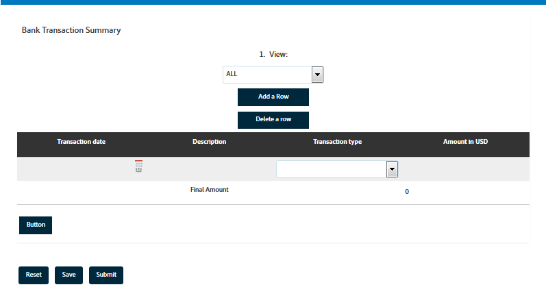

# Tablas en Forms adaptable {#tables-in-adaptive-forms}

El uso de tablas es una forma eficaz, simplificada y organizada de presentar datos complejos. Ayuda a los usuarios a identificar la información fácilmente y a proporcionar entradas en una organización ordenada de filas y columnas. La mayoría de los formularios de los servicios financieros y las organizaciones gubernamentales requieren tablas de datos grandes para poner números y realizar cálculos.

[!DNL AEM Forms] proporciona un componente Tabla en el navegador de componentes de la barra lateral que permite crear tablas en Forms adaptable. Algunas de las funciones clave que proporciona son:

* Diseño interactivo en dispositivos móviles
* Filas y columnas configurables
* Adición y eliminación dinámicas de filas durante la ejecución
* Combinación o combinación de celdas y división
* Accesible para lectores de pantalla
* Diseño personalizado con CSS
* Compatible y asignado con el componente de tabla XDP
* Compatibilidad para agregar filas o celdas utilizando elementos de tipo complejos XSD
* Combinación de datos de un archivo XML

## Cree una tabla {#create-a-table}

Para crear una tabla, arrastre y suelte el componente Tabla desde el navegador de componentes de la barra de tareas del formulario adaptable. De forma predeterminada, la tabla contiene dos columnas y tres filas, incluida la fila de encabezado.


### Acerca del encabezado y las celdas del cuerpo {#about-header-and-body-cells}

Las celdas del encabezado son campos de texto. Para cambiar la etiqueta de un encabezado, haga clic con el botón derecho en la celda del encabezado y haga clic en **Editar**. En el cuadro de diálogo Editar, actualice la etiqueta en la variable **Valor** y haga clic en **OK**.

De forma predeterminada, las celdas del cuerpo son cuadros de texto. Puede reemplazar una celda de cuerpo por cualquier otro componente de Forms adaptable disponible en la barra de tareas, como un cuadro numérico, un selector de fecha o una lista desplegable.

Por ejemplo, la primera fila de trabajo de la siguiente tabla incluye componentes de cuadro de texto, selector de fechas y lista desplegable como celdas.


Para combinar dos o más celdas de cuerpo, seleccione las celdas que desee combinar, haga clic con el botón derecho y seleccione **Combinar**. Además, puede dividir una celda combinada haciendo clic con el botón derecho en ella y seleccionando **Dividir celdas**.

### Agregar, eliminar, mover filas y columnas {#add-delete-move-rows-and-columns}

Puede agregar y eliminar una fila o columna, y mover una fila hacia arriba o hacia abajo en una tabla.

Para agregar o eliminar una fila o columna o mover una fila, haga clic en cualquier celda de la fila o columna. Aparece un menú desplegable en la parte superior de la columna y en la parte izquierda de la fila. El menú de la parte superior ofrece opciones para agregar o eliminar la columna, mientras que el menú de la izquierda permite agregar, eliminar o mover la fila.

* La operación Add agrega una fila debajo o una columna a la derecha de la fila o columna seleccionada.
* La operación Eliminar elimina la fila o columna seleccionada.
* La operación Subir y Bajar mueve la fila seleccionada arriba y abajo.

El menú desplegable de la fila también proporciona la operación Editar para editar las propiedades de fila, la configuración y las opciones de estilo.


>[!NOTE]
>
>* Aunque puede agregar cualquier número de filas en una tabla, el número máximo de columnas que puede agregar es de seis. Tampoco puede eliminar la fila de encabezado de la tabla.
>
>* La conversión automatizada de un formulario de PDF a un formulario adaptable puede crear tablas sin encabezados. Puede agregar y eliminar columnas a tablas sin encabezados. Los encabezados ocultos se añaden a estas tablas para ayudarle a agregar y eliminar columnas. Estos encabezados son visibles durante la creación, pero permanecen ocultos en el formulario publicado.


### Agregar descripción de tabla {#add-table-description}

Puede añadir una descripción de la tabla para explicar cómo se organiza la información que los lectores de pantalla pueden interpretar y leer. Para añadir la descripción:

1. Seleccione la tabla y pulse  para ver sus propiedades en la barra lateral.
1. Especifique un resumen en la ficha Accesibilidad .
1. Haga clic en **Listo**.

### Ordenar columnas en una tabla {#sortcolumnstable}

Puede ordenar los datos en función de cualquier columna de una tabla del formulario adaptable. Los valores de la columna se pueden ordenar en orden ascendente o descendente.

La ordenación se puede aplicar a columnas de tabla que contengan:

* Texto estático
* Propiedades del objeto del modelo de datos
* Combinación de texto estático y propiedades del objeto del modelo de datos

Para aplicar la ordenación en columnas de tabla, las celdas de columna de tabla deben contener cualquiera de los siguientes componentes: Cuadro numérico, Paso numérico, Campo de entrada de fecha, Selector de fecha, Texto o Cuadro de texto.

Para habilitar la ordenación:

1. Seleccione la tabla y pulse  (Configurar). También puede seleccionar la tabla utilizando la variable **Contenido** en la barra de tareas de la comunicación interactiva.
1. Select **Habilitar ordenación**.
1. Toque  para guardar las propiedades de la tabla. Los iconos de clasificación, flechas arriba y abajo, en los encabezados de las columnas representan que se ha activado la ordenación.

   

1. Cambie a la **Vista previa** para ver la salida. La tabla se ordena automáticamente en función de la primera columna de la tabla.
1. Haga clic en el encabezado de la columna para ordenar los valores según la columna.

   Un encabezado de columna con una flecha hacia arriba representa que la tabla se ordena en función de esa columna. Además, los valores de la columna se muestran en orden ascendente.

   

   Del mismo modo, un encabezado de columna con una flecha hacia abajo representa que los valores de la columna se muestran en orden descendente.

   También puede realizar cambios en la tabla de la **Vista previa** y vuelva a hacer clic en el encabezado de columna para ordenar los valores de columna.

## Configurar estilo de tabla {#configure}

Puede definir el estilo de una tabla utilizando el modo Estilo de la barra de herramientas de la página. Realice los siguientes pasos para cambiar al modo de estilo y editar el estilo de la tabla

1. En la barra de herramientas de la página, antes de Vista previa, pulse  > **Estilo**.

1. En la barra lateral, seleccione la tabla y pulse el botón de edición .
Puede ver las propiedades de estilo en la barra lateral.


>[!NOTE]
>
>Puede cambiar el tema de color de las filas de encabezado y de trabajo cambiando los valores de las variables LESS. Para obtener más información, consulte [Temas en [!DNL AEM Forms]](themes.md)

## Añadir o eliminar una fila de forma dinámica {#add-or-delete-a-row-dynamically}

Las tablas proporcionan compatibilidad para agregar o eliminar filas de forma dinámica durante la ejecución.

1. Seleccionar una fila de tabla y pulsar .
1. En la pestaña Repetir configuración , especifique los recuentos mínimo y máximo para limitar el número de filas de la tabla.
1. Haga clic en **Listo**.

Durante el tiempo de ejecución, verá **+** y *-* para añadir o eliminar una fila.


>[!NOTE]
>
>La adición o eliminación de una fila de forma dinámica no se admite en los encabezados del diseño de tablas izquierdo móvil.

## Expresiones en una tabla {#expressions-in-a-table}

Las tablas de Forms adaptable permiten escribir expresiones en JavaScript para inducir comportamientos como mostrar u ocultar una tabla o una fila, agregar todos los números y mostrar el total en una celda, activar o desactivar una celda, validar los datos introducidos por el usuario, etc. Estas expresiones utilizan las API del modelo de secuencias de comandos de Forms adaptable.

Mientras que las tablas y filas solo admiten expresiones de visibilidad para controlar su visibilidad en función del valor devuelto por una expresión, las celdas admiten las siguientes expresiones:

* **Secuencia de comandos de inicialización:** para realizar una acción en la inicialización de un campo.
* **Secuencia de comandos de confirmación de valor:** para cambiar los componentes de un formulario después de cambiar el valor de un campo.

>[!NOTE]
>
>Si el script de cambio/salida XFA también se aplica al mismo campo, el script de cambio/salida XFA se ejecuta antes que el script de confirmación de valor.

* **Calcular expresiones**: para calcular automáticamente el valor de un campo.
* **Expresiones de validación**: para validar un campo.
* **Expresiones de acceso**: para activar o desactivar un campo.
* **Expresión de visibilidad**: para controlar la visibilidad de un campo y un panel.

La expresión de visibilidad de una tabla o fila se puede definir en la pestaña Propiedades del panel del cuadro de diálogo correspondiente Editar componente. Las expresiones de una celda se pueden definir en la pestaña Script del cuadro de diálogo Editar componente.

Para obtener la lista completa de clases, eventos, objetos y API públicas de Forms adaptable, consulte [Referencia de la API de la biblioteca JavaScript para Forms adaptable](https://helpx.adobe.com/experience-manager/6-5/forms/javascript-api/index.html).

## Presentaciones móviles {#mobile-layouts}

Las tablas de Adaptive Forms proporcionan dispositivos móviles de experiencia inigualable debido a su diseño fluido y adaptable. [!DNL AEM Forms] ofrece dos tipos de diseños móviles para tablas: encabezados en columnas a la izquierda y contraíbles.

Puede configurar un diseño móvil para una tabla desde la ficha Estilo del cuadro de diálogo Editar componente para una tabla.

### Encabezados a la izquierda {#headers-on-left}

En el diseño Encabezados de la izquierda, el encabezado de la tabla se transpone a la izquierda y solo aparece una celda contra un encabezado. Cada fila de esta presentación aparece como una sección distinta. Las siguientes imágenes comparan una tabla en un escritorio con la de un dispositivo móvil.


Vista de escritorio de una tabla con Encabezado en el diseño izquierdo


Vista móvil de una tabla con Encabezado en el diseño izquierdo

### Diseño de columnas contraíbles {#collapsible-columns-layout}

En la presentación de columna Contraer , las columnas de la tabla se contraen para mostrar una o dos columnas, según el tamaño del dispositivo, mientras que otras columnas se contraen. Puede hacer clic en el icono contraer o expandir para ver otras columnas de la tabla.

>[!NOTE]
>
>Aunque el diseño de columna contraíble está optimizado para dispositivos móviles, también funcionará en el escritorio si el ancho disponible no es suficiente para mostrar todas las columnas de una tabla.

Las siguientes imágenes comparan el aspecto de una tabla en un dispositivo con columnas contraídas y expandidas.


Columnas contraídas de una tabla con solo dos columnas que se muestran en un dispositivo móvil


Columna ampliada de una tabla en un dispositivo móvil

## Combinar datos en una tabla {#merge-data-in-a-table}

Las tablas de Adaptive Forms permiten rellenar la tabla durante la ejecución utilizando datos de un archivo XML. El archivo XML de datos puede residir en el sistema de archivos local del equipo donde [!DNL AEM Forms] el servidor se está ejecutando o en el repositorio CRX.

Veamos un ejemplo de la siguiente tabla de resumen de transacciones bancarias que queremos rellenar con datos de un archivo XML.



En este ejemplo, la propiedad Element name para:

* la fila es **Fila1**
* la celda del cuerpo en Fecha de transacción es **tableItem1**
* la celda del cuerpo bajo Descripción es **tableItem2**
* la celda de cuerpo en Tipo de transacción es **type**
* la celda del cuerpo en Amount in USD es **tableItem3**

El archivo XML que contiene datos con el formato siguiente:

```xml
<?xml version="1.0" encoding="UTF-8"?><afData>
  <afUnboundData>
    <data>
 <typeSelect>0</typeSelect>
 <Row1>
      <tableItem1>2015-01-08</tableItem1>
      <tableItem2>Purchase laptop</tableItem2>
      <type>0</type>
      <tableItem3>12000</tableItem3>
 </Row1>
 <Row1>
      <tableItem1>2015-01-05</tableItem1>
      <tableItem2>Transport expense</tableItem2>
      <type>0</type>
      <tableItem3>120</tableItem3>
 </Row1>
 <Row1>
      <tableItem1>2014-01-08</tableItem1>
      <tableItem2>Laser printer</tableItem2>
      <type>0</type>
      <tableItem3>500</tableItem3>
 </Row1>
 <Row1>
      <tableItem1>2014-12-08</tableItem1>
      <tableItem2>Credit card payment</tableItem2>
      <type>0</type>
      <tableItem3>300</tableItem3>
 </Row1>
 <Row1>
      <tableItem1>2015-01-06</tableItem1>
      <tableItem2>Interest earnings</tableItem2>
      <type>1</type>
      <tableItem3>12000</tableItem3>
 </Row1>
 <Row1>
      <tableItem1>2015-01-05</tableItem1>
      <tableItem2>Payment from a client</tableItem2>
      <type>1</type>
      <tableItem3>500</tableItem3>
 </Row1>
 <Row1>
      <tableItem1>2015-01-08</tableItem1>
      <tableItem2>Food expense</tableItem2>
      <type>0</type>
      <tableItem3>120</tableItem3>
 </Row1>
 </data>
  </afUnboundData>
  <afBoundData>
    <data/>
  </afBoundData>
  <afBoundData/>
</afData>
```

En el XML de ejemplo, los datos de una fila se definen mediante la variable `<Row1>` , que es el nombre del elemento para la fila de la tabla. Dentro de `<Row1>` , los datos de cada celda se definen dentro de la etiqueta para el nombre del elemento, como `<tableItem1>`, `<tableItem2>`, `<tableItem3>`y `<type>`.

Para combinar estos datos con la tabla durante la ejecución, es necesario señalar el formulario adaptable que contiene la tabla a la ubicación XML absoluta con wcmmode desactivado. Por ejemplo, si el formulario adaptable se encuentra en *https://`servername`/myForms/bankTransaction.html* y el archivo XML de datos se guarda en *C:/myTransactions/bankSummary.xml*, puede ver la tabla con datos en la siguiente dirección URL:

*https://`servername`/myForms/bankTransaction.html?dataRef=file:/// C:/myTransactions/bankSummary.xml&amp;wcmmode=disabled*


## Uso de componentes XDP y tipos complejos XSD {#use-xdp-components-and-xsd-complex-types}

Si ha creado un formulario adaptable basado en una plantilla de formulario XFA, los elementos XFA están disponibles en la ficha Modelo de datos de AEM Buscador de contenido. Puede arrastrar y soltar estos elementos XFA, incluidas tablas, en el formulario adaptable.

El elemento de tabla XFA está asignado al componente Tabla y funciona de forma predeterminada en Forms adaptable. Todas las propiedades y funcionalidades de la tabla XDP se conservan cuando se mueven al formulario adaptable y se puede realizar cualquier operación en él igual que con la tabla de formulario adaptable nativa. Por ejemplo, si una fila de una tabla XDP se marca como repetible, también se repetirá cuando se suelte en Forms adaptable.

Además, puede arrastrar y soltar el subformulario XDP para agregar una fila nueva en la tabla. Sin embargo, tenga en cuenta que no funciona la colocación de un subformulario anidado.

>[!NOTE]
>
>Una tabla XDP sin una fila de encabezado no se asignará al componente Tabla de formulario adaptable. En su lugar, se asignará al componente Panel de formulario adaptable con diseño fluido. Además, cuando se agrega una tabla anidada de un XDP a un formulario adaptable, la tabla exterior se convierte en un panel mientras se mantiene la tabla interna.

Además, puede arrastrar y soltar un grupo de elementos de tipo complejo XSD para crear una fila de tabla. Se crea una fila nueva justo debajo de la fila en la que se han colocado los elementos. Las celdas creadas utilizando los elementos de tipo complejos XSD mantienen una referencia de enlace al XSD. También puede reemplazar una celda de cuerpo por un elemento de tipo complejo XSD soltando el elemento en la celda.

>[!NOTE]
>
>El número de elementos de un componente de tabla XDP, un subformulario o un tipo complejo XSD no puede superar el número de celdas de una fila. Por ejemplo, no se pueden soltar cuatro elementos en una fila que tenga solo tres celdas. Producirá un error.
>
>Si el número de elementos es menor que el número de celdas de una fila, la nueva fila agrega primero celdas basadas en los elementos y, a continuación, se agregan celdas predeterminadas para rellenar las celdas restantes de la fila. Por ejemplo, si suelta un grupo de tres elementos en una fila que tiene cuatro celdas, las tres primeras celdas se basan en los elementos que haya soltado y la otra celda será la celda de tabla predeterminada.

## Consideraciones clave {#key-considerations}

* Si mueve filas hacia arriba y hacia abajo mientras crea una tabla basada en XSD, se observará cierta pérdida de datos de filas de tabla en el XML de datos generado al enviar el formulario.
* Cada celda de cuerpo de una tabla predeterminada tiene asociado un nombre de elemento predefinido. Si agrega otra tabla en el formulario adaptable, las celdas de cuerpo predeterminadas de la nueva tabla tendrán el mismo nombre de elemento que en la primera tabla. En este caso, los datos generados al enviar el formulario incluirán datos en las celdas de cuerpo predeterminadas de solo una de las tablas. Por lo tanto, asegúrese de cambiar el nombre de los elementos de las celdas de cuerpo predeterminadas para mantenerlos únicos en todas las tablas y evitar la pérdida de datos.

   Tenga en cuenta que esto solo es aplicable a las celdas de cuerpo predeterminadas. Si agrega más filas o columnas a una tabla, se generarán automáticamente nombres de elementos únicos para celdas de cuerpo no predeterminadas.

