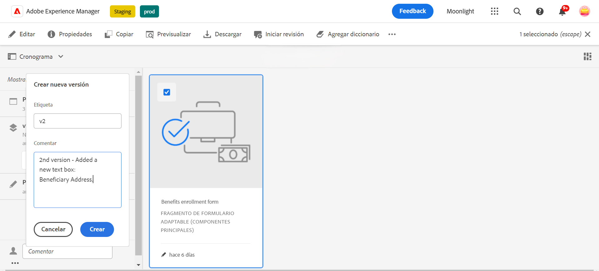
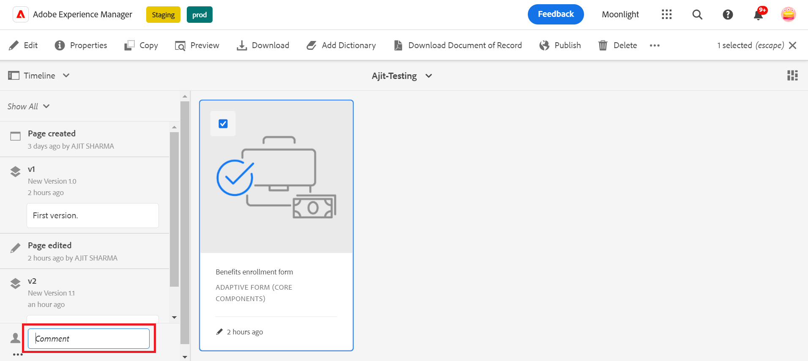
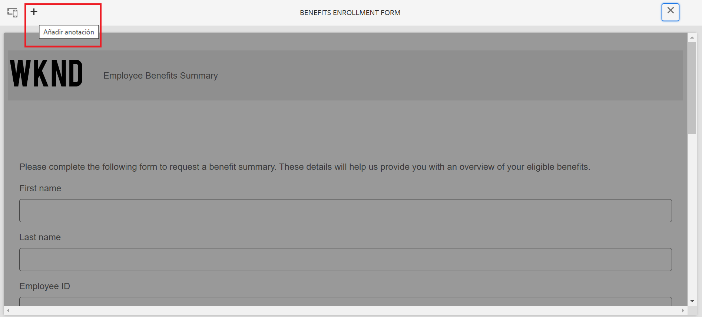

# Versiones, revisión y comentarios de un formulario adaptable

<!--Before you can use versionings, comments, and annotations in an Adaptive Form, you must ensure you have [enabled Adaptive Form Core Components](
https://experienceleague.adobe.com/en/docs/experience-manager-cloud-service/content/forms/setup-configure-migrate/enable-adaptive-forms-core-components).-->

<!--Adaptive Form Core Components facilitates to add versionings, comments, and annotations to a form. These features helps form authors and users to enhance the form development process where they can create multiple versions of a form, collaborate and add their comments to a form, and add annotations to form components.-->

Los componentes principales de un formulario adaptable proporcionan una funcionalidad que permite a los autores de formularios incorporar versiones, comentarios y anotaciones en los formularios. Estas funciones sirven para optimizar el proceso de desarrollo de formularios, ya que permiten a los usuarios crear y administrar varias versiones de un formulario, participar en conversaciones de colaboración mediante comentarios y adjuntar anotaciones a componentes de formulario específicos, lo que mejora la experiencia general de creación de formularios.

## Versiones de formularios adaptables {#adaptive-form-versioning}

Las versiones de formularios adaptables ayudan a añadir versiones a un formulario. Los autores de formularios pueden crear fácilmente varias versiones de un formulario y, finalmente, utilizar la que mejor se adapte a los objetivos de la empresa. Además, los usuarios de formularios también pueden revertir el formulario a las versiones anteriores. También permite a los autores comparar dos versiones distintas de un formulario previsualizándolas, lo que les permite analizar mejor los formularios desde el punto de vista de la interfaz de usuario. Veamos en detalle cada una de las funcionalidades de las versiones de los formularios adaptativos:

### Creación de una versión del formulario {#create-a-form-version}

Para crear una versión de un formulario, siga los pasos a continuación:

1. Cree un formulario o utilice un formulario existente.
1. En la interfaz de usuario de AEM, vaya a **[!UICONTROL Formulario]**>>**[!UICONTROL Formularios y documentos]** y seleccione su **Formulario**.
1. En el menú desplegable de selección del panel izquierdo, seleccione **[!UICONTROL Versiones]**.
   
1. Haga clic en los **tres puntos** situados en el panel inferior de la izquierda y, a continuación, haga clic en **[!UICONTROL Guardar como versión]**.
1. Ahora, proporcione una etiqueta a la versión del formulario, y puede proporcionar información sobre el formulario a través del comentario.
   

### Actualizar una versión de formulario {#update-a-form-version}

Al editar y actualizar el formulario adaptable, se añade una nueva versión al formulario. Siga los pasos de la última sección para asignar un nombre a una nueva versión del formulario, como se muestra en la imagen:

### Revertir una versión de formulario {#revert-a-form-version}

Para revertir una versión de formulario a la anterior, seleccione una versión de formulario y haga clic en **[!UICONTROL Revertir a esta versión]**.

### Comparar versiones de formularios {#compare-form-versions}

Los autores de formularios pueden comparar dos versiones diferentes de un formulario para obtener una vista previa. Para comparar versiones, seleccione cualquier versión del formulario y haga clic en **[!UICONTROL Comparar con actual]**. Muestra dos versiones de formulario diferentes en el modo de vista previa.

## Añadir comentarios {#add-comments}

Una revisión es un mecanismo que permite a uno o más revisores realizar comentarios sobre los formularios.  Cualquier usuario de un formulario puede realizar comentarios en un formulario o revisarlo mediante comentarios. Para realizar comentarios en un formulario, seleccione un **[!UICONTROL Formulario]** y añada un **[!UICONTROL Comentario]** al formulario.

>[!NOTE]
> Cuando se usan comentarios en los componentes principales de los formularios adaptables, como se ha indicado anteriormente, la funcionalidad del formulario [Crear y administrar revisiones en formularios](/help/forms/create-reviews-forms.md) está deshabilitada.

## Añadir anotaciones {#adaptive-form-annotations}

En muchos casos, los usuarios de grupos de formularios deben añadir anotaciones a un formulario con fines de revisión, por ejemplo, en una pestaña específica o en los componentes de un formulario. En estos casos, los autores pueden utilizar anotaciones. Para añadir anotaciones a un formulario, siga los siguientes pasos:

1. Abra un formulario en el modo **[!UICONTROL Editar]**.

1. Haga clic en el icono **añadir** situado en el carril superior derecho, como se indica en la imagen.
   

1. Haga clic en el icono **añadir** situado en el carril superior izquierdo, como se indica en la imagen, para añadir la anotación.
   

1. Ahora puede añadir comentarios y dibujar bocetos con varios colores para formar componentes.

1. Para ver todas las anotaciones añadidas a un formulario, seleccione el formulario y verá las anotaciones añadidas en el panel izquierdo, como se muestra en la imagen.

   

## Consulte también {#see-also}

{{see-also}}
