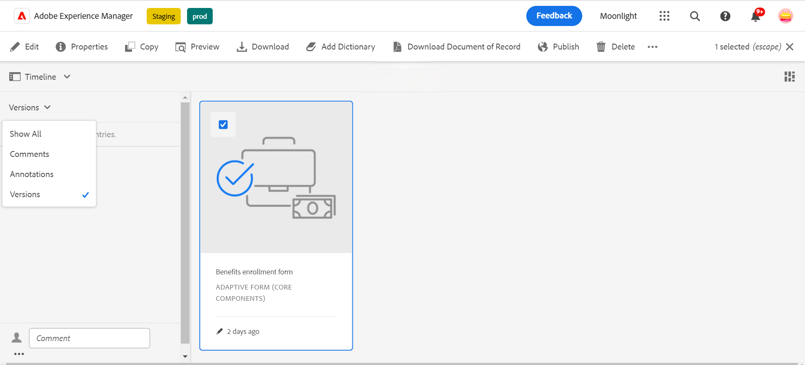
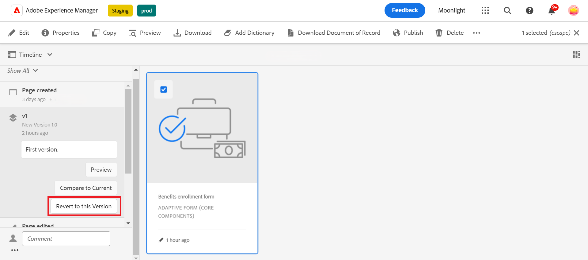

# Creación de versiones, revisión y comentarios sobre un formulario adaptable

<!--Before you can use versionings, comments, and annotations in an Adaptive Form, you must ensure you have [enabled Adaptive Form Core Components](
https://experienceleague.adobe.com/en/docs/experience-manager-cloud-service/content/forms/setup-configure-migrate/enable-adaptive-forms-core-components).-->

<!--Adaptive Form Core Components facilitates to add versionings, comments, and annotations to a form. These features helps form authors and users to enhance the form development process where they can create multiple versions of a form, collaborate and add their comments to a form, and add annotations to form components.-->

 Esta es una función previa al lanzamiento y se puede acceder a ella a través de nuestro [canal previo al lanzamiento](https://experienceleague.adobe.com/docs/experience-manager-cloud-service/content/release-notes/prerelease.html?lang=es#new-features). 

Los componentes principales de un formulario adaptable proporcionan una funcionalidad que permite a los autores de formularios incorporar versiones, comentarios y anotaciones en los formularios. Estas funciones sirven para optimizar el proceso de desarrollo de formularios, ya que permiten a los usuarios crear y administrar varias versiones de un formulario, participar en debates de colaboración mediante comentarios y adjuntar anotaciones a componentes de formulario específicos, lo que mejora la experiencia general de creación de formularios.

## Versiones de formulario adaptable {#adaptive-form-versioning}

Las versiones de formularios adaptables ayudan a agregar versiones a un formulario. Los autores de formularios pueden crear fácilmente varias versiones de un formulario y, finalmente, utilizar el que sea adecuado para los objetivos comerciales. Además, los usuarios de formularios también pueden revertir el formulario a las versiones anteriores. También facilita a los autores la comparación de dos versiones cualquiera de un formulario mediante la previsualización, lo que les permite analizar mejor los formularios desde las perspectivas de la interfaz de usuario. Vamos a ver en detalle cada funcionalidad de control de versiones de formulario adaptable:

### Crear una versión de formulario {#create-a-form-version}

Para crear una versión de un formulario, siga los pasos a continuación:

1. Cree un formulario o utilice un formulario existente.
1. AEM En la interfaz de usuario de, navegue hasta **[!UICONTROL Form]**>>**[!UICONTROL Forms y documentos]** y seleccione su **Form**.
1. En el menú desplegable de selección del panel izquierdo, seleccione **[!UICONTROL Versiones]**.
   
1. Haga clic en **tres puntos** situado en el panel inferior de la izquierda, haga clic en **[!UICONTROL Guardar como versión]**.
1. Ahora, proporcione una etiqueta a la versión del formulario y puede proporcionar información sobre el formulario a través del comentario.
   

### Actualizar una versión de formulario {#update-a-form-version}

Al editar y actualizar el formulario adaptable, se agrega una nueva versión al formulario. Siga los pasos de la última sección para asignar un nombre a una nueva versión del formulario, como se muestra en la imagen:

### Revertir una versión de formulario {#revert-a-form-version}

Para revertir una versión de formulario a la anterior, seleccione una versión de formulario y haga clic en **[!UICONTROL Volver a esta versión]**.

### Comparar versiones de formularios {#compare-form-versions}

Los autores de formularios pueden comparar dos versiones diferentes de un formulario para obtener una vista previa. Para comparar versiones, seleccione cualquier versión del formulario y haga clic en **[!UICONTROL Comparar con actual]**. Muestra dos versiones de formulario diferentes en el modo de vista previa.

## Agregar comentarios {#add-comments}

Una revisión es un mecanismo que permite a uno o más revisores realizar comentarios sobre los formularios. Cualquier usuario de un formulario puede realizar comentarios en un formulario o revisarlo mediante comentarios. Para realizar comentarios sobre un formulario, seleccione una **[!UICONTROL Form]** y agregue una **[!UICONTROL Comentario]** al formulario.

>[!NOTE]
> Cuando se utilizan comentarios en los componentes principales del formulario adaptable, como se ha indicado anteriormente, la funcionalidad del formulario [Crear y administrar revisiones en formularios](/help/forms/create-reviews-forms.md) está deshabilitada.

## Agregar anotaciones {#adaptive-form-annotations}

En muchos casos, los usuarios de grupos de formularios deben agregar anotaciones a un formulario con fines de revisión, por ejemplo, en una pestaña específica de un formulario o de sus componentes. En estos casos, los autores pueden utilizar anotaciones. Para agregar anotaciones a un formulario, realice los siguientes pasos:

1. Abra un formulario en la **[!UICONTROL Editar]** modo.

1. Haga clic en **añadir icono** situado en el carril superior derecho, tal como se indica en la imagen.
   

1. Haga clic en **añadir icono** situado en el carril superior izquierdo, tal como se indica en la imagen, para añadir la anotación.
   

1. Ahora puede agregar comentarios y dibujar bocetos con varios colores para formar componentes.

1. Para ver todas las anotaciones agregadas a un formulario, seleccione el formulario y verá las anotaciones agregadas en el panel izquierdo, como se muestra en la imagen.

   

## Consulte también {#see-also}

{{see-also}}
