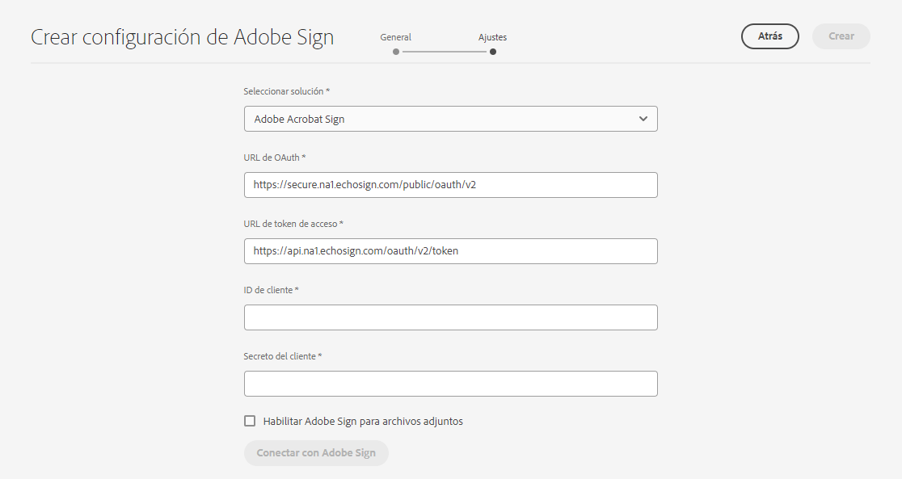
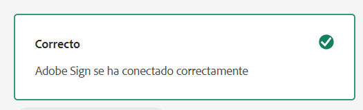
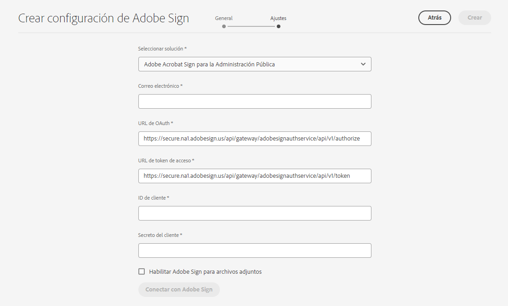

# Conecte [!DNL AEM Forms] as a Cloud Service con [!DNL Adobe Acrobat Sign] {#integrate-adobe-sign-with-aem-forms}

| Versión | Vínculo del artículo |
| -------- | ---------------------------- |
| AEM 6.5 | [Haga clic aquí](https://experienceleague.adobe.com/docs/experience-manager-65/forms/adaptive-forms-advanced-authoring/adobe-sign-integration-adaptive-forms.html?lang=es#adobe-acrobat-sign-for-government) |
| AEM as a Cloud Service | Este artículo |

[!DNL Adobe Acrobat Sign] habilita los flujos de trabajo de firma electrónica para flujos de trabajo adaptables de Forms y de AEM. Las firmas electrónicas mejoran los flujos de trabajo para procesar documentos para el área legal, ventas, nóminas, administración de recursos humanos y muchas más.

Cuando se trabaja con [!DNL Adobe Acrobat Sign] y los formularios adaptables, normalmente los usuarios rellenan un formulario adaptable para solicitar un servicio. Por ejemplo, una solicitud de tarjeta de crédito y un formulario de solicitud para una prestación. Cuando un usuario rellena, envía y firma el formulario de solicitud, este se envía al proveedor de servicios para que realice más acciones. El proveedor de servicios revisa la solicitud y utiliza [!DNL Adobe Acrobat Sign] para marcarla como aprobada. AEM Forms es compatible tanto con Adobe Acrobat Sign como con Adobe Acrobat Sign Solutions para el gobierno. Según la licencia y los requisitos, puede integrar o conectar AEM Forms con cualquiera de las soluciones:

* [Conectar AEM Forms con Adobe Acrobat Sign](#adobe-sign)
* [Conectar AEM Forms con Adobe Acrobat Sign Solutions para el gobierno](#adobe-acrobat-sign-for-government)

## Conectar AEM Forms con Adobe Acrobat Sign {#adobe-sign}

Para conectar **[!DNL AEM Forms]** con **[!DNL Adobe Acrobat Sign]**, configure el software y las cuentas enumerados en la sección de requisitos previos y configure Adobe Sign Cloud Service en sus instancias Autor as a Cloud Service y Publicación de Forms:

### Requisitos previos para conectar AEM Forms con Adobe Acrobat Sign {#prerequisites-for-adobe-sign}

Para integrar [!DNL Adobe Acrobat Sign] con [!DNL AEM Forms] se requiere la siguiente configuración:

1. Una [cuenta de desarrollador de Adobe Acrobat Sign](https://www.adobe.com/acrobat/business/developer-form.html?lang=es) activa.
1. Una [aplicación API de Adobe Acrobat Sign](https://www.adobe.io/apis/documentcloud/sign/docs.html#!adobedocs/adobe-sign/master/gstarted/create_app.md).
1. Las credenciales (ID de cliente y Secreto de cliente) de la aplicación API de [!DNL Adobe Acrobat Sign];
1. (solo para la autenticación basada en documentos de identidad del gobierno) [Habilitar el método de autenticación](https://helpx.adobe.com/es/sign/using/adobesign-authentication-government-id.html#AuditReport) para la autenticación de documentos de identidad del gobierno.

### Conectar las instancias de autor y publicación de AEM Forms con Adobe Acrobat Sign {#configure-adobe-sign-with-aem-forms}

Una vez cumplidos los requisitos previos, realice los siguientes pasos para configurar [!DNL Adobe Acrobat Sign] con [!DNL AEM Forms] en las instancias de autor.

1. En la instancia de autor de AEM Forms, vaya a **[!UICONTROL Herramientas]**  > **[!UICONTROL General]** > **[!UICONTROL Explorador de configuración]**.
1. En la página **[!UICONTROL Explorador de configuración]**, seleccione **[!UICONTROL Crear]**.
1. En el cuadro de diálogo **[!UICONTROL Crear configuración]**, especifique un **[!UICONTROL Título]** para la configuración, habilite **[!UICONTROL Configuraciones de nube]** y seleccione **[!UICONTROL Crear]**. Crea un contenedor de configuración para almacenar servicios en la nube. Asegúrese de que el nombre de la carpeta no contenga ningún espacio.
1. Vaya a **[!UICONTROL Herramientas]**  > **[!UICONTROL Cloud Services]** > **[!UICONTROL Adobe Acrobat Sign]** y abra el contenedor de configuración que creó en el paso anterior.

   >[!NOTE]
   >
   >Cuando cree un formulario adaptable, especifique el nombre del contenedor en el campo **[!UICONTROL Contenedor de configuración]**.

1. En la página de configuración, seleccione **[!UICONTROL Crear]** para crear una configuración de [!DNL Adobe Acrobat Sign] en AEM Forms.
1. En la pestaña **[!UICONTROL General]** de la página **[!UICONTROL Crear configuración de Adobe Acrobat Sign]**, especifique un **[!UICONTROL Nombre]** para la configuración y seleccione **[!UICONTROL Siguiente]**. Si lo desea, puede especificar un **[!UICONTROL Título]** y examinar los archivos para seleccionar una **[!UICONTROL miniatura]** para la configuración.

1. Ahora puede **[!UICONTROL Seleccionar solución]** para seleccionar [!DNL Adobe Acrobat Sign].

   <!---->
   

<!--

[create URL](#create-a-redirect-url-for-your-aem-instance)
 -->

1. Copie la URL presente en la ventana actual del explorador en un bloc de notas y quite la parte `/ui#/aem` desde la URL. La URL modificada es necesaria para configurar la [!DNL Adobe Acrobat Sign] aplicación con [!DNL AEM Forms], en un paso posterior. Seleccione **[!UICONTROL Siguiente]**.

1. En la pestaña **[!UICONTROL Configuración]**,
   * el campo **[!UICONTROL URL de OAuth]** contiene la dirección URL predeterminada que incluye la partición de la base de datos Adobe Sign. El formato de la URL es el siguiente:

     `https://<shard>/public/oauth/v2`

     Por ejemplo:
     `https://secure.na1.echosign.com/public/oauth/v2`

   * el campo **[!UICONTROL URL de token de acceso]** contiene la dirección URL predeterminada que incluye la partición de la base de datos Adobe Sign. El formato de la URL es el siguiente:

     `https://<shard>/oauth/v2/token`

     Por ejemplo:
     `https://api.na1.echosign.com/oauth/v2/token`

   donde:

   **na1** hace referencia a la partición predeterminada de la base de datos. Puede modificar el valor de la partición de la base de datos. Asegúrese de que las configuraciones en la nube de [!DNL  Adobe Acrobat Sign] apuntan a la [partición correcta](https://helpx.adobe.com/es/sign/using/identify-account-shard.html).

   >[!NOTE]
   >
   >* Mantenga abierta la página **Crear la configuración de Adobe Acrobat Sign**. No la cierre. Puede recuperar la **ID de cliente** y el **Secreto de cliente** después de configurar OAuth para la aplicación [!DNL Adobe Acrobat Sign] como se describe en los pasos siguientes.
   >* Después de iniciar sesión en su cuenta de Adobe Sign, vaya a la **[!UICONTROL API de Acrobat Sign]** > **[!UICONTROL Información de API]** > **[!UICONTROL Documentación de métodos de API de REST]** > **[!UICONTROL Token de acceso de OAuth]** para acceder a información relacionada con la URL de OAuth de Adobe Sign y la URL del token de acceso.

1. Configure OAuth para la aplicación [!DNL Adobe Acrobat Sign]:

   1. Abra una ventana del explorador e inicie sesión en su cuenta de desarrollador de [!DNL Adobe Acrobat Sign].
   1. Seleccione la aplicación configurada para [!DNL AEM Forms] y seleccione **[!UICONTROL Configurar OAuth para aplicación]**.
   1. En el cuadro **[!UICONTROL URL de redireccionamiento]**, añada la URL copiada en el paso anterior (Paso 8) y haga clic en **[!UICONTROL Guardar]**.
   1. Habilite el siguiente ámbito para la aplicación [!DNL Adobe Acrobat Sign] y haga clic en **[!UICONTROL Guardar]**.

   * [!DNL aggrement_read]
   * [!DNL aggrement_write]
   * [!DNL aggrement_send]
   * [!DNL widget_read]
   * [!DNL widget_write]
   * [!DNL workflow_read]

   >[!NOTE]
   > Puede cambiar el modificador de ámbitos de `self` a `account` directamente desde la IU de AEM, tal como se indica en el paso 12.

   Para obtener información paso a paso sobre cómo configurar OAuth para una aplicación [!DNL Adobe Acrobat Sign] y obtener las claves, consulte la documentación para desarrolladores [Configurar OAuth para la aplicación](https://www.adobe.io/apis/documentcloud/sign/docs.html#!adobedocs/adobe-sign/master/gstarted/configure_oauth.md).

   

1. Vuelva a la página **[!UICONTROL Crear configuración de Adobe Acrobat Sign]**. En la pestaña **[!UICONTROL Configuración]**, especifique el [**[!UICONTROL ID de cliente]** (también denominado como ID de aplicación) y el **[!UICONTROL Secreto de cliente]**]. Utilice el [ID de cliente y el Secreto de cliente de la aplicación Adobe Acrobat Sign](https://opensource.adobe.com/acrobat-sign/developer_guide/helloworld.html#get-the-app-id-and-secret) que creó en el paso anterior.

1. En la sección [!UICONTROL Ámbito de autorización], puede modificar los ámbitos a “cuenta” o “propia” añadiendo el prefijo “self” o “cuenta a los ámbitos, según sea necesario.
   

1. Seleccione la opción **[!UICONTROL Habilitar Adobe Acrobat Sign para archivos adjuntos]** para anexar los archivos adjuntos a un formulario adaptable al documento de [!DNL Adobe Acrobat Sign]correspondiente enviado para su firma.

1. Seleccione **[!UICONTROL Conectar a Adobe Acrobat Sign]**. Cuando se le soliciten credenciales, indique el **nombre de usuario** y la **contraseña** de la cuenta utilizada al crear la [!DNL Adobe Acrobat Sign]aplicación. Cuando se le pida que confirme, acceda a `your developer account`, haga clic en **[!UICONTROL Permitir acceso]**. Si las credenciales son correctas y permite a [!DNL AEM Forms] acceder a su cuenta de desarrollador de [!DNL Adobe Acrobat Sign], aparecerá un mensaje de éxito similar al siguiente.

   

1. Seleccione **[!UICONTROL Crear]** para crear la configuración de [!DNL Adobe Acrobat Sign].

1. Seleccione la configuración y haga clic en **[!UICONTROL Publicar]**, seleccione la configuración y haga clic en **[!UICONTROL Publicar]**. Esto replicará la configuración en los entornos de publicación correspondientes.

1. Repita todos los pasos anteriores en las instancias de desarrollador, fase y producción (cualquiera de las restantes) para completar la configuración de [!DNL Adobe Acrobat Sign] con [!DNL AEM Forms] para su entorno.

Ahora puede [usar Agregar campos de Adobe Acrobat Sign a un formulario adaptable](working-with-adobe-sign.md). Asegúrese de agregar el contenedor de configuración utilizado para Cloud Service a todos los formularios adaptables habilitados para [!DNL Adobe Acrobat Sign]. Puede especificar un contenedor de configuración desde las propiedades de un formulario adaptable.

>[!NOTE]
>
> Para configurar la zona protegida de Adobe Sign, puede seguir los mismos pasos de configuración explicados en [Adobe Sign](#adobe-sign).

#### Resolución de problemas {#resolve-config-error}

Cuando conecta [!DNL Adobe Acrobat Sign] con [!DNL AEM Forms] y busca un error `Unable to authorize access because the client configuration is invalid: invalid_request` tal como se muestra en la imagen siguiente. Para solucionarlo, siga los pasos que se indican a continuación:


1. Copie la URL presente en la ventana actual del explorador en un bloc de notas y quite la parte `/ui#/aem` desde la URL. 
1. Abra una ventana del explorador e inicie sesión en su cuenta de desarrollador de [!DNL Adobe Acrobat Sign].
1. Seleccione la aplicación configurada para [!DNL AEM Forms] y seleccione **[!UICONTROL Configurar OAuth para aplicación]**.
1. En el cuadro **[!UICONTROL URL de redireccionamiento]**, añada la URL copiada en el paso anterior y haga clic en **[!UICONTROL Guardar]**.

## Conectar AEM Forms con Adobe Acrobat Sign Solutions para el gobierno {#adobe-acrobat-sign-for-government}

La conexión de AEM Forms con Adobe Acrobat Sign Solutions para el gobierno es un proceso de varios pasos. Implica:

* La creación de una URL de redireccionamiento para sus casos de AEM
* Uso compartido de la URL de redireccionamiento y los ámbitos con el equipo de Adobe Sign Solutions para el gobierno
* Recibiendo credenciales del equipo de Adobe Sign
* Uso de las credenciales recibidas para conectar AEM Forms con Adobe Acrobat Sign Solutions para el gobierno


AEM Forms as a Cloud Service proporciona entornos de desarrollo, de ensayo y de producción. Puede comenzar conectando su entorno de desarrollo para con Adobe Acrobat Sign Solutions para el gobierno y conectar los entornos de ensayo y producción más adelante.

### Antes de comenzar {#prerequisites-for-adobe-sign-for-acrobat-sign-for-government}

Antes de empezar a conectar AEM Forms con la solución de Adobe Acrobat Sign, asegúrese de que su cuenta de [Adobe Acrobat Sign Solutions para gobierno](https://opensource.adobe.com/acrobat-sign/signgov/gstarted.html#account-provisioning) está aprovisionada.


### Conexión de AEM Forms as a Cloud Service con Adobe Acrobat Sign Solutions para el gobierno {#connect-adobe-acrobat-sign-for-government}

#### Cree una URL de redireccionamiento para la instancia de AEM

1. En la instancia de autor as a Cloud Service de Forms, navegue hasta **[!UICONTROL Herramientas]**  > **[!UICONTROL General]** > **[!UICONTROL Explorador de configuración]**.
1. En la página **[!UICONTROL Explorador de configuración]**, seleccione **[!UICONTROL Crear]**.
1. En el cuadro de diálogo **[!UICONTROL Crear configuración]**, especifique un **[!UICONTROL Título]** para la configuración, habilite **[!UICONTROL Configuraciones de nube]** y seleccione **[!UICONTROL Crear]**. Crea un contenedor de configuración para almacenar servicios en la nube. Asegúrese de que el nombre de la carpeta no contenga ningún espacio.
1. Navegue hacia **[!UICONTROL Herramientas]**  > **[!UICONTROL Cloud Services]** > **[!UICONTROL Adobe Acrobat Sign]** y abra el contenedor de configuración que creó en el paso anterior. Cuando cree un formulario adaptable, especifique el nombre del contenedor en el campo **[!UICONTROL Contenedor de configuración]**.
1. En la página de configuración, seleccione **[!UICONTROL Crear]** para crear una configuración de [!DNL Adobe Acrobat Sign] en AEM Forms.
1. Copie la URL de la ventana del explorador actual en un bloc de notas y quite `/ui#/aem` de la URL. Esta URL se denomina `re-direct URL`.
En la siguiente sección, comparta la `re-direct URL` y `Scopes` con el equipo de Adobe Sign y las credenciales de solicitud (ID de cliente y Secreto de cliente).

#### Comparta la URL de redireccionamiento y los ámbitos con el equipo de Adobe Sign y reciba las credenciales

El equipo de Adobe Acrobat Sign para soluciones gubernamentales requiere que se habilite la `re-direct URL` y los determinados ámbitos para su aplicación de Adobe Acrobat Sign (enumerados a continuación) para generar credenciales (ID de cliente y Secreto de cliente) que le permitan conectar AEM Forms con Adobe Acrobat Sign Solutions para el gobierno.

Comparta la `scopes` (enumeradas a continuación) y cree y anote el último paso de `re-direct URL` de la sección anterior con su representante de Adobe Acrobat Sign para soluciones gubernamentales ([miembro del equipo de Adobe Professional Services](https://opensource.adobe.com/acrobat-sign/signgov/gstarted.html#password)).

**_Ámbitos_**

* [!DNL aggrement_read]
* [!DNL aggrement_write]
* [!DNL aggrement_send]
* [!DNL widget_read]
* [!DNL widget_write]
* [!DNL workflow_read]
* [!DNL offline_access]

El representante genera y comparte credenciales con usted. En la siguiente sección, utilice las credenciales (ID de cliente y Secreto de cliente) para conectar AEM Forms con Adobe Acrobat Sign Solutions para el gobierno.

#### Utilice las credenciales recibidas para conectar AEM Forms con Adobe Acrobat Sign Solutions para el gobierno

1. Abra la `re-direct URL` en su explorador. Ha creado y anotado la `re-direct URL` en el último paso del [ cree una URL de redireccionamiento en la instancia AEM de la](#create-a-redirect-url-for-your-aem-instance) sección.

1. En la pestaña **[!UICONTROL General]** de la página **[!UICONTROL Crear configuración de Adobe Sign]**, especifique un **[!UICONTROL Nombre]** para la configuración y seleccione **[!UICONTROL Siguiente]**. Si lo desea, puede especificar un **[!UICONTROL Título]** y examinar los archivos para seleccionar una **[!UICONTROL miniatura]** para la configuración. Haga clic en **[!UICONTROL Siguiente]**.

1. En la pestaña de **[!UICONTROL Configuración]** de la página **[!UICONTROL Crear configuración de Adobe Sign]**, para la opción de **[!UICONTROL Seleccionar solución]**, seleccione [!DNL Adobe Acrobat Sign Solutions for Government].


   

1. En el **[!UICONTROL Correo electrónico]** completado, especifique la dirección de correo electrónico asociada a su cuenta de Adobe Acrobat Sign Solutions para el gobierno.

1. En la pestaña **[!UICONTROL Configuración]**,
   * el campo **[!UICONTROL URL de OAuth]** contiene la dirección URL predeterminada que incluye la partición de la base de datos Adobe Sign. El formato de la URL es el siguiente:

     `https://<shard>/api/gateway/adobesignauthservice/api/v1/authorize`

     Por ejemplo:
     `https://secure.na1.adobesign.us/api/gateway/adobesignauthservice/api/v1/authorize`

   * el campo **[!UICONTROL URL de token de acceso]** contiene la dirección URL predeterminada que incluye la partición de la base de datos Adobe Sign. El formato de la URL es el siguiente:

     `https://<shard>/api/gateway/adobesignauthservice/api/v1/token`

     Por ejemplo:
     `https://secure.na1.adobesign.us/api/gateway/adobesignauthservice/api/v1/token`

   donde:

   **na1** hace referencia a la partición predeterminada de la base de datos. Puede modificar el valor de la partición de la base de datos. Asegúrese de que las configuraciones en la nube de [!DNL  Adobe Acrobat Sign] apuntan a la [partición correcta](https://helpx.adobe.com/es/sign/using/identify-account-shard.html).

   >[!NOTE]
   >
   > * Después de iniciar sesión en su cuenta de Adobe Sign, vaya a **[!UICONTROL API de Acrobat Sign]** > **[!UICONTROL Información de API]** > **[!UICONTROL Documentación de métodos de API de REST]** > **[!UICONTROL Token de acceso de OAuth]** para acceder a información relacionada con la URL de oAuth de Adobe Sign y la URL del token de acceso.

1. Use las credenciales compartidas por Adobe Acrobat Sign para el representante de soluciones gubernamentales ([miembro del equipo de Adobe Professional Services]) en la sección anterior como [**[!UICONTROL ID de cliente]** y **[!UICONTROL Secreto del cliente]**].

1. Seleccione la opción **[!UICONTROL Habilitar Adobe Acrobat Sign para archivos adjuntos]** para anexar los archivos adjuntos a un formulario adaptable al documento de [!DNL Adobe Acrobat Sign]correspondiente enviado para su firma.

1. Seleccione **[!UICONTROL Conectar con Adobe Sign]**. Cuando se le soliciten credenciales, indique el nombre de usuario y la contraseña de la cuenta utilizada al crear la aplicación [!DNL Adobe Acrobat Sign]. Cuando se le pida que confirme el acceso de `your developer account`, haga clic en **[!UICONTROL Permitir acceso]**. Si las credenciales son correctas y permite a [!DNL AEM Forms] acceder a su cuenta de desarrollador de [!DNL Adobe Acrobat Sign], aparecerá un mensaje de éxito similar al siguiente.

   

   <!-- 
      > When prompted for credentials, provide username and password of the account used while creating [!DNL Adobe Acrobat Sign] application. When asked to confirm access for `your developer account`, Click **[!UICONTROL Allow Access]**. 
      -->

1. Seleccione **[!UICONTROL Crear]** para crear la configuración.

1. Seleccione la configuración y haga clic en **[!UICONTROL Publicar]**, seleccione la configuración y haga clic en **[!UICONTROL Publicar]**. Esto reproducirá la configuración en los entornos de publicación correspondientes.

1. Repita todos los pasos anteriores en las instancias de desarrollador, fase y producción (cualquiera de las restantes) para completar la configuración de [!DNL Adobe Acrobat Sign Solutions for Government] con [!DNL AEM Forms] para su entorno.

Ahora puede [utilizar agregar campos de Adobe Acrobat Sign en un formulario adaptable](working-with-adobe-sign.md) o [Flujo de trabajo de AEM](/help/forms/aem-forms-workflow-step-reference.md#sign-document-step-sign-document-step). Asegúrese de agregar el contenedor de configuración utilizado para Cloud Service a todos los formularios adaptables habilitados para [!DNL Adobe Acrobat Sign]. Puede especificar un contenedor de configuración desde las propiedades de un formulario adaptable.

## Configure el planificador [!DNL Adobe Acrobat Sign] para sincronizar el estado de la firma {#configure-adobe-sign-scheduler-to-sync-the-signing-status}

AEM Forms as a Cloud Service, proporciona un servicio de planificador que comprueba el estado de los firmantes a intervalos definidos. Los escenarios en los que se configura el servicio de planificador:

* Si utiliza [Enviar el formulario (después de que cada destinatario complete la ceremonia de firma)](/help/forms/working-with-adobe-sign.md#select-adobe-sign-cloud-service-and-signing-order) para firmar un documento, el formulario se enviará solo después de que todos los firmantes hayan firmado el formulario.
* Si usa el [Paso Firmar en un flujo de trabajo de AEM](/help/forms/aem-forms-workflow-step-reference.md#sign-document-step) para firmar un documento, el paso firmar espera a que todos los firmantes firmen el documento antes de continuar con el siguiente paso del flujo de trabajo.

De forma predeterminada, los servicios del planificador [!DNL Adobe Acrobat Sign] comprueban (sondean) la respuesta de los firmantes cada 24 horas. Puede cambiar el intervalo predeterminado para su entorno.

Para cambiar el intervalo predeterminado, especifique una [expresión Cron](https://en.wikipedia.org/wiki/Cron#CRON_expression) para la propiedad **sign.status.exp** de la configuración del **servicio de configuración de Adobe Acrobat Sign**.

Por ejemplo, para ejecutar el servicio de configuración diariamente a las 00:00 a. m., establezca la propiedad **sign.status.exp** de la configuración del **servicio de configuración de Adobe Acrobat Sign** para especificar `0 0 0 1/1 * ? *`. El siguiente archivo JSON muestra el ejemplo para ejecutar el servicio de configuración diariamente a las 00:00 a. m.:

```json
{
  "sign.status.exp":"0 0 0 1/1 * ? *"
}
```

Para establecer los valores de una configuración, [Genere las configuraciones OSGi mediante el SDK de AEM](https://experienceleague.adobe.com/docs/experience-manager-cloud-service/implementing/deploying/configuring-osgi.html?lang=es#generating-osgi-configurations-using-the-aem-sdk-quickstart) e [implemente la configuración](https://experienceleague.adobe.com/docs/experience-manager-cloud-service/implementing/using-cloud-manager/deploy-code.html?lang=es#deployment-process) a su instancia de Cloud Service.

## Preguntas frecuentes

* **P: ¿Puedo procesar la página de firma de Adobe Sign GovCloud en un iframe?**
* **R:** Sí, puede procesar la página de firma de Adobe Sign GovCloud en un iframe.

>[!MORELIKETHIS]
>
>* [Firmar electrónicamente un formulario con firmas manuscritas](/help/forms/signing-forms-using-scribble.md)
>* [Prácticas recomendadas para utilizar Adobe Acrobat Sign con formularios adaptables](https://medium.com/adobetech/using-adobe-sign-to-e-sign-an-adaptive-form-heres-the-best-way-to-do-it-dc3e15f9b684)
