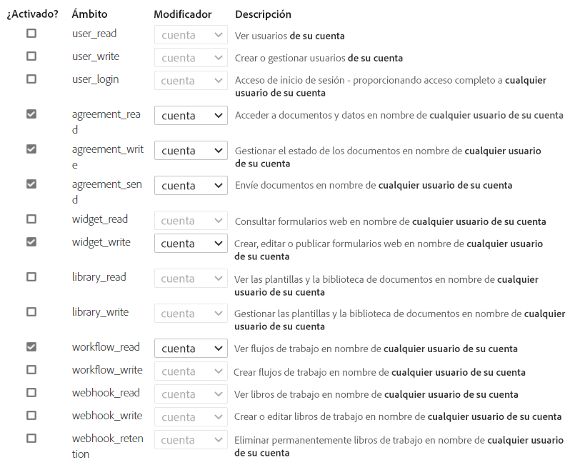

# Connect [!DNL AEM Forms] as a Cloud Service con [!DNL Adobe Acrobat Sign] {#integrate-adobe-sign-with-aem-forms}

[!DNL Adobe Acrobat Sign] activa los flujos de trabajo de firma electrónica para flujos de trabajo adaptables de Forms AEM y de. Las firmas electrónicas mejoran los flujos de trabajo para procesar documentos para el área legal, ventas, nóminas, administración de recursos humanos y muchas más.

Cuando se trabaja con [!DNL Adobe Acrobat Sign] y los formularios adaptables, normalmente los usuarios rellenan un formulario adaptable para solicitar un servicio. Por ejemplo, una solicitud de tarjeta de crédito y un formulario de solicitud para una prestación. Cuando un usuario rellena, envía y firma el formulario de solicitud, este se envía al proveedor de servicios para que realice más acciones. El proveedor de servicios revisa la solicitud y utiliza [!DNL Adobe Acrobat Sign] para marcarla como aprobada. AEM Forms es compatible tanto con Adobe Acrobat Sign como con Adobe Acrobat Sign Solutions para el gobierno. Según la licencia y los requisitos, puede integrar o conectar AEM Forms con cualquiera de las soluciones:

* [Conexión de AEM Forms con Adobe Acrobat Sign](#adobe-sign)
* [Conectar AEM Forms con Adobe Acrobat Sign Solutions para Administración Pública](#adobe-acrobat-sign-for-government)

## Conexión de AEM Forms con Adobe Acrobat Sign {#adobe-sign}

Para conectar **[!DNL AEM Forms]** con **[!DNL Adobe Acrobat Sign]**, configure el software y las cuentas enumerados en la sección Requisitos previos y configure Adobe Sign Cloud Service en las instancias Autor as a Cloud Service y Publicación de Forms:

### Requisitos previos para conectar AEM Forms con Adobe Acrobat Sign {#prerequisites-for-adobe-sign}

Para integrar, necesita la siguiente configuración [!DNL Adobe Acrobat Sign] con [!DNL AEM Forms]:

1. Un activo [cuenta de desarrollador de Adobe Acrobat Sign](https://acrobat.adobe.com/es/es/sign/developer-form.html).
1. Un [aplicación API de Adobe Acrobat Sign](https://www.adobe.io/apis/documentcloud/sign/docs.html#!adobedocs/adobe-sign/master/gstarted/create_app.md).
1. Las credenciales (ID de cliente y Secreto de cliente) de la aplicación API de [!DNL Adobe Acrobat Sign];
1. (solo para autenticación basada en documentos de identidad oficiales) [Habilitar el método de autenticación](https://helpx.adobe.com/es/sign/using/adobesign-authentication-government-id.html#AuditReport) para la autenticación de documentos oficiales.


### Conectar las instancias de autor y publicación de AEM Forms con Adobe Acrobat Sign {#configure-adobe-sign-with-aem-forms}

Una vez cumplidos los requisitos previos, realice los siguientes pasos para configurar [!DNL Adobe Acrobat Sign] con [!DNL AEM Forms] en las instancias de autor.

1. En la instancia de autor de AEM Forms, vaya a **[!UICONTROL Herramientas]**  > **[!UICONTROL General]** > **[!UICONTROL Explorador de configuración]**.
1. En la página **[!UICONTROL Explorador de configuración]**, pulse **[!UICONTROL Crear]**.
1. En el cuadro de diálogo **[!UICONTROL Crear configuración]**, especifique un **[!UICONTROL Título]** para la configuración, habilite **[!UICONTROL Configuraciones de nube]** y pulse **[!UICONTROL Crear]**. Crea un contenedor de configuración para almacenar servicios en la nube. Asegúrese de que el nombre de la carpeta no contenga ningún espacio.
1. Vaya a **[!UICONTROL Herramientas]**  > **[!UICONTROL Cloud Services]** > **[!UICONTROL Adobe Acrobat Sign]** y abra el contenedor de configuración que creó en el paso anterior.

   >[!NOTE]
   >
   >Cuando cree un formulario adaptable, especifique el nombre del contenedor en el campo **[!UICONTROL Contenedor de configuración]**.

1. En la página de configuración, pulse **[!UICONTROL Crear]** para crear una configuración de [!DNL Adobe Acrobat Sign] en AEM Forms.
1. En el **[!UICONTROL General]** de la pestaña **[!UICONTROL Crear configuración de Adobe Acrobat Sign]** página, especifique un **[!UICONTROL Nombre]** para la configuración de y pulse **[!UICONTROL Siguiente]**. Si lo desea, puede especificar un **[!UICONTROL Título]** y examinar los archivos para seleccionar una **[!UICONTROL miniatura]** para la configuración.

1. Ahora puede **[!UICONTROL Seleccionar solución]** para seleccionar [!DNL Adobe Acrobat Sign].

   

1. Copie la URL presente en la ventana actual del explorador en un bloc de notas y elimine la parte `/ui#/aem` desde la dirección URL. La URL modificada es necesaria para configurar [!DNL Adobe Acrobat Sign] aplicación con [!DNL AEM Forms], en un paso posterior. Pulse **[!UICONTROL Siguiente]**.

1. En la pestaña **[!UICONTROL Configuración]**, el campo **[!UICONTROL URL de OAuth]** contiene la URL predeterminada. El formato de la URL es el siguiente:

   `https://<shard>/public/oAuth/v2`

   Por ejemplo:
   `https://secure.na1.echosign.com/public/oauth/v2`

   donde:

   **na1** hace referencia a la partición predeterminada de la base de datos. Puede modificar el valor de la partición de la base de datos. Asegúrese de que las configuraciones en la nube de [!DNL  Adobe Acrobat Sign] apuntan a la [partición correcta](https://helpx.adobe.com/es/sign/using/identify-account-shard.html).

   Si crea otra configuración de [!DNL Adobe Acrobat Sign] para una función o componente de Adobe Experience Manager, asegúrese de que todas las configuraciones en la nube de [!DNL Adobe Acrobat Sign] apuntan a la misma partición.

   >[!NOTE]
   >
   > Guarde el **Crear configuración de Adobe Acrobat Sign** página abierta. No la cierre. Puede recuperar la **ID de cliente** y el **Secreto de cliente** después de configurar OAuth para la aplicación [!DNL Adobe Acrobat Sign] como se describe en los pasos siguientes.


1. Configure OAuth para la aplicación [!DNL Adobe Acrobat Sign]:

   1. Abra una ventana del explorador e inicie sesión en su cuenta de desarrollador de [!DNL Adobe Acrobat Sign].
   1. Seleccione la aplicación configurada para [!DNL AEM Forms] y pulse **[!UICONTROL Configurar OAuth para aplicación]**.
   1. En el cuadro **[!UICONTROL URL de redireccionamiento]**, añada la URL copiada en el paso anterior (Paso 8) y haga clic en **[!UICONTROL Guardar]**.
   1. Habilite el siguiente ámbito para la aplicación [!DNL Adobe Acrobat Sign] y haga clic en **[!UICONTROL Guardar]**.
   * [!DNL aggrement_read]
   * [!DNL aggrement_write]
   * [!DNL aggrement_send]
   * [!DNL widget_read]
   * [!DNL widget_write]
   * [!DNL workflow_read]

   Para obtener información paso a paso sobre cómo configurar OAuth para una aplicación [!DNL Adobe Acrobat Sign] y obtener las claves, consulte la documentación para desarrolladores [Configurar OAuth para la aplicación](https://www.adobe.io/apis/documentcloud/sign/docs.html#!adobedocs/adobe-sign/master/gstarted/configure_oauth.md).

   

1. Vuelva a la **[!UICONTROL Crear configuración de Adobe Acrobat Sign]** página. En la pestaña **[!UICONTROL Configuración]**, especifique la [**[!UICONTROL ID de cliente]** (también denominada como ID de aplicación) y el **[!UICONTROL Secreto de cliente]**]. Utilice el [ID de cliente y secreto de cliente de la aplicación Adobe Acrobat Sign](https://opensource.adobe.com/acrobat-sign/developer_guide/helloworld.html#get-the-app-id-and-secret) que creó en el paso anterior.

1. Seleccione el **[!UICONTROL Habilitar Adobe Acrobat Sign para archivos adjuntos]** para anexar los archivos adjuntos a un formulario adaptable al correspondiente [!DNL Adobe Acrobat Sign] documento enviado para firmar.

1. Tocar **[!UICONTROL Conectar con Adobe Acrobat Sign]**. Cuando se le soliciten credenciales, proporcione **nombre de usuario** y **contraseña** de la cuenta utilizada al crear [!DNL Adobe Acrobat Sign] aplicación. Cuando se le pida que confirme, acceda a `your developer account`, haga clic en **[!UICONTROL Permitir el acceso]**. Si las credenciales son correctas y permite a [!DNL AEM Forms] acceder a su cuenta de desarrollador de [!DNL Adobe Acrobat Sign], aparecerá un mensaje de éxito similar al siguiente.

   

1. Pulse **[!UICONTROL Crear]** para crear la configuración de [!DNL Adobe Acrobat Sign].

1. Seleccione la configuración y haga clic en **[!UICONTROL Publicar]**, seleccione la configuración y haga clic en **[!UICONTROL Publicar]**. Esto replicará la configuración en los entornos de publicación correspondientes.

1. Repita todos los pasos anteriores en las instancias de desarrollador, fase y producción (cualquiera de las restantes) para completar la configuración de [!DNL Adobe Acrobat Sign] con [!DNL AEM Forms] para su entorno.

Ahora, puede [use Agregar campos de Adobe Acrobat Sign a un formulario adaptable](working-with-adobe-sign.md). Asegúrese de agregar el contenedor de configuración utilizado para Cloud Service a todos los formularios adaptables habilitados para [!DNL Adobe Acrobat Sign]. Puede especificar un contenedor de configuración desde las propiedades de un formulario adaptable.

## Conectar AEM Forms con Adobe Acrobat Sign Solutions para Administración Pública {#adobe-acrobat-sign-for-government}

La conexión de AEM Forms con Adobe Acrobat Sign Solutions para Administración Pública es un proceso de varios pasos. Implica:

* AEM Creación de una URL de redireccionamiento para las instancias de la
* Uso compartido de la dirección URL de redireccionamiento y los ámbitos con el equipo de Adobe Sign Solutions for Government
* Recibiendo credenciales del equipo de Adobe Sign
* Usar las credenciales recibidas para conectar AEM Forms con Adobe Acrobat Sign Solutions para Administración Pública


AEM Forms as a Cloud Service proporciona entornos de desarrollo, fase y producción. Puede empezar conectando su entorno de desarrollo para con Adobe Acrobat Sign Solutions para Administración Pública y conectar los entornos de ensayo y producción más adelante.

### Antes de comenzar {#prerequisites-for-adobe-sign-for-acrobat-sign-for-government}

Antes de empezar a conectar AEM Forms con la solución de Adobe Acrobat Sign, asegúrese de que su [Adobe Acrobat Sign Solutions para Administración Pública](https://opensource.adobe.com/acrobat-sign/signgov/gstarted.html#account-provisioning) cuenta está aprovisionada.


### Conexión de AEM Forms as a Cloud Service con Adobe Acrobat Sign Solutions para Administración Pública {#connect-adobe-acrobat-sign-for-government}

#### AEM Cree una dirección URL de redireccionamiento para la instancia de

1. En la instancia de autor as a Cloud Service de Forms, navegue hasta **[!UICONTROL Herramientas]**  > **[!UICONTROL General]** > **[!UICONTROL Explorador de configuración]**.
1. En la página **[!UICONTROL Explorador de configuración]**, pulse **[!UICONTROL Crear]**.
1. En el cuadro de diálogo **[!UICONTROL Crear configuración]**, especifique un **[!UICONTROL Título]** para la configuración, habilite **[!UICONTROL Configuraciones de nube]** y pulse **[!UICONTROL Crear]**. Crea un contenedor de configuración para almacenar servicios en la nube. Asegúrese de que el nombre de la carpeta no contenga ningún espacio.
1. Vaya a **[!UICONTROL Herramientas]**  > **[!UICONTROL Cloud Services]** > **[!UICONTROL Adobe Acrobat Sign]** y abra el contenedor de configuración que creó en el paso anterior. Cuando cree un formulario adaptable, especifique el nombre del contenedor en el campo **[!UICONTROL Contenedor de configuración]**.
1. En la página de configuración, pulse **[!UICONTROL Crear]** para crear una configuración de [!DNL Adobe Acrobat Sign] en AEM Forms.
1. Copie la dirección URL de la ventana actual del explorador en un bloc de notas y elimine `/ui#/aem` desde la dirección URL. Esta URL se denomina `re-direct URL`. En la siguiente sección, comparta la variable `re-direct URL` y `Scopes` con el equipo de Adobe Sign y las credenciales de solicitud (ID de cliente y Secreto de cliente).


#### Comparta la dirección URL de redireccionamiento y los ámbitos con el equipo de Adobe Sign y reciba las credenciales

El equipo de Adobe Acrobat Sign para soluciones gubernamentales requiere lo siguiente `re-direct URL` y los ámbitos que se van a habilitar para la aplicación de Adobe Acrobat Sign (enumerados a continuación) para generar credenciales (ID de cliente y Secreto de cliente) que le permitan conectar AEM Forms con Adobe Acrobat Sign Solutions para Administración Pública.

Compartir el `scopes` (enumeradas a continuación) y el `re-direct URL` creó y anotó el último paso de la sección anterior con su representante de Adobe Acrobat Sign para soluciones gubernamentales ([miembro del equipo de Adobe Professional Services](https://opensource.adobe.com/acrobat-sign/signgov/gstarted.html#password)).

**_Ámbitos_**

* [!DNL aggrement_read]
* [!DNL aggrement_write]
* [!DNL aggrement_send]
* [!DNL widget_read]
* [!DNL widget_write]
* [!DNL workflow_read]
* [!DNL offline_access]

El representante genera y comparte credenciales con usted. En la siguiente sección, utilice las credenciales (ID de cliente y Secreto de cliente) para conectar AEM Forms con Adobe Acrobat Sign Solutions para Administración Pública.

#### Utilice las credenciales recibidas para conectar AEM Forms con Adobe Acrobat Sign Solutions para Administración Pública

1. Abra el `re-direct URL` en el explorador. Ha creado y anotado el `re-direct URL` en el último paso del [AEM creación de una URL de redireccionamiento en la instancia de](#create-redirect-url) sección.

1. En la pestaña **[!UICONTROL General]** de la página **[!UICONTROL Crear configuración de Adobe Sign]**, especifique un **[!UICONTROL Nombre]** para la configuración y pulse **[!UICONTROL Siguiente]**. Si lo desea, puede especificar un **[!UICONTROL Título]** y examinar los archivos para seleccionar una **[!UICONTROL miniatura]** para la configuración. Haga clic en **[!UICONTROL Siguiente]**.

1. En el **[!UICONTROL Configuración]** de la pestaña **[!UICONTROL Crear configuración de Adobe Sign]** página, para el **[!UICONTROL Seleccionar solución]** , seleccione [!DNL Adobe Acrobat Sign Solutions for Government].

   

1. En el **[!UICONTROL Correo electrónico]** , especifique la dirección de correo electrónico asociada a su cuenta de Adobe Acrobat Sign Solutions para Administración Pública.

1. El **[!UICONTROL URL de OAuth]** El campo especifica la partición de la base de datos Adobe Sign. El campo contiene la dirección URL predeterminada. No cambie la dirección URL.

1. Use las credenciales compartidas por Adobe Acrobat Sign para el representante de soluciones gubernamentales ([miembro del equipo de Adobe Professional Services]) en la sección anterior como [**[!UICONTROL ID de cliente]** y **[!UICONTROL Secreto del cliente]**].

1. Seleccione el **[!UICONTROL Habilitar Adobe Acrobat Sign para archivos adjuntos]** para anexar los archivos adjuntos a un formulario adaptable al correspondiente [!DNL Adobe Acrobat Sign] documento enviado para firmar.

1. Pulse **[!UICONTROL Conectar con Adobe Sign]**. Cuando se le soliciten credenciales, indique el nombre de usuario y la contraseña de la cuenta utilizada al crear la aplicación [!DNL Adobe Acrobat Sign]. Cuando se le pida que confirme el acceso de `your developer account`, haga clic en **[!UICONTROL Permitir acceso]**. Si las credenciales son correctas y permite a [!DNL AEM Forms] acceder a su cuenta de desarrollador de [!DNL Adobe Acrobat Sign], aparecerá un mensaje de éxito similar al siguiente.

   

   <!-- > When prompted for credentials, provide username and password of the account used while creating [!DNL Adobe Acrobat Sign] application. When asked to confirm access for `your developer account`, Click **[!UICONTROL Allow Access]**. -->

1. Pulse **[!UICONTROL Crear]** para crear la configuración de .

1. Seleccione la configuración y haga clic en **[!UICONTROL Publicar]**, seleccione la configuración y haga clic en **[!UICONTROL Publicar]**. Esto replicará la configuración en los entornos de publicación correspondientes.

1. Repita todos los pasos anteriores en las instancias de desarrollador, fase y producción (cualquiera de las restantes) para completar la configuración de [!DNL Adobe Acrobat Sign Solutions for Government] con [!DNL AEM Forms] para su entorno.

Ahora, puede [utilice agregar campos de Adobe Acrobat Sign en un formulario adaptable](working-with-adobe-sign.md) o [AEM Flujo de trabajo de](/help/forms/aem-forms-workflow-step-reference.md#sign-document-step-sign-document-step). Asegúrese de agregar el contenedor de configuración utilizado para la configuración del Cloud Service a todos los Forms adaptables habilitados para [!DNL Adobe Acrobat Sign]. Puede especificar un contenedor de configuración desde las propiedades de un formulario adaptable.

## (Solo para flujos de trabajo de AEM) Configure el planificador de [!DNL Adobe Acrobat Sign] para sincronizar el estado de firma. {#configure-adobe-sign-scheduler-to-sync-the-signing-status}

Cuando utilice el paso del flujo de trabajo [!DNL Adobe Acrobat Sign] para firmar un formulario adaptable, el formulario se puede pasar de un firmante a otro o se puede enviar a todos los firmantes simultáneamente, en función de la configuración del paso del flujo de trabajo. Los formularios adaptables habilitados para [!DNL Adobe Acrobat Sign] se envían al servidor de Experience Manager Forms solo después de que todos los firmantes completen el proceso de firma.

De forma predeterminada, los servicios del planificador [!DNL Adobe Acrobat Sign] comprueban (sondean) la respuesta de los firmantes cada 24 horas. Puede cambiar el intervalo predeterminado para su entorno.

Para cambiar el intervalo predeterminado, especifique un [expresión cron](https://en.wikipedia.org/wiki/Cron#CRON_expression) para el **sign.status.exp** propiedad del **Servicio de configuración de Adobe Acrobat Sign** configuración.

Por ejemplo, para ejecutar el servicio de configuración diariamente a las 00:00, establezca **sign.status.exp** propiedad del **Servicio de configuración de Adobe Acrobat Sign** configuración para especificar `0 0 0 1/1 * ? *`. El siguiente archivo JSON muestra el ejemplo para ejecutar el servicio de configuración diariamente a las 00:00 a. m.:

```json
{
  "sign.status.exp":"0 0 0 1/1 * ? *"
}
```

Para establecer los valores de una configuración, [Generar configuraciones OSGi mediante el SDK de AEM](https://experienceleague.adobe.com/docs/experience-manager-cloud-service/implementing/deploying/configuring-osgi.html?lang=es#generating-osgi-configurations-using-the-aem-sdk-quickstart) e [implemente la configuración](https://experienceleague.adobe.com/docs/experience-manager-cloud-service/implementing/using-cloud-manager/deploy-code.html?lang=es#deployment-process) a su instancia de Cloud Service.


## Artículos relacionados {#related-articles}

* [Usar Adobe Acrobat Sign en un formulario adaptable](working-with-adobe-sign.md)

* [Prácticas recomendadas para utilizar Adobe Acrobat Sign con Forms adaptable](https://medium.com/adobetech/using-adobe-sign-to-e-sign-an-adaptive-form-heres-the-best-way-to-do-it-dc3e15f9b684)
