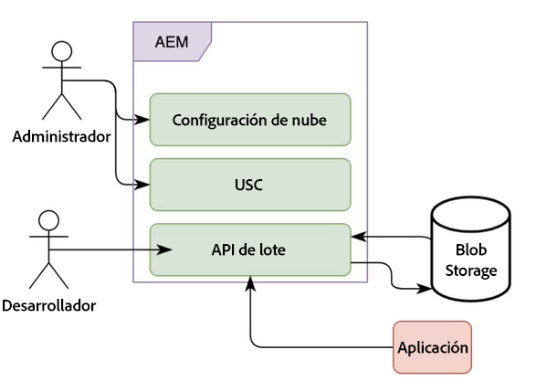

# Procesamiento por lotes de Comunicaciones de AEM Forms as a Cloud Service

Las comunicaciones le permiten crear, montar y entregar comunicaciones personalizadas y orientadas a la marca, como correspondencia comercial, documentos, declaraciones, cartas de procesamiento de reclamaciones, avisos de beneficios, facturas mensuales y kits de bienvenida. Puede utilizar las API de comunicaciones para combinar una plantilla (XFA o PDF) con datos de clientes para generar documentos en los formatos PDF, PS, PCL, DPL, IPL y ZPL.

Las comunicaciones ofrecen API para la generación de documentos bajo demanda y planificados. Puede utilizar API sincrónicas para la generación bajo demanda y API por lotes (API asincrónicas) para la generación planificada de documentos:

* Las API sincrónicas son adecuadas para casos de uso de generación de documentos bajo demanda, con baja latencia y de registro único. Estas API son más adecuadas para casos de uso basados en las acciones del usuario. Por ejemplo, generar un documento después de que un usuario rellene un formulario.

* Las API por lotes (API asíncronas) son adecuadas para casos de uso planificados de alto rendimiento y de generación de múltiples documentos. Estas API generan documentos por lotes. Por ejemplo, facturas telefónicas, extractos de tarjetas de crédito y declaraciones de beneficios generados cada mes.

<!-- The following skills are required to create templates and use HTTP APIs: 

* Understanding of Adobe Forms Designer or Acrobat Forms to create templates

* Understanding of HTTP APIs and experience of using HTTP APIs

* Basic understanding of Adobe Experience Manager -->

## Operaciones por lotes {#batch-operations}

Una operación por lotes es un proceso de generación de varios documentos de tipo similar para un conjunto de registros a intervalos planificados. Una operación por lotes consta de dos partes: configuración (definición) y ejecución.

* **Configuración (definición)**: Una configuración por lotes almacena información sobre varios activos y propiedades que se deben ajustar para documentos generados. Por ejemplo, ofrece detalles acerca de la plantilla XDP o PDF y la ubicación de los datos de cliente que se van a utilizar, además de especificar diversas propiedades para los documentos de salida.

* **Ejecución**: Para iniciar una operación por lotes, pase el nombre de la configuración por lotes al API de ejecución por lotes.

### Componentes de una operación por lotes {#components-of-a-batch-operations}

**Configuración de nube**: La configuración de Experience Manager Cloud le ayuda a conectar una instancia de Experience Manager al almacenamiento de Microsoft Azure de propiedad del cliente. Permite especificar las credenciales de la cuenta de Microsoft Azure propiedad del cliente para conectarse a ella.

**Configuración del almacén de datos por lotes (USC)**: La configuración de datos por lotes le ayuda a configurar una instancia específica del almacenamiento de Blob para las API por lotes. Permite especificar las ubicaciones de entrada y salida en el almacenamiento del Blob de Microsoft Azure de propiedad del cliente.

**API por lotes**: Permite crear configuraciones por lotes y realizar las ejecuciones por lotes en función de estas configuraciones para combinar una plantilla PDF o XDP con datos y generar resultados en los formatos PDF, PS, PCL, DPL, IPL y ZPL. Las comunicaciones ofrecen API por lotes para la administración de la configuración y la ejecución por lotes.

**Almacenamiento**: Las API de comunicación utilizan el almacenamiento de Microsoft Azure Cloud de propiedad del cliente para recuperar registros del cliente y almacenar documentos generados. Puede configurar el almacenamiento de Microsoft Azure en la configuración de Experience Manager Cloud Service.

**Aplicación**: Su aplicación personalizada para utilizar las API por lotes para generar y consumir documentos.

## Generar varios documentos mediante operaciones por lotes {#generate-multiple-documents-using-batch-operations}

Puede utilizar operaciones por lotes para generar varios documentos a intervalos programados.

>[!VIDEO](https://video.tv.adobe.com/v/338349)

Puede ver el vídeo o seguir las instrucciones a continuación para aprender a generar documentos mediante operaciones por lotes. La documentación de referencia del API utilizada en vídeo está disponible en formato .yaml. Puede descargar el archivo [API por lotes](assets/batch-api.yaml) y cargarlo en Postman para comprobar la funcionalidad de las API y seguir el vídeo.

### Requisitos previos {#pre-requisites}

Para utilizar el API por lotes, se requiere lo siguiente:

* [Cuenta de almacenamiento de Microsoft Azure](https://docs.microsoft.com/es-es/azure/storage/common/storage-account-create?tabs=azure-portal)
* Plantillas PDF o XDP
* [Datos que se deben combinar con las plantillas](#form-data)
* Usuarios con privilegios de administrador en Experience Manager

### Configurar su entorno {#setup-your-environment}

Antes de utilizar una operación por lotes:

* Cargue datos de clientes (archivos XML) al almacenamiento del Blob de Microsoft Azure
* Crear una configuración de nube
* Crear una configuración del almacén de datos por lotes
* Cargue plantillas y otros recursos a su instancia de Experience Manager Forms Cloud Service

### Cargar datos de clientes (archivos XML) al almacenamiento de Azure

En su almacenamiento de Microsoft Azure, cree [contenedores](https://docs.microsoft.com/es-es/azure/vs-azure-tools-storage-explorer-blobs) y [cargue datos de clientes (XML)](https://docs.microsoft.com/es-es/azure/vs-azure-tools-storage-explorer-blobs#managing-blobs-in-a-blob-container) a las [carpetas](https://docs.microsoft.com/es-es/azure/storage/blobs/storage-quickstart-blobs-portal) dentro de los contenedores.

>[!NOTE]
>
>Puede configurar el almacenamiento de Microsoft Azure para que limpie automáticamente la carpeta de entrada o mueva el contenido de la carpeta de salida a una ubicación diferente a intervalos programados. Con todo, asegúrese de que las carpetas no se limpien cuando se siga ejecutando una operación por lotes que haga referencia a las carpetas.

### Crear una configuración de nube {#create-a-cloud-configuration}

La configuración de nube conecta su instancia de Experience Manager con el almacenamiento de Microsoft Azure. Para crear una configuración de nube:

1. Vaya a Herramientas > Cloud Services > Almacenamiento de Azure
1. Abra una carpeta para hospedar la configuración y haga clic en Crear. Utilice la carpeta Global o cree una carpeta.
1. Especifique el nombre de la configuración y las credenciales para conectarse al servicio. Puede [recuperar estas credenciales de su portal de almacenamiento de Microsoft Azure](https://docs.microsoft.com/es-es/azure/storage/common/storage-account-keys-manage?tabs=azure-portal#view-account-access-keys).
1. Haga clic en Crear.

Su instancia de Experience Manager ya está lista para conectarse al almacenamiento de Microsoft Azure y puede utilizarla para almacenar y leer contenido, cuando sea necesario.

### Crear una configuración del almacén de datos por lotes {#create-batch-data-store-configuration}

La configuración de datos por lotes le ayuda a configurar contenedores y carpetas para la entrada y salida. Los registros del cliente se mantienen en la carpeta Fuente y los documentos generados se ubican en la carpeta Destino.

Para crear la configuración:

1. Vaya a Herramientas > Formularios > Conector de almacenamiento unificado.
1. Abra una carpeta para hospedar la configuración y haga clic en Crear. Utilice la carpeta Global o cree una carpeta.
1. Especifique el título y el nombre de la configuración. En Almacenamiento, seleccione Almacenamiento de Microsoft Azure.
1. En Ruta de configuración de almacenamiento, examine y seleccione la configuración de nube que contiene las credenciales de la cuenta de almacenamiento de Azure de propiedad del cliente.
1. En la carpeta Fuente, especifique el nombre del contenedor de almacenamiento de Azure y la carpeta que contiene los registros.
1. En la carpeta Destino, especifique la ruta del contenedor y la carpeta de almacenamiento de Azure para almacenar los documentos generados.
1. Haga clic en Crear.

La instancia de Experience Manager ahora está conectada al almacenamiento de Microsoft Azure y configurada para recuperar y enviar datos a ubicaciones específicas del almacenamiento de Microsoft Azure.

### Cargar plantillas y otros activos a su instancia de Experience Manager {#upload-templates-and-other-assets-to-your-AEM-instance}

Una organización suele tener varias plantillas. Por ejemplo, una plantilla para los extractos de tarjetas de crédito, las declaraciones de beneficios y las solicitudes de reclamación. Cargue todas estas plantillas XDP y PDF en su instancia de Experience Manager. Para cargar una plantilla:

1. Abra su instancia de Experience Manager.
1. Vaya a Formularios > Formularios y documentos
1. Haga clic en Crear > Carpeta y cree una carpeta. Abra la carpeta.
1. Haga clic en Crear > Cargar archivo y cargue las plantillas.

## Use el API por lotes para generar documentos {#use-batch-API-to-generate-documents}

Para utilizar un API por lotes, cree una configuración por lotes y realice una ejecución basada en esa configuración. La documentación del API ofrece información sobre las API para crear y ejecutar un lote, los parámetros correspondientes y los posibles errores. Puede descargar el [archivo de definición del API](assets/batch-api.yaml) y cargarlo en [Postman](https://go.postman.co/home) o un software similar para probar las API y crear y ejecutar una operación por lotes.

### Crear un lote {#create-a-batch}

Para crear un lote, utilice el API `POST /config`. Incluya las siguientes propiedades obligatorias en el cuerpo de la petición HTTP:

* **configName**: Especifique un nombre único para el lote. Por ejemplo, `wknd-job`
* **dataSourceConfigUri**: Especifique la ubicación de la configuración del almacén de datos por lotes. Puede ser una ruta relativa o absoluta de la configuración. Por ejemplo: `/conf/global/settings/forms/usc/batch/wknd-batch`
* **outputTypes**: Especifique los formatos de salida: PDF e PRINT. Si utiliza el tipo de salida PRINT, en la propiedad `printedOutputOptionsList`, especifique al menos una opción de impresión. Las opciones de impresión se identifican por su tipo de procesamiento, por lo que actualmente no se permiten varias opciones de impresión con el mismo tipo de procesamiento. Los formatos compatibles son PS, PCL, DPL, IPL y ZPL.

* **template**: Especifique la ruta absoluta o relativa de la plantilla. Por ejemplo, `crx:///content/dam/formsanddocuments/wknd/statements.xdp`

Si especifica una ruta relativa, facilite también una raíz de contenido. Consulte la documentación del API para obtener más información sobre la raíz de contenido.

<!-- For example, you include the following JSON in the body of HTTP APIs to create a batch named wknd-job: -->

Puede usar `GET /config /[configName]` para ver los detalles de la configuración por lotes.

### Ejecutar un lote {#run-a-batch}

Para utilizar (ejecutar) un lote, use `POST /config /[configName]/execution`. Por ejemplo, para ejecutar un lote llamado wknd-demo, utilice /config/wknd-demo/execution. El servidor devuelve el código de respuesta HTTP 202 al aceptar la solicitud. El API no devuelve ninguna carga útil excepto un código único (identificador de ejecución) en el encabezado de la respuesta HTTP para el trabajo por lotes que se ejecuta en el servidor. Puede utilizar el identificador de ejecución para recuperar el estado del lote.

>[!NOTE]
>
>Mientras se ejecuta el lote, no realice ningún cambio en las carpetas de fuente y destino correspondientes, en la configuración de la fuente de datos y en la configuración de Microsoft Azure Cloud.

### Comprobar el estado de un lote {#status-of-a-batch}

Para recuperar el estado de un lote, utilice `GET /config /[configName]/execution/[execution-identifier]`. El identificador de ejecución se incluye en el encabezado de la respuesta HTTP para la solicitud de ejecución por lotes.

La respuesta de la solicitud de estado contiene la sección de estado. Ofrece detalles sobre el estado del trabajo por lotes, el número de registros que ya están en proceso (ya se están leyendo y procesando) y el estado de cada outputType/renderType (número de elementos en curso, con éxito y con errores). El estado también incluye la hora de inicio y finalización del trabajo por lotes junto con información sobre errores, si los hay. La hora de finalización es -1 hasta que se completa la ejecución por lotes.

>[!NOTE]
>
>* Cuando solicita varios formatos PRINT, el estado contiene varias entradas. Por ejemplo, PRINT/ZPL, PRINT/IPL.
>* Un trabajo por lotes no lee todos los registros simultáneamente, sino que el trabajo sigue leyendo e incrementando el número de registros. Por lo tanto, el estado devuelve -1 hasta que se hayan leído todos los registros.

### Ver documentos generados {#view-generated-documents}

Al finalizar el trabajo, los documentos generados se almacenan en la carpeta `success`, en la ubicación de destino especificada en la configuración del almacén de datos por lotes. Si hay algún error, el servicio crea una carpeta `failure`. Ofrece información sobre el tipo y el motivo de los errores.

Entendámoslo con la ayuda de un ejemplo: Supongamos que hay un archivo de datos de entrada `record1.xml` y dos tipos de salida: `PDF` y `PCL`. A continuación, la ubicación de destino contiene dos subcarpetas: `pdf` y `pcl`; una para cada uno de los tipos de salida. Supongamos que la generación de PDF se ha realizado correctamente y que la subcarpeta `pdf` contiene la subcarpeta `success`, que a su vez contiene el documento de PDF generado `record1.pdf`. Supongamos que la generación de PCL ha fallado y luego la subcarpeta `pcl` contiene una subcarpeta `failure`, que a su vez contiene un archivo de error `record1.error.txt`, que contiene detalles del error. Además, la ubicación de destino contiene una carpeta temporal llamada `__tmp__`, que contiene ciertos archivos necesarios durante la ejecución por lotes. Esta carpeta se puede eliminar cuando no haya ejecuciones por lotes activas que hagan referencia a la carpeta de destino.

>[!NOTE]
>
>Procesar un lote puede tardar algún tiempo en función del número de registros de entrada y de la complejidad de la plantilla. Espere unos minutos antes de comprobar que las carpetas de destino tengan archivos de salida.

## Documentación de referencia del API

La documentación de referencia de la API ofrece información detallada sobre todos los parámetros, métodos de autenticación y diversos servicios que ofrecen las API. La documentación de referencia del API está disponible en formato .yaml. Puede descargar el archivo [API por lotes](assets/batch-api.yaml) y cargarlo en Postman para comprobar la funcionalidad de las API.

>[!MORELIKETHIS]
>
>* [Introducción a Comunicaciones de AEM Forms as a Cloud Service](/help/forms/aem-forms-cloud-service-communications-introduction.md)
>* [Arquitectura de AEM Forms as a Cloud Service para Formularios adaptables y API de comunicaciones](/help/forms/aem-forms-cloud-service-architecture.md)
>* [Procesamiento de comunicaciones: API sincrónicas](/help/forms/aem-forms-cloud-service-communications.md)
>* [Procesamiento de comunicaciones: API por lotes](/help/forms/aem-forms-cloud-service-communications-batch-processing.md)
>* [Procesamiento de comunicaciones - API a petición](/help/forms/aem-forms-cloud-service-communications-on-demand-processing.md)
