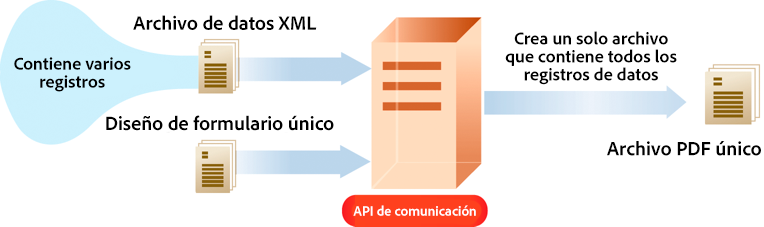

# Introducción a Comunicaciones de AEM Forms as a Cloud Service {#frequently-asked-questions}

| Versión | Vínculo del artículo |
| -------- | ---------------------------- |
| AEM 6.5 | [Haga clic aquí](https://experienceleague.adobe.com/docs/experience-manager-65/forms/use-document-services/overview-aem-document-services.html?lang=es) |
| AEM as a Cloud Service | Este artículo |

La funcionalidad de comunicaciones le ayuda a crear documentos estandarizados, personalizados y aprobados por la marca, como correspondencia comercial, declaraciones, cartas de procesamiento de reclamaciones, avisos de beneficios, facturas mensuales o kits de bienvenida.

La funcionalidad ofrece varias API para generar y manipular documentos. Puede generar o manipular un documento bajo demanda o crear un trabajo por lotes para generar varios documentos a intervalos definidos. Las API de comunicaciones ofrecen:

* Funcionalidades de generación de documentación por lotes y bajo demanda optimizadas.

* Funcionalidad para combinar, reorganizar y validar documentos PDF bajo demanda.

* Las API HTTP para facilitar la integración con sistemas externos. Se incluyen API independientes para operaciones bajo demanda (baja latencia) y por lotes (operaciones de alto rendimiento).

* Un acceso seguro a los datos. Las API de comunicaciones se conectan y acceden a los datos únicamente desde los repositorios de datos designados por el cliente, lo que hace que las comunicaciones sean muy seguras.

Se puede crear un extracto de tarjeta de crédito mediante las API de comunicaciones. Este extracto de ejemplo utiliza la misma plantilla pero datos independientes para cada cliente según su uso de la tarjeta de crédito.

## Generación de documentos

Las API de generación de documentos de comunicaciones ayudan a combinar una plantilla (XFA o PDF) con datos de clientes (XML) para generar documentos en formatos de PDF y de impresión, como PS, PCL, DPL, IPL y ZPL. Estas API utilizan plantillas PDF y XFA con [datos XML](communications-known-issues-limitations.md#form-data) para generar un solo documento bajo demanda o varios documentos usando un trabajo por lotes.

Normalmente, crea una plantilla mediante [Designer](use-forms-designer.md) y utiliza las API de comunicaciones para combinar los datos con la plantilla. Su aplicación puede enviar el documento de salida a una impresora de red, una impresora local o a un sistema de almacenamiento para su archivo. Los flujos de trabajo personalizados y típicos listos para usarse tienen el siguiente aspecto:

En función del caso de uso, también puede hacer que estos documentos estén disponibles para su descarga mediante su sitio web o un servidor de almacenamiento.

Algunos ejemplos de las API de generación de documentos son los siguientes:

### Crear documentos PDF {#create-pdf-documents}

Puede utilizar las API de generación de documentos para crear un documento PDF basado en un diseño de formulario y datos de formulario XML. El resultado es un documento de PDF no interactivo. Es decir, los usuarios no pueden introducir ni modificar los datos del formulario. Un flujo de trabajo básico es combinar los datos del formulario XML con un diseño de formulario para crear un documento PDF. La siguiente ilustración muestra la combinación de un diseño de formulario y datos del formulario XML para producir un documento PDF.

Figura: Flujo de trabajo típico para crear un documento PDF

### Crear un documento PostScript (PS), Printer Command Language (PCL), Zebra Printing Language (ZPL) {#create-PS-PCL-ZPL-documents}

Puede utilizar las API de generación de documentos para crear un documento PostScript (PS), Printer Command Language (PCL) y Zebra Printing Language (ZPL) basado en un documento PDF o diseño de formulario XDP. Estas API ayudan a combinar un diseño de formulario con datos de formulario para generar un documento. Puede guardar el documento en un archivo y desarrollar un proceso personalizado para enviarlo a una impresora.

<!-- ### Processing batch data to create multiple documents

Communications APIs can create separate documents for each record within an XML batch data source. The APIs can also create a single document that contains all records (this functionality is the default). Assume that an XML data source contains ten records and you instruct the APIs to create a separate document for each record (for example, PDF documents). As a result, the APIs generate ten PDF documents.

The following illustration also shows Communications APIs processing an XML data file that contains multiple records. However, assume that you instruct the APIs to create a single PDF document that contains all data records. In this situation, the APIs generate one document that contains all the records.

The following illustration shows Communications APIs processing an XML data file that con tains multiple records. Assume that you instruct the Communications APIs to create a separate PDF document for each data record. In this situation, the APIs generates a separate PDF document for each data record.

 -->

### Procesar datos por lotes para crear varios documentos {#processing-batch-data-to-create-multiple-documents}

Puede utilizar las API de generación de documentos para crear documentos independientes para cada registro dentro de una fuente de datos por lotes XML. Puede generar documentos en modo masivo y asincrónico. Puede configurar varios parámetros para la conversión y luego iniciar el proceso por lotes.

<!-- You can can also create a single document that contains all records (this functionality is the default).  Assume that an XML data source contains ten records and you have a requirement to create a separate document for each record (for example, PDF documents). You can use the Communication APIs to generate ten PDF documents. -->

<!-- The following illustration shows the Communication APIs processing an XML data file that contains multiple records. However, assume that you instruct the Communication APIs to create a single PDF document that contains all data records. In this situation, the Communication APIs generate one document that contains all the records.

The following illustration shows the Communication APIs processing an XML data file that contains multiple records. Assume that you instruct the Communication APIs to create a separate PDF document for each data record. In this situation, the Communication APIs generates a separate PDF document for each data record.

For detailed information on using Batch APIs, see Communication APIs: Processing batch data to create multiple documents. 

### Flatten interactive PDF documents {#flatten-interactive-pdf-documents}

You can use document generation APIs to transform an interactive PDF document (for example, a form) to a non-interactive PDF document. An interactive PDF document lets users enter or modify data located in the PDF document fields. The process of transforming an interactive PDF document to a non-interactive PDF document is called flattening. When a PDF document is flattened, a user cannot modify the data located in the document's fields. One reason to flatten a PDF document is to ensure that data cannot be modified.

You can flatten the following types of PDF documents:

* Interactive PDF documents created in Designer (that contain XFA streams).

* Acrobat PDF forms

If you attempt to flatten a non-interactive PDF document, an exception occurs.

### Retain Form State {#retain-form-state}

An interactive PDF document contains various elements that constitute a form. These elements may include fields (to accept or display data), buttons (to trigger events), and scripts (commands to perform a specific action). Clicking a button may trigger an event that changes the state of a field. For example, choosing a gender option may change the color of a field or the appearance of the form. This is an example of a manual event causing the form state to change.

When such an interactive PDF document is flattened using the Communications APIs, the state of the form is not retained. To ensure that the state of the form is retained even after the form is flattened, set the Boolean value _retainFormState_ to True to save and retain the state of the form. -->

## Manipulación de documentos

Las API de manipulación de documentos de comunicación ayudan a combinar, reorganizar y validar documentos PDF. Normalmente, crea un DDX y lo envía a las API de manipulación de documentos para montar o reorganizar un documento. El [documento DDX](https://helpx.adobe.com/content/dam/help/en/experience-manager/forms-cloud-service/ddxRef.pdf) ofrece instrucciones sobre cómo utilizar los documentos de origen para producir un conjunto de documentos necesarios. La documentación de referencia DDX ofrece información detallada acerca de todas las operaciones compatibles. Algunos ejemplos de manipulación de documentos son los siguientes:

### Montar los documentos PDF

Puede utilizar las API de manipulación de documentos para montar dos o más documentos PDF o XDP en un único documento PDF o Portfolio PDF. A continuación se indican algunas formas de montar documentos PDF:

* Montar un documento PDF sencillo
* Crear un Portfolio PDF
* Montar documentos cifrados
* Montar documentos utilizando la numeración Bates
* Acoplar y montar documentos

Figura: Montar un documento PDF sencillo a partir de varios documentos PDF

### Desmontar los documentos PDF

Puede utilizar las API de manipulación de documentos para desmontar un documento PDF. Las API pueden extraer páginas del documento de origen o dividir un documento fuente en base a marcadores. Normalmente, esta tarea resulta útil si el documento del PDF se creó originalmente a partir de numerosos documentos individuales, como una colección de declaraciones.

* Extraer páginas de un documento fuente
* Dividir un documento fuente basado en marcadores

Figura: Dividir un documento fuente basado en marcadores en varios documentos

### Convertir y validar documentos compatibles con PDF/A

Puede utilizar las API de manipulación de documentos para convertir un documento PDF en un documento compatible con PDF/A y para determinar si un documento PDF es compatible con PDF/A. PDF/A es un formato de archivo elaborado para la conservación del contenido del documento a largo plazo. Las fuentes están incrustadas en el documento y el archivo no está comprimido. Como resultado, un documento PDF/A suele ser más grande que un documento PDF estándar. Además, un documento PDF/A no contiene contenido de audio y vídeo.

<!-- 

## Document utilities

Document utilities synchronous APIs helps you convert documents between PDF and XDP file formats, and query information about a PDF document. For example, you can determine whether a PDF document contains comments or attachments. 

### Retrieve PDF document properties

You can [query a PDF document](https://developer.adobe.com/experience-manager-forms-cloud-service-developer-reference/references/pdf-utility-sync/#tag/Document-Extraction/) for the following information:

* Is a PDF Document: Check whether the source document is a PDF document.
* Is a fillable form: Check whether the source PDF document is a fillable form.
* Form Type: Retrieve the form type of the document.
* Check for Attachments: Check whether the source PDF document has any attachments.
* Check for Comments: Check whether the source PDF document has any review comments.
* Is a PDF Package: Check whether the document is a PDF package.
* Get the PDF Version: Retrieve the [version of the PDF document](https://en.wikipedia.org/wiki/History_of_PDF).
* Recommended Acrobat Version: Retrieve the required version of Acrobat (Reader) to open the PDF document.
* Is an XFA Document: Check whether the source PDF document is an XFA-based PDF document.
* Is Shell PDF: Check whether the source PDF document is shell PDF. A shell PDF contains only an XFA stream, font and image resources, and one page that is either blank or contains a warning that the document must be opened using Acrobat or Adobe Reader. The shell PDF is used with PDF transformation to optimize delivery of PDFForm transformations only.
* Get the XFA Version: Retrieve the [XFA Version for an XFA-based PDF document](https://en.wikipedia.org/wiki/XFA#XFA_versions).

### Convert PDF Documents into XDP Documents

The [PDF to XDP API](https://developer.adobe.com/experience-manager-forms-cloud-service-developer-reference/references/pdf-utility-sync/#tag/Document-Conversion) converts a PDF document to an XDP file. For a PDF document to be successfully converted to an XDP file, the PDF document must contain an XFA stream in the dictionary. -->

## Seguro del documento {#doc-assurance}

El servicio DocAssurance incluye las API de firma y codificación:

### API de firmas

Las API de firmas permiten a su organización proteger la seguridad y la privacidad de los documentos de Adobe PDF que distribuye y recibe. Este servicio utiliza firmas digitales y certificación para garantizar que solo los destinatarios previstos puedan modificar los documentos. Dado que las características de seguridad se aplican al propio documento, este permanece seguro y controlado durante todo su ciclo de vida. Un documento permanece seguro más allá del cortafuegos mientras se descarga sin conexión y se envía nuevamente a su organización. Puede realizar las siguientes tareas mediante las API de firmas:

* Agregue un campo de firma a un documento PDF.
* Firme el campo de firma especificado en un documento PDF.
* Certificar un documento PDF

### Las API de cifrado

Las API de cifrado permiten encriptar y desencriptar documentos. Cuando se encripta un documento, su contenido se vuelve ilegible. Un usuario autorizado puede desencriptar el documento para obtener acceso a su contenido. Si un documento PDF está encriptado con una contraseña, el usuario debe escribir la contraseña para abrir y visualizar el documento en Adobe Reader o Adobe Acrobat. Del mismo modo, si un documento PDF está encriptado con un certificado, el usuario debe desencriptar el documento PDF con la clave pública que corresponde al certificado (clave privada) que se utilizó para encriptarlo.

Puede realizar estas tareas mediante las API de encriptado:

* Encriptar un documento PDF con una contraseña.
* Quitar el encriptado de contraseña de un documento PDF.
* Recupera el tipo de seguridad aplicada a un documento PDF.

Tanto las API de firma como las de encriptado son [API sincrónicas](#types-of-communications-apis-types).

## Tipos de API de comunicaciones {#types}

Las comunicaciones ofrecen API HTTP para la generación de documentos por lotes y bajo demanda:

* **[Las API sincrónicas](https://developer.adobe.com/experience-manager-forms-cloud-service-developer-reference/)** son adecuadas para casos de uso de generación de documentos bajo demanda, con baja latencia y de registro único. Estas API son más adecuadas para casos de uso basados en las acciones del usuario. Por ejemplo, generar un documento después de que un usuario termine de rellenar un formulario.

* **[Las API por lotes (API asíncronas)](https://developer.adobe.com/experience-manager-forms-cloud-service-developer-reference/)** son adecuadas para escenarios planificados, de alto rendimiento y de generación de múltiples documentos. Estas API generan documentos por lotes. Por ejemplo, facturas telefónicas, extractos de tarjetas de crédito y declaraciones de beneficios generados cada mes.

## Incorporación

La funcionalidad de comunicaciones está disponible como módulo independiente y complementario para los usuarios de Forms as a Cloud Service. Póngase en contacto con el equipo de ventas de Adobe o con su representante de Adobe para solicitar acceso. Adobe posibilita el acceso a su organización y otorga los pertinentes privilegios a la persona de su organización designada como administrador. El administrador puede conceder acceso a los desarrolladores de Forms as a Cloud Service (usuarios) de su organización para que utilicen las API.

Después de la incorporación, para habilitar la funcionalidad de comunicaciones para su entorno de Forms as a Cloud Service:

1. Inicie sesión en Cloud Manager y abra su instancia de AEM Forms as a Cloud Service.

1. Abra la opción Editar programa, vaya a la pestaña Soluciones y complementos y seleccione la opción **[!UICONTROL Formularios: comunicaciones]**.

   

   Si ya ha habilitado la opción **[!UICONTROL Formularios: inscripción digital]**, a continuación, seleccione **[!UICONTROL Formularios: complemento de comunicaciones]**.

   

1. Haga clic en **[!UICONTROL Actualizar]**.

1. Ejecute la canalización de la versión. Una vez que la canalización de la versión se haya realizado correctamente, las API de comunicaciones se habilitan para su entorno.

>[!NOTE]
>
> Para habilitar y configurar las API de manipulación de documentos, agregue la siguiente regla a [Configuración de Dispatcher](setup-local-development-environment.md#forms-specific-rules-to-dispatcher):
>
> `# Allow Forms Doc Generation requests`
> `/0062 { /type "allow" /method "POST" /url "/adobe/forms/assembler/*" }`

<!--

Communication help you combine a template and XML data to generate print documents in various formats. The service lets you generate documents in synchronous and batch modes. The APIs enables you to create applications that let you:

  * Generate documents by populating template files (PDF and XDP) with XML data.
  * Generate output forms in various formats, including non-interactive PDF print streams.

Consider a scenario where you have one or more templates and multiple records of XML data for each template. You can use Communications APIs to generate a print document for each record.  You can also combine the records into a single document.  The result is a non-interactive PDF document. A non-interactive PDF document does not let users enter data into its fields.

 There are two main Communications APIs. The _generatePDFOutput_ generates PDFs, while the _generatePrintedOutput_ generates PostScript, ZPL, and PCL formats. These APIs are available as REST endpoints on your environment, both on author and publish instances. Since the publish instances are configured to scale faster than the author instances, it is recommended use these APIs via publish instances.

The first parameter of both the operations accept the path and name of the template file (for example, ExpenseClaim.xdp). You can specify a fully qualified path, reference path of your AEM Repository, or path of a binary file. The second parameter accepts an XML document that is merged with the template while generating the output document.  

The [API reference documentation](https://documentcloud.adobe.com/link/track?uri=urn:aaid:scds:US:b1223732-ae0f-4921-bdc0-c31e48b56044) provides detailed information about all the parameters, authentication methods, and various services provided by APIs. The API reference documentation is also available in the .yaml format. You can download the .yaml for [Batch APIs](assets/batch-api.yaml) or [non-Batch API.yaml](assets/non-batch-api.yaml) file and upload it to postman to check functionality of APIs.

>[!VIDEO](https://video.tv.adobe.com/v/335771)

Uploading Communication APIs .yaml file to postman to check functionality of APIs.

## Using the Communications APIs {#workflows}

Typically, you create a template using [Designer](use-forms-designer.md) and use communications APIs ( generatePDFOutput and generatePrintedOutput) to:

* Convert these templates to various formats, including PDF, PostScript, ZPL, and PCL.
* Merge XML form data with a form design to generate a document.
* Generate a document without merging XML form data into the document. However, the primary workflow is merging data into the document.

Then, the output document is stored to a file. You can design custom workflows to send the file to a network printer, a local printer, or to a storage system for archival. A typical out of the box and custom workflows look like the following:

### Create PDF documents {#create-pdf-documents}

You can use the _generatePDFOutput_ API to create PDF document that is based on a form design and XML form data. The output is a non-interactive PDF document. That is, users cannot enter or modify form data. A basic workflow is to merge XML form data with a form design to create a PDF document. The following illustration shows the merging of a form design and XML form data to produce a PDF document.

### Create PostScript (PS), Printer Command Language (PCL), Zebra Printing Language (ZPL) document {#create-PS-PCL-ZPL-documents}

You can use Communications APIs to create PostScript (PS), Printer Command Language (PCL), and Zebra Printing Language (ZPL) document that are based on an XDP form design or PDF document. The _generatePrintedOutput_ API merges a form design with form data to generate a document. You can save the document to a file and develop a custom process to send it to a printer.

 ### Processing batch data to create multiple documents

Communications APIs can create separate documents for each record within an XML batch data source. The APIs can also create a single document that contains all records (this functionality is the default). Assume that an XML data source contains ten records and you instruct the APIs to create a separate document for each record (for example, PDF documents). As a result, the APIs generate ten PDF documents.

The following illustration also shows Communications APIs processing an XML data file that contains multiple records. However, assume that you instruct the APIs to create a single PDF document that contains all data records. In this situation, the APIs generate one document that contains all the records.

The following illustration shows Communications APIs processing an XML data file that contains multiple records. Assume that you instruct the Communications APIs to create a separate PDF document for each data record. In this situation, the APIs generates a separate PDF document for each data record.

### Processing batch data to create multiple documents {#processing-batch-data-to-create-multiple-documents}

You create separate documents for each record within an XML batch data source. You can can also create a single document that contains all records (this functionality is the default). Assume that an XML data source contains ten records and you have a requirement to create a separate document for each record (for example, PDF documents). You can use the Communication APIs to generate ten PDF documents.

The following illustration shows the Communication APIs processing an XML data file that contains multiple records. However, assume that you instruct the Communication APIs to create a single PDF document that contains all data records. In this situation, the Communication APIs generate one document that contains all the records.

The following illustration shows the Communication APIs processing an XML data file that contains multiple records. Assume that you instruct the Communication APIs to create a separate PDF document for each data record. In this situation, the Communication APIs generates a separate PDF document for each data record.

For detailed information on using Batch APIs, see Communication APIs: Processing batch data to create multiple documents.

### Flatten interactive PDF documents {#flatten-interactive-pdf-documents}

You can use the Communications APIs to transform an interactive PDF document (for example, a form) to a non-interactive PDF document. An interactive PDF document lets users enter or modify data located in the PDF document fields. The process of transforming an interactive PDF document to a non-interactive PDF document is called flattening. When a PDF document is flattened, a user cannot modify the data located in the document's fields. One reason to flatten a PDF document is to ensure that data cannot be modified.

You can flatten the following types of PDF documents:

* Interactive PDF documents created in Designer (that contain XFA streams).

* Acrobat PDF forms

If you attempt to flatten a non-interactive PDF document, an exception occurs.

### Retain Form State {#retain-form-state}

An interactive PDF document contains various elements that constitute a form. These elements may include fields (to accept or display data), buttons (to trigger events), and scripts (commands to perform a specific action). Clicking a button may trigger an event that changes the state of a field. For example, choosing a gender option may change the color of a field or the appearance of the form. This is an example of a manual event causing the form state to change.

When such an interactive PDF document is flattened using the Communications APIs, the state of the form is not retained. To ensure that the state of the form is retained even after the form is flattened, set the Boolean value _retainFormState_ to True to save and retain the state of the form.  -->

## Vea también {#see-also}

* [Procesamiento de comunicaciones: API sincrónicas](/help/forms/aem-forms-cloud-service-communications.md)
* [Procesamiento de comunicaciones: API por lotes](/help/forms/aem-forms-cloud-service-communications-batch-processing.md)
* [Arquitectura de AEM Forms as a Cloud Service para Formularios adaptables y API de comunicaciones](/help/forms/aem-forms-cloud-service-architecture.md)
